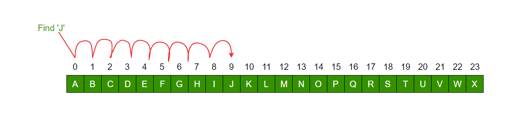
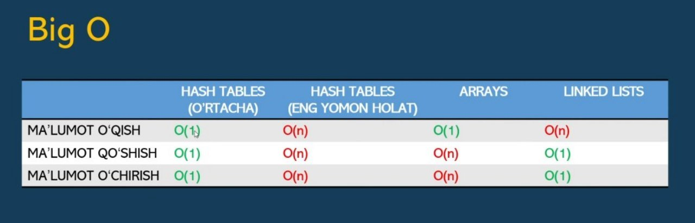
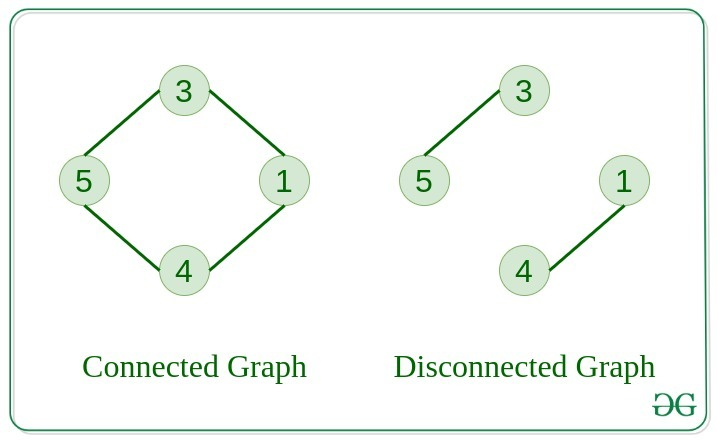
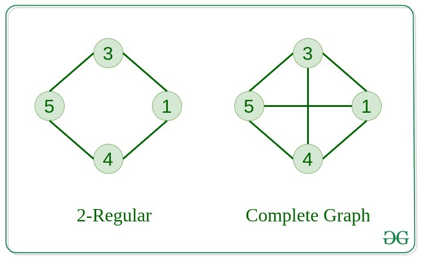

# MA'LUMOTLAR TUZILMASI VA ALGORITMLAR (Data Structures and Algorithms)

### Kompyuter

- Kompyuter - **ma'lumotlar**ga ishlov beruvchi electron qurilma
- Kompyuterning asosiy vazifasi **ma'lumotlar**ni o'qish,
  ularning ustida turli hisob-kitoblarni bajarish va saqlash

**Kompyuterlar 3 ta tarkibiy qismlardan iborat:**

- Prosessor (CPU)
- Xotira (RAM, HDD, SSD...)
- Kirish-chiqish qurilmalari (keyboard, mouse, monitor...)

### DASTUR

- Dastur - qo'yilgan muammoga yechim topish uchun, kompyuterga qaysi amallarni qanday ketma-ketlikda bajarishni aytuvchi **ko'rsatmalar to'plami**
- Bevosita dastur yozish jarayoni dasturlash, dastur yozuvchi odam esa **dasturchi** deyiladi

### ALGORITM

- **Algoritm** - bu muammoni hal qilish uchun aniq ketma-ketlikda berilgan ko'rsatmalar to'plami
- Yaxshi algoritmning belgilari:
  - kirish (muammo) va chiqish (yechim) aniq berilgan bo'lishi kerak
  - Algoritmning har bir bosqichi aniq va ravshan bo'lishi kerak
  - Algoritm muammoni hal qilishning turli usullari orasida eng samaralisi bo'lishi kerak
  - Algoritmda kompyuter kodi bo'lmasligi kerak. Buning o'rniga algoritm turli xil dasturlash tillarida ishlatilishi mumkin bo'lgan tarzda yozilishi kerak

### MA'LUMOTLAR

- Ma'lumotlar - kompyuter xotirasida saqlanuvchi matn, rasm, video, audio, dasturlar, jadvallar va boshqa axborotlar
- Ma'lumotlar tuzilmasi - ma'lumotlardan **samarali** foydalanish uchun tartibga solishning o'ziga xos usuli

> [!NOTE]
>
> Ma'lumotlar tuzilmasi va algoritmlar - **dasturlash**ning negizi!
> Bitta muammoga **bir nechta** yechim bo'lishi
> Mavjud ma'lumotlar tuzilmasi va algoritmlardan xabardor bo'lish eng **samarali** yechimni topishda yordam beradi
> Samaradorlik algoritmning **tezligi** va qancha **xotira** egallashi bilan o'lchanadi **(Time and Space complexity)**

### MA'LUMOTLAR TUZILMASI

- Array (ro'yxat)
- 2-3-N o'lchamli ro'yxat
- Linked list (bo'glangan ro'yxat)
- Stacks
- Queues
- Graph (Graflar)
- Shajara (Tree)
- Hash jadvallari
- Heap

### ALGORITMLAR

- Aksar muammolar ma'lumotlarni tartiblashga va qidirishga borib taqaladi
- Biz o'rganadigan aksar algoritmlar ham aynan **Tartiblash** va **Qidirish** (Sorting and Searching) algoritmlar haqida bo'ladi
- Dynamic Programming, Greedy Algorithms

### SORTING

- Bubble sort
- Selection sort
- Merge sort
- Quick sort
- Heap sort
- Bucket sort

### QIDIRISH ALGORITMLAR - SEARCHING

- Linear search
- Binary search
- Recursion
- Jump search

### Linear search

**Linear search** - **Chiziqli qidiruv** - elementlarni qidirishning eng oddiy turi bo'lib, ko'rib chiqilayotgan keyingi qiymatni ushbu qiymatlar mos kelgunga qadar kerakli qiymat bilan **ketma-ket** taqqoslash yo'li bilan amalga oshiriladi.

<p align="center">

</p>

> Example **Linear search** in JavaScript

```js
function search(arr, n, x) {
  for (let i = 0; i < n; i++) if (arr[i] == x) return i;
  return -1;
}

let arr = [2, 3, 4, 10, 40];
let x = 10;
let n = arr.length;

let result = search(arr, n, x);
result == -1
  ? console.log("Element is not present in array")
  : console.log("Element is present at index " + result);
```

> [!NOTE]
>
> Saralanmagan ro'yxatlar: Bizda tartiblanmagan massiv yoki ro'yxat mavjud bo'lganda, to'plamdagi istalgan elementni topish uchun **Linear search** eng ko'p ishlatiladi.
> Kichik ma'lumotlar to'plamlari mavjud bo'lsa **Linear search** afzalroqdir.
> Kichik ma'lumotlar to'plamlari uchun juda mos keladigan algoritm.
> Hech qanday qo'shimcha xotira talab qilmaydi.
> Katta massivlar uchun mos emas.

### Binary search

**Binary search** - **Ikkilik qidiruv** - logarifmik vaqt logida tartiblangan massivdagi elementni topishga imkon beruvchi algoritm bo'lib, bu erda n - massivdagi elementlar soni.

<p align="center">

</p>

> Algoritm

1. Massivning o'rta elementini tanlash
2. Elementni kerakli element bilan solishtirish
3. Agar elementlar teng bo'lsa, ushbu elementning indeksini qaytaring, aks holda:

- Agar siz izlayotgan element o'rtadagidan kichikroq bo'lsa, massivning chap yarmini ko'rib chiqing
- Agar siz izlayotgan element o'rtadagidan kattaroq bo'lsa, massivning o'ng yarmini ko'rib chiqing

4. Biz elementni topmagunimizcha, algoritmni massivning tanlangan yarmiga qo'llaymiz
5. Agar kerakli element massivda bo'lmasa, biz sikldan chiqamiz

> Example **Binary search** in JavaScript

```js
function search(nums: number[], target: number): number {
  let start = 0;
  let end = nums.length - 1;

  while (start <= end) {
    const key = Math.floor((start + end) / 2);
    const value = nums[key];

    if (value === target) return key;

    if (target > value) start = key + 1;
    if (target < value) end = key - 1;
  }

  return -1;
}
```

> [!NOTE]
>
> **Binary search** elementlar soni ko'p bo'lganda samarali bo'ladi, chunki u har bir bosqichda taqqoslash operatsiyalari sonini taxminan yarmiga qisqartiradi.

### Big O notation (katta O belgisi)

<p align="center">

</p>

- Big O (katta O) - algoritmning tezligini o'lchash uchun mezon
- Big O eng yomon holatdagi tezlikni o'lchaydi
- O'lchov birligi - operatsiyalar soni
- Linear Search uchun O(n)
- Binary Search uchun O(log2N)

> Ba'zi algoritmlarning tezligi:

<p align="center">

</p>

<p align="center">

</p>

> Turli vaqt murakkabliklarida talab qilinadigan operatsiyalar:

<p align="center">

</p>

<p align="center">

</p>

### Array - ma'lumot tuzilmasi

> Array (Massiv)

<p align="center">

</p>

> Array in JavaScript

```js
let arr = [1, 2, 3, 4, 5, 6, 7, 8, 9]; // Initializing an array with values

// Accessing elements
console.log("Element at index 0:", arr[0]); // Element at index 0: 1
```

> ARRAY va XOTIRA

<p align="center">

</p>

> ARRAY va Big O

<p align="center">

</p>

<p align="center">

</p>

> **Array** turlari:

Asosan ikki turdagi **Array** mavjud:

**Static Array**: Ushbu turdagi massivda xotira kompilyatsiya vaqtida uning belgilangan o'lchamiga ega bo'ladi. Biz bu massiv hajmini o‘zgartira olmaymiz yoki yangilay olmaymiz.
**Dynamic Array**: Ushbu turdagi massivda xotira ish vaqtida ajratiladi, lekin belgilangan hajmga ega emas. Aytaylik, foydalanuvchi massivning istalgan tasodifiy hajmini e'lon qilmoqchi bo'lsa, biz statik massivdan foydalanmaymiz, uning o'rniga qo'lda dinamik massiv ishlatiladi. U har qanday dasturning ishlash vaqtida uning hajmini belgilash uchun ishlatiladi.

<p align="center">

</p>

> Example in JavaScript

```js
// Static Integer Array
const staticArray = [1, 2, 3, 4, 5];

// Dynamic Integer Array (Array with size allocation)
const dynamicArray = new Array(5); // Allocating memory for 5 elements

// Initializing dynamic array elements
for (let i = 0; i < dynamicArray.length; i++) {
  dynamicArray[i] = i + 1; // Assigning values 1, 2, 3, 4, 5
}

// Printing Static Integer Array
console.log("Static Integer Array:");
console.log(staticArray.join(" "));

// Printing Dynamic Integer Array
console.log("Dynamic Integer Array:");
console.log(dynamicArray.join(" "));
```

<p align="center">

</p>

> **Static Array** va **Dynamic Array** o'rtasidagi asosiy farq:

<p align="center">

</p>

### LINKED LISTS

- **LINKED LISTS** - bu ketma-ketligi xotiradagi joylashuviga bog'liq bo'lmagan **chiziqli** ma'lumotlar **to'plami**
- Ro'yxatning har bir elementi keyingi elementga **ishora** qiladi
- Ma'lumotlar tuzilmasi sifatida **LINKED LISTS**ni bir-biriga **bog'langan tugunlar** ko'rinishida tasavvur qilamiz
- Har bir tugun o'z **qiymatini** va keyingi element **manzilini** saqlaydi

<p align="center">

</p>

> **LINKED LISTS** - Bog'langan ro'yhatlar

<p align="center">

</p>

<p align="center">

</p>

> Linked List Implementation in C

<p align="center">

</p>

> **ARRAYS** VS. **LINKED LISTS**

|               | ARRAYS                                        | LINKED LISTS                                    |
| ------------- | --------------------------------------------- | ----------------------------------------------- |
| AFZALLIKLARI  | - Tez o'qish/qidirish                         | - Tez yozish/o'chirish                          |
|               | - Har bir element kamroq xotira egallaydi     | - O'zgaruvchan hajmga ega                       |
|               |                                               | - Xotiradan samarali foydalanish                |
| KAMCHILIKLARI | - Sekin qo'shish/o'chirish                    | - Sekin qidirish                                |
|               | - O'zgarmas hajm (hajm o'zgartirish "qimmat") | - Har bir tugun xotirada ko'proq                |
|               | - Xotiradan smarasiz foydalanish              | joy egallaydi (qiymat + keyingi tugun mamnzili) |

<p align="center">

</p>

<p align="center">

</p>

> **LINKED LISTS** turlari:

1. **Singly linked lists** - Bir tomonlama ro'yxat

<p align="center">

</p>

2. **Doubly linked lists** - Ikki marta bog'langan ro'yxat

<p align="center">

</p>

3. **Circular linked lists** - Aylana ro'yxat

- **Circular singly linked list**

<p align="center">

</p>

- **Circular doubly linked list**

<p align="center">

</p>

> [!NOTE]
>
> **ABSTRAKT MA'LUMOT TURLARI**
>
> - Ma'lumot turiga **dasturlash tilidan uzilgan** holda qarash
> - Abstrakt ma'lumot turi u saqlaydigan **qiymatlar** va uning ustida
>   bajarish mumkin bo'lgan **operasiyalar** bilan aniqlanadi

> Example **LINKED LISTS** in JavaScript

```js
class Node {
  constructor(data) {
    this.data = data;
    this.next = null;
  }
}

class LinkedList {
  constructor() {
    this.head = null;
  }

  // Append: Insert a new node at the end of the linked list
  append(data) {
    const newNode = new Node(data);
    if (!this.head) {
      this.head = newNode;
    } else {
      let current = this.head;
      while (current.next !== null) {
        current = current.next;
      }
      current.next = newNode;
    }
  }

  // Prepend: Insert a new node at the beginning of the linked list
  prepend(data) {
    const newNode = new Node(data);
    newNode.next = this.head;
    this.head = newNode;
  }

  // Delete: Remove the first occurrence of a node with the given data
  delete(data) {
    if (!this.head) {
      return; // List is empty
    }
    if (this.head.data === data) {
      this.head = this.head.next;
      return;
    }
    let current = this.head;
    while (current.next !== null) {
      if (current.next.data === data) {
        current.next = current.next.next;
        return;
      }
      current = current.next;
    }
  }

  // Search: Find the first occurrence of a node with the given data
  search(data) {
    let current = this.head;
    while (current !== null) {
      if (current.data === data) {
        return true; // Data found
      }
      current = current.next;
    }
    return false; // Data not found
  }

  // Print: Display the elements of the linked list
  print() {
    let current = this.head;
    const elements = [];
    while (current !== null) {
      elements.push(current.data);
      current = current.next;
    }
    console.log(elements.join(" -> "));
  }
}

// Example usage:
const linkedList = new LinkedList();
linkedList.append(10);
linkedList.append(20);
linkedList.append(30);
linkedList.prepend(5);
linkedList.print(); // Output: 5 -> 10 -> 20 -> 30
linkedList.delete(20);
linkedList.print(); // Output: 5 -> 10 -> 30
console.log(linkedList.search(10)); // Output: true
console.log(linkedList.search(50)); // Output: false
```

### SELECTION SORT - RO'YXATLARNI TARTIBLASH

<p align="center">

</p>

> Example **Selection Sort** in JavaScript

```js
function selectionSort(arr) {
  for (let i = 0; i < arr.length; i++) {
    let lowest = i;
    for (let j = i + 1; j < arr.length; j++) {
      if (arr[j] < arr[lowest]) {
        lowest = j;
      }
    }
    if (lowest !== i) {
      // Swap
      [arr[i], arr[lowest]] = [arr[lowest], arr[i]];
    }
  }
  return arr;
}
console.log(selectionSort([3, 5, 1, 2])); // [1, 2, 3, 5]
```

> **Selection Sort** performance summary table

<p align="center">

</p>

### RECURSION - REKURSIYA

<p align="center">

</p>

> Rekursiya — Funksiya oʻziga oʻzi toʻgʻridan-toʻgʻri yoki qandaydir vosita orqali murojaat qilish jarayoniga rekursiya deyiladi va bunday funksiya rekursiv funksiya deb ataladi

> Rekursiv funksiyalar ikki qismdan iborat bo'ladi:

- Rekursiya sharti (recursive case)
- To'xtash sharti (base case)

> Exapmle **Recursion** in JavaScript

```js
// Program to countdown till 1

// recursive function
function counter(count) {
  // display count
  console.log(count);

  // condition for stopping
  if (count > 1) {
    // decrease count
    count = count - 1;

    // call counter with new value of count
    counter(count);
  } else {
    // terminate execution
    return;
  }
}

// access function
counter(5);
```

```js
// recursion while loop
const factorial = (x) => {
  if (x < 0) {
    throw new Error("x must be greater than or equal to 0");
  }

  if (x <= 1) {
    return 1;
  }

  let result = 1;

  while (x > 0) {
    result *= x;
    x--;
  }

  return result;
};
```

```js
// recursive function
function factorial(num) {
  // base case
  // recurse only if num is greater than 0
  if (num > 1) {
    return num * factorial(num - 1);
  } else {
    return 1;
  }
}

let x = 3;

// store result of factorial() in variable
let y = factorial(x);

console.log(`The factorial of ${x} is ${y}`);
```

### THE STACK

<p align="center">

</p>

- **LIFO** Ma'lumotlar to'plami
- **LIFO (Last In First Out)** - Oxirgi kirgan, birinchi chiqadi
- Ma'lumotlar to'plam ustiga qo'shiladi va to'plam usridan olinadi

> The Stack ustida amallar

- Push - element qo'shish
- Pop - element sug'urib olish
- isEmpty - to'plam bo'sh ekanligini tekshirish
- isFull - to'plam to'la ekanligini tekshirish
- Peek - eng yuqoridagi element qiymatini ko'rish

<p align="center">

</p>

<p align="center">

</p>

> Example **Stack** in JavaScript

```js
// Stack class
class Stack {
  // Array is used to implement stack
  constructor() {
    this.items = [];
  }

  // Functions to be implemented
  // push(item)
  // pop()
  // peek()
  // isEmpty()
  // printStack()
}

// push function
push(element);
{
  // push element into the items
  this.items.push(element);
}

// pop function
pop();
{
  // return top most element in the stack
  // and removes it from the stack
  // Underflow if stack is empty
  if (this.items.length == 0) return "Underflow";
  return this.items.pop();
}

// peek function
peek();
{
  // return the top most element from the stack
  // but does'nt delete it.
  return this.items[this.items.length - 1];
}

// isEmpty function
isEmpty();
{
  // return true if stack is empty
  return this.items.length == 0;
}

// printStack function
printStack();
{
  let str = "";
  for (let i = 0; i < this.items.length; i++) str += this.items[i] + " ";
  return str;
}
```

```js
// creating object for stack class
let stack = new Stack();

// testing isEmpty and pop on an empty stack

// returns false
console.log(stack.isEmpty());

// returns Underflow
console.log(stack.pop());

// Adding element to the stack
stack.push(10);
stack.push(20);
stack.push(30);

// Printing the stack element
// prints [10, 20, 30]
console.log(stack.printStack());

// returns 30
console.log(stack.peek());

// returns 30 and remove it from stack
console.log(stack.pop());

// returns [10, 20]
console.log(stack.printStack());
```

```js
class Stack {
  constructor() {
    this.items = [];
  }

  push(element) {
    this.items.push(element);
  }

  pop() {
    if (this.items.length === 0) {
      return "Underflow";
    }
    return this.items.pop();
  }
}

function postFixEvaluation(exp) {
  let stack = new Stack();
  for (let i = 0; i < exp.length; i++) {
    let c = exp[i];
    if (!isNaN(c)) stack.push(c - "0");
    else {
      let val1 = stack.pop();
      let val2 = stack.pop();
      if (val1 == "Underflow" || val2 == "Underflow")
        return "Can not perform postfix evaluation";
      switch (c) {
        case "+":
          stack.push(val2 + val1);
          break;
        case "-":
          stack.push(val2 - val1);
          break;
        case "/":
          stack.push(val2 / val1);
          break;
        case "*":
          stack.push(val2 * val1);
          break;
      }
    }
  }

  return stack.pop();
}

// calling the above method
// returns 9
console.log(postFixEvaluation("235*+8-"));

// returns "Can not perform postfix evaluation"
console.log(postFixEvaluation("23*+"));
```

> **Stack va Rekursiya**

- Rekursiv funksiyalar ham stack asosida ishlaydi
- Dasturlashda bu **call stack** yoki **program stack** deyiladi

<p align="center">

</p>

<p align="center">

</p>

### DIVIDE & CONQUER - Bo'lib tashlab, hukmronlik qil

- Ba'zida muammolarga yechim ko'rinmaydi
- Yaxshi dasturchi muammo oldida yengilmaydi
- Katta muammoni mayda muammolarga bo'lib olib, har bir muammoni alohida hal qiladi
- Bu **DIVIDE & CONQUER** metodi deb ataladi
- **DIVIDE & CONQUER** metodi juda ko'p muammolarga yechim bo'lishi mumkin
- Keyingi safar murakkab muammoga to'qnash kelganingizda shu metodni esga soling

<p align="center">

</p>

> Examples of **Divide and Conquer** Algorithm in JavaScript

```js
// Function to find the maximum number
// in a given array.
function findMax(a, lo, hi) {
  // If lo becomes greater than hi, then return minimum
  // integer possible
  if (lo > hi) return Number.MIN_VALUE;
  // If the subarray has only one element, return the
  // element
  if (lo === hi) return a[lo];
  const mid = Math.floor((lo + hi) / 2);
  // Get the maximum element from the left half
  const leftMax = findMax(a, lo, mid);
  // Get the maximum element from the right half
  const rightMax = findMax(a, mid + 1, hi);
  // Return the maximum element from the left and right
  // half
  return Math.max(leftMax, rightMax);
}
```

### QUICKSORT

- **Quicksort** ham ma'lumotlarni **tartiblash** algoritmi
- **Selection sortga** nisbatan bir necha barobar tezroq
- **Divide and Conquer** yordamida ishlaydi

<p align="center">

</p>

> Complexity Analysis of Quick Sort

<p align="center">

</p>

> Examples **Quick Sort** **Select the First element as a pivot** in JavaScript

```js
function quicksort(array) {
  if (array.length <= 1) {
    return array;
  }

  var pivot = array[0];

  var left = [];
  var right = [];

  for (var i = 1; i < array.length; i++) {
    array[i] < pivot ? left.push(array[i]) : right.push(array[i]);
  }

  return quicksort(left).concat(pivot, quicksort(right));
}

var unsorted = [23, 45, 16, 37, 3, 99, 22];
var sorted = quicksort(unsorted);

console.log("Sorted array", sorted);
```

> Examples **Quick Sort** **Select the Last element as a pivot** in JavaScript

```js
function quicksort(array) {
  if (array.length <= 1) {
    return array;
  }

  var pivot = array[array.length - 1];

  var left = [];
  var right = [];

  for (var i = 1; i < array.length; i++) {
    array[i] < pivot ? left.push(array[i]) : right.push(array[i]);
  }

  return quicksort(left).concat(pivot, quicksort(right));
}

var unsorted = [23, 45, 16, 37, 3, 99, 22];
var sorted = quicksort(unsorted);

console.log("Sorted array", sorted);
```

> Examples **Quick Sort** **Select the Middle element as a pivot** in JavaScript

```js
function quickSort(arr) {
  if (arr.length <= 1) {
    return arr;
  }

  let pivot = arr[Math.floor(arr.length / 2)];
  let left = [];
  let right = [];

  for (let i = 0; i < arr.length; i++) {
    if (i !== Math.floor(arr.length / 2)) {
      if (arr[i] < pivot) {
        left.push(arr[i]);
      } else {
        right.push(arr[i]);
      }
    }
  }

  return quickSort(left).concat(pivot, quickSort(right));
}

// Example usage
let array = [10, 7, 8, 9, 1, 5];
console.log("Sorted array:", quickSort(array));
```

> Examples **Quick Sort** **Select a Random element as a pivot** in JavaScript

```js
function quickSort(arr) {
  if (arr.length < 2) {
    return arr;
  }
  const pivot = arr[Math.floor(Math.random() * arr.length)];

  let left = [];
  let right = [];
  let equal = [];

  for (let val of arr) {
    if (val < pivot) {
      left.push(val);
    } else if (val > pivot) {
      right.push(val);
    } else {
      equal.push(val);
    }
  }
  return [...quickSort(left), ...equal, ...quickSort(right)];
}

// Unsorted Array
const arr = [6, 9, 2, 5, 0, 7, 3, 1, 8, 4];

console.log(quickSort(arr)); // [0,1,2,3,4,5,6,7,8,9]
```

### BUBBLE SORT

- Eng sodda tartiblash algoritmi
- Qo'shni elementlarni solishtirish va o'rnini almashtirish orqali ishlaydi

<p align="center">

</p>
<p align="center">

</p>
<p align="center">

</p>

> Example **BUBBLE SORT** in JavaScript

```js
// Optimized javaScript implementation
// of Bubble sort
function bubbleSort(arr, n) {
  var i, j, temp;
  var swapped;
  for (i = 0; i < n - 1; i++) {
    swapped = false;
    for (j = 0; j < n - i - 1; j++) {
      if (arr[j] > arr[j + 1]) {
        // Swap arr[j] and arr[j+1]
        temp = arr[j];
        arr[j] = arr[j + 1];
        arr[j + 1] = temp;
        swapped = true;
      }
    }

    // IF no two elements were
    // swapped by inner loop, then break
    if (swapped == false) break;
  }
}

// Function to print an array
function printArray(arr, size) {
  var i;
  for (i = 0; i < size; i++) console.log(arr[i] + " ");
}

// Driver program
var arr = [64, 34, 25, 12, 22, 11, 90];
var n = arr.length;
bubbleSort(arr, n);
console.log("Sorted array: ");
printArray(arr, n);
```

> Complexity Analysis of Bubble Sort:

- Time Complexity: O(n2)
- Auxiliary Space: O(1)

> **Bubble Sort** afzalliklari:

- **Bubble Sort** tushunish va amalga oshirish oson.
- Bu qo'shimcha xotira maydonini talab qilmaydi.
- Bu barqaror tartiblash algoritmidir, ya'ni bir xil kalit qiymatiga ega bo'lgan elementlar tartiblangan chiqishda o'zlarining nisbiy tartibini saqlab turadi.

- **Bubble Sort** kamchiliklari:
- **Bubble Sort** tartiblash O(n2) vaqt murakkabligiga ega, bu esa katta maʼlumotlar toʻplamlari uchun uni juda sekinlashtiradi.
- **Bubble Sort** solishtirishga asoslangan tartiblash algoritmidir, ya'ni u kirish ma'lumotlar to'plamidagi elementlarning nisbiy tartibini aniqlash uchun taqqoslash operatorini talab qiladi. Ayrim hollarda algoritm samaradorligini cheklashi mumkin.

### MERGE SORT

- **Divide and Conquer** usuli yordamida ishlaydigan tartiblash algoritmi
- Ro'yxatni ikkiga bo'lib, ikki tarafni alohida tartiblab jamlash asosida ishlaydi

<p align="center">

</p>

<p align="center">

</p>
<p align="center">

</p>
<p align="center">

</p>
<p align="center">

</p>

> Example **MERGE SORT** in JavaScript

```js
function merge(arr, left, mid, right) {
  const n1 = mid - left + 1;
  const n2 = right - mid;

  // Create temp arrays
  const L = new Array(n1);
  const R = new Array(n2);

  // Copy data to temp arrays L[] and R[]
  for (let i = 0; i < n1; i++) L[i] = arr[left + i];
  for (let j = 0; j < n2; j++) R[j] = arr[mid + 1 + j];

  let i = 0,
    j = 0;
  let k = left;

  // Merge the temp arrays back into arr[left..right]
  while (i < n1 && j < n2) {
    if (L[i] <= R[j]) {
      arr[k] = L[i];
      i++;
    } else {
      arr[k] = R[j];
      j++;
    }
    k++;
  }

  // Copy the remaining elements of L[], if there are any
  while (i < n1) {
    arr[k] = L[i];
    i++;
    k++;
  }

  // Copy the remaining elements of R[], if there are any
  while (j < n2) {
    arr[k] = R[j];
    j++;
    k++;
  }
}

function mergeSort(arr, left, right) {
  if (left >= right) return;

  const mid = Math.floor(left + (right - left) / 2);
  mergeSort(arr, left, mid);
  mergeSort(arr, mid + 1, right);
  merge(arr, left, mid, right);
}

function printArray(arr) {
  console.log(arr.join(" "));
}

// Driver code
const arr = [12, 11, 13, 5, 6, 7];
console.log("Given array is");
printArray(arr);

mergeSort(arr, 0, arr.length - 1);

console.log("\nSorted array is");
printArray(arr);
```

> Complexity Analysis of **Merge Sort**:

- Time Complexity:
  - Best Case: O(n log n), When the array is already sorted or nearly sorted.
  - Average Case: O(n log n), When the array is randomly ordered.
  - Worst Case: O(n log n), When the array is sorted in reverse order.
- Auxiliary Space: O(n), Additional space is required for the temporary array used during merging.

> **Merge Sort** afzalliklari:

- Barqarorlik: **Merge Sort** barqaror tartiblash algoritmidir, ya'ni u kirish massividagi teng elementlarning nisbiy tartibini saqlaydi.
- Kafolatlangan eng yomon ishlash: **Merge Sort** eng yomon vaqt murakkabligi O(N logN) ga teng, ya'ni u hatto katta ma'lumotlar to'plamlarida ham yaxshi ishlaydi.
- Amalga oshirish oson: **Divide and Conquer** yondashuvi oddiy.
- Tabiiy parallel: Biz mustaqil ravishda pastki qatorlarni birlashtiramiz, bu esa uni parallel ishlov berish uchun mos qiladi.

> **Merge Sort** kamchiliklari:

- Bo'shliqning murakkabligi: **Merge Sort** saralash jarayonida birlashtirilgan kichik massivlarni saqlash uchun qo'shimcha xotira talab qiladi.
- Joyda emas: **Merge Sort** joyida tartiblash algoritmi emas, ya'ni tartiblangan ma'lumotlarni saqlash uchun qo'shimcha xotira talab qilinadi. Bu xotiradan foydalanish tashvish tug'diradigan ilovalarda kamchilik bo'lishi mumkin.
- Umuman **QuickSort** dan sekinroq. **QuickSort** keshga qulayroq, chunki u joyida ishlaydi.

### HASH TABLES

<p align="center">

</p>

- **Eng foydali va ko'p** ishlatiladigan ma'lumotlar tuzilmasi
- Aksar dasturlash tillarida **tadbiq qilingan**
  - Hash maps
  - Maps
  - Dictionaries (Python)

> Hash funksiya

- Hash funksiya **matnni** takrorlanmas, noyob **songa** o'tkazib beradi
- Hash funksiyalarning **turi ko'p**
- Yaxshi hash funksiya belgilari:
  - **Bir xil matn** uchun **bir hil son** qaytaradi
  - **Xar xil matnlar** uchun **xar xil son** qaytaradi
- Hash funksiya **sizga kerakli oraliqdagi** sonlarni qaytaradi

> Ikki yoki undan ortiq kalitlar bir xil massiv indeksiga ishora qilganda **Collisions** sodir bo'ladi.

<p align="center">

</p>
<p align="center">

</p>

> Example Implementation of Hash Table in JavaScript

```js
class Hash {
  constructor(V) {
    this.BUCKET = V; // No. of buckets
    this.table = new Array(V); // Pointer to an array containing buckets
    for (let i = 0; i < V; i++) {
      this.table[i] = new Array();
    }
  }

  // inserts a key into hash table
  insertItem(x) {
    const index = this.hashFunction(x);
    this.table[index].push(x);
  }

  // deletes a key from hash table
  deleteItem(key) {
    // get the hash index of key
    const index = this.hashFunction(key);

    // find the key in (index)th list
    const i = this.table[index].indexOf(key);

    // if key is found in hash table, remove it
    if (i !== -1) {
      this.table[index].splice(i, 1);
    }
  }

  // hash function to map values to key
  hashFunction(x) {
    return x % this.BUCKET;
  }

  // function to display hash table
  displayHash() {
    for (let i = 0; i < this.BUCKET; i++) {
      let str = `${i}`;
      for (let j = 0; j < this.table[i].length; j++) {
        str += ` --> ${this.table[i][j]}`;
      }
      console.log(str);
    }
  }
}

// Driver program
const a = [15, 11, 27, 8, 12];
const n = a.length;

// insert the keys into the hash table
const h = new Hash(7); // 7 is count of buckets in hash table
for (let i = 0; i < n; i++) {
  h.insertItem(a[i]);
}

// delete 12 from hash table
h.deleteItem(12);

// display the Hash table
h.displayHash();
```

> Complexity Analysis of a Hash Table

<p align="center">

</p>

# GRAPH

- **GRAPH** - bu cho'qqilar(vertices) va qirralardan(edges) iborat chiziqli bo'lmagan ma'lumotlar strukturasi.
- **GRAPH** cho'qqilar(vertices) to'plami ( V ) va qirralardan(edges) to'plamidan ( E ) iborat. **GRAPH** G(V, E) bilan belgilanadi.

<p align="center">

</p>

> Grafik ma'lumotlar strukturasining komponentlari:

- Vertices: Vertices - bu grafikning asosiy birliklari.
  Ba'zan, cho'qqilar(vertices) cho'qqi yoki tugunlar sifatida ham tanilgan.
  Har bir tugun/cho'qqi (node/vertex) etiketli yoki yorliqsiz(labeled or unlabelled) bo'lishi mumkin.
- Edges: Edges chiziladi yoki grafikning ikkita tugunini ulash uchun ishlatiladi.
  Yo'naltirilgan grafikdagi juft tugunlarni buyurtma qilish mumkin.
  Qirralar(edges) har qanday ikkita tugunni istalgan usulda ulashi mumkin.
  Hech qanday qoidalar yo'q. Ba'zan qirralarning yoylari sifatida ham tanilgan.
  Har bir chekka etiketli/yorliqsiz (labelled/unlabelled) bo'lishi mumkin.

> **GRAPH** turlari

1. **Null Graph**

- **Graph** qirralar(edges) bo'lmasa **Null Graph** deb nomlanadi.

2. **Trivial Graph**

- Faqat bitta tepaga(single vertex) ega bo'lgan **Graph** - **Trivial Graph**dir.
<p align="center">

</p>

3. **Undirected Graph**

- Qirralari(edges) hech qanday yo'nalishga ega bo'lmagan **Graph**.
  Ya'ni tugunlar(nodes) har bir chekkaning ta'rifida tartibsiz juftliklar(unordered pairs)dir.

4. **Directed Graph**

- Qirrasi(edge) yo'nalishga ega bo'lgan **Graph**. Ya'ni tugunlar(nodes) har bir chekkaning ta'rifida juftlik bilan tartiblangan(ordered pairs).
<p align="center">

</p>

5. **Connected Graph**

- Bir tugundan(node) boshqa istalgan tugunga(node) tashrif buyurishimiz **Connected Graph** deb nomlanadi.

6. **Disconnected Graph**

- Tugundan(node) kamida bitta tugunga(node) etib bo'lmaydigan grafik **Disconnected Graph** deb nomlanadi.
<p align="center">

</p>

7. **Regular Graph**

- Har bir cho'qqining darajasi K ga teng bo'lgan grafik K **Regular Graph** deb ataladi.

8. **Complete Graph**

- Har bir tugundan bir-biriga chekka bo'lgan grafik.
<p align="center">

</p>

9. **Cycle Graph**

- Grafik o'z-o'zidan (cycle) bo'lgan grafik, har bir tepalik darajasining minimal qiymati 2 ga teng.

10. **Cyclic Graph**

- Kamida bitta (cycle) o'z ichiga olgan grafik **Cyclic Graph** deb nomlanadi.
<p align="center">

</p>

11. **Directed Acyclic Graph**

- Hech qanday (cycle)ni o'z ichiga olmaydigan **Directed Graph**.

12. **Bipartite Graph**

- Har bir to'plamdagi cho'qqida ular orasidagi chekka bo'lmasligi uchun cho'qqini ikkita to'plamga bo'lish mumkin bo'lgan grafik.
<p align="center">

</p>

13. **Weighted Graph**

- Qirralari allaqachon mos og'irlik bilan ko'rsatilgan grafik **Weighted Graph** deb nomlanadi.
- Og'irlangan grafiklarni qo'shimcha ravishda yo'naltirilgan **Weighted Graph** va yo'naltirilmagan **Weighted Graph** deb tasniflash mumkin.

> **Graph** saqlashning bir necha usullari mavjud:

- **Adjacency Matrix**
- **Adjacency List**

> **Adjacency Matrix**

<p align="center">

</p>

Example **Adjacency Matrix** in JavaScript

```js
function addEdge(mat, i, j) {
  mat[i][j] = 1; // Graph is
  mat[j][i] = 1; // undirected
}

function displayMatrix(mat) {
  // Display the adjacency matrix
  for (const row of mat) {
    console.log(row.join(" "));
  }
}

// Main function to run the program
const V = 4; // Number of vertices

// Initialize matrix
let mat = Array.from({ length: V }, () => Array(V).fill(0));

// Add edges to the graph
addEdge(mat, 0, 1);
addEdge(mat, 0, 2);
addEdge(mat, 1, 2);
addEdge(mat, 2, 3);

/* Optionally, initialize matrix directly
let mat = [
    [0, 1, 0, 0],
    [1, 0, 1, 0],
    [0, 1, 0, 1],
    [0, 0, 1, 0]
];
*/

// Display adjacency matrix
console.log("Adjacency Matrix:");
displayMatrix(mat);
```

> **Adjacency List**

<p align="center">

</p>

Example **Adjacency List** in JavaScript

```js
function addEdge(adj, i, j) {
  adj[i].push(j);
  adj[j].push(i); // Undirected
}

function displayAdjList(adj) {
  for (let i = 0; i < adj.length; i++) {
    console.log(`${i}: `);
    for (const j of adj[i]) {
      console.log(`${j} `);
    }
    console.log();
  }
}

// Create a graph with 4 vertices and no edges
const V = 4;
const adj = Array.from({ length: V }, () => []);

// Now add edges one by one
addEdge(adj, 0, 1);
addEdge(adj, 0, 2);
addEdge(adj, 1, 2);
addEdge(adj, 2, 3);

console.log("Adjacency List Representation:");
displayAdjList(adj);
```

> Comparison between Adjacency Matrix and Adjacency List

<p align="center">

</p>

> Difference between Tree and Graph:

<p align="center">

</p>

> Real-Life Applications of Graph Data Structure:

<p align="center">

</p>

> Grafik ma'lumotlar strukturasining afzalliklari:

- Grafik ma'lumotlar strukturasi keng doiradagi munosabatlarni ifodalash uchun ishlatiladi,
  chunki bizda oldingi ma'lumotlar tuzilmalari kabi hech qanday cheklovlar yo'q
  (Daraxtda tsikllar bo'lishi mumkin emas va ierarxik bo'lishi kerak.
  Massivlar, bog'langan ro'yxat va boshqalar chiziqli).
- Ulardan keng ko'lamli muammolarni, jumladan, yo'lni aniqlash, ma'lumotlarni klasterlash,
  tarmoq tahlili va mashinalarni o'rganishni modellashtirish va hal qilish uchun foydalanish mumkin.
- Biz ma'lum elementlar to'plami va ular o'rtasidagi munosabatlarni osongina grafik sifatida modellashtirish mumkin,
  masalan, BFS, DFS, Spanning Tree, Eng qisqa yo'l, Topologik saralash va kuchli bog'langan standart grafik algoritmlari.
- Grafik ma'lumotlar strukturasi murakkab ma'lumotlar tuzilmalarini sodda va intuitiv tarzda ifodalash uchun ishlatilishi mumkin,
  bu ularni tushunish va tahlil qilishni osonlashtiradi.

> Grafik ma'lumotlar strukturasining kamchiliklari:

- Grafik ma'lumotlar tuzilmasi murakkab va tushunish qiyin bo'lishi mumkin,
  ayniqsa grafik nazariyasi yoki tegishli algoritmlar bilan tanish bo'lmagan odamlar uchun.
- Grafiklarni yaratish va manipulyatsiya qilish, ayniqsa, juda katta yoki murakkab grafiklar uchun hisoblash uchun qimmat bo'lishi mumkin.
- Grafik algoritmlarni to'g'ri loyihalash va amalga oshirish qiyin bo'lishi mumkin va xatolar va xatolarga moyil bo'lishi mumkin.
- Grafik ma'lumotlar tuzilmasini vizualizatsiya qilish va tahlil qilish qiyin bo'lishi mumkin, ayniqsa juda katta yoki murakkab grafiklar uchun,
  bu ma'lumotlardan mazmunli tushunchalarni olishni qiyinlashtirishi mumkin.

# Breadth-First Search (BFS)

- Breadth-first qidirish algoritmi **Graphlar** bilan ishlaydi
- Ikki savolga javob beradi:
  1. A va B node orasida yo'l bormi?
  2. A dan B ga eng yaqin yo'l qaysi?

> Breadth-First Search (BFS) qanday ishlaydi?

<p align="center">

</p>
<p align="center">

</p>
<p align="center">

</p>
<p align="center">

</p>
<p align="center">

</p>
<p align="center">

</p>
<p align="center">

</p>

> Example BFS in JavaScript

```js
// BFS from given source s
function bfs(adj, s) {
  const visited = Array(V).fill(false);
  const queue = [];

  // Mark the source node as visited
  // and enqueue it
  visited[s] = true;
  queue.push(s);

  // Iterate over the queue
  while (queue.length) {
    // Dequeue a vertex from queue and print it
    const curr = queue.shift();
    process.stdout.write(curr + " ");

    // Get all adjacent vertices of the dequeued
    // vertex. If an adjacent has not been visited,
    // mark it visited and enqueue it
    for (const x of adj[curr]) {
      if (!visited[x]) {
        visited[x] = true;
        queue.push(x);
      }
    }
  }
}

// Function to add an edge to the graph
function addEdge(u, v) {
  adj[u].push(v);
  adj[v].push(u);
}

// Example usage
const V = 5;
const adj = Array.from({ length: V }, () => []);
addEdge(0, 1);
addEdge(0, 2);
addEdge(1, 3);
addEdge(1, 4);
addEdge(2, 4);

console.log("BFS starting from 0:");
bfs(adj, 0);
```

> Example BFS of the whole Graph which Maybe Disconnected in JavaScript

```js
// Function to add an edge to the graph
function addEdge(adj, u, v) {
  adj[u].push(v);
  adj[v].push(u); // Undirected graph
}

// BFS from given source s
function bfs(adj, s, visited) {
  let q = []; // Create a queue for BFS

  // Mark the source node as visited and enqueue it
  visited[s] = true;
  q.push(s);

  // Iterate over the queue
  while (q.length > 0) {
    let curr = q.shift(); // Dequeue a vertex
    console.log(curr + " ");

    // Get all adjacent vertices of curr
    for (let x of adj[curr]) {
      if (!visited[x]) {
        visited[x] = true; // Mark as visited
        q.push(x); // Enqueue it
      }
    }
  }
}

// Perform BFS for the entire graph
function bfsDisconnected(adj) {
  let visited = Array(adj.length).fill(false); // Not visited

  for (let i = 0; i < adj.length; i++) {
    if (!visited[i]) {
      bfs(adj, i, visited);
    }
  }
}

// Example usage
let V = 6; // Number of vertices
let adj = Array.from({ length: V }, () => []);

// Add edges to the graph
addEdge(adj, 0, 1);
addEdge(adj, 0, 2);
addEdge(adj, 3, 4);
addEdge(adj, 4, 5);

// Perform BFS traversal for the entire graph
bfsDisconnected(adj);
```

> Complexity Analysis of Breadth-First Search (BFS) Algorithm:

<p align="center">

</p>

### Dijkstra algoritmi

> Dijkstra's algorithm to find the shortest path between a and b.

<p align="center">

</p>

> Illustration of Dijkstra's algorithm finding a path from a start node (lower left, red)
> to a target node (upper right, green) in a robot motion planning problem.

<p align="center">

</p>

> A demo of Dijkstra's algorithm based on Euclidean distance. Red lines are the shortest path covering, i.e.,
> connecting u and prev[u]. Blue lines indicate where relaxing happens, i.e.,
> connecting v with a node u in Q, which gives a shorter path from the source to v.

<p align="center">

</p>

> **Dijkstra algoritmi** vaznli graphlar(**Weighted Graph**)da **eng arzon** yo'lni topish uchun ishlatiladi

- masofa
- narx
- vaqt
- vazn
- va boshqalar

> **Dijkstra algoritmi** **manfiy vaznli graph**lar bilan ishlamaydi

> **Dijkstra algoritmi** faqat **yo'naltirilgan Cyclic graph**lar bilan ishlaydi

> **Breadth-First vs. Dijkstra**

| Breadth-First                               | Dijkstra                                             |
| ------------------------------------------- | ---------------------------------------------------- |
| Bosh tugundan oxirgi tugungacha             | Har qadamda **eng arzon** tugunga o'tadi             |
| **barcha tugunlarni** ko'rib chiqadi        |                                                      |
| ------------------------------------------- | ---------------------------------------------------- |
| Faqatgina **vaznsiz** (yoki bir hil vaznli) | **Musbat vaznli va vaznsiz** graphlar bilan ishlaydi |
| graphlar bilan ishlaydi                     |                                                      |
| ------------------------------------------- | ---------------------------------------------------- |
| Natija: **Eng qisqa** yo'l                  | Natija: **Eng arzon** yo'l                           |
| ------------------------------------------- | ---------------------------------------------------- |
| Big O: **O(N+E)**                           | Big O: **O(N+E(LogN))**                              |

### GREEDY ALGORITHMS - OCHKO'Z ALGORITMLAR

<p align="center">

</p>

- Ba'zi muammolar **hech qanday** algoritmga tushmaydi
- Shunday holatda bizga **ochko'z algoritmlar** yordam beradi
- Ochko'z algoritmlar **har qadamga** eng **optimal** yechimni tanlash
- Har doim ham to'g'ri yechimni bermaydi
- The Knapsack Problem (To'rvaxalta muammosi)
- Ochko'z algoritmlar har doim ham **eng to'g'ri** yechimni **bermaydi**
- Lekin **amalga oshirish (dasturlash) oson**
- Agar to'g'ri yechimni topish juda **ko'p vaqt (resurs) talab qilsa**
  qoniqarli yechimni topish uchun Greedy Algoritmlarni **tanlang**

> **The set-covering problem**

- To'plamni yopish muammosi
<p align="center">

</p>

### NP-COMPLETE PROBLEMS - NP MUAMMOLAR

NP-to'liq muammo samarali yechim topilmagan, ammo agar yechim berilsa,
uni tezda tekshirish mumkin bo'lgan muammo turidir.
NP-to'liq muammolarning mohiyati: hal qilish qiyin, lekin tekshirish oson.

> **TRAVELING SALESPERSON PROBLEM**

<p align="center">

</p>

> Musofir savdogar muammosi:

- Savdogar ish bilan safarga chiqdi va safar davomida 5 ta manzilga kirib o'tishi kerak
- Muammo: 5 ta manzilga eng kam vaqt (yoki masofa) bosib kirib o'tish yo'lini topish
- Demak n ta nuqta uchun kombinasiyalar n! (factorial)ga teng: 5! = 1*2*3*4*5 = 120
- Big O: O(n!)

> **NP MUAMMOLAR BELGILARI**

- Kichik sonlar uchun tez, katta sonlar uchun juda sekin ishlaydigan muammolar
- **X ning barcha kombinasiyalarini toping** mazmunidagi muammolar
- Har bir yechimni ko'rib chiqish kerak bo'lgan muammolar
- Ketma-ketliklarni qarab chiqish talab qilinadigan muammolar (musofir muammosi)
- Barcha to'plamlarni ko'rib chiqish talab qilinadigan muammolar
- Set-covering yoki musofir muammosiga tushadigan muammolar

Gamilton sikli muammosi har bir shaharga aynan bir marta tashrif buyuradigan ekskursiya mavjudligini aniqlashdir.
Bu erda biz Gamilton turining mavjudligini bilamiz (chunki grafik to'liq) va aslida bunday turlar ko'p,
muammo Gamilton siklining minimal vaznini topishdir.

<p align="center">

</p>

1. 1-shaharni boshlang'ich va yakuniy nuqta sifatida ko'rib chiqing.
2. Hammasini yarating (n-1)! Shaharlarni almashtirish.
3. Har bir almashtirish narxini hisoblang va minimal xarajat almashtirishni kuzatib boring.
4. Minimal xarajat bilan almashtirishni qaytaring.

```js
// JavaScript code for the above approach

// there are four nodes in example graph (graph is 1-based)
let n = 4;

// give appropriate maximum to avoid overflow
let MAX = 1000000;

// dist[i][j] represents shortest distance to go from i to j
// this matrix can be calculated for any given graph using
// all-pair shortest path algorithms
let dist = [
  [0, 0, 0, 0, 0],
  [0, 0, 10, 15, 20],
  [0, 10, 0, 25, 25],
  [0, 15, 25, 0, 30],
  [0, 20, 25, 30, 0],
];

// memoization for top down recursion
let memo = new Array(n + 1);

for (let i = 0; i < memo.length; i++) {
  memo[i] = new Array(1 << (n + 1)).fill(0);
}

function fun(i, mask) {
  // base case
  // if only ith bit and 1st bit is set in our mask,
  // it implies we have visited all other nodes already
  if (mask == ((1 << i) | 3)) return dist[1][i];

  // memoization
  if (memo[i][mask] != 0) return memo[i][mask];

  let res = MAX; // result of this sub-problem

  // we have to travel all nodes j in mask and end the
  // path at ith node so for every node j in mask,
  // recursively calculate cost of travelling all nodes in
  // mask except i and then travel back from node j to
  // node i taking the shortest path take the minimum of
  // all possible j nodes

  for (let j = 1; j <= n; j++)
    if (mask & (1 << j) && j != i && j != 1)
      res = Math.min(res, fun(j, mask & ~(1 << i)) + dist[j][i]);
  return (memo[i][mask] = res);
}

// Driver program to test above logic
let ans = MAX;
for (let i = 1; i <= n; i++)
  // try to go from node 1 visiting all nodes in
  // between to i then return from i taking the
  // shortest route to 1
  ans = Math.min(ans, fun(i, (1 << (n + 1)) - 1) + dist[i][1]);

console.log("The cost of most efficient tour " + ans);

// This code is contributed by Potta Lokesh
// The cost of most efficient tour = 80
```
