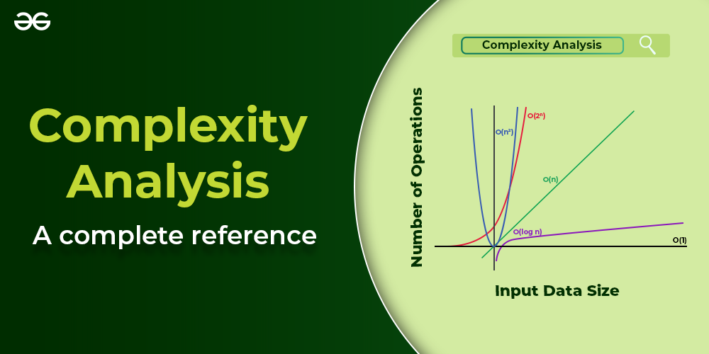

# Analysis of Algorithms

Algoritmlarni tahlil qilish - bu algoritmlar va dasturlarning ishlashini baholashni o'z ichiga olgan informatika fanining asosiy jihati. Samaradorlik vaqt va makon nuqtai nazaridan o'lchanadi.

## Basics on Analysis of Algorithms:

- Why is Analysis Important?
- Order of Growth
- Asymptotic Analysis
- Worst, Average and Best Cases of Algorithms

## Asymptotic Notations:

- Asymptotic Notations
- Big-O Notation
- Theta - Θ Notation
- Big – Ω (Big- Omega) Notation
- Time Complexity
- Space Complexity
- Difference between Big Oh, Big Omega and Big Theta
- Examples of Big-O analysis
- Difference between big O notations and tilde
- Practice Questions on Time Complexity Analysis

## Analysis Examples

- Analyzing Loops
- Analyzing Recursive Functions
- Amortized Analysis

## Some Advance topics:

- P, NP, CoNP, NP hard and NP complete
- Can comparison-based sorting take less than N logN?
- Why does accessing an Array element take O(1) time?
- Time of the push(), pop(), isEmpty() and peek() of Stack

## Complexity Proofs:

- Proof that Clique Decision problem is NP-Complete
- Proof that Independent Set in Graph theory is NP Complete
- Prove that a problem consisting of Clique and Independent Set is NP Complete
- Prove that Dense Subgraph is NP Complete by Generalisation
- Prove that Sparse Graph is NP-Complete

## Basics on Analysis of Algorithms

### Algoritmlarning ishlashi nima uchun muhim?

Foydalanuvchiga qulaylik, modullilik, xavfsizlik, texnik xizmat ko'rsatish va hokazo kabi ko'plab muhim narsalarga e'tibor qaratish lozim. Nima uchun unumdorlik haqida qayg'urish kerak? Bunga javob oddiy, yuqoridagi barcha narsalarga faqat bizda ishlash bo'lsagina ega bo'lishimiz mumkin. Shunday qilib, ishlash yuqoridagi barcha narsalarni sotib olishimiz mumkin bo'lgan valyutaga o'xshaydi. Ishlashni o'rganishning yana bir sababi - tezlik qiziqarli! Xulosa qilib aytganda, ishlash == o'lchov. Tasavvur qiling-a, 1000 sahifa yuklay oladi, lekin imlo tekshiruvi daqiqasiga 1 sahifa YOKI tasviringizni 90 daraja chapga burish uchun 1 soat vaqt ketadigan tasvir muharriri YOKI... siz tushunasiz. Agar dasturiy ta'minot xususiyati foydalanuvchilar bajarishi kerak bo'lgan vazifalar ko'lamini bajara olmasa - bu o'lik kabi yaxshi.

Algoritm tahlili hisoblash murakkabligi nazariyasining muhim qismi bo'lib, u aniq hisoblash muammosini hal qilish uchun algoritmning zarur resurslarini nazariy baholashni ta'minlaydi. Algoritmlarni tahlil qilish - uni bajarish uchun zarur bo'lgan vaqt va makon resurslari miqdorini aniqlash.

### Algoritmlarning ishlashi nima uchun muhim?

- Katta kirishlar uchun algoritmning harakatini bashorat qilish (Scalable Software).
- Algoritmni amalga oshirish va asosiy kompyuter tizimidagi ma'lum bir parametr har safar o'zgarganda samaradorlikni sinab ko'rishdan ko'ra, algoritm samaradorligi uchun oddiy chora-tadbirlarga ega bo'lish ancha qulayroqdir.
- Eng muhimi, turli xil algoritmlarni tahlil qilish orqali biz ularni solishtirib, maqsadimiz uchun eng yaxshisini aniqlashimiz mumkin.
