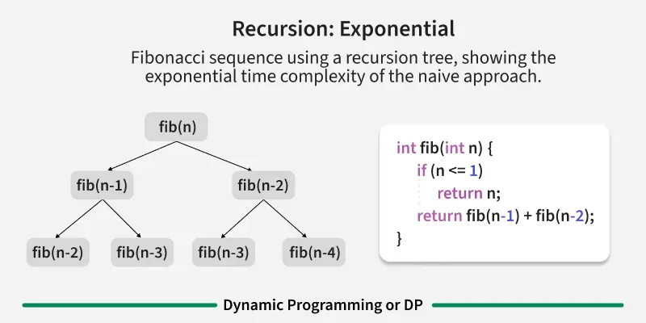
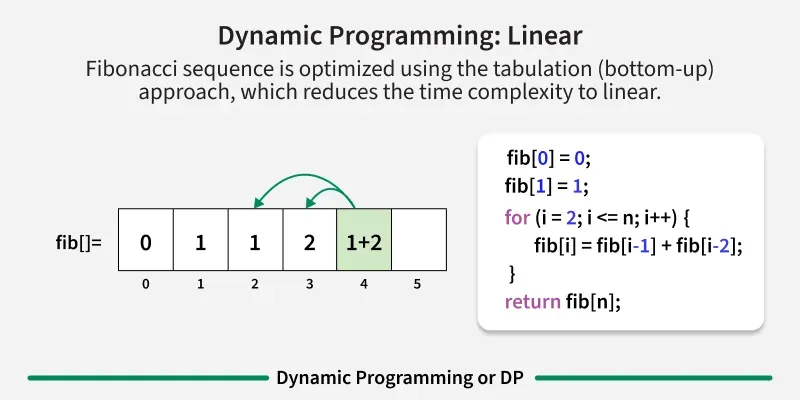

### Dynamic Programming

**Dinamik dasturlash quyidagi xususiyatlarga ega algoritmik texnikadir.**

- Bu, asosan, oddiy rekursiyani optimallashtirishdir. Qaerda biz bir xil kirishlar uchun takroriy qo'ng'iroqlarga ega bo'lgan rekursiv yechimni ko'rsak, uni Dinamik dasturlash yordamida optimallashtirishimiz mumkin.
- Maqsad kichik muammolar natijalarini shunchaki saqlashdir, shunda kerak bo'lganda ularni qayta hisoblashimiz shart emas. Ushbu oddiy optimallashtirish odatda vaqt murakkabligini eksponensialdan polinomga qisqartiradi.
- Dinamik dasturlash yordamida hal qilinadigan ba'zi mashhur muammolar: Fibonachchi raqamlari, Diff Utility (eng uzun umumiy ketma-ketlik), Bellman-Ford eng qisqa yo'li, Floyd Warshall, masofani tahrirlash va matritsa zanjirini ko'paytirish.

**Basic of DP**

- Introduction to DP
- Tabulation vs Memoizatation
- Steps to solve a DP Problem

**Basic Problems**

- Fibonacci numbers
- Tribonacci Numbers
- Lucas Numbers
- Climbing Stairs
- Climbing Stairs with 3 Moves
- Weighted Climbing Stairs
- Maximum Segments
- nth Catalan Number
- Count Unique BSTs
- Count Valid Parenthesis
- Ways to Triangulate a Polygon
- Min Sum in a Triangle
- Minimum Perfect Squares
- Ways to Partition a Set
- Binomial Coefficient
- Pascal's Triangle
- Nth Row of Pascal Triangle
- Min Sum in a Triangle

**Easy Problems**

- House Robber
- Min Cost Path
- Decode Ways
- Subset Sum Problem
- Coin change problem - Count Ways
- Coin Change – Minimum Coins to Make Sum
- Painting Fence Algorithm
- Cutting a Rod
- Jump Game
- Longest Common Substring
- Count all paths in a Grid
- Paths in a Grid with Obstacles
- Permutations with K Inversions
- Max A's using Special Keyboard

**Medium Problems**

- Water Overflow
- Longest Common Subsequence
- Longest Increasing Subsequence
- Edit Distance
- Largest Divisible Subset
- Weighted Job Schedulling
- 0-1 Knapsack Problem
- Printing Items in 0/1 Knapsack
- Unbounded Knapsack
- Word Break Problem
- Tile Stacking Problem
- Box-Stacking Problem
- Partition Problem
- Longest Palindromic Subsequence
- Longest Common Increasing Subsequence (LCS + LIS)
- All distinct subset (or subsequence) sums
- Count Derangements
- Minimum insertions for palindrome
- Wildcard Pattern Matching
- Regular Expression Matching
- Arrange Balls with adjacent of different types
- Longest Subsequence with 1 adjacent difference
- Maximum size square sub-matrix with all 1s
- Bellman–Ford Algorithm
- Floyd Warshall Algorithm
- Maximum Tip Calculator

**Hard Problems**

- Largest X Bordered Square
- Egg Dropping Problem
- Palindrome Partitioning
- Palindromic Substring Count
- Word Wrap Problem
- Optimal Strategy for a Game
- The painter’s partition problem
- Program for Bridge and Torch problem
- Matrix Chain Multiplication
- Printing Matrix Chain Multiplication
- Maximum sum rectangle
- Stock Buy and Sell - At-Most k Times
- Stock Buy and Sell - At Most 2 Times
- Min cost to sort strings using Reversals
- Count of AP Subsequences
- DP on Trees
- Max Height of Tree when any Node can be Root
- Longest repeating and non-overlapping substring
- Palindrome Substrings Count

**DP Problems Sorted by Topic / Dimensions / Standard Problems**

- DP Standard Problems and Variations.
- DP Problems Dimension Wise (1D, 2D and 3D)
- DP Problems Topic Wise

**Advanced Concepts in Dynamic Programming (DP)**

- Bitmasking and Dynamic Programming | Set 1
- Bitmasking and Dynamic Programming | Set-2 (TSP)
- Digit DP | Introduction
- Sum over Subsets | Dynamic Programming
