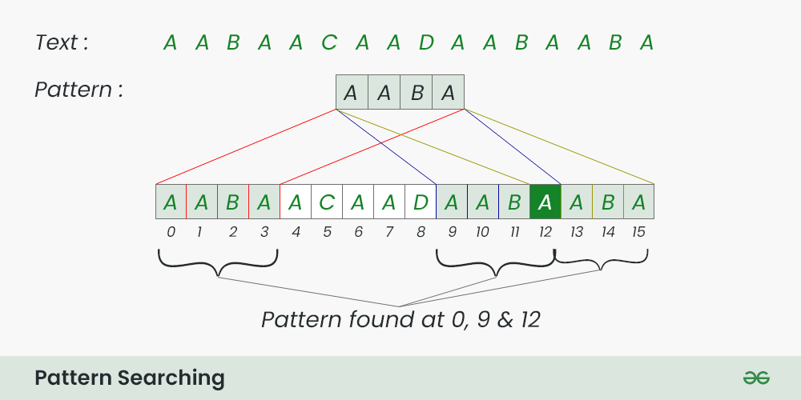

### Pattern Searching

**Pattern searching** algoritmlari informatika va ma'lumotlarni qayta ishlashda muhim vositadir. Ushbu algoritmlar kattaroq ma'lumotlar to'plamida ma'lum bir naqshni samarali topish uchun mo'ljallangan.

**Important Pattern Searching Algorithms:**

- Naive String Matching : A Simple Algorithm that works in O(m x n) time where m is the length of the pattern and n is the length of the text.
- Knuth-Morris-Pratt (KMP) Algorithm It preprocesses pattern and works in O(m + n) Time.
- Rabin-Karp Algorithm : It uses hashing to compare the pattern with the text. It works in O(m x n) Time in worst case,
- Aho-Corasick Algorithm : A deterministic finite automaton (DFA) based algorithm and works in O(m + n) time.

**Learn Basics of Pattern Searching:**

- Introduction to Pattern Searching
- Naive Pattern Searching

**Standard Pattern Searching Algorithms:**

- Rabin-Karp Algorithm
- KMP Algorithm
- Z algorithm
- Finite Automata
- Boyer Moore – Bad Character Heuristic
- Aho-Corasick Algorithm
- Suffix Array
- Kasai’s Algorithm for LCP array from Suffix Array
- Online algorithm for checking palindrome in a stream
- Manacher’s Algorithm
- Ukkonen’s Suffix Tree Construction – Part 1
- Generalized Suffix Tree

**Practice Problems on Pattern Searching:**

- Frequency of a Substring
- Anagram Substring Search
- Check if Two Strings Rotations
- Substrings with all Vowels
- Substrings with only Given Character
- Find all Occurrences of a Subarray
- Pattern Searching using a Trie of all Suffixes
- Wildcard Pattern Matching
- Regular Expression Matching
- Longest prefix which is also suffix
- Count string in a 2D array
- Find all the patterns of “1(0+)1”
- Max length prefix as Subsequence
- Search a Word in a 2D Grid
- Word Search with Zig-Zag
- Suffix Tree Application 1 – Substring Check

**Applications of Pattern Searching**

- **Text Processing:** Searching for keywords in a document, finding and replacing text, spell checking, and plagiarism detection.
- **Information Retrieval:** Finding relevant documents in a database, web search, and data mining.
- **Bioinformatics:** Searching for DNA sequences in a genome, protein analysis, and gene expression analysis.
- **Network Security:** Detecting malicious patterns in network traffic, intrusion detection, and malware analysis.
- **Data Mining:** Identifying patterns in large datasets, customer segmentation, and fraud detection.
