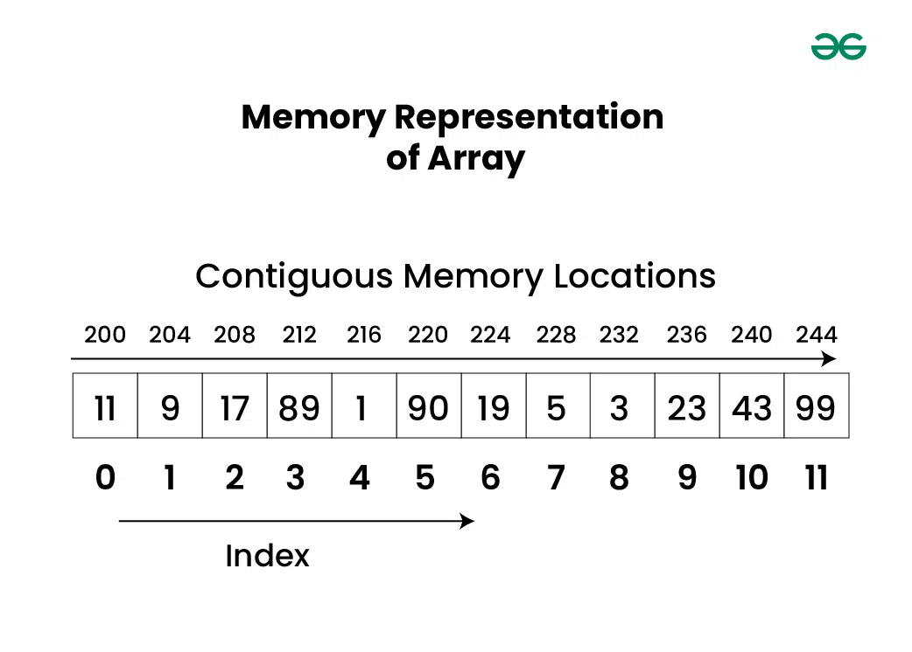
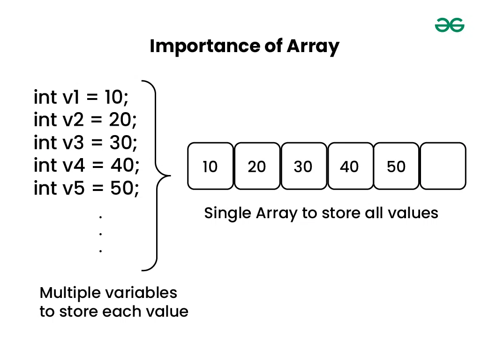
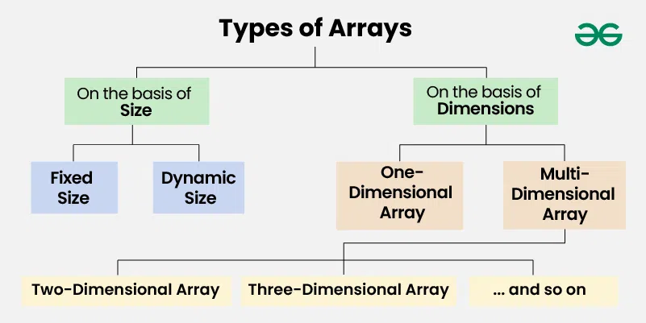
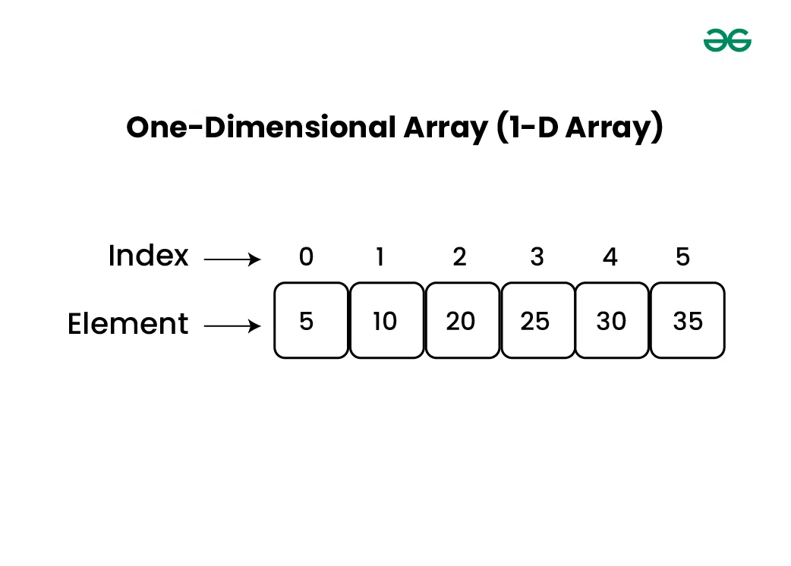
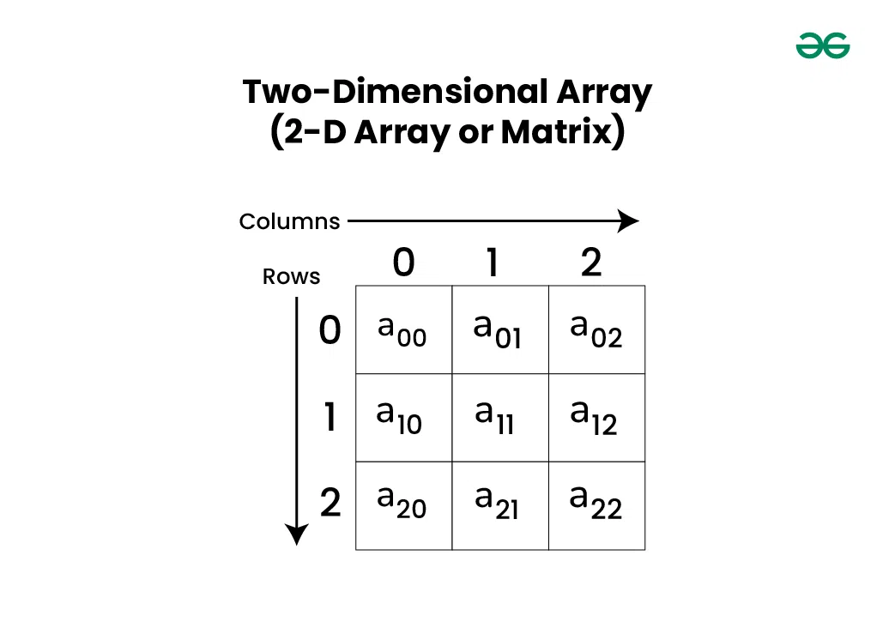
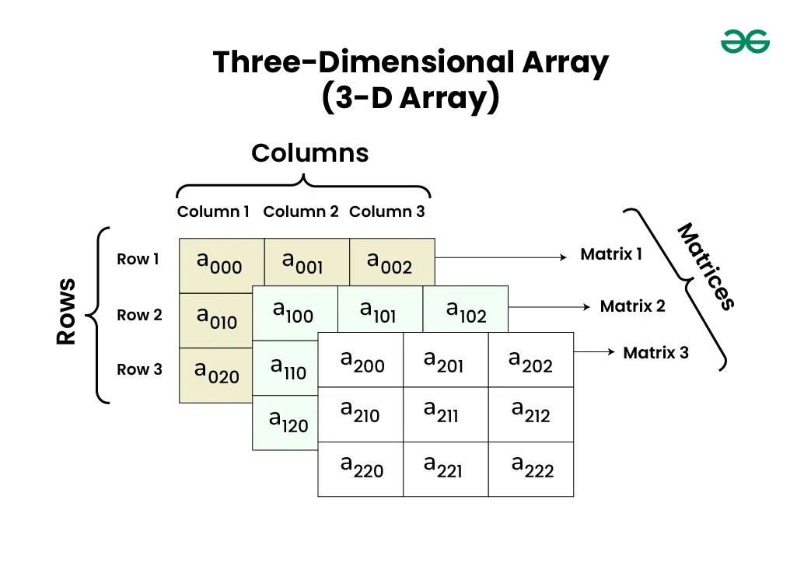

### Array - ma'lumot tuzilmasi

> Array (Massiv)

<p align="center">

</p>

- **Massivning asosiy terminologiyalari:**

  - **Massiv indeksi:** Massivda elementlar indekslari bilan aniqlanadi. Massiv indeksi 0 dan boshlanadi.
  - **Massiv elementi:** Elementlar massivda saqlanadigan elementlardir va ularga indeks orqali kirish mumkin.
  - **Massiv uzunligi:** Massiv uzunligi uning tarkibiga kirishi mumkin bo'lgan elementlar soni bilan belgilanadi.

- **Massivning xotira tasviri**
  - Massivda barcha elementlar qo'shni xotira joylarida saqlanadi.
    Shunday qilib, agar biz massivni ishga tushirsak, elementlar xotirada ketma-ket joylashadi.
    Bu elementlarga samarali kirish va manipulyatsiya qilish imkonini beradi.

<p align="center">

</p>

- **Massiv elon qilish**
  - Massivlar turli tillarda turli usullarda e’lon qilinishi mumkin.
    Yaxshiroq tasvirlash uchun quyida tilga xos massiv deklaratsiyalari keltirilgan:

> Example in JavaScript

```js
let arr = [];
```

- **Massivni ishga tushirish**
  - Massivlar turli tillarda turli yo‘llar bilan ishga tushirilishi mumkin.
    Quyida tilga xos massivni ishga tushirishlar keltirilgan:

> Example in JavaScript

```js
let arr = [1, 2, 3, 4, 5];
let arr = ["a", "b", "c", "d", "e"];
let arr = [1.4, 2.0, 24, 5.0, 0.0];
```

- **Massivning ahamiyati**

  - Faraz qilaylik, sinfda beshta talaba bor va agar biz ularning imtihondagi baholarini yozib olishimiz kerak bo'lsa,
    biz buni beshta o'zgaruvchini alohida e'lon qilish va yozuvlarni hisobga olish orqali amalga oshirishimiz mumkin,
    lekin agar talabalar soni juda ko'payib ketsa, nima bo'ladi? ma'lumotlarni manipulyatsiya qilish va saqlash qiyin.

  - Buning ma'nosi shundaki, bizda oz sonli ob'ektlar mavjud bo'lganda oddiy o'zgaruvchilardan (v1, v2, v3, ..) foydalanishimiz mumkin.
    Ammo biz ko'p sonli misollarni saqlamoqchi bo'lsak, ularni oddiy o'zgaruvchilar bilan boshqarish qiyin bo'ladi.
    Massiv g'oyasi bir o'zgaruvchida ko'p misollarni ifodalashdir.

<p align="center">

</p>

- **Massiv ma'lumotlar tuzilmalariga ehtiyoj yoki ilovalar**

  - Massiv - bu asosiy ma'lumotlar strukturasi va boshqa ko'plab ma'lumotlar tuzilmalari bu yordamida amalga oshiriladi.
    Staklar va navbatlar kabi ma'lumotlar tuzilmalarini amalga oshirish
  - Ma'lumotlarni jadval va matritsalarda aks ettirish
  - Xesh jadvallari va grafik kabi dinamik ma'lumotlar tuzilmalarini yaratish.
  - Boshqa ma'lumotlar tuzilmalari bilan taqqoslaganda, massivlar tasodifiy kirish (biz i-elementga tezda kirishimiz mumkin) va kesh qulayligi (barcha elementlar qo'shni joyda saqlanadi) kabi afzalliklarga ega.

- **Massivlar turlari**
  **Massivlarni ikki xil tasniflash mumkin:**
  - Hajmi asosida
  - O'lchovlar asosida

<p align="center">

</p>

- **Hajmi bo'yicha massivlar turlari:**

* **1. Ruxsat etilgan o'lchamli massivlar:**

> Example in C

```js
// Method 1 to create a fixed sized array.
// Here the memory is allocated at compile time.
int arr1[5];
// Another way (creation and initialization both)
int arr2[5] = {1, 2, 3, 4, 5};


// Method 2 to create a fixed sized array
// Here memory is allocated at run time (Also
// known as dynamically allocated arrays)
int *arr = (int*)malloc(n * sizeof(int));

```

- **2. Dinamik o‘lchamli massivlar:**
  - Massivning o'lchami kodni bajarish jarayonida foydalanuvchi talablariga muvofiq o'zgaradi,
    shuning uchun koderlar o'lchamlar haqida tashvishlanmasliklari kerak. Ular kerak bo'lganda
    elementlarni qo'shishlari va olib tashlashlari mumkin. Ushbu massivlarda xotira asosan
    dinamik ravishda ajratiladi va ajratiladi.

> Example in JavaScript

```js
// Dynamic Sized Array
let arr = new Array();
```

- **O'lchovlar bo'yicha massivlar turlari:**
  - 1. Bir o'lchovli massiv (1-D massiv): 1d massivni qator sifatida tasavvur qilishingiz mumkin,
       bu erda elementlar birin-ketin saqlanadi.

<p align="center">

</p>

- 2. Ko'p o'lchovli massiv: Ko'p o'lchovli massiv bir nechta o'lchovli massivdir.
     Biz ko'p o'lchovli massivdan murakkab ma'lumotlarni jadvallar va boshqalar ko'rinishida
     saqlash uchun foydalanishimiz mumkin. Bizda 2 o'lchovli massivlar, 3 o'lchovli massivlar,
     4 o'lchovli massivlar va boshqalar bo'lishi mumkin.

- **Two-Dimensional Array(2-D Array or Matrix):** (Ko'p o'lchovli massiv:) Ko'p o'lchovli massiv bir nechta o'lchovli massivdir.
  Biz ko'p o'lchovli massivdan murakkab ma'lumotlarni jadvallar va boshqa ko'rinishda saqlash uchun yuklashimiz mumkin.
  Bizda 2 o'lchovli massivlar, 3 o'lchovli massivlar, 4 o'lchovli massivlar va boshqalar bo'lishi mumkin.

<p align="center">

</p>

- **Three-Dimensional Array(3-D Array):** (Uch o'lchovli massiv (3 o'lchovli massiv):) 3 o'lchovli ko'p o'lchovli massiv
  uch o'lchovni o'z ichiga oladi, shuning uchun uni ikki o'lchovli massivlar massivi deb hisoblash mumkin.

<p align="center">

</p>

**Massivdagi amallar**

- **1. Massivlarni o‘tkazish:**
  - Massivni o'tkazish massivning barcha elementlariga bir marta tashrif buyurishni o'z ichiga oladi.
    Quyida turli tillarda massivlarni o'tkazishni amalga oshirish ko'rsatilgan:

> Example in JavaScript

```js
let arr = [1, 2, 3, 4, 5];
// Traversing over arr[]
for (let x of arr) console.log(x);
```

- **2. Massivga kiritish:**
  - Biz massivning istalgan joyiga bir yoki bir nechta elementlarni kiritishimiz mumkin.
    Quyida Insertion in Array ning turli tillarda amalga oshirilishi keltirilgan:

> Example in JavaScript

```js
// javascript Program to Insert an element
// at a specific position in an Array
function insertElement(arr, n, x, pos) {
  // shift elements to the right
  // which are on the right side of pos
  var i = n - 1;
  for (i; i >= pos; i--) {
    arr[i + 1] = arr[i];
  }
  arr[pos] = x;
}
```

- **3. Massivda o‘chirish:**
  - Biz massivdagi istalgan indeksdagi elementni o‘chirib tashlashimiz mumkin.
    Quyida massivdagi elementni o‘chirish amali keltirilgan:

```js
// function to search a key to  be deleted
function findElement(arr, n, key) {
  let i;
  for (i = 0; i < n; i++) if (arr[i] == key) return i;
  return -1;
}

// Function to delete an element
function deleteElement(arr, n, key) {
  // Find position of element to be deleted
  let pos = findElement(arr, n, key);

  if (pos == -1) {
    document.write("Element not found");
    return n;
  }
  // Deleting element
  let i;
  for (i = pos; i < n - 1; i++) arr[i] = arr[i + 1];
  return n - 1;
}
```

- **4. Massivda qidirish:**
  - Biz massivni aylanib o'tishimiz va elementni qidirishimiz mumkin.
    Quyida massivdagi elementni qidirishning amalga oshirilishi keltirilgan:

> Example in JavaScript

```js
// Function to implement search operation
function findElement(arr, n, key) {
  let i;
  for (i = 0; i < n; i++) if (arr[i] == key) return i;

  return -1;
}
```

**Complexity Analysis of Operations on Array**

- **Time Complexity:**

| Operation   | Best Case   | Average Case   | Worst Case   |
| ----------- | ----------- | -------------- | ------------ |
| Traversal   | Ω(N)        | θ(N)           | O(N)         |
| ----------- | ----------- | -------------- | ------------ |
| Insertion   | Ω(1)        | θ(N)           | O(N)         |
| ----------- | ----------- | -------------- | ------------ |
| Deletion    | Ω(1)        | θ(N)           | O(N)         |
| ----------- | ----------- | -------------- | ------------ |
| Searching   | Ω(1)        | θ(N)           | O(N)         |
| ----------- | ----------- | -------------- | ------------ |

- **Space Complexity:**

| Operation   | Best Case   | Average Case   | Worst Case   |
| ----------- | ----------- | -------------- | ------------ |
| Traversal   | Ω(1)        | θ(1)           | O(1)         |
| ----------- | ----------- | -------------- | ------------ |
| Insertion   | Ω(1)        | θ(N)           | O(N)         |
| ----------- | ----------- | -------------- | ------------ |
| Deletion    | Ω(1)        | θ(N)           | O(N)         |
| ----------- | ----------- | -------------- | ------------ |
| Searching   | Ω(1)        | θ(1)           | O(1)         |
| ----------- | ----------- | -------------- | ------------ |

- **Massivning afzalliklari**

  - Massivlar elementlarga tasodifiy kirish imkonini beradi. Bu elementlarga pozitsiya bo'yicha kirishni tezroq qiladi.
  - Massivlar yaxshi kesh joylashuviga ega, bu esa ishlashda juda katta farq qiladi.
  - Massivlar bitta nomdan foydalangan holda bir xil turdagi bir nechta ma'lumotlar elementlarini ifodalaydi.
  - Massivlar bog'langan ro'yxatlar, steklar, navbatlar, daraxtlar, grafiklar va boshqalar kabi boshqa ma'lumotlar tuzilmalarini amalga oshirish uchun ishlatiladi.

- **Massivning kamchiliklari**

  - Massivlar qat'iy o'lchamga ega bo'lganligi sababli, ularga xotira ajratilgandan so'ng, uni ko'paytirish yoki kamaytirish mumkin emas, agar kerak bo'lsa, qo'shimcha ma'lumotlarni saqlash imkonsiz bo'ladi. Ruxsat etilgan o'lchamdagi massiv statik massiv deb ataladi.
  - Massivga talab qilinganidan kamroq xotira ajratish ma'lumotlarning yo'qolishiga olib keladi.
  - Massiv tabiatan bir hil, shuning uchun bitta massiv har xil turdagi ma'lumotlarning qiymatlarini saqlay olmaydi.
  - Massivlar ma'lumotlarni qo'shni xotira joylarida saqlaydi, bu esa o'chirish va kiritishni amalga oshirishni juda qiyinlashtiradi. Ushbu muammo elementlarga ketma-ket kirish imkonini beruvchi bog'langan ro'yxatlarni amalga oshirish orqali bartaraf etiladi.

- **Massiv ilovalari**
  - Ular massivlar ro'yxati, uyalar, xesh-jadvallar, vektorlar va matritsalar kabi boshqa ma'lumotlar tuzilmalarini amalga oshirishda qo'llaniladi.
  - Ma'lumotlar bazasi yozuvlari odatda massivlar sifatida amalga oshiriladi.
  - U kompyuter yordamida jadvallarni qidirishda ishlatiladi.

Massiv ma'lumotlar strukturasining ilovalari:
Massivlar, asosan, ularni foydali qiladigan boshqa ma'lumotlar tuzilmalariga
nisbatan tasodifiy kirish va keshga qulaylik kabi afzalliklarga ega.

- **Quyida massivlarning ba'zi ilovalari keltirilgan:**

  - **Storing and accessing data:** Massivlar elementlarni ma'lum bir tartibda saqlaydi
    va har qanday elementga doimiy vaqtda O(1) kirish imkonini beradi.
  - **Searching:** Agar massivdagi ma'lumotlar tartiblangan bo'lsa, biz elementni O(log n)
    vaqtida qidirishimiz mumkin. Bundan tashqari, floor(), ceiling(), k-kichik, k-katta va
    hokazolarni samarali tarzda topishimiz mumkin.
  - **Matrices:** Ikki o'lchovli massivlar matritsalar uchun grafik algoritmlari va tasvirni
    qayta ishlash kabi hisoblashlarda qo'llaniladi.
  - **Implementing other data structures:** massivlar stacks va queues larni amalga oshirish
    uchun asosiy ma'lumotlar strukturasi sifatida ishlatiladi.
  - **Dynamic programming:** Dinamik dasturlash algoritmlari ko'pincha kattaroq muammolarni
    hal qilish uchun kichik muammolarning oraliq natijalarini saqlash uchun massivlardan foydalanadi.
  - **Data Buffers:** massivlar ma'lumotlar buferlari va navbatlari bo'lib xizmat qiladi,
    ishlov berishdan oldin tarmoq paketlari, fayl oqimlari va ma'lumotlar bazasi natijalari
    kabi kiruvchi ma'lumotlarni vaqtincha saqlaydi.

- **Massiv ma'lumotlar strukturasining afzalliklari:**

  - **Efficient and Fast Access:** massivlar doimiy kirish vaqti bilan to'plamdagi istalgan
    elementga to'g'ridan-to'g'ri va samarali kirish imkonini beradi, chunki ma'lumotlar qo'shni xotira joylarida saqlanadi.
  - **Memory Efficiency:** massivlar elementlarni qo'shni xotirada saqlaydi, bu bitta blokda
    samarali taqsimlashga imkon beradi va xotira parchalanishini kamaytiradi.
  - **Versatility:** Massivlar butun sonlar, suzuvchi nuqtali raqamlar, belgilar va hatto
    ob'ektlar va ko'rsatkichlar kabi murakkab ma'lumotlar tuzilmalarini o'z ichiga olgan
    keng turdagi ma'lumotlar turlarini saqlash uchun ishlatilishi mumkin.
  - **Compatibility with hardware:** Massiv ma'lumotlar strukturasi ko'pgina apparat arxitekturalari
    bilan mos keladi, bu uni turli xil muhitlarda dasturlash uchun ko'p qirrali vositaga aylantiradi.

- **Massiv ma'lumotlar strukturasining kamchiliklari:**
  - **Fixed Size:** massivlar yaratishda belgilangan o'lchamga ega. Massivni kengaytirish yangisini
    yaratish va elementlarni nusxalashni talab qiladi, bu ko'p vaqt va xotirani talab qiladi.
  - **Memory Allocation Issues:** Katta massivlarni ajratish xotiraning charchashiga olib kelishi mumkin,
    ayniqsa resurslari cheklangan tizimlarda ishlamay qolishi mumkin.
  - **Insertion and Deletion Challenges:** elementlarni qo'shish yoki olib tashlash keyingi elementlarni
    o'zgartirishni talab qiladi, bu esa bu operatsiyalarni samarasiz qiladi.
  - **Limited Data Type Support:** massivlar faqat bir xil turdagi elementlarni qo'llab-quvvatlaydi,
    ulardan foydalanishni murakkab ma'lumotlar turlari bilan cheklaydi.
  - **Lack of Flexibility:** Ruxsat etilgan o'lcham va cheklangan turdagi qo'llab-quvvatlash massivlarni
    bog'langan ro'yxatlar yoki daraxtlar kabi tuzilmalarga qaraganda kamroq moslashuvchan qiladi.

> Example Array in JavaScript

```js
let arr = [1, 2, 3, 4, 5, 6, 7, 8, 9]; // Initializing an array with values

// Accessing elements
console.log("Element at index 0:", arr[0]); // Element at index 0: 1
```

> ARRAY va XOTIRA

<p align="center">

</p>

> ARRAY va Big O

<p align="center">

</p>

<p align="center">

</p>

> **Array** turlari:

Asosan ikki turdagi **Array** mavjud:

1. **Static Array**: Ushbu turdagi massivda xotira kompilyatsiya vaqtida uning belgilangan o'lchamiga ega bo'ladi. Biz bu massiv hajmini o‘zgartira olmaymiz yoki yangilay olmaymiz.
2. **Dynamic Array**: Ushbu turdagi massivda xotira ish vaqtida ajratiladi, lekin belgilangan hajmga ega emas. Aytaylik, foydalanuvchi massivning istalgan tasodifiy hajmini e'lon qilmoqchi bo'lsa, biz statik massivdan foydalanmaymiz, uning o'rniga qo'lda dinamik massiv ishlatiladi. U har qanday dasturning ishlash vaqtida uning hajmini belgilash uchun ishlatiladi.

<p align="center">

</p>

> Example in JavaScript

```js
// Static Integer Array
const staticArray = [1, 2, 3, 4, 5];

// Dynamic Integer Array (Array with size allocation)
const dynamicArray = new Array(5); // Allocating memory for 5 elements

// Initializing dynamic array elements
for (let i = 0; i < dynamicArray.length; i++) {
  dynamicArray[i] = i + 1; // Assigning values 1, 2, 3, 4, 5
}

// Printing Static Integer Array
console.log("Static Integer Array:");
console.log(staticArray.join(" "));

// Printing Dynamic Integer Array
console.log("Dynamic Integer Array:");
console.log(dynamicArray.join(" "));
```

<p align="center">

</p>

> **Static Array** va **Dynamic Array** o'rtasidagi asosiy farq:

<p align="center">

</p>
