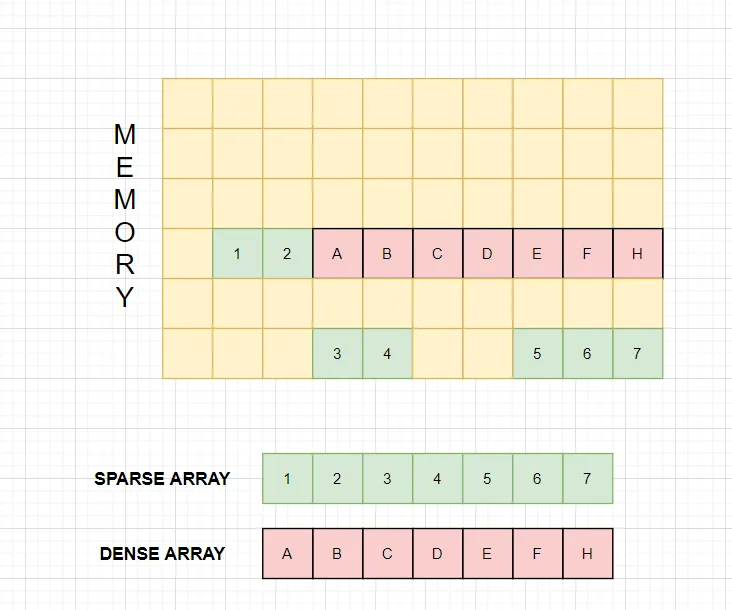
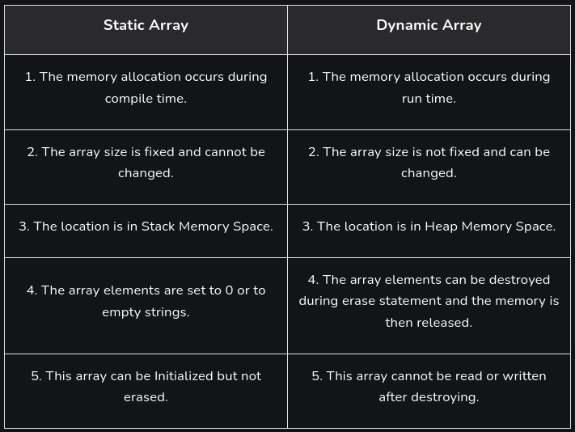

### Array - ma'lumot tuzilmasi

> Array (Massiv)

<p align="center">

</p>

Massiv ma'lumotlar strukturasining ilovalari:
Massivlar, asosan, ularni foydali qiladigan boshqa ma'lumotlar tuzilmalariga
nisbatan tasodifiy kirish va keshga qulaylik kabi afzalliklarga ega.

- **Quyida massivlarning ba'zi ilovalari keltirilgan:**

  - **Storing and accessing data:** Massivlar elementlarni ma'lum bir tartibda saqlaydi
    va har qanday elementga doimiy vaqtda O(1) kirish imkonini beradi.
  - **Searching:** Agar massivdagi ma'lumotlar tartiblangan bo'lsa, biz elementni O(log n)
    vaqtida qidirishimiz mumkin. Bundan tashqari, floor(), ceiling(), k-kichik, k-katta va
    hokazolarni samarali tarzda topishimiz mumkin.
  - **Matrices:** Ikki o'lchovli massivlar matritsalar uchun grafik algoritmlari va tasvirni
    qayta ishlash kabi hisoblashlarda qo'llaniladi.
  - **Implementing other data structures:** massivlar stacks va queues larni amalga oshirish
    uchun asosiy ma'lumotlar strukturasi sifatida ishlatiladi.
  - **Dynamic programming:** Dinamik dasturlash algoritmlari ko'pincha kattaroq muammolarni
    hal qilish uchun kichik muammolarning oraliq natijalarini saqlash uchun massivlardan foydalanadi.
  - **Data Buffers:** massivlar ma'lumotlar buferlari va navbatlari bo'lib xizmat qiladi,
    ishlov berishdan oldin tarmoq paketlari, fayl oqimlari va ma'lumotlar bazasi natijalari
    kabi kiruvchi ma'lumotlarni vaqtincha saqlaydi.

- **Massiv ma'lumotlar strukturasining afzalliklari:**

  - **Efficient and Fast Access:** massivlar doimiy kirish vaqti bilan to'plamdagi istalgan
    elementga to'g'ridan-to'g'ri va samarali kirish imkonini beradi, chunki ma'lumotlar qo'shni xotira joylarida saqlanadi.
  - **Memory Efficiency:** massivlar elementlarni qo'shni xotirada saqlaydi, bu bitta blokda
    samarali taqsimlashga imkon beradi va xotira parchalanishini kamaytiradi.
  - **Versatility:** Massivlar butun sonlar, suzuvchi nuqtali raqamlar, belgilar va hatto
    ob'ektlar va ko'rsatkichlar kabi murakkab ma'lumotlar tuzilmalarini o'z ichiga olgan
    keng turdagi ma'lumotlar turlarini saqlash uchun ishlatilishi mumkin.
  - **Compatibility with hardware:** Massiv ma'lumotlar strukturasi ko'pgina apparat arxitekturalari
    bilan mos keladi, bu uni turli xil muhitlarda dasturlash uchun ko'p qirrali vositaga aylantiradi.

- **Massiv ma'lumotlar strukturasining kamchiliklari:**
  - **Fixed Size:** massivlar yaratishda belgilangan o'lchamga ega. Massivni kengaytirish yangisini
    yaratish va elementlarni nusxalashni talab qiladi, bu ko'p vaqt va xotirani talab qiladi.
  - **Memory Allocation Issues:** Katta massivlarni ajratish xotiraning charchashiga olib kelishi mumkin,
    ayniqsa resurslari cheklangan tizimlarda ishlamay qolishi mumkin.
  - **Insertion and Deletion Challenges:** elementlarni qo'shish yoki olib tashlash keyingi elementlarni
    o'zgartirishni talab qiladi, bu esa bu operatsiyalarni samarasiz qiladi.
  - **Limited Data Type Support:** massivlar faqat bir xil turdagi elementlarni qo'llab-quvvatlaydi,
    ulardan foydalanishni murakkab ma'lumotlar turlari bilan cheklaydi.
  - **Lack of Flexibility:** Ruxsat etilgan o'lcham va cheklangan turdagi qo'llab-quvvatlash massivlarni
    bog'langan ro'yxatlar yoki daraxtlar kabi tuzilmalarga qaraganda kamroq moslashuvchan qiladi.

> Example Array in JavaScript

```js
let arr = [1, 2, 3, 4, 5, 6, 7, 8, 9]; // Initializing an array with values

// Accessing elements
console.log("Element at index 0:", arr[0]); // Element at index 0: 1
```

> ARRAY va XOTIRA

<p align="center">

</p>

> ARRAY va Big O

<p align="center">

</p>

<p align="center">

</p>

> **Array** turlari:

Asosan ikki turdagi **Array** mavjud:

1. **Static Array**: Ushbu turdagi massivda xotira kompilyatsiya vaqtida uning belgilangan o'lchamiga ega bo'ladi. Biz bu massiv hajmini o‘zgartira olmaymiz yoki yangilay olmaymiz.
2. **Dynamic Array**: Ushbu turdagi massivda xotira ish vaqtida ajratiladi, lekin belgilangan hajmga ega emas. Aytaylik, foydalanuvchi massivning istalgan tasodifiy hajmini e'lon qilmoqchi bo'lsa, biz statik massivdan foydalanmaymiz, uning o'rniga qo'lda dinamik massiv ishlatiladi. U har qanday dasturning ishlash vaqtida uning hajmini belgilash uchun ishlatiladi.

<p align="center">

</p>

> Example in JavaScript

```js
// Static Integer Array
const staticArray = [1, 2, 3, 4, 5];

// Dynamic Integer Array (Array with size allocation)
const dynamicArray = new Array(5); // Allocating memory for 5 elements

// Initializing dynamic array elements
for (let i = 0; i < dynamicArray.length; i++) {
  dynamicArray[i] = i + 1; // Assigning values 1, 2, 3, 4, 5
}

// Printing Static Integer Array
console.log("Static Integer Array:");
console.log(staticArray.join(" "));

// Printing Dynamic Integer Array
console.log("Dynamic Integer Array:");
console.log(dynamicArray.join(" "));
```

<p align="center">

</p>

> **Static Array** va **Dynamic Array** o'rtasidagi asosiy farq:

<p align="center">

</p>
