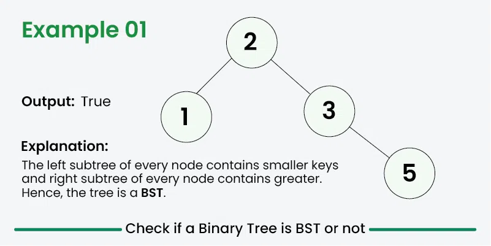
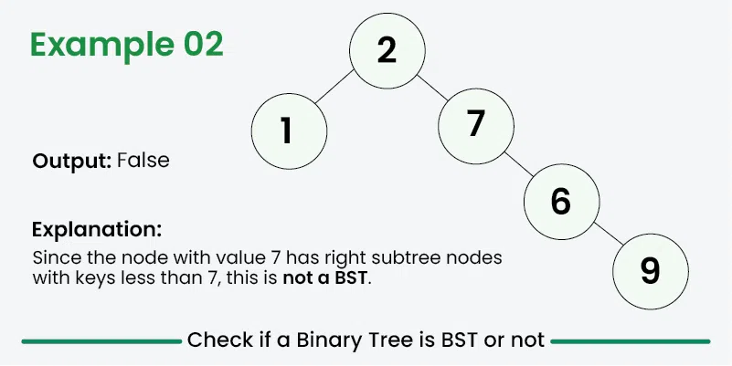
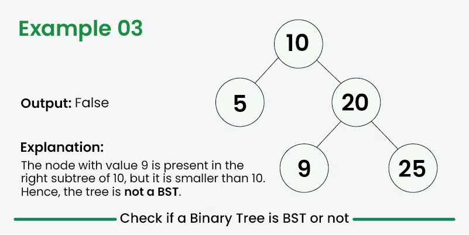

### Binary Search Tree

**Binary Search Tree (yoki BST)** - bu ma'lumotlarni tartiblangan tarzda tartibga solish va saqlash uchun informatikada qo'llaniladigan ma'lumotlar tuzilmasi. Ikkilik qidiruv daraxtining har bir tugunida ko‘pi bilan ikkita bola, chap va o‘ng bola bo‘ladi, chap bolada ota-ona tugunidan kichikroq qiymatlar, o‘ngda esa ota-tugundan kattaroq qiymatlar mavjud. Ushbu ierarxik tuzilma daraxtda saqlangan ma'lumotlarni samarali qidirish, kiritish va o'chirish operatsiyalarini amalga oshirish imkonini beradi.

**Binary Search Tree** xususiyatlari:

- Tugunning chap pastki daraxti faqat tugun kalitidan kamroq kalitlarga ega tugunlarni o'z ichiga oladi.
- Tugunning o'ng pastki daraxti faqat tugun kalitidan kattaroq kalitlarga ega bo'lgan tugunlarni o'z ichiga oladi.
- Chap va o'ng pastki daraxt ham ikkilik qidiruv daraxti bo'lishi kerak.
- Ikki nusxadagi tugunlar bo'lmasligi kerak (BST turli xil ishlov berish yondashuvlari bilan takroriy qiymatlarga ega bo'lishi mumkin).

**Binary Search Tree** haqida muhim fikrlar

- Binary Search Tree saralangan ma'lumotlar oqimini saqlash uchun foydalidir. Bu O(h) vaqtida qidirish, kiritish, oʻchirish, shiftga, maksimal va minga ruxsat beradi. Ular bilan bir qatorda, biz har doim saralangan tartibda daraxt ob'ektlarini aylanib o'tishimiz mumkin.
- O'z-o'zini muvozanatlashtiruvchi BSTlar yordamida biz BST balandligi Log n bilan bog'langanligini ta'minlashimiz mumkin. Demak, O(Log n) vaqtida yuqorida qayd etilgan O(h) operatsiyalariga erishamiz.
- Bizga faqat qidirish, kiritish va o'chirish kerak bo'lganda va boshqa operatsiyalar kerak bo'lmasa, biz BSTdan ko'ra hash jadvalini afzal ko'ramiz, chunki Xesh jadvali bu operatsiyalarni o'rtacha O(1) vaqtida qo'llab-quvvatlaydi.

**Binary Search Tree** ilovalari:
BST qidiruv, kiritish, oʻchirish, maksimal, minimal, pol, shift, kattaroq, kichikroq va hokazo kabi operatsiyalarni O(h) vaqtida qoʻllab-quvvatlaydi, bunda h BST balandligi. Balandlikni kamroq ushlab turish uchun amalda o'z-o'zidan muvozanatlashuvchi BSTlar (masalan, AVL va Red Black Trees) qo'llaniladi. Ushbu o'z-o'zini muvozanatlashtiruvchi BSTlar balandlikni O (Log n) sifatida saqlaydi. Shuning uchun yuqoridagi barcha amallar O (Log n) ga aylanadi. Bular bilan birga BST O(n) vaqtida ma'lumotlarning tartiblangan tartibini o'tkazish imkonini beradi.

1. Tartiblangan ma'lumotlar oqimini saqlash uchun o'z-o'zini muvozanatlashtiruvchi ikkilik qidiruv daraxti ishlatiladi. Misol uchun, biz onlayn buyurtmalar oldik va biz jonli ma'lumotlarni (RAMda) narxlarning tartiblangan tartibida saqlamoqchimiz deylik. Misol uchun, biz istalgan vaqtda ma'lum bir narxdan past narxda sotib olingan tovarlar sonini bilishni xohlaymiz. Yoki biz berilgan narxdan yuqori narxda sotib olingan mahsulotlar sonini bilmoqchimiz.
2. Ikki marta tugallangan ustuvor navbatni amalga oshirish uchun Self-Balancing Binary Search Tree ishlatiladi. Binary Heap yordamida biz extractMin() yoki extractMax() yordamida ustuvor navbatni amalga oshirishimiz mumkin. Agar biz ikkala operatsiyani ham qo'llab-quvvatlamoqchi bo'lsak, ikkalasini O (Log n) da bajarish uchun o'z-o'zini muvozanatlashtiruvchi ikkilik qidiruv daraxtidan foydalanamiz.
3. Algoritm bilan bog'liq ko'plab muammolar mavjud, bunda o'z-o'zini muvozanatlashtirgan BST eng mos ma'lumotlar tuzilmasi hisoblanadi, masalan, o'ng tomonda kichikroq elementlarni sanash, o'ng tomondagi eng kichik katta element va h.k.
4. Katta ma'lumotlar to'plamini saralash uchun BSTdan foydalanish mumkin. Ma'lumotlar to'plamining elementlarini BSTga kiritish va keyin tartib bo'yicha o'tishni amalga oshirish orqali elementlar tartiblangan tartibda qaytariladi. Oddiy tartiblash algoritmlari bilan solishtirganda, bu erda afzallik shundaki, biz keyinchalik O(Log n) vaqtida elementlarni kiritish/o'chirishimiz mumkin.
5. Ma'lumotlar bazasini indekslashda BST ning B Tree va B+ Tree kabi o'zgarishlari qo'llaniladi.
6. Java-da TreeMap va TreeSet, C++-da to'plam va xaritalar o'z-o'zini muvozanatlashtiruvchi BST-lar, rasmiy ravishda Qizil-Qora daraxt yordamida amalga oshiriladi.

**Binary Search Tree** afzalliklari:

- **Efficient searching:** O'z-o'zini muvozanatlashtiruvchi BST bilan qidirish uchun O(log n) vaqt murakkabligi
- **Ordered structure:** Elementlar tartiblangan tartibda saqlanadi, bu keyingi yoki oldingi elementni topishni osonlashtiradi
- **Dynamic insertion and deletion:** Elementlarni samarali qoʻshish yoki olib tashlash mumkin
- **Balanced structure:** Balanslangan BSTlar logarifmik balandlikni saqlab, samarali operatsiyalarni ta'minlaydi
- **Doubly Ended Priority Queue:** BSTlarda biz maksimal va minimalni samarali ushlab turishimiz mumkin

**Binary Search Tree** kamchiliklari:

- **Not self-balancing:** muvozanatsiz BSTlar yomon ishlashga olib kelishi mumkin
- **Worst-case time complexity:** Eng yomon holatda, BSTlar qidirish va kiritish uchun chiziqli vaqt murakkabligiga ega bo'lishi mumkin.
- **Memory overhead:** BSTlar ko'rsatgichlarni bola tugunlariga saqlash uchun qo'shimcha xotira talab qiladi
- **Not suitable for large datasets:** BSTlar juda katta ma'lumotlar to'plamlari uchun samarasiz bo'lishi mumkin
- **Limited functionality:** BSTlar faqat qidirish, qo'shish va o'chirish operatsiyalarini qo'llab-quvvatlaydi

> Big O

|                   | Array    | Binary Search Tree |
| ----------------- | -------- | ------------------ |
| Qidirish          | O(log2n) | O(log2n)           |
| Element qo'shish  | O(n)     | O(log2n)           |
| Element o'chirish | O(n)     | O(log2n)           |

- Binary Search Tree kamchiligi:

  - Muvozanatni yo'qotish

- Boshqa (tree) shajara turlari:
  - Red-black tree (o'zini muvozanatga keltiradi)
  - B-tree (ma'lumotlar bazasida ishlatiladi)
  - Heap
  - Splay tree
