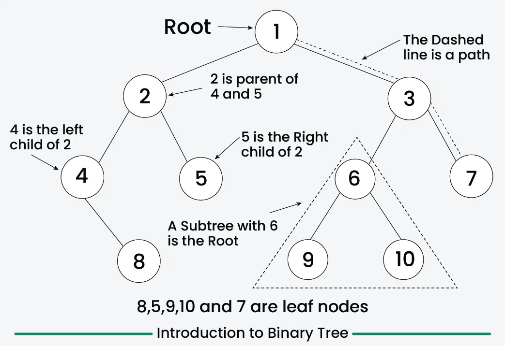
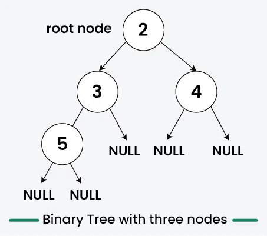
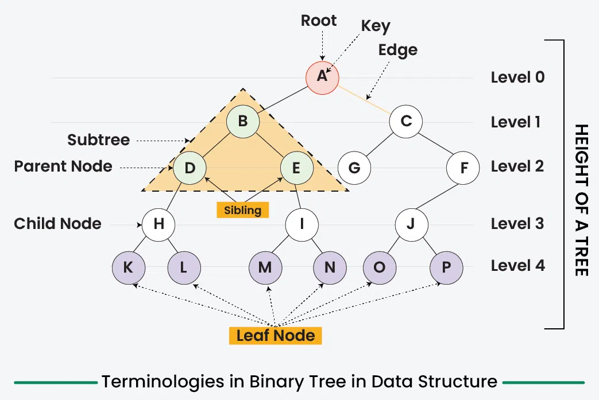
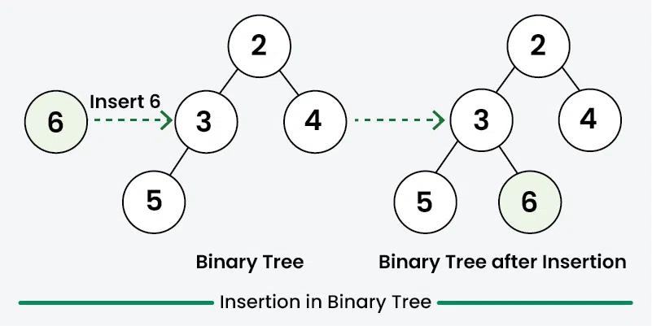
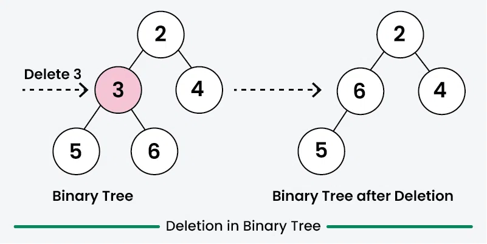

### Binary Tree Data Structure

**Binary Tree** ma'lumotlar strukturasi - bu ierarxik ma'lumotlar tuzilmasi bo'lib, unda har bir tugun chap va o'ng bola deb ataladigan ko'pi bilan ikkita bolaga ega. U odatda Computer Science da ma'lumotlarni samarali saqlash va olish uchun, qo'shish, o'chirish va o'tish kabi turli operatsiyalar bilan qo'llaniladi.

<p align="center">

</p>

**Binary Tree** - bu **non-linear** (chiziqli bo'lmagan) va **hierarchical** (ierarxik) ma'lumotlar strukturasi bo'lib, unda har bir **node** **left** va **right child** deb ataladigan eng ko'p **two childreb**ga ega. Binary Tree ning eng yuqori node ga root deyiladi, pastki qismi esa leaves deb ataladi.

<p align="center">

</p>

**Binary Tree tasviri**

- **Binary Tree dagi har bir tugun 3 qismdan iborat:**
  - Data
  - Pointer to the left child
  - Pointer to the right child

<p align="center">

</p>

Create/Declare a Node of a Binary Tree:

```js
/* Class containing left and right child 
  of current node and data*/

class Node {
  constructor(item) {
    this.data = item;
    this.left = this.right = null;
  }
}
```

Example for Creating a Binary Tree:

<p align="center">

</p>

```js
class Node {
  constructor(d) {
    this.data = d;
    this.left = null;
    this.right = null;
  }
}

// Initialize and allocate memory for tree nodes
let firstNode = new Node(2);
let secondNode = new Node(3);
let thirdNode = new Node(4);
let fourthNode = new Node(5);

// Connect binary tree nodes
firstNode.left = secondNode;
firstNode.right = thirdNode;
secondNode.left = fourthNode;
```

- **Terminologies in Binary Tree**
  - **Nodes:** The fundamental part of a binary tree, where each node contains data and link to two child nodes.
  - **Root:** The topmost node in a tree is known as the root node. It has no parent and serves as the starting point for all nodes in the tree.
  - **Parent Node:** A node that has one or more child nodes. In a binary tree, each node can have at most two children.
  - **Child Node:** A node that is a descendant of another node (its parent).
  - **Leaf Node:** A node that does not have any children or both children are null.
  - **Internal Node:** A node that has at least one child. This includes all nodes except the root and the leaf nodes.
  - **Depth of a Node:** The number of edges from a specific node to the root node. The depth of the root node is zero.
  - **Height of a Binary Tree:** The number of nodes from the deepest leaf node to the root node.

<p align="center">

</p>

- **Properties of Binary Tree**
  - The maximum number of nodes at level L of a binary tree is 2^L
  - The maximum number of nodes in a binary tree of height H is 2^H – 1
  - Total number of leaf nodes in a binary tree = total number of nodes with 2 children + 1
  - In a Binary Tree with N nodes, the minimum possible height or the minimum number of levels is Log2(N+1)
  - A Binary Tree with L leaves has at least | Log2L |+ 1 levels

**Types of Binary Tree**
Binary Tree can be classified into multiples types based on multiple factors:

- **On the basis of Number of Children**
  - Full Binary Tree
  - Degenerate Binary Tree
  - Skewed Binary Trees
- **On the basis of Completion of Levels**
  - Complete Binary Tree
  - Perfect Binary Tree
  - Balanced Binary Tree
- **On the basis of Node Values:**
  - Binary Search Tree
  - AVL Tree
  - Red Black Tree
  - B Tree
  - B+ Tree
  - Segment Tree

**Operations On Binary Tree**

**1. Traversal in Binary Tree**
Traversal in Binary Tree involves visiting all the nodes of the binary tree. Tree Traversal algorithms can be classified broadly into two categories, DFS and BFS:

Depth-First Search (DFS) algorithms: DFS explores as far down a branch as possible before backtracking. It is implemented using recursion. The main traversal methods in DFS for binary trees are:

- Preorder Traversal (current-left-right): Visits the node first, then left subtree, then right subtree.
- Inorder Traversal (left-current-right): Visits left subtree, then the node, then the right subtree.
- Postorder Traversal (left-right-current): Visits left subtree, then right subtree, then the node.

Breadth-First Search (BFS) algorithms: BFS explores all nodes at the present depth before moving on to nodes at the next depth level. It is typically implemented using a queue. BFS in a binary tree is commonly referred to as Level Order Traversal.

```js
// Node structure
class Node {
  constructor(data) {
    this.data = data;
    this.left = null;
    this.right = null;
  }
}

// In-order DFS: Left, Root, Right
function inOrderDFS(node) {
  if (node === null) return;
  inOrderDFS(node.left);
  process.stdout.write(node.data + " ");
  inOrderDFS(node.right);
}

// Pre-order DFS: Root, Left, Right
function preOrderDFS(node) {
  if (node === null) return;
  process.stdout.write(node.data + " ");
  preOrderDFS(node.left);
  preOrderDFS(node.right);
}

// Post-order DFS: Left, Right, Root
function postOrderDFS(node) {
  if (node === null) return;
  postOrderDFS(node.left);
  postOrderDFS(node.right);
  process.stdout.write(node.data + " ");
}

// BFS: Level order traversal
function bfs(root) {
  if (root === null) return;
  let queue = [root];
  while (queue.length > 0) {
    let node = queue.shift();
    process.stdout.write(node.data + " ");
    if (node.left) queue.push(node.left);
    if (node.right) queue.push(node.right);
  }
}

// Creating the tree
let root = new Node(2);
root.left = new Node(3);
root.right = new Node(4);
root.left.left = new Node(5);

console.log("In-order DFS: ");
inOrderDFS(root);
console.log("\nPre-order DFS: ");
preOrderDFS(root);
console.log("\nPost-order DFS: ");
postOrderDFS(root);
console.log("\nLevel order: ");
bfs(root);
```

Output:

```
In-order DFS: 5 3 2 4
Pre-order DFS: 2 3 5 4
Post-order DFS: 5 3 4 2
Level order: 2 3 4 5
```

**2. Insertion in Binary Tree**

Inserting elements means add a new node into the binary tree. As we know that there is no such ordering of elements in the binary tree, So we do not have to worry about the ordering of node in the binary tree. We would first creates a root node in case of empty tree. Then subsequent insertions involve iteratively searching for an empty place at each level of the tree. When an empty left or right child is found then new node is inserted there. By convention, insertion always starts with the left child node.

<p align="center">

</p>

```js
class Node {
  constructor(d) {
    this.data = d;
    this.left = null;
    this.right = null;
  }
}

// Function to insert a new node in the binary tree
function insert(root, key) {
  if (root === null) {
    return new Node(key);
  }

  // Create a queue for level order traversal
  let queue = [root];

  while (queue.length > 0) {
    let temp = queue.shift();

    // If left child is empty, insert the new node here
    if (temp.left === null) {
      temp.left = new Node(key);
      break;
    } else {
      queue.push(temp.left);
    }

    // If right child is empty, insert the new node here
    if (temp.right === null) {
      temp.right = new Node(key);
      break;
    } else {
      queue.push(temp.right);
    }
  }

  return root;
}

// In-order traversal
function inorder(root) {
  if (root === null) return;
  inorder(root.left);
  process.stdout.write(root.data + " ");
  inorder(root.right);
}

let root = new Node(2);
root.left = new Node(3);
root.right = new Node(4);
root.left.left = new Node(5);

console.log("Inorder traversal before insertion: ");
inorder(root);
console.log();

let key = 6;
root = insert(root, key);

console.log("Inorder traversal after insertion: ");
inorder(root);
console.log();
```

Output:

```js
Inorder traversal before insertion: 5 3 2 4
Inorder traversal after insertion: 5 3 6 2 4
```

**3. Searching in Binary Tree**

Searching for a value in a binary tree means looking through the tree to find a node that has that value. Since binary trees do not have a specific order like binary search trees, we typically use any traversal method to search. The most common methods are depth-first search (DFS) and breadth-first search (BFS). In DFS, we start from the root and explore the depth nodes first. In BFS, we explore all the nodes at the present depth level before moving on to the nodes at the next level. We continue this process until we either find the node with the desired value or reach the end of the tree. If the tree is empty or the value isn’t found after exploring all possibilities, we conclude that the value does not exist in the tree.

Here is the implementation of searching in a binary tree using Depth-First Search (DFS)

```js
class Node {
  constructor(d) {
    this.data = d;
    this.left = null;
    this.right = null;
  }
}

// Function to search for a value in the binary tree using DFS
function searchDFS(root, value) {
  // Base case: If the tree is empty or we've reached a leaf node
  if (root === null) {
    return false;
  }
  // If the node's data is equal to the value we are searching for
  if (root.data === value) {
    return true;
  }
  // Recursively search in the left and right subtrees
  const left_res = searchDFS(root.left, value);
  const right_res = searchDFS(root.right, value);

  return left_res || right_res;
}

// Creating the binary tree
const root = new Node(2);
root.left = new Node(3);
root.right = new Node(4);
root.left.left = new Node(5);
root.left.right = new Node(6);

const value = 6;
if (searchDFS(root, value)) {
  console.log(`${value} is found in the binary tree`);
} else {
  console.log(`${value} is not found in the binary tree`);
}
```

Output:

```
6 is found in the binary tree
```

**4. Deletion in Binary Tree**

Deleting a node from a binary tree means removing a specific node while keeping the tree’s structure. First, we need to find the node that want to delete by traversing through the tree using any traversal method. Then replace the node’s value with the value of the last node in the tree (found by traversing to the rightmost leaf), and then delete that last node. This way, the tree structure won’t be effected. And remember to check for special cases, like trying to delete from an empty tree, to avoid any issues.

Note: There is no specific rule of deletion but we always make sure that during deletion the binary tree proper should be preserved.

<p align="center">

</p>

```js
class Node {
  constructor(d) {
    this.data = d;
    this.left = null;
    this.right = null;
  }
}

// Function to delete a node from the binary tree
function deleteNode(root, val) {
  if (root === null) return null;

  // Use a queue to perform BFS
  let queue = [root];
  let target = null;

  // Find the target node
  while (queue.length > 0) {
    let curr = queue.shift();

    if (curr.data === val) {
      target = curr;
      break;
    }
    if (curr.left) queue.push(curr.left);
    if (curr.right) queue.push(curr.right);
  }
  if (target === null) return root;

  // Find the deepest rightmost node and its parent
  let lastNode = null;
  let lastParent = null;
  queue = [{ node: root, parent: null }];

  while (queue.length > 0) {
    let { node: curr, parent } = queue.shift();
    lastNode = curr;
    lastParent = parent;

    if (curr.left) queue.push({ node: curr.left, parent: curr });
    if (curr.right) queue.push({ node: curr.right, parent: curr });
  }

  // Replace target's value with the last node's value
  target.data = lastNode.data;

  // Remove the last node
  if (lastParent) {
    if (lastParent.left === lastNode) lastParent.left = null;
    else lastParent.right = null;
  } else {
    return null;
  }
  return root;
}

// In-order traversal
function inorder(root) {
  if (root === null) return;
  inorder(root.left);
  process.stdout.write(root.data + " ");
  inorder(root.right);
}

let root = new Node(2);
root.left = new Node(3);
root.right = new Node(4);
root.left.left = new Node(5);
root.left.right = new Node(6);

console.log("Original tree (in-order): ");
inorder(root);
console.log();

let valToDel = 3;
root = deleteNode(root, valToDel);

console.log(`Tree after deleting ${valToDel} (in-order): `);
inorder(root);
console.log();
```

Output:

```
Original tree (in-order): 5 3 6 2 4
Tree after deleting 3 (in-order): 5 6 2 4
```

- **Auxiliary Operations On Binary Tree**
  - Finding the height of the tree
  - Find level of a node in a Binary tree
  - Finding the size of the entire tree

**Complexity Analysis of Binary Tree Operations**
Here’s the complexity analysis for specific binary tree operations:

| Operation              | Time Complexity | Auxiliary Space |
| ---------------------- | --------------- | --------------- |
| In-Order Traversal     | O(n)            | O(n)            |
| Pre-Order Traversal    | O(n)            | O(n)            |
| Post-Order Traversal   | O(n)            | O(n)            |
| Insertion (Unbalanced) | O(n)            | O(n)            |
| Searching (Unbalanced) | O(n)            | O(n)            |
| Deletion (Unbalanced)  | O(n)            | O(n)            |

Note: We can use Morris Traversal to traverse all the nodes of the binary tree in O(n) time complexity but with O(1) auxiliary space.

**Binary Tree afzalliklari**

- **Efficient Search:** Binary Search Trees (a variation of Binary Tree) are efficient when searching for a specific element, as each node has at most two child nodes when compared to linked list and arrays
- **Memory Efficient:** Binary trees require lesser memory as compared to other tree data structures, therefore memory-efficient.
- Binary trees are relatively easy to implement and understand as each node has at most two children, left child and right child.

**Binary Tree kamchiliklari**

- **Limited structure:** Binary trees are limited to two child nodes per node, which can limit their usefulness in certain applications. For example, if a tree requires more than two child nodes per node, a different tree structure may be more suitable.
- **Unbalanced trees:** Unbalanced binary trees, where one subtree is significantly larger than the other, can lead to inefficient search operations. This can occur if the tree is not properly balanced or if data is inserted in a non-random order.
- **Space inefficiency:** Binary trees can be space inefficient when compared to other data structures like arrays and linked list. This is because each node requires two child references or pointers, which can be a significant amount of memory overhead for large trees.
- **Slow performance in worst-case scenarios:** In the worst-case scenario, a binary tree can become degenerate or skewed, meaning that each node has only one child. In this case, search operations in Binary Search Tree (a variation of Binary Tree) can degrade to O(n) time complexity, where n is the number of nodes in the tree.

**Binary Tree ilovalari**

- Binary Tree can be used to represent hierarchical data.
- Huffman Coding trees are used in data compression algorithms.
- Priority Queue is another application of binary tree that is used for searching maximum or minimum in O(1) time complexity.
- Useful for indexing segmented at the database is useful in storing cache in the system,
- Binary trees can be used to implement decision trees, a type of machine learning algorithm used for classification and regression analysis.
