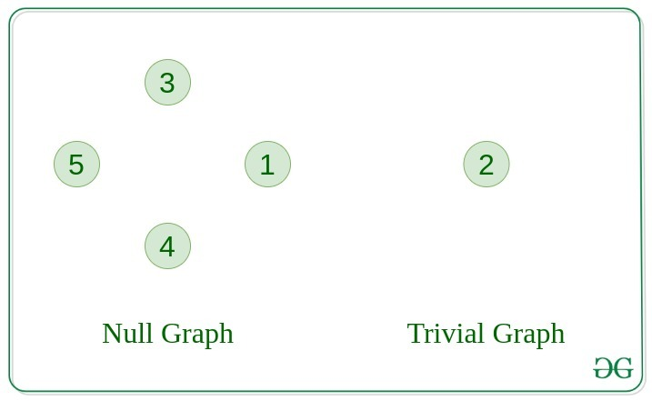
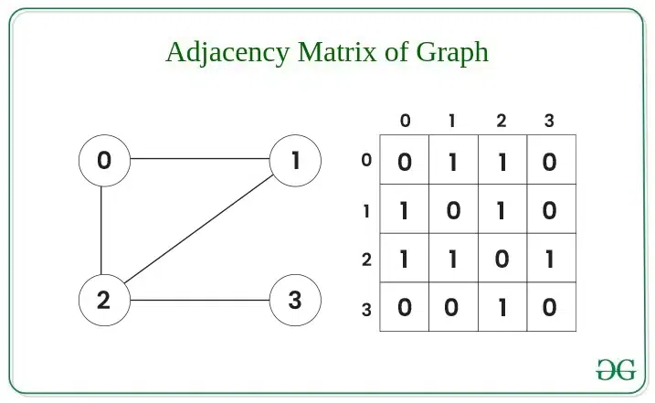
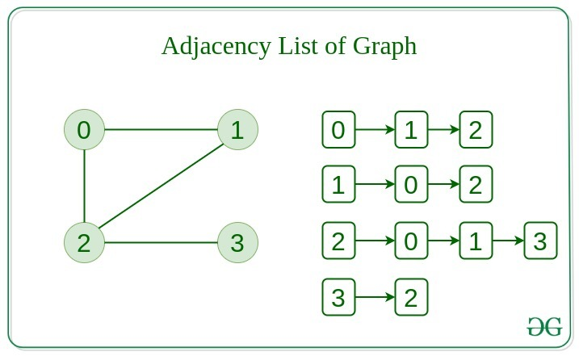
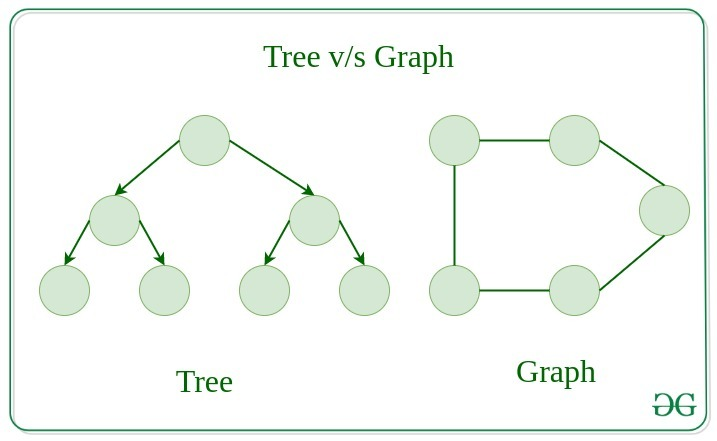
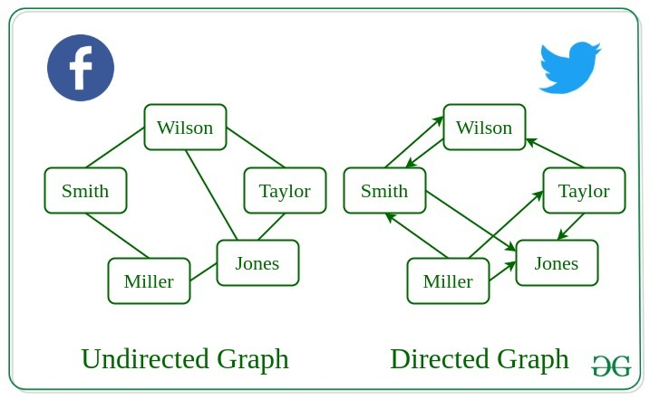

### Graph

- **GRAPH** - bu cho'qqilar(vertices) va qirralardan(edges) iborat chiziqli bo'lmagan ma'lumotlar strukturasi.
- **GRAPH** cho'qqilar(vertices) to'plami ( V ) va qirralardan(edges) to'plamidan ( E ) iborat. **GRAPH** G(V, E) bilan belgilanadi.

<p align="center">

</p>

> Grafik ma'lumotlar strukturasining komponentlari:

- Vertices: Vertices - bu grafikning asosiy birliklari.
  Ba'zan, cho'qqilar(vertices) cho'qqi yoki tugunlar sifatida ham tanilgan.
  Har bir tugun/cho'qqi (node/vertex) etiketli yoki yorliqsiz(labeled or unlabelled) bo'lishi mumkin.
- Edges: Edges chiziladi yoki grafikning ikkita tugunini ulash uchun ishlatiladi.
  Yo'naltirilgan grafikdagi juft tugunlarni buyurtma qilish mumkin.
  Qirralar(edges) har qanday ikkita tugunni istalgan usulda ulashi mumkin.
  Hech qanday qoidalar yo'q. Ba'zan qirralarning yoylari sifatida ham tanilgan.
  Har bir chekka etiketli/yorliqsiz (labelled/unlabelled) bo'lishi mumkin.

> **GRAPH** turlari

1. **Null Graph**

- **Graph** qirralar(edges) bo'lmasa **Null Graph** deb nomlanadi.

2. **Trivial Graph**

- Faqat bitta tepaga(single vertex) ega bo'lgan **Graph** - **Trivial Graph**dir.
<p align="center">

</p>

3. **Undirected Graph**

- Qirralari(edges) hech qanday yo'nalishga ega bo'lmagan **Graph**.
  Ya'ni tugunlar(nodes) har bir chekkaning ta'rifida tartibsiz juftliklar(unordered pairs)dir.

4. **Directed Graph**

- Qirrasi(edge) yo'nalishga ega bo'lgan **Graph**. Ya'ni tugunlar(nodes) har bir chekkaning ta'rifida juftlik bilan tartiblangan(ordered pairs).
<p align="center">

</p>

5. **Connected Graph**

- Bir tugundan(node) boshqa istalgan tugunga(node) tashrif buyurishimiz **Connected Graph** deb nomlanadi.

6. **Disconnected Graph**

- Tugundan(node) kamida bitta tugunga(node) etib bo'lmaydigan grafik **Disconnected Graph** deb nomlanadi.
<p align="center">

</p>

7. **Regular Graph**

- Har bir cho'qqining darajasi K ga teng bo'lgan grafik K **Regular Graph** deb ataladi.

8. **Complete Graph**

- Har bir tugundan bir-biriga chekka bo'lgan grafik.
<p align="center">

</p>

9. **Cycle Graph**

- Grafik o'z-o'zidan (cycle) bo'lgan grafik, har bir tepalik darajasining minimal qiymati 2 ga teng.

10. **Cyclic Graph**

- Kamida bitta (cycle) o'z ichiga olgan grafik **Cyclic Graph** deb nomlanadi.
<p align="center">

</p>

11. **Directed Acyclic Graph**

- Hech qanday (cycle)ni o'z ichiga olmaydigan **Directed Graph**.

12. **Bipartite Graph**

- Har bir to'plamdagi cho'qqida ular orasidagi chekka bo'lmasligi uchun cho'qqini ikkita to'plamga bo'lish mumkin bo'lgan grafik.
<p align="center">

</p>

13. **Weighted Graph**

- Qirralari allaqachon mos og'irlik bilan ko'rsatilgan grafik **Weighted Graph** deb nomlanadi.
- Og'irlangan grafiklarni qo'shimcha ravishda yo'naltirilgan **Weighted Graph** va yo'naltirilmagan **Weighted Graph** deb tasniflash mumkin.

> **Graph** saqlashning bir necha usullari mavjud:

- **Adjacency Matrix**
- **Adjacency List**

> **Adjacency Matrix**

<p align="center">

</p>

Example **Adjacency Matrix** in JavaScript

```js
function addEdge(mat, i, j) {
  mat[i][j] = 1; // Graph is
  mat[j][i] = 1; // undirected
}

function displayMatrix(mat) {
  // Display the adjacency matrix
  for (const row of mat) {
    console.log(row.join(" "));
  }
}

// Main function to run the program
const V = 4; // Number of vertices

// Initialize matrix
let mat = Array.from({ length: V }, () => Array(V).fill(0));

// Add edges to the graph
addEdge(mat, 0, 1);
addEdge(mat, 0, 2);
addEdge(mat, 1, 2);
addEdge(mat, 2, 3);

/* Optionally, initialize matrix directly
let mat = [
    [0, 1, 0, 0],
    [1, 0, 1, 0],
    [0, 1, 0, 1],
    [0, 0, 1, 0]
];
*/

// Display adjacency matrix
console.log("Adjacency Matrix:");
displayMatrix(mat);
```

> **Adjacency List**

<p align="center">

</p>

Example **Adjacency List** in JavaScript

```js
function addEdge(adj, i, j) {
  adj[i].push(j);
  adj[j].push(i); // Undirected
}

function displayAdjList(adj) {
  for (let i = 0; i < adj.length; i++) {
    console.log(`${i}: `);
    for (const j of adj[i]) {
      console.log(`${j} `);
    }
    console.log();
  }
}

// Create a graph with 4 vertices and no edges
const V = 4;
const adj = Array.from({ length: V }, () => []);

// Now add edges one by one
addEdge(adj, 0, 1);
addEdge(adj, 0, 2);
addEdge(adj, 1, 2);
addEdge(adj, 2, 3);

console.log("Adjacency List Representation:");
displayAdjList(adj);
```

> Comparison between Adjacency Matrix and Adjacency List

<p align="center">

</p>

> Difference between Tree and Graph:

<p align="center">

</p>

> Real-Life Applications of Graph Data Structure:

<p align="center">

</p>

> Grafik ma'lumotlar strukturasining afzalliklari:

- Grafik ma'lumotlar strukturasi keng doiradagi munosabatlarni ifodalash uchun ishlatiladi,
  chunki bizda oldingi ma'lumotlar tuzilmalari kabi hech qanday cheklovlar yo'q
  (Daraxtda tsikllar bo'lishi mumkin emas va ierarxik bo'lishi kerak.
  Massivlar, bog'langan ro'yxat va boshqalar chiziqli).
- Ulardan keng ko'lamli muammolarni, jumladan, yo'lni aniqlash, ma'lumotlarni klasterlash,
  tarmoq tahlili va mashinalarni o'rganishni modellashtirish va hal qilish uchun foydalanish mumkin.
- Biz ma'lum elementlar to'plami va ular o'rtasidagi munosabatlarni osongina grafik sifatida modellashtirish mumkin,
  masalan, BFS, DFS, Spanning Tree, Eng qisqa yo'l, Topologik saralash va kuchli bog'langan standart grafik algoritmlari.
- Grafik ma'lumotlar strukturasi murakkab ma'lumotlar tuzilmalarini sodda va intuitiv tarzda ifodalash uchun ishlatilishi mumkin,
  bu ularni tushunish va tahlil qilishni osonlashtiradi.

> Grafik ma'lumotlar strukturasining kamchiliklari:

- Grafik ma'lumotlar tuzilmasi murakkab va tushunish qiyin bo'lishi mumkin,
  ayniqsa grafik nazariyasi yoki tegishli algoritmlar bilan tanish bo'lmagan odamlar uchun.
- Grafiklarni yaratish va manipulyatsiya qilish, ayniqsa, juda katta yoki murakkab grafiklar uchun hisoblash uchun qimmat bo'lishi mumkin.
- Grafik algoritmlarni to'g'ri loyihalash va amalga oshirish qiyin bo'lishi mumkin va xatolar va xatolarga moyil bo'lishi mumkin.
- Grafik ma'lumotlar tuzilmasini vizualizatsiya qilish va tahlil qilish qiyin bo'lishi mumkin, ayniqsa juda katta yoki murakkab grafiklar uchun,
  bu ma'lumotlardan mazmunli tushunchalarni olishni qiyinlashtirishi mumkin.
