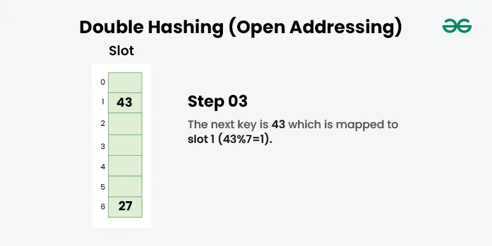

### Hashing in Data Structure

Xeshlash xesh funktsiyalari deb nomlanuvchi matematik formulalar yordamida o'zgaruvchan o'lchamdagi kirishdan qattiq o'lchamli chiqishni yaratish jarayonini anglatadi. Ushbu uslub ma'lumotlar strukturasidagi elementni saqlash uchun indeks yoki joyni aniqlaydi.

<p align="center">

</p>

- **Hash nima?**

  - Ma'lumotlar tuzilmalarida xeshlash berilgan kalitni boshqa qiymatga o'zgartirish jarayonini anglatadi. Bu xesh-jadvaldagi ma'lum bir indeksga ma'lumotlarni uning kaliti asosida tezkor ravishda olish imkonini beruvchi xesh funktsiyasidan foydalangan holda xaritalashni o'z ichiga oladi. Kalitni mos keladigan qiymatga aylantirish Hash funktsiyasi yordamida amalga oshiriladi va xash funktsiyasidan olingan qiymat Hash Code deb ataladi.

- **Hashing komponentlari**
  - **Key:** Kalit har qanday satr yoki butun son bo'lishi mumkin, u ma'lumotlar strukturasidagi elementni saqlash uchun indeks yoki joyni aniqlaydigan texnikada xesh funktsiyasiga kirish sifatida beriladi.
  - **Hash Function:** Xesh funktsiyasi kiritish kalitini oladi va xesh jadvali deb ataladigan massivdagi element indeksini qaytaradi. Indeks hash indeksi sifatida tanilgan.
  - **Hash Table:** Xesh-jadval - bu xesh funktsiyasi deb ataladigan maxsus funktsiyadan foydalangan holda kalitlarni qiymatlarga moslashtiradigan ma'lumotlar tuzilmasi. Xesh ma'lumotlarni assotsiativ tarzda har bir ma'lumot qiymatining o'ziga xos indeksiga ega bo'lgan massivda saqlaydi.

<p align="center">

</p>

- **Eng foydali va ko'p** ishlatiladigan ma'lumotlar tuzilmasi
- Aksar dasturlash tillarida **tadbiq qilingan**

  - Hash maps
  - Maps
  - Dictionaries (Python)

- **Hash funksiya**

  - Hash funksiya **matnni** takrorlanmas, noyob **songa** o'tkazib beradi
  - Hash funksiyalarning **turi ko'p**

  * **Yaxshi hash funksiya belgilari:**
    - **Bir xil matn** uchun **bir hil son** qaytaradi
    - **Xar xil matnlar** uchun **xar xil son** qaytaradi

  - Hash funksiya **sizga kerakli oraliqdagi** sonlarni qaytaradi

- **Complexity of calculating hash value using the hash function**

  - **Time complexity: O(n)**
  - **Space complexity: O(1)**

- **Hashing bilan bog'liq muammo**

  - Agar yuqoridagi misolni ko'rib chiqsak, biz ishlatgan xesh funktsiyasi harflar yig'indisidir, lekin agar biz xesh funktsiyasini diqqat bilan ko'rib chiqsak, muammoni osongina tasavvur qilish mumkinki, turli qatorlar uchun bir xil xesh qiymati hash funktsiyasi tomonidan yaratiladi.
  - Masalan: {“ab”, “ba”} ikkalasi ham bir xil xesh qiymatiga ega va {“cd”,”be”} qatori ham bir xil xesh qiymatini hosil qiladi va hokazo. Bu toʻqnashuv deb nomlanadi va qidiruvda muammo tugʻdiradi. , qiymatni kiritish, o'chirish va yangilash.

- **Ikki yoki undan ortiq kalitlar bir xil massiv indeksiga ishora qilganda Collisions sodir bo'ladi.**
  - Hashingdagi to'qnashuv ikki xil kalit bir xil xesh qiymatiga moslashganda sodir bo'ladi. Ko'p xesh algoritmlari uchun xash to'qnashuvlari ataylab yaratilishi mumkin. Xesh to'qnashuvi ehtimoli algoritm hajmiga, xesh qiymatlarining taqsimlanishiga va Hash funktsiyasining samaradorligiga bog'liq.
  - Xeshlash jarayoni katta kalit uchun kichik raqam hosil qiladi, shuning uchun ikkita kalit bir xil qiymatni ishlab chiqarishi mumkin. Vaziyat, yangi kiritilgan kalit allaqachon ishg'ol qilingan kalitga mos keladi va u ba'zi to'qnashuvlarni boshqarish texnologiyasidan foydalangan holda hal qilinishi kerak.

<p align="center">

</p>

- **To'qnashuvni hal qilishning asosan ikkita usuli mavjud:**
  - 1. Separate Chaining
  - 2. Open Addressing

<p align="center">

</p>

- **1. Separate Chaining**
  - Xesh-jadvalning har bir katagini bir xil xesh funktsiyasi qiymatiga ega bo'lgan bog'langan yozuvlar ro'yxatiga ishora qilishdir. Zanjirlash oddiy, lekin stoldan tashqarida qo'shimcha xotira talab qiladi.

```
**Linked List** ma'lumotlar strukturasi ushbu texnikani amalga oshirish uchun ishlatiladi.
Shunday qilib, bir nechta elementlar bir xil slot indeksiga xeshlanganda, bu elementlar
zanjir deb nomlanuvchi **singly-linked list**ga kiritiladi.
```

Misol: Biz xesh funksiyasini berdik va biz to'qnashuvni hal qilish texnikasi uchun alohida zanjirlash usuli yordamida xesh jadvaliga ba'zi elementlarni kiritishimiz kerak:

```
Hash function = key % 5,
Elements = 12, 15, 22, 25 and 37.
```

<p align="center">

</p>
<p align="center">

</p>
<p align="center">

</p>
<p align="center">

</p>
<p align="center">

</p>

- **Afzalliklari:**

  - Amalga oshirish oddiy.
  - Xesh jadvali hech qachon to'ldirilmaydi, biz har doim zanjirga ko'proq elementlar qo'shishimiz mumkin.
  - Xesh funktsiyasi yoki yuk omillariga nisbatan kam sezgir.
  - U asosan kalitlarning qancha va qanchalik tez-tez kiritilishi yoki o'chirilishi noma'lum bo'lganda qo'llaniladi.

- **Kamchiliklari:**

  - Zanjirlashning kesh ishlashi yaxshi emas, chunki kalitlar bog'langan ro'yxat yordamida saqlanadi. Ochiq manzillash keshning yaxshi ishlashini ta'minlaydi, chunki hamma narsa bir jadvalda saqlanadi.
  - Joyni isrof qilish (xesh jadvalining ba'zi qismlari hech qachon ishlatilmaydi)
  - Agar zanjir uzun bo'lsa, qidiruv vaqti eng yomon holatda O(n) ga aylanishi mumkin
  - Ulanishlar uchun qo'shimcha joydan foydalanadi

- **Chaining ishlashi:**
  - Xeshlash samaradorligini har bir kalitni jadvalning istalgan uyasiga (oddiy bir xil xeshlash) teng darajada xeshlash ehtimoli bor degan faraz ostida baholash mumkin.

```
m = Number of slots in hash table
n = Number of keys to be inserted in hash table

Load factor α = n/m
Expected time to search = O(1 + α)
Expected time to delete = O(1 + α)

Time to insert = O(1)
Time complexity of search insert and delete is O(1) if  α is O(1)
```

**Data Structures For Storing Chains:**

1. Linked lists

- Search: O(l) where l = length of linked list
- Delete: O(l)
- Insert: O(l)
- Not cache friendly

2. Dynamic Sized Arrays ( Vectors in C++, ArrayList in Java, list in Python)

- Search: O(l) where l = length of array
- Delete: O(l)
- Insert: O(l)
- Cache friendly

3. Self Balancing BST ( AVL Trees, Red-Black Trees)

- Search: O(log(l)) where l = length of linked list
- Delete: O(log(l))
- Insert: O(log(i))
- Not cache friendly
- Java 8 onward versions use this for HashMap

* **2. Open Addressing**

Ochiq adreslashda barcha elementlar xesh-jadvalning o'zida saqlanadi. Har bir jadval yozuvida yozuv yoki NIL mavjud. Elementni qidirishda biz kerakli element topilmaguncha yoki element jadvalda yo'qligi aniq bo'lguncha jadval slotlarini birma-bir tekshiramiz.

Ochiq manzillash - bu to'qnashuvlarni hal qilish usuli. Ochiq manzillashda barcha elementlar xesh jadvalining o'zida saqlanadi. Shunday qilib, istalgan vaqtda jadvalning o'lchami kalitlarning umumiy sonidan kattaroq yoki teng bo'lishi kerak (kerak bo'lsa, eski ma'lumotlarni nusxalash orqali jadval hajmini oshirishimiz mumkinligini unutmang). Ushbu yondashuv yopiq xeshlash deb ham ataladi. Bu jarayonning barchasi tekshirishga asoslangan. Oldinda tekshirish turlarini tushunamiz:

```
- **Insert(k):** Keep probing until an empty slot is found. Once an empty slot is found, insert k.
- **Search(k):** Keep probing until the slot’s key doesn’t become equal to k or an empty slot is reached.
- **Delete(k):** Delete operation is interesting. If we simply delete a key, then the search may fail.
  So slots of deleted keys are marked specially as “deleted”.
  The insert can insert an item in a deleted slot, but the search doesn’t stop at a deleted slot.
```

- **2.a) Linear Probing**
  - Chiziqli tekshirishda xesh jadvali xeshning asl joylashuvidan boshlanadigan ketma-ket qidiriladi. Agar biz olgan joy allaqachon band bo'lsa, keyingi joyni tekshiramiz.

> Algorithm:

```
 1. Calculate the hash key. i.e.  key = data % size

 2. Check, if  hashTable[key]  is empty
    * store the value directly by  hashTable[key] = data

 3. If the hash index already has some value then
    * check for next index using  key = (key+1) % size

 4. Check, if the next index is available hashTable[key] then store the value. Otherwise try for next index.

 5. Do the above process till we find the space.
```

<p align="center">

</p>
<p align="center">

</p>
<p align="center">

</p>
<p align="center">

</p>
<p align="center">

</p>
<p align="center">

</p>

- **2.b) Quadratic Probing**
  - Kvadrat probing - bu xesh-jadvallardagi xesh to'qnashuvlarini hal qilish uchun kompyuter dasturlashda ochiq manzillash sxemasi. Kvadrat probing asl xesh indeksini olish va ochiq uyasi topilmaguncha ixtiyoriy kvadratik polinomning ketma-ket qiymatlarini qo'shish orqali ishlaydi.

> An example sequence using quadratic probing is:

```
H + 1^2,  H + 2^2, H + 3^2, H + 4^2 ………………… H + k^2
```

Bu usul o'rta kvadrat usuli sifatida ham tanilgan, chunki bu usulda biz i iteratsiyada i^2`th zond (uya) va i = 0, 1, qiymatini qidiramiz. . . n – 1. Biz har doim asl xesh joylashuvidan boshlaymiz. Agar faqat joy band bo'lsa, biz boshqa uyalarni tekshiramiz.

Hash(x) xash funksiyasi yordamida hisoblangan slot indeksi, n esa xesh jadvalining o‘lchami bo‘lsin.

```
 If the slot hash(x)% n is full, then we try (hash(x) + 1^ 2) % n.
 If (hash(x) + 1^2) % n is also full, then we try (hash(x) + 2^2) % n.
 If (hash(x) + 2^2) % n is also full, then we try (hash(x) + 3^2) % n.
 This process will be repeated for all the values of i until an empty slot is found
```

Example: Let us consider table Size = 7, hash function as Hash(x) = x % 7 and collision resolution strategy to be f(i) = i^2 . Insert = 22, 30, and 50

<p align="center">

</p>
<p align="center">

</p>
<p align="center">

</p>
<p align="center">

</p>

- **2.c) Double Hashing**
  Ikki marta xeshlash - bu ochiq manzilli xesh jadvallarida to'qnashuvlarni hal qilish usuli. Ikki marta xeshlash ikkita hash funktsiyasidan foydalanadi,
  - Birinchi hash funktsiyasi h1(k) bo'lib, u kalitni oladi va xesh jadvalidagi joyni beradi. Ammo agar yangi joy band bo'lmasa yoki bo'sh bo'lsa, biz kalitimizni osongina joylashtiramiz.
  - Agar joy band bo'lsa (to'qnashuv) biz ikkinchi darajali xesh-funktsiyani h2(k) birinchi xesh-funktsiyasi h1(k) bilan birgalikda xesh jadvalidagi yangi joyni topish uchun foydalanamiz.

Xesh-funksiyalarning bu birikmasi shaklga ega

```
h(k, i) = (h1(k) + i * h2(k)) % n

i is a non-negative integer that indicates a collision number,
k = element/key which is being hashed
n = hash table size.
```

- **Complexity of the Double hashing algorithm:**
  - **Time complexity: O(n)**

Example: Insert the keys 27, 43, 692, 72 into the Hash Table of size 7. where first hash-function is h1​(k) = k mod 7 and second hash-function is h2(k) = 1 + (k mod 5)

<p align="center">

</p>
<p align="center">

</p>
<p align="center">

</p>
<p align="center">

</p>
<p align="center">

</p>

- **Double Hashing afzalliklari**
  - Double xeshingning afzalligi shundaki, u zondlashning eng yaxshi shakllaridan biri bo'lib, xesh jadvali bo'ylab yozuvlarni bir xil taqsimlashni ta'minlaydi.
  - Ushbu texnika hech qanday klasterni bermaydi.
  - Bu to'qnashuvlarni hal qilishning samarali usullaridan biridir.

```
Double hashing can be done using :
(hash1(key) + i * hash2(key)) % TABLE_SIZE
Here hash1() and hash2() are hash functions and TABLE_SIZE
is size of hash table.
(We repeat by increasing i when collision occurs)
```

**Method 1:** First hash function is typically hash1(key) = key % TABLE_SIZE
A popular second hash function is hash2(key) = PRIME – (key % PRIME) where PRIME is a prime smaller than the TABLE_SIZE.
A good second Hash function is:

- It must never evaluate to zero
- Just make sure that all cells can be probed

<p align="center">

</p>

```js
// JS code
const MAX_SIZE = 10000001;

// Set sieve of Eratosthenes
let isPrime = new Array(MAX_SIZE).fill(0);
isPrime[0] = isPrime[1] = 1;
for (let i = 2; i * i <= MAX_SIZE; i++) {
if (isPrime[i] === 0) {
	for (let j = i * i; j <= MAX_SIZE; j += i) {
	isPrime[j] = 1;
	}
}
}

// Create DoubleHash Class
class DoubleHash {
constructor(n) {
	this.TABLE_SIZE = n;
	this.PRIME = this.TABLE_SIZE - 1;
	while (isPrime[this.PRIME] === 1) {
	this.PRIME--;
	}
	this.keysPresent = 0;
	this.hashTable = new Array(this.TABLE_SIZE).fill(-1);
}
isFull(){
return this.TABLE_SIZE==this.keysPresent;
}
hash1(value) {
	return value % this.TABLE_SIZE;
}

hash2(value) {
	return this.PRIME - (value % this.PRIME);
}

// Function to print prime numbers
__printPrime(n) {
	for (let i = 0; i <= n; i++) {
	if (isPrime[i] === 0) {
		console.log(i + ", ");
	}
	}
	console.log("\n");
}

// Function to insert value in hash table
insert(value) {
	if (value === -1 || value === -2) {
	console.log("ERROR : -1 and -2 can't be inserted in the table\n");
	}
	if (this.isFull()) {
	console.log("ERROR : Hash Table Full\n");
	return;
	}
	let probe = this.hash1(value),
	offset = this.hash2(value); // in linear probing offset = 1;

	while (this.hashTable[probe] !== -1) {
	if (-2 === this.hashTable[probe]) break; // insert at deleted element's location
	probe = (probe + offset) % this.TABLE_SIZE;
	}

	this.hashTable[probe] = value;
	this.keysPresent += 1;
}

erase(value) {
	// Return if element is not present
	if (!this.search(value)) return;

	let probe = this.hash1(value),
	offset = this.hash2(value);

	while (this.hashTable[probe] !== -1) {
	if (this.hashTable[probe] === value) {
		this.hashTable[probe] = -2; // mark element as deleted (rather than unvisited(-1)).
		this.keysPresent--;
		return;
	} else {
		probe = (probe + offset) % this.TABLE_SIZE;
	}
	}
}

search(value) {
	let probe = this.hash1(value),
	offset = this.hash2(value),
	initialPos = probe;
	let firstItr = true;

	while (1) {
	if (this.hashTable[probe] === -1) break; // Stop search if -1 is encountered.
	else if (this.hashTable[probe] === value) return true; // Stop search after finding the element.
	else if (probe === initialPos && !firstItr)
		return false; // Stop search if one complete traversal of hash table is completed.
	else probe = (probe + offset) % this.TABLE_SIZE; // if none of the above cases occur then update the index and check at it.
	firstItr = false;
	}
	return false;
}

// Function to display the hash table.
print() {
	for (let i = 0; i < this.TABLE_SIZE; i++) console.log(this.hashTable[i] + ", ");
	console.log("\n");
}
}

// Main function
function main() {
let myHash = new DoubleHash(13); // creates an empty hash table of size 13

// Inserts random element in the hash table
let insertions = [115, 12, 87, 66, 123],
	n1 = insertions.length;

for (let i = 0; i < n1; i++) myHash.insert(insertions[i]);

console.log("Status of hash table after initial insertions : ");
myHash.print();

// Searches for random element in the hash table, and prints them if found.
let queries = [1, 12, 2, 3, 69, 88, 115],
	n2 = queries.length;

console.log("\n" + "Search operation after insertion : \n");

for (let i = 0; i < n2; i++)
	if (myHash.search(queries[i])) console.log(queries[i] + " present\n");

// Deletes random element from the hash table.
let deletions = [123, 87, 66],
	n3 = deletions.length;

for (let i = 0; i < n3; i++) myHash.erase(deletions[i]);

console.log("Status of hash table after deleting elements : ");
myHash.print();

return 0;
}

main();

// This code is contributed by ishankhandelwals.

```

**Output**

```
Status of hash table after initial insertions : -1, 66, -1, -1, -1, -1, 123, -1, -1, 87, -1, 115, 12,

Search operation after insertion :
12 present
115 present
Status of hash table after deleting elements : -1, -2, -1, -1, -1, -1, -2, -1, -1, -2, -1, 115, 12,
```

- **Time Complexity:**
  - Insertion: O(n)
  - Search: O(n)
  - Deletion: O(n)
- **Auxiliary Space: O(size of the hash table).**

* **Comparison**
  - **linear probing**da algoritm shunchaki xesh-jadvaldagi keyingi mavjud bo'shliqni qidiradi va to'qnashgan kalitni u erga joylashtiradi. Agar o'sha slot ham band bo'lsa, algoritm bo'sh slot topilmaguncha keyingi mavjud uyani qidirishni davom ettiradi. Bu jarayon barcha to'qnashgan kalitlar saqlanmaguncha takrorlanadi. Lineer probing eng yaxshi kesh ishlashiga ega, ammo klasterlashdan aziyat chekadi. Chiziqli zondlashning yana bir afzalligi hisoblash oson.
  - **quadratic probing**da algoritm uyalarni ko'proq oraliqda qidiradi. To'qnashuv sodir bo'lganda, algoritm asl xesh qiymati va kvadratik funktsiyani o'z ichiga olgan tenglama yordamida keyingi uyani qidiradi. Agar o'sha slot ham band bo'lsa, algoritm kvadratik funktsiyaning qiymatini oshiradi va yana urinib ko'radi. Ushbu jarayon bo'sh joy topilguncha takrorlanadi. Kvadrat probing kesh ishlashi va klasterlash nuqtai nazaridan ikkalasi o'rtasida joylashgan.
  - **double hashing**da algoritm to'qnashuv sodir bo'lganda tekshirish uchun keyingi uyani aniqlash uchun ikkinchi xesh funktsiyasidan foydalanadi. Algoritm asl xesh funktsiyasidan foydalangan holda xesh qiymatini hisoblab chiqadi, keyin ofsetni hisoblash uchun ikkinchi xesh funktsiyasidan foydalanadi. Keyin algoritm asl xash qiymati va ofset yig'indisi bo'lgan uyani tekshiradi. Agar o'sha slot band bo'lsa, algoritm ofsetni oshiradi va yana urinib ko'radi. Ushbu jarayon bo'sh joy topilguncha takrorlanadi. Ikki marta xeshlashda kesh ishlashi yomon, lekin klasterlash yo'q. Ikki marta xeshlash ko'proq hisoblash vaqtini talab qiladi, chunki ikkita xesh funktsiyasini hisoblash kerak.

To'qnashuvni boshqarish texnikasini tanlash xesh jadvalining ishlashiga sezilarli ta'sir ko'rsatishi mumkin. Chiziqli probing oddiy va tezdir, lekin u klasterlashga olib kelishi mumkin (ya'ni, kalitlar uzoq vaqt davomida bir-biriga bog'langan holda saqlanadigan vaziyat) va ish faoliyatini yomonlashtirishi mumkin. Kvadrat probing ko'proq masofada joylashgan, lekin u klasterga olib kelishi mumkin va ba'zi slotlar hech qachon tekshirilmaydigan vaziyatga olib kelishi mumkin. Ikki marta xeshlash murakkabroq, lekin u kalitlarning bir tekis taqsimlanishiga olib keladi va ba'zi hollarda yaxshi ishlashni ta'minlaydi.

| S.No. | Separate Chaining                                                                 | Open Addressing                                                            |
| ----- | --------------------------------------------------------------------------------- | -------------------------------------------------------------------------- |
| 1.    | Chaining is Simpler to implement.                                                 | Open Addressing requires more computation.                                 |
| 2.    | In chaining, Hash table never fills up, we can always add more elements to chain. | In open addressing, table may become full.                                 |
| 3.    | Chaining is Less sensitive to the hash function or load factors.                  | Open addressing requires extra care to avoid clustering and load factor.   |
| 4.    | Chaining is mostly used when it is unknown how many and                           | Open addressing is used when the frequency and                             |
|       | how frequently keys may be inserted or deleted.                                   | number of keys is known.                                                   |
| 5.    | Cache performance of chaining is not good as keys are stored                      | Open addressing provides better cache performance                          |
|       | using linked list.                                                                | as everything is stored in the same table.                                 |
| 6.    | Wastage of Space (Some Parts of hash table in chaining are never used).           | In Open addressing, a slot can be used even if an input doesn’t map to it. |
| 7.    | Chaining uses extra space for links.                                              | No links in Open addressing                                                |

> [!NOTE]
> Zanjirlashning kesh ishlashi yaxshi emas, chunki biz bog'langan ro'yxatni aylanib o'tganimizda, biz asosan kompyuter xotirasi bo'ylab bir tugundan ikkinchisiga o'tmoqdamiz. Shu sababli, protsessor hali tashrif buyurmagan tugunlarni keshlay olmaydi, bu bizga yordam bermaydi. Ammo Open Addressing bilan ma'lumotlar tarqalmaydi, shuning uchun protsessor xotira segmentiga doimiy ravishda kirishni aniqlasa, tezkor kirish uchun keshlanadi.

- **Open Addressing samaradorligi:**
  - Zanjirlash singari, xeshlashning ishlashi har bir kalit jadvalning istalgan uyasiga teng darajada xeshlanganligi taxmini ostida baholanishi mumkin (oddiy bir xil xeshlash)

```
m = Number of slots in the hash table

n = Number of keys to be inserted in the hash table

 Load factor α=n/m  (< 1)

Expected time to search/insert/delete <1/(1–α)

So Search, Insert and Delete take (1/(1–α)) time
```

**Hashingdagi Load Factor nimani anglatadi?**
Xesh jadvalining yuk koeffitsienti xesh jadvalidagi elementlar sonining xesh jadvalining o'lchamiga bo'linishi sifatida aniqlanishi mumkin. Yuk koeffitsienti hal qiluvchi parametr bo'lib, biz avvalgi xesh funktsiyasini qayta tiklashni yoki mavjud xesh jadvaliga qo'shimcha elementlarni qo'shishni xohlaganimizda foydalaniladi.

Bu bizga xesh funktsiyasining samaradorligini aniqlashda yordam beradi, ya'ni biz ishlatayotgan xesh funktsiyasi kalitlarni xesh jadvalida bir xilda taqsimlaydimi yoki yo'qligini aytadi.

> Load Factor = Total elements in hash table/ Size of hash table

- **Complexity and Load Factor**
  - Birinchi qadam uchun olingan vaqt K va hash funktsiyasiga bog'liq.
    Misol uchun, agar kalit "abcd" qatori bo'lsa, u holda uning xesh funktsiyasi satr uzunligiga bog'liq bo'lishi mumkin. Lekin n ning juda katta qiymatlari uchun xaritadagi yozuvlar soni va kalitlarning uzunligi n ga nisbatan deyarli ahamiyatsiz, shuning uchun xesh hisoblash doimiy vaqtda, ya'ni O(1)da amalga oshiriladi deb hisoblash mumkin.
  - Ikkinchi bosqich uchun ushbu indeksda mavjud bo'lgan K-V juftliklari ro'yxatidan o'tish kerak. Buning uchun eng yomoni, barcha n ta yozuvlar bir xil indeksda bo'lishi mumkin. Shunday qilib, vaqt murakkabligi O (n) bo'ladi. Biroq, xesh-funksiyalar massivdagi kalitlarni bir xilda taqsimlash uchun etarlicha tadqiqotlar o'tkazildi, shuning uchun bu deyarli hech qachon sodir bo'lmaydi.
  - Shunday qilib, o'rtacha hisobda, agar n ta yozuv bo'lsa va b massivning o'lchami bo'lsa, har bir indeksda n/b yozuvlar bo'ladi. Ushbu qiymat n/b bizning xaritamizdagi yukni ifodalovchi yuk omili deb ataladi.
  - Ushbu yuk koeffitsienti past bo'lishi kerak, shuning uchun bitta indeksdagi yozuvlar soni kamroq va murakkablik deyarli doimiy, ya'ni O (1).

**Rehashing nima?**
Nomidan ko'rinib turibdiki, rehashing yana xeshlashni anglatadi. Asosan, yuk koeffitsienti oldindan belgilangan qiymatdan oshib ketganda (yuk koeffitsientining standart qiymati 0,75), murakkablik ortadi. Buni bartaraf etish uchun massivning o'lchami oshiriladi (ikki barobar) va barcha qiymatlar yana xeshlanadi va past yuk koeffitsientini va past murakkablikni saqlab qolish uchun yangi ikki o'lchamli massivda saqlanadi.

Qayta tiklash vaqtida xashmapning barcha elementlari takrorlanadi va ularning yangi chelak pozitsiyalari xashmapning yangi o'lchamiga mos keladigan yangi xesh funktsiyasi yordamida hisoblanadi. Bu jarayon ko'p vaqt talab qilishi mumkin, ammo xashmapning samaradorligini saqlab qolish kerak.

Rehashing qanday amalga oshiriladi?

- **Qayta tiklash quyidagi tarzda amalga oshirilishi mumkin:**
  - Xaritaga har bir yangi yozuv qo'shilishi uchun yuk koeffitsientini tekshiring.
  - Agar u oldindan belgilangan qiymatdan katta bo'lsa (yoki ko'rsatilmagan bo'lsa, standart qiymat 0,75), keyin Rehash.
  - Rehash uchun oldingi o'lchamdagi ikki barobar kattalikdagi yangi massivni yarating va uni yangi paqir qatoriga aylantiring.
  - Keyin eski bucketArray-dagi har bir elementga o'ting va uni yangi kattaroq paqir qatoriga kiritish uchun har biri uchun insert() ni chaqiring.

> Program to implement Rehashing:

```js
// javascript program to implement Rehashing
class Map {
  constructor() {
    // The bucket array where
    // the nodes containing K-V pairs are stored
    this.buckets = [];
    this.numBuckets = 5;
    // No. of pairs stored - n
    this.size = 0;
    // Default loadFactor
    this.DEFAULT_LOAD_FACTOR = 0.75;

    for (let i = 0; i < this.numBuckets; i++) {
      this.buckets.push(null);
    }
  }

  getBucketInd(key) {
    //Using the inbuilt function from the object class
    let hashCode = key.toString().hashCode();
    // array index = hashCode%numBuckets
    return hashCode % this.numBuckets;
  }

  insert(key, value) {
    //Getting the index at which it needs to be inserted
    let bucketInd = this.getBucketInd(key);

    // The first node at that index
    let head = this.buckets[bucketInd];
    // First, loop through all the nodes present at that index
    // to check if the key already exists
    while (head) {
      //If already present the value is updated
      if (head.key == key) {
        head.value = value;
        return;
      }
      head = head.next;
    }
    //new node with the K and V
    let newElementNode = new MapNode(key, value);
    //The head node at the index
    head = this.buckets[bucketInd];
    // the new node is inserted
    // by making it the head
    // and it's next is the previous head
    newElementNode.next = head;
    this.buckets[bucketInd] = newElementNode;
    this.size++;
    let loadFactor = (1.0 * this.size) / this.numBuckets;

    if (loadFactor > this.DEFAULT_LOAD_FACTOR) {
      console.log(loadFactor + " is greater than " + this.DEFAULT_LOAD_FACTOR);
      //If the load factor is > 0.75, rehashing is done
      console.log("Therefore Rehashing will be done.");
      //Rehash
      this.rehash();

      console.log("New Size of Map: " + this.numBuckets);
    }

    console.log("Number of pairs in the Map: " + this.size);
  }

  rehash() {
    console.log("\n***Rehashing Started***\n");
    //he present bucket list is made temp
    let temp = this.buckets;
    // New bucketList of double the old size is created
    this.numBuckets *= 2;
    //Initialised to null
    this.buckets = [];
    for (let i = 0; i < this.numBuckets; i++) {
      this.buckets.push(null);
    }
    //Now size is made zero
    // and we loop through all the nodes in the original bucket list(temp)
    // and insert it into the new list
    this.size = 0;

    for (let i = 0; i < temp.length; i++) {
      let head = temp[i];

      while (head) {
        let key = head.key;
        let val = head.value;
        //calling the insert function for each node in temp
        // as the new list is now the bucketArray
        this.insert(key, val);
        head = head.next;
      }
    }

    console.log("***Rehashing Done***\n");
  }
}

class MapNode {
  constructor(key, value) {
    this.key = key;
    this.value = value;
    this.next = null;
  }
}

String.prototype.hashCode = function () {
  let hash = 0;
  if (this.length == 0) {
    return hash;
  }
  for (let i = 0; i < this.length; i++) {
    let char = this.charCodeAt(i);
    hash = (hash << 5) - hash + char;
    hash = hash & hash; // Convert to 32bit integer
  }
  return hash;
};

let map = new Map();
// Inserting elements
map.insert(1, 1);
map.insert(2, 2);
map.insert(3, 3);
map.insert(4, 4);
map.insert(5, 5);
map.insert(6, 6);
map.insert(7, 7);
map.insert(8, 8);
map.insert(9, 9);
map.insert(10, 10);

//Code is contributed by NarasingaNikhil
```

**Output:**

```
HashMap created
Number of pairs in the Map: 0
Size of Map: 5
Default Load Factor : 0.75

Pair(1, Geeks) inserted successfully.

Current Load factor = 0.2
Number of pairs in the Map: 1
Size of Map: 5

Current HashMap:
key = 1, val = Geeks

Pair(2, forGeeks) inserted successfully.

Current Load factor = 0.4
Number of pairs in the Map: 2
Size of Map: 5

Current HashMap:
key = 1, val = Geeks
key = 2, val = forGeeks

Pair(3, A) inserted successfully.

Current Load factor = 0.6
Number of pairs in the Map: 3
Size of Map: 5

Current HashMap:
key = 1, val = Geeks
key = 2, val = forGeeks
key = 3, val = A

Pair(4, Computer) inserted successfully.

Current Load factor = 0.8
0.8 is greater than 0.75
Therefore Rehashing will be done.


***Rehashing Started***

Pair(1, Geeks) inserted successfully.

Current Load factor = 0.1
Number of pairs in the Map: 1
Size of Map: 10

Pair(2, forGeeks) inserted successfully.

Current Load factor = 0.2
Number of pairs in the Map: 2
Size of Map: 10

Pair(3, A) inserted successfully.

Current Load factor = 0.3
Number of pairs in the Map: 3
Size of Map: 10

Pair(4, Computer) inserted successfully.

Current Load factor = 0.4
Number of pairs in the Map: 4
Size of Map: 10


***Rehashing Ended***

New Size of Map: 10

Number of pairs in the Map: 4
Size of Map: 10

Current HashMap:
key = 1, val = Geeks
key = 2, val = forGeeks
key = 3, val = A
key = 4, val = Computer

Pair(5, Portal) inserted successfully.

Current Load factor = 0.5
Number of pairs in the Map: 5
Size of Map: 10

Current HashMap:
key = 1, val = Geeks
key = 2, val = forGeeks
key = 3, val = A
key = 4, val = Computer
key = 5, val = Portal
```

**The time complexity of the insert operation is O(1) and the**
**Auxiliary space : O(n).**

**The time complexity of the rehash operation is O(n) and the**
**Auxiliary space: O(n).**

- **Xash ma'lumotlar strukturasining qo'llanilishi**

  - Xesh ma'lumotlar bazalarida indekslash uchun ishlatiladi.
  - Xesh diskga asoslangan ma'lumotlar tuzilmalarida qo'llaniladi.
  - Python kabi ba'zi dasturlash tillarida ob'ektlarni amalga oshirish uchun JavaScript xesh ishlatiladi.

- **Hash ma'lumotlar strukturasining real vaqt rejimida qo'llanilishi**

  - Xash ma'lumotlarga tezkor kirish uchun kesh xaritalash uchun ishlatiladi.
  - Parolni tekshirish uchun hashdan foydalanish mumkin.
  - Xesh kriptografiyada xabarlar dayjesti sifatida ishlatiladi.
  - Satrdagi naqshlarni moslashtirish uchun Rabin-Karp algoritmi.
  - Satrning turli pastki qatorlari sonini hisoblash.

- **Xash ma'lumotlar strukturasining afzalliklari**

- Xesh boshqa ma'lumotlar tuzilmalariga qaraganda yaxshiroq sinxronlashni ta'minlaydi.
- Xesh jadvallari qidiruv daraxtlari yoki boshqa ma'lumotlar tuzilmalariga qaraganda samaraliroq
- Xesh o'rtacha qidirish, qo'shish va o'chirish operatsiyalari uchun doimiy vaqtni ta'minlaydi.

- **Xash ma'lumotlar strukturasining kamchiliklari**

- Ko'p to'qnashuvlar mavjud bo'lganda xash samarasiz.
- Mumkin bo'lgan kalitlarning katta to'plami uchun xesh to'qnashuvlaridan deyarli qochib bo'lmaydi.
- Xesh null qiymatlarga ruxsat bermaydi.

**Applications of Hashing**

1. Hashing o'rtacha doimiy qidiruv, kiritish va o'chirish operatsiyalarini ta'minlaydi. Shuning uchun xeshlash eng ko'p ishlatiladigan ma'lumotlar tuzilmalaridan biridir, masalan, alohida elementlar, elementlarning chastotalarini hisoblash, dublikatlarni topish va boshqalar.
2. **Database indexing:** Xeshlash ma'lumotlar bazalari va boshqa ma'lumotlarni saqlash tizimlarida ma'lumotlarni samarali indekslash va olish uchun ishlatiladi.
3. **Dictionaries:** So'zni tezda qidirishimiz uchun lug'atni amalga oshirish.
4. **Password storage:** Xeshlash parolga xesh funksiyasini qo'llash va oddiy matn parolini emas, balki xeshlangan natijani saqlash orqali parollarni xavfsiz saqlash uchun ishlatiladi.
5. **Network Routing:** Ma'lumotlar paketlari uchun eng yaxshi yo'lni aniqlash.
6. **Bloom Filters:** Bloom filtri - xeshlashning makon uchun optimallashtirilgan va ehtimolli versiyasi bo'lib, spamni filtrlash, tavsiyalar kabi ulkan ilovalarga ega.
7. **Cryptography:** Xeshlash kriptografiyada raqamli imzolar, xabarlarning autentifikatsiya kodlari (MAC) va kalitlarni hosil qilish funksiyalarini yaratish uchun ishlatiladi.
8. **Load balancing:** Xeshlash so'rovlarni tarmoqdagi serverlarga tarqatish uchun izchil xeshlash kabi yukni muvozanatlash algoritmlarida qo'llaniladi.
9. **Blockchain:** Xeshlash blokcheyn texnologiyasida, masalan, ish isboti algoritmida, blokcheynning yaxlitligi va konsensusini ta'minlash uchun ishlatiladi.
10. **Image processing:** Xeshlash tasvirni qayta ishlash dasturlarida, masalan, pertseptiv xeshlash, tasvirning takrorlanishi va o'zgartirishlarini aniqlash va oldini olish uchun ishlatiladi.
11. **File comparison:** Xeshlash MD5 va SHA-1 xesh funksiyalari kabi fayllarni solishtirish algoritmlarida fayllarning yaxlitligini solishtirish va tekshirish uchun ishlatiladi.
12. **Fraud detection:** Xeshlash firibgarlikni aniqlash va kiberxavfsizlik dasturlarida, masalan, tajovuzni aniqlash va antivirus dasturlarida, zararli harakatlarni aniqlash va oldini olish uchun ishlatiladi.
13. **Caching:** Tez-tez foydalaniladigan ma'lumotlarni tezroq olish uchun saqlash. Masalan, brauzer keshlari, biz URLni kalit sifatida ishlatishimiz va URL manzilining mahalliy xotirasini topishimiz mumkin.
14. **Symbol Tables:** Dasturlash tillarida identifikatorlarni ularning qiymatlariga moslashtirish.
15. **Associative Arrays:** Assotsiativ massivlar faqat xesh-jadvallardan boshqa narsa emas. Keng tarqalgan SQL kutubxona funksiyalari sizga ma'lumotlarni assotsiativ massivlar sifatida olish imkonini beradi, shunda operativ xotirada olingan ma'lumotlar kalitni tezda izlashi mumkin.
    Xeshlashning boshqa ko'plab ilovalari, jumladan, zamonaviy kriptografiya xesh-funksiyalari mavjud. Ushbu ilovalarning ba'zilari quyida keltirilgan:
    - Message Digest
    - Password Verification
    - Data Structures(Programming Languages)
    - Compiler Operation
    - Rabin-Karp Algorithm
    - Linking File name and path together
    - Game Boards
    - Graphics

**Message Digest:**

Bu kriptografik xash funksiyalarining ilovasi. Kriptografik xesh-funksiyalar - bu kirishga erishish deyarli imkonsiz bo'lgan chiqishni ishlab chiqaradigan funktsiyalar. Xesh-funksiyalarning bu xossasiga qaytmaslik deyiladi.

Example:

```
Aytaylik, siz fayllarni mavjud bulut xizmatlaridan birida saqlashingiz kerak.
Siz saqlagan fayllar uchinchi tomon tomonidan o'zgartirilmaganligiga ishonch hosil qilishingiz kerak.
Siz buni kriptografik xesh algoritmi yordamida ushbu faylning “xesh”ini hisoblash orqali amalga oshirasiz.
Keng tarqalgan kriptografik xesh algoritmlaridan biri bu SHA 256. Shunday qilib hisoblangan xesh maksimal
hajmi 32 baytga teng. Shunday qilib, ko'p sonli fayllarning xeshini hisoblash muammo bo'lmaydi.
Siz ushbu xeshlarni mahalliy kompyuteringizda saqlaysiz.

Endi fayllarni yuklab olganingizda, siz yana xeshni hisoblaysiz. Keyin uni oldingi hisoblangan xesh bilan
moslashtirasiz. Shunday qilib, siz fayllaringiz buzilgan yoki o'zgartirilmaganligini bilasiz.
Agar kimdir faylni o'zgartirsa, faylning xesh qiymati albatta o'zgaradi.
Xeshni o'zgartirmasdan faylni buzish deyarli mumkin emas.
```

**Password Verification:** Parolni tekshirishda kriptografik xesh funksiyalari juda keng qo'llaniladi.

Example:

```
Foydalanuvchiga kirishni talab qiladigan har qanday onlayn veb-saytdan foydalanganda siz foydalanmoqchi
bo'lgan hisob sizga tegishli ekanligini tasdiqlash uchun elektron pochta va parolingizni kiritasiz.
Parol kiritilganda, parolning xeshi hisoblab chiqiladi, keyin parolni tekshirish uchun serverga yuboriladi.
Serverda saqlangan parollar aslida asl parollarning hisoblangan xesh qiymatlaridir.
Bu parol mijozdan serverga yuborilganda hech qanday hidlash bo'lmasligini ta'minlash uchun amalga oshiriladi.
```

**Data Structures(Programming Languages):**

Turli dasturlash tillarida xesh-jadvalga asoslangan ma'lumotlar tuzilmalari mavjud. Asosiy g'oya kalit-qiymat juftligini yaratishdir, bu erda kalit noyob qiymat bo'lishi kerak, ammo qiymat turli kalitlar uchun bir xil bo'lishi mumkin. Ushbu dastur C++ da unordered_set va unordered_map, javada HashSet va HashMap, pythonda dict, JavaScript-da xaritada va hokazolarda ko'rinadi.

**Compiler Operation:**

Dasturlash tilining kalit so'zlari boshqa identifikatorlardan farqli ravishda qayta ishlanadi. Dasturlash tilining kalit so'zlari (if, else, for, return va boshqalar) va boshqa identifikatorlar o'rtasida farqlash va dasturni muvaffaqiyatli kompilyatsiya qilish uchun kompilyator barcha kalit so'zlarni xesh-jadval yordamida amalga oshiriladigan to'plamda saqlaydi.

**Rabin-Karp Algorithm:**

Xeshlashning eng mashhur ilovalaridan biri bu Rabin-Karp algoritmidir. Bu asosan satrni qidirish algoritmi bo'lib, u satrdagi har qanday naqshlar to'plamini topish uchun xeshlashdan foydalanadi. Ushbu algoritmning amaliy qo'llanilishi plagiatni aniqlashdir. Rabin-Karp haqida ko'proq ma'lumot olish uchun Naqshlarni qidirish | orqali ham o'ting 3-to'plam (Rabin-Karp algoritmi).

**Linking File name and path together:**

Mahalliy tizimimizda fayllarni ko'chirishda biz faylning ikkita muhim komponentini, ya'ni file_name va file_pathni kuzatamiz. File_name va file_path o'rtasidagi yozishmalarni saqlash uchun tizim xesh-jadval yordamida amalga oshiriladigan xaritadan (fayl_nomi, fayl_yo'li) foydalanadi.

**Graphics:**

Ob'ektlarni grafik saqlashda saqlashning markaziy muammosi. Buning uchun ma'lumotlar xeshlash orqali tartibga solinadi. Bundan tashqari, tegishli o'lchamdagi panjara qilish uchun ishlatiladi. Biz to'rni siyrak matritsalarda bo'lgani kabi 1D massivda saqlaymiz. Bitta katakda saqlangan barcha nuqtalar bir joyda saqlanadi. Agar uchta nuqta bir xil yozuvda saqlansa, unda uchta nuqta bo'ladi. bu yerda xesh funksiyasi hujayralar tarmog'ini xotira joyiga ko'rsatish uchun ishlatiladi. Ushbu saqlash usulining asosiy afzalligi qidiruv operatsiyasini tez bajarishdir.

### Index Mapping (or Trivial Hashing) with negatives allowed

Index Mapping (shuningdek, Trivial Hashing deb ham ataladi) bu xeshlashning oddiy shakli bo'lib, unda ma'lumotlar to'g'ridan-to'g'ri xesh jadvalidagi indeks bilan taqqoslanadi. Ushbu usulda ishlatiladigan xesh funktsiyasi odatda kirish ma'lumotlarini o'zi bilan taqqoslaydigan identifikatsiya funktsiyasidir. Bunday holda, ma'lumotlarning kaliti xesh jadvalidagi indeks sifatida ishlatiladi va qiymat ushbu indeksda saqlanadi.

Misol uchun, agar bizda 10 o'lchamdagi xesh jadvali bo'lsa va biz "olma" qiymatini "a" tugmachasi bilan saqlamoqchi bo'lsak, ahamiyatsiz xeshlash funktsiyasi shunchaki "a" kalitini xeshdagi "a" indeksiga moslashtiradi. jadvalga o'ting va "olma" qiymatini ushbu indeksda saqlang.

Indeks xaritalashning asosiy afzalliklaridan biri uning soddaligidir. Xesh funktsiyasini tushunish va amalga oshirish oson va ma'lumotlarni kalit yordamida osongina olish mumkin. Biroq, u ham ba'zi cheklovlarga ega. Asosiy kamchilik shundaki, u faqat kichik ma'lumotlar to'plamlari uchun ishlatilishi mumkin, chunki xesh jadvalining o'lchami kalitlar soni bilan bir xil bo'lishi kerak. Bundan tashqari, u to'qnashuvlarni hal qilmaydi, shuning uchun ikkita kalit bir xil indeksga mos keladigan bo'lsa, ma'lumotlardan biri ustiga yoziladi.

Cheklangan diapazonni hisobga olsak, massiv ham ijobiy, ham ijobiy bo'lmagan raqamlarni o'z ichiga oladi, ya'ni elementlar -MAX dan +MAX gacha bo'lgan oraliqda. Bizning vazifamiz O(1) vaqtida massivda qandaydir raqam bor yoki yo'qligini izlashdir.

Diapazon cheklanganligi sababli biz indekslarni xaritalashdan (yoki ahamiyatsiz xeshlashdan) foydalanishimiz mumkin. Biz qiymatlarni katta massivda indeks sifatida ishlatamiz. Shuning uchun biz elementlarni O(1) vaqtida qidirishimiz va kiritishimiz mumkin.

<p align="center">

</p>

- **How to handle negative numbers?**
  - The idea is to use a 2D array of size hash[MAX+1][2]

**Algorithm:**

```
Assign all the values of the hash matrix as 0.

- **Traverse the given array:**
  - If the element ele is non negative assign
    - hash[ele][0] as 1.
  - Else take the absolute value of ele and
    - assign hash[ele][1] as 1.
```

- **To search any element x in the array.**
  - If X is non-negative check if hash[X][0] is 1 or not. If hash[X][0] is one then the number is present else not present.
  - If X is negative take the absolute value of X and then check if hash[X][1] is 1 or not. If hash[X][1] is one then the number is present

> Below is the implementation of the above idea.

```js
// JavaScript program to implement direct index
// mapping with negative values allowed.

let MAX = 1000;

// Since array is global, it
// is initialized as 0.
let has = new Array(MAX + 1);
for (let i = 0; i < MAX + 1; i++) {
  has[i] = new Array(2);
  for (let j = 0; j < 2; j++) has[i][j] = 0;
}

// searching if X is Present in
// the given array or not.
function search(X) {
  if (X >= 0) {
    if (has[X][0] == true) {
      return true;
    } else {
      return false;
    }
  }

  // if X is negative take the
  // absolute value of X.
  X = Math.abs(X);
  if (has[X][1] == true) {
    return true;
  }

  return false;
}

function insert(a, n) {
  for (let i = 0; i < n; i++) {
    if (a[i] >= 0) {
      has[a[i]][0] = true;
    } else {
      let abs_i = Math.abs(a[i]);
      has[abs_i][1] = true;
    }
  }
}

// Driver code
let a = [-1, 9, -5, -8, -5, -2];
let n = a.length;
insert(a, n);
let X = -5;
if (search(X) == true) {
  document.write("Present");
} else {
  document.write("Not Present");
}

// This code is contributed by rag2127
// corrected by akashish__

// Output: Present
```

- **Time Complexity:**
  - The time complexity of the above algorithm is O(N), where N is the size of the given array.
- **Space Complexity:**
  - The space complexity of the above algorithm is O(N), because we are using an array of max size.

> Example Implementation of Hash Table in JavaScript

```js
class Hash {
  constructor(V) {
    this.BUCKET = V; // No. of buckets
    this.table = new Array(V); // Pointer to an array containing buckets
    for (let i = 0; i < V; i++) {
      this.table[i] = new Array();
    }
  }

  // inserts a key into hash table
  insertItem(x) {
    const index = this.hashFunction(x);
    this.table[index].push(x);
  }

  // deletes a key from hash table
  deleteItem(key) {
    // get the hash index of key
    const index = this.hashFunction(key);

    // find the key in (index)th list
    const i = this.table[index].indexOf(key);

    // if key is found in hash table, remove it
    if (i !== -1) {
      this.table[index].splice(i, 1);
    }
  }

  // hash function to map values to key
  hashFunction(x) {
    return x % this.BUCKET;
  }

  // function to display hash table
  displayHash() {
    for (let i = 0; i < this.BUCKET; i++) {
      let str = `${i}`;
      for (let j = 0; j < this.table[i].length; j++) {
        str += ` --> ${this.table[i][j]}`;
      }
      console.log(str);
    }
  }
}

// Driver program
const a = [15, 11, 27, 8, 12];
const n = a.length;

// insert the keys into the hash table
const h = new Hash(7); // 7 is count of buckets in hash table
for (let i = 0; i < n; i++) {
  h.insertItem(a[i]);
}

// delete 12 from hash table
h.deleteItem(12);

// display the Hash table
h.displayHash();
```

> Complexity Analysis of a Hash Table

<p align="center">

</p>
