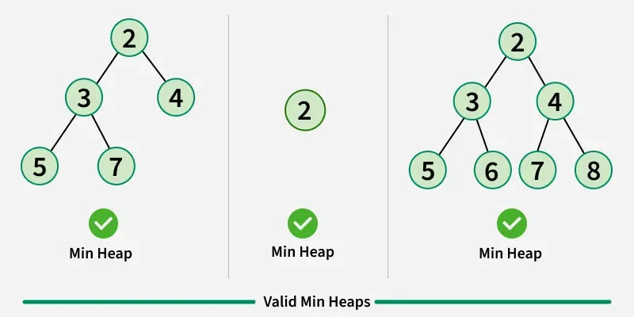
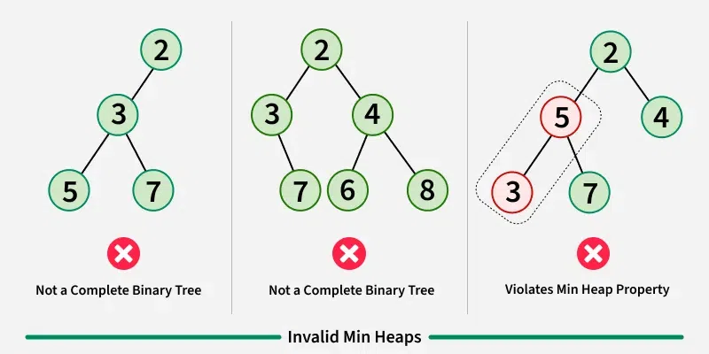
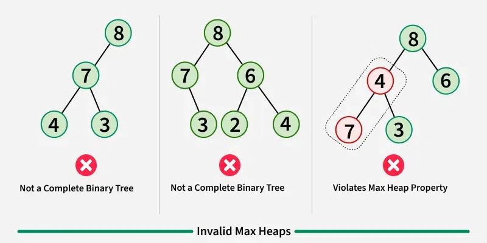

### Heap Data Structure

**Heap** bu to'liq **binary tree** ma'lumotlar tuzilmasi bo'lib, u yig'ish xususiyatini qondiradi: har bir tugun uchun uning bolalar qiymati o'z qiymatidan katta yoki teng. Uyumlar odatda ustuvor navbatlarni amalga oshirish uchun ishlatiladi, bu erda eng kichik (yoki eng katta) element har doim daraxtning ildizida joylashgan.

<p align="center">

</p>
<p align="center">

</p>
<p align="center">

</p>
<p align="center">

</p>

Binary Heap qanday ifodalanadi?
Binary heap - bu to'liq Binary Tree. Binary heap odatda massiv sifatida taqdim etiladi.

| arr[(i-1)/2]   | Returns the parent node      |
| -------------- | ---------------------------- |
| arr[(2*i)+1]   | Returns the left child node  |
| -------------- | ---------------------------- |
| arr[(2*i)+2]   | Returns the right child node |

**Heap ustidagi operatsiyalar:**
Quyida minimal yig'ish bo'yicha ba'zi standart operatsiyalar mavjud:

- **getMin():** It returns the root element of Min Heap. The time Complexity of this operation is O(1). In case of a maxheap it would be getMax().
- **extractMin():** Removes the minimum element from MinHeap. The time Complexity of this Operation is O(log N) as this operation needs to maintain the heap property (by calling heapify()) after removing the root.
- **decreaseKey():** Decreases the value of the key. The time complexity of this operation is O(log N). If the decreased key value of a node is greater than the parent of the node, then we don’t need to do anything. Otherwise, we need to traverse up to fix the violated heap property.
- **insert():** Inserting a new key takes O(log N) time. We add a new key at the end of the tree. If the new key is greater than its parent, then we don’t need to do anything. Otherwise, we need to traverse up to fix the violated heap property.
- **delete():** Deleting a key also takes O(log N) time. We replace the key to be deleted with the minimum infinite by calling decreaseKey(). After decreaseKey(), the minus infinite value must reach root, so we call extractMin() to remove the key.

```js
// A class for Min Heap
class MinHeap {
  // Constructor: Builds a heap from a given array a[] of given size
  constructor() {
    this.arr = [];
  }

  left(i) {
    return 2 * i + 1;
  }

  right(i) {
    return 2 * i + 2;
  }

  parent(i) {
    return Math.floor((i - 1) / 2);
  }

  getMin() {
    return this.arr[0];
  }

  insert(k) {
    let arr = this.arr;
    arr.push(k);

    // Fix the min heap property if it is violated
    let i = arr.length - 1;
    while (i > 0 && arr[this.parent(i)] > arr[i]) {
      let p = this.parent(i);
      [arr[i], arr[p]] = [arr[p], arr[i]];
      i = p;
    }
  }

  // Decreases value of key at index 'i' to new_val.
  // It is assumed that new_val is smaller than arr[i].
  decreaseKey(i, new_val) {
    let arr = this.arr;
    arr[i] = new_val;

    while (i !== 0 && arr[this.parent(i)] > arr[i]) {
      let p = this.parent(i);
      [arr[i], arr[p]] = [arr[p], arr[i]];
      i = p;
    }
  }

  // Method to remove minimum element (or root) from min heap
  extractMin() {
    let arr = this.arr;
    if (arr.length == 1) {
      return arr.pop();
    }

    // Store the minimum value, and remove it from heap
    let res = arr[0];
    arr[0] = arr[arr.length - 1];
    arr.pop();
    this.MinHeapify(0);
    return res;
  }

  // This function deletes key at index i. It first reduced value to minus
  // infinite, then calls extractMin()
  deleteKey(i) {
    this.decreaseKey(i, this.arr[0] - 1);
    this.extractMin();
  }

  // A recursive method to heapify a subtree with the root at given index
  // This method assumes that the subtrees are already heapified
  MinHeapify(i) {
    let arr = this.arr;
    let n = arr.length;
    if (n === 1) {
      return;
    }
    let l = this.left(i);
    let r = this.right(i);
    let smallest = i;
    if (l < n && arr[l] < arr[i]) smallest = l;
    if (r < n && arr[r] < arr[smallest]) smallest = r;
    if (smallest !== i) {
      [arr[i], arr[smallest]] = [arr[smallest], arr[i]];
      this.MinHeapify(smallest);
    }
  }
}

let h = new MinHeap();
h.insert(3);
h.insert(2);
h.deleteKey(1);
h.insert(15);
h.insert(5);
h.insert(4);
h.insert(45);

console.log(h.extractMin() + " ");
console.log(h.getMin() + " ");

h.decreaseKey(2, 1);
console.log(h.extractMin());
```

```
2 4 1
```

**Heaps ilovalari:**

- **Heap Sort:** Heap Sort uses Binary Heap to sort an array in O(nLogn) time.
- **Priority Queue:** Priority queues can be efficiently implemented using Binary Heap because it supports insert(), delete() and extractmax(), decreaseKey() operations in O(log N) time. Binomial Heap and Fibonacci Heap are variations of Binary Heap. These variations perform union also efficiently.
- **Graph Algorithms:** The priority queues are especially used in Graph Algorithms like Dijkstra’s Shortest Path and Prim’s Minimum Spanning Tree.
- Many problems can be efficiently solved using Heaps. See following for example. a) K’th Largest Element in an array. b) Sort an almost sorted array/ c) Merge K Sorted Arrays.

**Heap ma'lumotlar strukturasining ilovalari**

1. **Priority Queues:** Heaps are commonly used to implement priority queues, where elements with higher priority are extracted first. This is useful in many applications such as scheduling tasks, handling interruptions, and processing events.
2. **Sorting Algorithms:** Heapsort, a comparison-based sorting algorithm, is implemented using the Heap data structure. It has a time complexity of O(n log n), making it efficient for large datasets.
3. **Graph algorithms:** Heaps are used in graph algorithms such as Prim’s Algorithm, Dijkstra’s algorithm., and the A\* search algorithm.
4. **Lossless Compression:** Heaps are used in data compression algorithms such as Huffman coding, which uses a priority queue implemented as a min-heap to build a Huffman tree.
5. **Medical Applications:** In medical applications, heaps are used to store and manage patient information based on priority, such as vital signs, treatments, and test results.
6. **Load balancing:** Heaps are used in load balancing algorithms to distribute tasks or requests to servers, by processing elements with the lowest load first.
7. **Order statistics:** The Heap data structure can be used to efficiently find the kth smallest (or largest) element in an array. See method 4 and 6 of this post for details.
8. **Resource allocation:** Heaps can be used to efficiently allocate resources in a system, such as memory blocks or CPU time, by assigning a priority to each resource and processing requests in order of priority.
9. **Job scheduling:** The heap data structure is used in job scheduling algorithms, where tasks are scheduled based on their priority or deadline. The heap data structure allows efficient access to the highest-priority task, making it a useful data structure for job scheduling applications.
