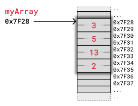
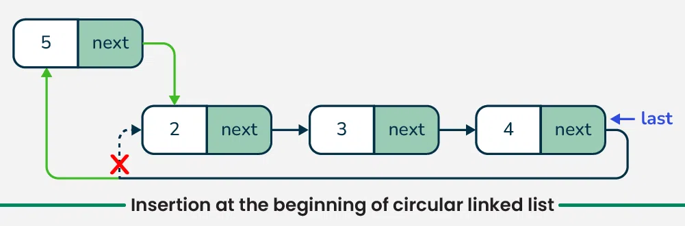

### Linked List Data Structure

- **LINKED LISTS** - bu ketma-ketligi xotiradagi joylashuviga bog'liq bo'lmagan **chiziqli** ma'lumotlar **to'plami**
- Ro'yxatning har bir elementi keyingi elementga **ishora** qiladi
- Ma'lumotlar tuzilmasi sifatida **LINKED LISTS**ni bir-biriga **bog'langan tugunlar** ko'rinishida tasavvur qilamiz
- Har bir tugun o'z **qiymatini** va keyingi element **manzilini** saqlaydi

<p align="center">

</p>

> **LINKED LISTS** - Bog'langan ro'yhatlar

<p align="center">

</p>

<p align="center">

</p>

> Linked List Implementation in C

<p align="center">

</p>

**LINKED LISTS** **Computer Science**dagi asosiy ma'lumotlar strukturasidir. U asosan massivlarga nisbatan qo'shish va o'chirish operatsiyalarini samarali bajarishga imkon beradi. Massivlar singari, u stek, navbat va deque kabi boshqa ma'lumotlar tuzilmalarini amalga oshirish uchun ham ishlatiladi. Bog'langan ro'yxat va massivlarni taqqoslash

- **Linked List:**

  - Data Structure: Non-contiguous
  - Memory Allocation: Typically allocated one by one to individual elements
  - Insertion/Deletion: Efficient
  - Access: Sequential

- **Array:**
  - Data Structure: Contiguous
  - Memory Allocation: Typically allocated to the whole array
  - Insertion/Deletion: Inefficient
  - Access: Random

> **ARRAYS** VS. **LINKED LISTS**

|               | ARRAYS                                        | LINKED LISTS                                    |
| ------------- | --------------------------------------------- | ----------------------------------------------- |
| AFZALLIKLARI  | - Tez o'qish/qidirish                         | - Tez yozish/o'chirish                          |
|               | - Har bir element kamroq xotira egallaydi     | - O'zgaruvchan hajmga ega                       |
|               |                                               | - Xotiradan samarali foydalanish                |
| KAMCHILIKLARI | - Sekin qo'shish/o'chirish                    | - Sekin qidirish                                |
|               | - O'zgarmas hajm (hajm o'zgartirish "qimmat") | - Har bir tugun xotirada ko'proq                |
|               | - Xotiradan smarasiz foydalanish              | joy egallaydi (qiymat + keyingi tugun mamnzili) |

<p align="center">

</p>

<p align="center">

</p>

- **LINKED LISTS** turlari:
  - Singly Linked List
  - Doubly Linked List
  - Circular Linked List
  - Applications and Advantages of Linked List

1. **Singly Linked List** - Bir tomonlama ro'yxat

- Understanding Node Structure
- Operations on Singly Linked List
- Traversal in Singly Linked List
- Searching in Singly Linked List
- Finding Length in Singly Linked List
- Insertion in Singly Linked List
- Deletion in Singly Linked List

<p align="center">

</p>

**Understanding Node Structure**

```js
// Definition of a Node in a singly linked list
class Node {
  constructor(data) {
    // Data part of the node
    this.data = data;
    this.next = null;
  }
}
```

**Operations on Singly Linked List**

- **Traversal**
- **Searching**
- **Length**
- **Insertion:**
  - Insert at the beginning
  - Insert at the end
  - Insert at a specific position
- **Deletion:**
  - Delete from the beginning
  - Delete from the end
  - Delete a specific node

**Traversal in Singly Linked List**

```js
// Javascript Function to traverse and print the elements
// of the linked list
function traverseLinkedList(head) {
  // Start from the head of the linked list
  let current = head;

  // Traverse the linked list until reaching the
  // end (null)
  while (current !== null) {
    // Print the data of the current node
    console.log(current.data + " ");

    // Move to the next node
    current = current.next;
  }

  console.log();
}

// Output
// 1 2 3
```

**Searching in Singly Linked List**

```js
// Javascript function to search for a value in the Linked List
function searchLinkedList(head, target) {
  // Traverse the Linked List
  while (head !== null) {
    // Check if the current node's data matches the target value
    if (head.data === target) {
      return true; // Value found
    }

    // Move to the next node
    head = head.next;
  }

  return false; // Value not found
}
```

**Finding Length in Singly Linked List**

```js
// Javascript function to find the length of the linked list
function findLength(head) {
  // Initialize a counter for the length
  let length = 0;

  // Start from the head of the list
  let current = head;

  // Traverse the list and increment the length for each
  // node
  while (current !== null) {
    length++;
    current = current.next;
  }

  // Return the final length of the linked list
  return length;
}
```

**Insertion in Singly Linked List**

> a. Insertion at the Beginning of Singly Linked List:

<p align="center">

</p>

```js
// Javascript function to insert a new node at the beginning of the
// linked list
function insertAtBeginning(head, value) {
  // Create a new node with the given value
  let newNode = new Node(value);

  // Set the next pointer of the new node to the current
  // head
  newNode.next = head;

  // Move the head to point to the new node
  head = newNode;

  // Return the new head of the linked list
  return head;
}
```

> b. Insertion at the End of Singly Linked List:

<p align="center">

</p>

```js
// Javascript function to insert a node at the end of the linked
// list
function insertAtEnd(head, value) {
  // Create a new node with the given value
  let newNode = new Node(value);

  // If the list is empty, make the new node the head
  if (head === null) {
    return newNode;
  }

  // Traverse the list until the last node is reached
  let current = head;
  while (current.next !== null) {
    current = current.next;
  }

  // Link the new node to the current last node
  current.next = newNode;

  return head;
}
```

> c. Insertion at a Specific Position of the Singly Linked List:

<p align="center">

</p>

```js
// Function to insert a node at a specified position
function insertPos(head, pos, data) {
  if (pos < 1) {
    console.log("Invalid position!");
    return head;
  }

  // Special case for inserting at the head
  if (pos === 1) {
    const newNode = new Node(data);
    newNode.next = head;
    return newNode;
  }

  // Traverse the list to find the node
  // before the insertion point
  let prev = head;
  let count = 1;
  while (count < pos - 1 && prev !== null) {
    prev = prev.next;
    count++;
  }

  // If position is greater than the number of nodes
  if (prev === null) {
    console.log("Invalid position!");
    return head;
  }

  // Insert the new node at the specified position
  const newNode = new Node(data);
  newNode.next = prev.next;
  prev.next = newNode;

  return head;
}
```

**Deletion in Singly Linked List**

> a. Deletion at the Beginning of Singly Linked List:

<p align="center">

</p>

```js
// Javascript Function to remove the first node
// of the linked list /
function removeFirstNode(head) {
  if (head == null) return null;

  // Move the head pointer to the next node
  temp = head;
  head = head.next;

  return head;
}
```

> b. Deletion at the End of Singly Linked List:

<p align="center">

</p>

```js
// Javascript Function to remove the last node of the linked list
function removeLastNode(head) {
  // If the list is empty, return null
  if (head === null) return null;

  // If the list has only one node, delete it
  // and return null
  if (head.next === null) {
    head = null;
    return null;
  }

  // Find the second last node
  let second_last = head;
  while (second_last.next.next !== null) second_last = second_last.next;

  // Remove the last node
  second_last.next = null;

  // Return the modified list
  return head;
}
```

> c. Deletion at a Specific Position of Singly Linked List:

<p align="center">

</p>

```js
// Javascript function to delete a node at a specific position
function deleteAtPosition(head, position) {
  // If the list is empty or the position is invalid
  if (head === null || position < 1) {
    return head;
  }

  // If the head needs to be deleted
  if (position === 1) {
    let temp = head;
    head = head.next;
    temp = null;
    return head;
  }

  // Traverse to the node before the position to be deleted
  let current = head;
  for (let i = 1; i < position - 1 && current !== null; i++) {
    current = current.next;
  }

  // If the position is out of range
  if (current === null || current.next === null) {
    return head;
  }

  // Store the node to be deleted
  let temp = current.next;

  // Update the links to bypass the node to be deleted
  current.next = current.next.next;

  // Delete the node
  temp = null;
  return head;
}
```

2. **Doubly Linked List** - Ikki marta bog'langan ro'yxat

<p align="center">

</p>

<p align="center">

</p>

- **Representation of Doubly Linked List in Data Structure**
  - 1. Data
  - 2. A pointer to the next node (next)
  - 2. A pointer to the previous node (prev)

<p align="center">

</p>

**Node Definition**

```js
class Node {
  constructor(data) {
    // To store the value or data.
    this.data = data;

    // Reference to the previous node
    this.prev = null;

    // Reference to the next node
    this.next = null;
  }
}
```

**Operations on Doubly Linked List**

- **Traversal in Doubly Linked List**
- **Searching in Doubly Linked List**
- **Finding Length of Doubly Linked List**
- **Insertion in Doubly Linked List:**
  - Insertion at the beginning of Doubly Linked List
  - Insertion at the end of the Doubly Linked List
  - Insertion at a specific position in Doubly Linked List
- **Deletion in Doubly Linked List:**
  - Deletion of a node at the beginning of Doubly Linked List
  - Deletion of a node at the end of Doubly Linked List
  - Deletion of a node at a specific position in Doubly Linked List

**Traversal in Doubly Linked List**

```js
// Define the Node class
class Node {
  constructor(data) {
    this.data = data;
    this.prev = null;
    this.next = null;
  }
}

// Function to traverse the doubly linked list
// in forward direction
function forwardTraversal(head) {
  // Start traversal from the head of the list
  let curr = head;

  // Continue until the current node is null
  // (end of the list)
  while (curr !== null) {
    // Output data of the current node
    console.log(curr.data + " ");

    // Move to the next node
    curr = curr.next;
  }

  // Print newline after traversal
  console.log();
}

// Function to traverse the doubly linked list
// in backward direction
function backwardTraversal(tail) {
  // Start traversal from the tail of the list
  let curr = tail;

  // Continue until the current node is null
  // (end of the list)
  while (curr !== null) {
    // Output data of the current node
    console.log(curr.data + " ");

    // Move to the previous node
    curr = curr.prev;
  }

  // Print newline after traversal
  console.log();
}

// Sample usage of the doubly linked list
//and traversal functions
// Create a doubly linked list with 3 nodes
const head = new Node(1);
const second = new Node(2);
const third = new Node(3);

head.next = second;
second.prev = head;
second.next = third;
third.prev = second;

console.log("Forward Traversal:");
forwardTraversal(head);

console.log("Backward Traversal:");
backwardTraversal(third);

// Output
// Forward Traversal:
// 1 2 3
// Backward Traversal:
// 3 2 1
```

**Finding Length of Doubly Linked List**

```js
class Node {
  constructor(val) {
    this.data = val;
    this.prev = null;
    this.next = null;
  }
}

// Function to find the length of
// a doubly linked list
function findLength(head) {
  let count = 0;
  let cur = head;
  while (cur !== null) {
    count++;
    cur = cur.next;
  }
  return count;
}

// Create a doubly linked list with 3 nodes
const head = new Node(1);
const second = new Node(2);
const third = new Node(3);

head.next = second;
second.prev = head;
second.next = third;
third.prev = second;

console.log("Length of the doubly linked list: " + findLength(head));

// Output
// Length of the doubly linked list: 3
```

**Insertion at the Beginning in Doubly Linked List**

<p align="center">

</p>

```js
// JavaScript Program to insert a node at the
//beginning of doubly linked list

// Node structure for the doubly linked list
function Node(data) {
  this.data = data;
  this.prev = null;
  this.next = null;
}

// Insert a node at the beginning
function insertBegin(head, data) {
  // Create a new node
  const new_node = new Node(data);

  // Make next of it as head
  new_node.next = head;

  // Set previous of head as new node
  if (head !== null) {
    head.prev = new_node;
  }

  // Return new node as new head
  return new_node;
}

// Print the doubly linked list
function printList(head) {
  let curr = head;
  while (curr !== null) {
    console.log(curr.data);
    curr = curr.next;
  }
}

// Create a hardcoded doubly linked list:
// 2 <-> 3 <-> 4
let head = new Node(2);
head.next = new Node(3);
head.next.prev = head;
head.next.next = new Node(4);
head.next.next.prev = head.next;

// Print the original list
console.log("Original Linked List:");
printList(head);

// Insert a new node at the front of the list
console.log("After inserting Node 1 at the front:");
let data = 1;
head = insertBegin(head, data);

// Print the updated list
printList(head);

// Output
// Original Linked List: 2 3 4
// After inserting Node 1 at the front: 1 2 3 4
```

**Insertion at the End of Doubly Linked List**

<p align="center">

</p>

```js
// Javascript Program to insert a node at the end of
//doublylinked list

class Node {
  constructor(data) {
    this.data = data;
    this.next = null;
    this.prev = null;
  }
}

function insertEnd(head, newData) {
  // Create a new node
  const newNode = new Node(newData);

  // If the linked list is empty, set the
  //new node as the head
  if (head === null) {
    head = newNode;
  } else {
    let curr = head;
    while (curr.next !== null) {
      curr = curr.next;
    }

    // Set the next of the last node to the
    //new node
    curr.next = newNode;

    // Set the prev of the new node to the
    //last node
    newNode.prev = curr;
  }

  return head;
}

function printList(head) {
  let curr = head;
  let result = "";
  while (curr !== null) {
    result += curr.data + " ";
    curr = curr.next;
  }
  console.log(result.trim());
}

// Create a hardcoded doubly linked list:
// 1 <-> 2 <-> 3
let head = new Node(1);
head.next = new Node(2);
head.next.prev = head;
head.next.next = new Node(3);
head.next.next.prev = head.next;

// Print the original list
console.log("Original Linked List: ");
printList(head);

// Insert a new node with data 4 at the end
console.log("Inserting Node with data 4 at the end: ");
const data = 4;
head = insertEnd(head, data);

// Print the updated list
printList(head);

// Output
// Original Linked List: 1 2 3
// Inserting Node with data 4 at the end: 1 2 3 4
```

**Insertion at a Specific Position in Doubly Linked List**

<p align="center">

</p>

```js
// Javascript Program to insert a node at a given position

class Node {
  constructor(data) {
    this.data = data;
    this.next = null;
    this.prev = null;
  }
}

// Function to insert a new node at a given position
function insertAtPosition(head, pos, newData) {
  // Create a new node
  let newNode = new Node(newData);

  // Insertion at the beginning
  if (pos === 1) {
    newNode.next = head;
    if (head !== null) {
      head.prev = newNode;
    }
    head = newNode;
    return head;
  }

  let curr = head;

  // Traverse the list to find the node
  //before the insertion point
  for (let i = 1; i < pos - 1 && curr !== null; ++i) {
    curr = curr.next;
  }

  // If the position is out of bounds
  if (curr === null) {
    console.log("Position is out of bounds.");
    return head;
  }

  // Set the prev of new node to curr
  newNode.prev = curr;

  // Set the next of new node to the next of curr
  newNode.next = curr.next;

  // Update the next of current node to new node
  curr.next = newNode;

  // If the new node is not the last node,
  // update prev of next node to new node
  if (newNode.next !== null) {
    newNode.next.prev = newNode;
  }

  return head;
}

// Function to print the list
function printList(head) {
  let curr = head;
  while (curr !== null) {
    console.log(curr.data + " ");
    curr = curr.next;
  }
  console.log();
}

// Create a hardcoded doubly linked list:
// 1 <-> 2 <-> 4
let head = new Node(1);
head.next = new Node(2);
head.next.prev = head;
head.next.next = new Node(4);
head.next.next.prev = head.next;

// Print the original list
console.log("Original Linked List:");
printList(head);

// Insert new node with data 3 at position 3
console.log("Inserting Node with data 3 at position 3:");
head = insertAtPosition(head, 3, 3);

// Print the updated list
printList(head);

// Output
// Original Linked List: 1 2 4
// Inserting Node with data 3 at position 3: 1 2 3 4
```

**Deletion at the Beginning of Doubly Linked List**

<p align="center">

</p>

```js
// JavaScript Program to delete a node from the
// beginning of Doubly Linked List
class Node {
  constructor(data) {
    this.data = data;
    this.prev = null;
    this.next = null;
  }
}

// Deletes the first node (head) of the list and returns the second node as the new head
function delHead(head) {
  // If empty, return null
  if (head === null) {
    return null;
  }

  // Store in temp for deletion later
  let temp = head;

  // Move head to the next node
  head = head.next;

  // Set prev of the new head
  if (head !== null) {
    head.prev = null;
  }

  // Return new head
  return head;
}

// Function to print the list
function printList(head) {
  let curr = head;
  let output = "";
  while (curr !== null) {
    output += curr.data + " ";
    curr = curr.next;
  }
  console.log(output.trim());
}

// Create a hardcoded doubly linked list:
// 1 <-> 2 <-> 3
let head = new Node(1);
head.next = new Node(2);
head.next.prev = head;
head.next.next = new Node(3);
head.next.next.prev = head.next;

console.log("Original Linked List: ");
printList(head);

console.log("After Deletion at the beginning: ");
head = delHead(head);

printList(head);

// Output
// Original Linked List: 1 2 3
// After Deletion at the beginning: 2 3
```

**Deletion at the End of Doubly Linked List**

<p align="center">

</p>

```js
class Node {
  constructor(data) {
    this.data = data;
    this.prev = null;
    this.next = null;
  }
}

// Function to delete the last node of the
//doubly linked list
function delLast(head) {
  // Corner cases
  if (head === null) return null;
  if (head.next === null) {
    // Only one node in the list
    return null;
  }

  // Traverse to the last node
  let curr = head;
  while (curr.next !== null) {
    curr = curr.next;
  }

  // Update the previous node's next pointer
  if (curr.prev !== null) {
    curr.prev.next = null;
  }

  // Node curr is now deleted (garbage collected in JS)
  return head;
}

// Function to print the list
function printList(head) {
  let curr = head;
  while (curr !== null) {
    console.log(curr.data + " ");
    curr = curr.next;
  }
}

// Create a hardcoded doubly linked list:
// 1 <-> 2 <-> 3
let head = new Node(1);
head.next = new Node(2);
head.next.prev = head;
head.next.next = new Node(3);
head.next.next.prev = head.next;

console.log("Original Linked List:");
printList(head);

console.log("After Deletion at the end:");
head = delLast(head);

printList(head);

// Output
// Original Linked List: 1 2 3
// After Deletion at the end: 1 2
```

**Deletion at a Specific Position in Doubly Linked List**

<p align="center">

</p>

```js
class Node {
  constructor(data) {
    this.data = data;
    this.prev = null;
    this.next = null;
  }
}

// Function to delete a node at a specific position
// in the doubly linked list
function delPos(head, pos) {
  // If the list is empty
  if (head === null) return head;

  let curr = head;

  // Traverse to the node at the given position
  for (let i = 1; curr && i < pos; ++i) {
    curr = curr.next;
  }

  // If the position is out of range
  if (curr === null) return head;

  // Update the previous node's next pointer
  if (curr.prev) {
    curr.prev.next = curr.next;
  }

  // Update the next node's prev pointer
  if (curr.next) {
    curr.next.prev = curr.prev;
  }

  // If the node to be deleted is the head node
  if (head === curr) {
    head = curr.next;
  }

  // Deallocate memory for the deleted node
  // In JavaScript, garbage collection handles
  //this automatically

  return head;
}

// Function to print the doubly linked list
function printList(head) {
  let curr = head;
  let result = [];
  while (curr !== null) {
    result.push(curr.data);
    curr = curr.next;
  }
  console.log(result.join(" "));
}

// Create a hardcoded doubly linked list:
// 1 <-> 2 <-> 3
let head = new Node(1);
head.next = new Node(2);
head.next.prev = head;
head.next.next = new Node(3);
head.next.next.prev = head.next;

console.log("Original Linked List:");
printList(head);

console.log("After Deletion at the position 2:");
head = delPos(head, 2);

printList(head);

// Output
// Original Linked List: 1 2 3
// After Deletion at the position 2: 1 3
```

- **Doubly Linked List afzalliklari**

  - **Efficient traversal in both directions:** Ikki marta bog'langan ro'yxatlar ro'yxatni har ikki yo'nalishda ham samarali o'tkazish imkonini beradi, bu esa uni tez-tez qo'shish va o'chirish talab qilinadigan ilovalar uchun mos qiladi.
  - **Easy insertion and deletion of nodes:** Oldingi va keyingi tugunlarga ko'rsatgichlarning mavjudligi butun ro'yxatni aylanib o'tmasdan, ro'yxatga tugunlarni kiritish yoki o'chirishni osonlashtiradi.
  - **Can be used to implement a stack or queue:** Ikki marta bog'langan ro'yxatlar dasturlashda qo'llaniladigan umumiy ma'lumotlar tuzilmalari bo'lgan stek va navbatlarni amalga oshirish uchun ishlatilishi mumkin.

- **Doubly Linked List kamchiliklari**

  - **More complex than singly linked lists:** Ikki marta bog'langan ro'yxatlar birma-bir bog'langan ro'yxatlarga qaraganda murakkabroq, chunki ular har bir tugun uchun qo'shimcha ko'rsatkichlarni talab qiladi.
  - **More memory overhead:** Ikki marta bog'langan ro'yxatlar alohida bog'langan ro'yxatlarga qaraganda ko'proq xotira yukini talab qiladi, chunki har bir tugun bitta o'rniga ikkita ko'rsatgichni saqlaydi.

- **Ikki marta bog'langan ro'yxat ilovalari**
  - Matn muharrirlarida bekor qilish va takrorlash funksiyalarini amalga oshirish.
  - Elementlarni tezkor kiritish va o'chirish zarur bo'lgan keshni amalga oshirish.
  - Tashrif buyurilgan sahifalar orasida oldinga va orqaga o'tish uchun brauzer tarixini boshqarish.
  - Pleylistlarni boshqarish va qo'shiqlar orasida samarali harakat qilish uchun musiqa pleyer ilovalari.
  - Har ikki uchida ham samarali kiritish va oʻchirish uchun Deque (ikki tomonlama navbat) kabi maʼlumotlar tuzilmalarini joriy qilish.

3. **Circular Linked List** - Aylana ro'yxat

- **Circular singly linked list**

<p align="center">

</p>

- **Circular doubly linked list**

<p align="center">

</p>

**Representation of a Circular Singly Linked List**

<p align="center">

</p>

```js
class Node {
  constructor(data) {
    this.data = data;
    this.next = null;
  }
}
```

> Example of Creating a Circular Linked List

<p align="center">

</p>

```js
// Initilize and allocate memory for nodes
let first = new Node(2);
let second = new Node(3);
let last = new Node(4);

// Connect nodes
first.next = second;
second.next = last;
last.next = first;
```

**Operations on the Circular Linked list:**

- **Insertion**
  - Insertion at the empty list
  - Insertion at the beginning
  - Insertion at the end
  - Insertion at the given position
- **Deletion**
  - Delete the first node
  - Delete the last node
  - Delete the node from any position
- **Searching**

**Insertion in the circular linked list:**

- **1. Insertion in an empty List in the circular linked list**

<p align="center">

</p>

```js
class Node {
  constructor(value) {
    this.data = value;
    this.next = null;
  }
}

function insertInEmptyList(last, data) {
  if (last !== null) return last;

  // Create a new node
  let newNode = new Node(data);

  // Point newNode to itself
  newNode.next = newNode;

  // Update last to point to the new node
  last = newNode;
  return last;
}

function printList(last) {
  if (last === null) return;

  // Start from the head node
  let head = last.next;
  while (true) {
    console.log(head.data);
    head = head.next;
    if (head === last.next) break;
  }
}

// Main function

let last = null;

// Insert a node into the empty list
last = insertInEmptyList(last, 1);

// Print the list
console.log("List after insertion:");
printList(last);

// Output
// List after insertion: 1
```

- **2. Insertion at the beginning in circular linked list**

<p align="center">

</p>

```js
class Node {
  constructor(data) {
    this.data = data;
    this.next = null;
  }
}

// Function to insert a node at the beginning of the
// circular linked list
function insertAtBeginning(last, value) {
  const newNode = new Node(value);

  // If the list is empty, make the new node point to
  // itself and set it as last
  if (last === null) {
    newNode.next = newNode;
    return newNode;
  }

  // Insert the new node at the beginning
  newNode.next = last.next;
  last.next = newNode;

  return last;
}

// Function to print the circular linked list
function printList(last) {
  if (last === null) return;

  let head = last.next;
  while (true) {
    console.log(head.data + " ");
    head = head.next;
    if (head === last.next) break;
  }
  console.log();
}

// Create circular linked list: 2, 3, 4
const first = new Node(2);
first.next = new Node(3);
first.next.next = new Node(4);
let last = first.next.next; // Using let to allow reassignment
last.next = first;

console.log("Original list: ");
printList(last);

// Insert 5 at the beginning
last = insertAtBeginning(last, 5);

console.log("List after inserting 5 at the beginning: ");
printList(last);

// Output
// Original list: 2 3 4
// List after inserting 5 at the beginning: 5 2 3 4
```

- **3. Insertion at the end in circular linked list**

<p align="center">

</p>

```js
class Node {
  constructor(value) {
    this.data = value;
    this.next = null;
  }
}

// Function to insert a node at the end of a circular linked
// list
function insertEnd(tail, value) {
  let newNode = new Node(value);
  if (tail === null) {
    // If the list is empty, initialize it with the new
    // node
    tail = newNode;
    newNode.next = newNode;
  } else {
    // Insert new node after the current tail and update
    // the tail pointer
    newNode.next = tail.next;
    tail.next = newNode;
    tail = newNode;
  }
  return tail;
}

// Function to print the circular linked list
function printList(last) {
  if (last === null) return;

  let head = last.next;
  while (true) {
    console.log(head.data + " ");
    head = head.next;
    if (head === last.next) break;
  }
  console.log();
}

// Create circular linked list: 2, 3, 4
let first = new Node(2);
first.next = new Node(3);
first.next.next = new Node(4);

let last = first.next.next;
last.next = first;

console.log("Original list: ");
printList(last);

// Insert elements at the end of the circular linked
// list
last = insertEnd(last, 5);
last = insertEnd(last, 6);

console.log("List after inserting 5 and 6: ");
printList(last);

// Output
// Original list: 2 3 4
// List after inserting 5 and 6: 2 3 4 5 6
```

- **4. Insertion at specific position in circular linked list**

<p align="center">

</p>

```js
class Node {
  constructor(value) {
    this.data = value;
    this.next = null;
  }
}

// Function to insert a node at a specific position in a
// circular linked list
function insertAtPosition(last, data, pos) {
  if (last === null) {
    // If the list is empty
    if (pos !== 1) {
      console.log("Invalid position!");
      return last;
    }
    // Create a new node and make it point to itself
    let newNode = new Node(data);
    last = newNode;
    last.next = last;
    return last;
  }

  // Create a new node with the given data
  let newNode = new Node(data);

  // curr will point to head initially
  let curr = last.next;

  if (pos === 1) {
    // Insert at the beginning
    newNode.next = curr;
    last.next = newNode;
    return last;
  }

  // Traverse the list to find the insertion point
  for (let i = 1; i < pos - 1; ++i) {
    curr = curr.next;

    // If position is out of bounds
    if (curr === last.next) {
      console.log("Invalid position!");
      return last;
    }
  }

  // Insert the new node at the desired position
  newNode.next = curr.next;
  curr.next = newNode;

  // Update last if the new node is inserted at the end
  if (curr === last) last = newNode;

  return last;
}

// Function to print the circular linked list
function printList(last) {
  if (last === null) return;

  let head = last.next;
  while (true) {
    console.log(head.data + " ");
    head = head.next;
    if (head === last.next) break;
  }
  console.log();
}

// Create circular linked list: 2, 3, 4
let first = new Node(2);
first.next = new Node(3);
first.next.next = new Node(4);

let last = first.next.next;
last.next = first;

console.log("Original list: ");
printList(last);

// Insert elements at specific positions
let data = 5;
let pos = 2;
last = insertAtPosition(last, data, pos);
console.log("List after insertions: ");
printList(last);

// Output
// Original list: 2 3 4
// List after insertions: 2 5 3 4
```

**Deletion from a Circular Linked List**

- **1. Delete the first node in circular linked list**

<p align="center">

</p>

```js
class Node {
  constructor(data) {
    this.data = data;
    this.next = null;
  }
}

function deleteFirstNode(last) {
  if (last === null) {
    // If the list is empty
    console.log("List is empty");
    return null;
  }

  let head = last.next;

  if (head === last) {
    // If there is only one node in the list
    last = null;
  } else {
    // More than one node in the list
    last.next = head.next;
  }

  return last;
}

function printList(last) {
  if (last === null) return;

  let head = last.next;
  while (true) {
    console.log(head.data + " ");
    head = head.next;
    if (head === last.next) break;
  }
  console.log();
}

// Create circular linked list: 2, 3, 4
let first = new Node(2);
first.next = new Node(3);
first.next.next = new Node(4);

let last = first.next.next;
last.next = first;

console.log("Original list: ");
printList(last);

// Delete the first node
last = deleteFirstNode(last);

console.log("List after deleting first node: ");
printList(last);

// Output
// Original list: 2 3 4
// List after deleting first node: 3 4
```

- **2. Delete a specific node in circular linked list**

<p align="center">

</p>

```js
class Node {
  constructor(data) {
    this.data = data;
    this.next = null;
  }
}

function deleteSpecificNode(last, key) {
  if (last === null) {
    // If the list is empty
    console.log("List is empty, nothing to delete.");
    return null;
  }

  let curr = last.next;
  let prev = last;

  // If the node to be deleted is the only node in the list
  if (curr === last && curr.data === key) {
    last = null;
    return last;
  }

  // If the node to be deleted is the first node
  if (curr.data === key) {
    last.next = curr.next;
    return last;
  }

  // Traverse the list to find the node to be deleted
  while (curr !== last && curr.data !== key) {
    prev = curr;
    curr = curr.next;
  }

  // If the node to be deleted is found
  if (curr.data === key) {
    prev.next = curr.next;
    if (curr === last) {
      last = prev;
    }
  } else {
    // If the node to be deleted is not found
    console.log("Node with data " + key + " not found.");
  }

  return last;
}

function printList(last) {
  if (last === null) {
    console.log("List is Empty");
    return;
  }

  let head = last.next;
  while (true) {
    console.log(head.data + " ");
    head = head.next;
    if (head === last.next) break;
  }
  console.log();
}

// Create circular linked list: 2, 3, 4
let first = new Node(2);
first.next = new Node(3);
first.next.next = new Node(4);

let last = first.next.next;
last.next = first;

console.log("Original list: ");
printList(last);

// Delete a specific node
let key = 3;
last = deleteSpecificNode(last, key);

console.log("List after deleting node " + key + ": ");
printList(last);

// Output
// Original list: 2 3 4
// List after deleting node 3: 2 4
```

- **3. Deletion at the end of Circular linked list**

<p align="center">

</p>

```js
class Node {
  constructor(data) {
    this.data = data;
    this.next = null;
  }
}

function deleteLastNode(last) {
  if (last === null) {
    // If the list is empty
    console.log("List is empty, nothing to delete.");
    return null;
  }
  let head = last.next;

  // If there is only one node in the list
  if (head === last) {
    last = null;
    return last;
  }
  // Traverse the list to find the second last node
  let curr = head;
  while (curr.next !== last) {
    curr = curr.next;
  }
  // Update the second last node's next pointer to point to head
  curr.next = head;
  last = curr;

  return last;
}

function printList(last) {
  if (last === null) return;

  let head = last.next;
  while (true) {
    process.stdout.write(head.data + " ");
    head = head.next;
    if (head === last.next) break;
  }
  console.log();
}

// Create circular linked list: 2, 3, 4
let first = new Node(2);
first.next = new Node(3);
first.next.next = new Node(4);

let last = first.next.next;
last.next = first;

console.log("Original list: ");
printList(last);

// Delete the last node
last = deleteLastNode(last);

console.log("List after deleting last node: ");
printList(last);

// Output
// Original list: 2 3 4
// List after deleting last node: 2 3
```

**Searching in Circular Linked list**

```js
class Node {
  constructor(value) {
    this.data = value;
    this.next = null;
  }
}

function search(last, key) {
  if (last === null) {
    // If the list is empty
    return false;
  }

  let head = last.next;
  let curr = head;

  // Traverse the list to find the key
  while (curr !== last) {
    if (curr.data === key) {
      // Key found
      return true;
    }
    curr = curr.next;
  }

  // Check the last node
  if (last.data === key) {
    // Key found
    return true;
  }
  // Key not found
  return false;
}

function printList(last) {
  if (last === null) return;

  let head = last.next;
  while (true) {
    process.stdout.write(head.data + " ");
    head = head.next;
    if (head === last.next) break;
  }
  console.log();
}

// Create circular linked list: 2, 3, 4
let first = new Node(2);
first.next = new Node(3);
first.next.next = new Node(4);

let last = first.next.next;
last.next = first;

console.log("Original list:");
printList(last);

// Search for a specific value
let key = 3;
let found = search(last, key);
if (found) {
  console.log(`Value ${key} found in the list.`);
} else {
  console.log(`Value ${key} not found in the list.`);
}

// Output
// Original list: 2 3 4
// Value 3 found in the list.
```

- **Circular Linked Lists afzalliklari**

  - Dumaloq bog'langan ro'yxatda oxirgi tugun birinchi tugunga ishora qiladi. Null havolalar yo'q, bu o'tishni osonlashtiradi va null ko'rsatgich istisnolariga duch kelish ehtimolini kamaytiradi.
  - Biz ro'yxatni istalgan tugundan aylanib o'tishimiz va boshdan qayta ishga tushirishni talab qilmasdan unga qaytishimiz mumkin, bu dumaloq takrorlashni talab qiladigan ilovalarda foydalidir.
  - Doiraviy bog'langan ro'yxatlar dumaloq navbatlarni osongina amalga oshirishi mumkin, bunda oxirgi element birinchisiga qayta ulanadi, bu esa resurslarni samarali boshqarish imkonini beradi.
  - Doiraviy bog'langan ro'yxatda har bir tugun ketma-ketlikdagi keyingi tugunga havolaga ega. Ikki marta bog'langan ro'yxat kabi oldingi tugunga to'g'ridan-to'g'ri havola bo'lmasa-da, biz avvalgi tugunni ro'yxatni aylanib o'tish orqali topishimiz mumkin.

- **Circular Linked Lists kamchiliklari**

  - Doiraviy bog'langan ro'yxatlarni amalga oshirish yakka bog'langan ro'yxatlarga qaraganda ancha murakkab.
  - Aniq to'xtash shartisiz dumaloq bog'langan ro'yxatni kesib o'tish, agar ehtiyotkorlik bilan foydalanilmasa, cheksiz tsikllarga olib kelishi mumkin.
  - Nosozliklarni tuzatish doiraviy xarakterga ega bo'lgani uchun qiyinroq bo'lishi mumkin, chunki bog'langan ro'yxatlarni o'tkazishning an'anaviy usullari qo'llanilmasligi mumkin.

- **Doiraviy bog'langan ro'yxatlarning ilovalari**
  - Odatda Round-Robin rejalashtirish mexanizmi orqali turli foydalanuvchilar o'rtasida vaqt almashish uchun foydalaniladi.
  - Ko'p o'yinchili o'yinlarda o'yinchilar o'rtasida almashish uchun dumaloq bog'langan ro'yxatdan foydalanish mumkin. Oxirgi o'yinchining navbatidan so'ng, ro'yxat birinchi o'yinchiga qaytadi.
  - Doiraviy bog'langan ro'yxatlar ko'pincha ma'lumotlar doimiy ravishda ishlab chiqariladi va iste'mol qilinadigan oqimli ma'lumotlar kabi buferlash ilovalarida qo'llaniladi.
  - Media pleerlarda dumaloq bog'langan ro'yxatlar pleylistlarni boshqarishi mumkin, bu esa foydalanuvchilarga qo'shiqlarni doimiy ravishda aylantirish imkonini beradi.
  - Brauzerlar keshni boshqarish uchun dumaloq bog'langan ro'yxatlardan foydalanadilar. Bu BACK tugmasini bosish orqali ko'rish tarixi bo'ylab samarali harakat qilish imkonini beradi.

4. **Applications and Advantages of Linked List**

- **Bog'langan ro'yxat - bu tugunlar yordamida ma'lumotlar to'plamini saqlash uchun ishlatiladigan chiziqli ma'lumotlar tuzilmasi.**

  - Ketma-ket elementlar ko'rsatkichlar / havolalar bilan bog'langan.
  - Bog'langan ro'yxatning oxirgi tuguni nullga ishora qiladi.
  - Bog'langan ro'yxatning kirish nuqtasi bosh deb nomlanadi.
  - Bog'langan ro'yxatlarning umumiy o'zgarishlari: Singly, Double, Singly Circular va Double Circular.

- **Linked List afzalliklari (yoki eng ko'p ishlatiladigan holatlar):**

  - Bog'langan ro'yxatlar, asosan, samarali kiritish va o'chirish tufayli ishlatiladi. O'rtaga element qo'shish (yoki o'chirish) uchun biz faqat bir nechta ko'rsatkichlarni (yoki havolalarni) o'zgartirishimiz kerak
  - Bog'langan ro'yxatning istalgan nuqtasida qo'shish va o'chirish O (1) vaqtni oladi. Massiv ma'lumotlar tuzilmasida o'rtaga kiritish/o'chirish O(n) vaqtni oladi.
  - Ushbu ma'lumotlar strukturasi oddiy va stek, navbatlar va boshqa mavhum ma'lumotlar tuzilmalarini amalga oshirish uchun ham ishlatilishi mumkin.
  - Queue va Deque ma'lumotlar tuzilmalarini amalga oshirish: oddiy massivni amalga oshirish umuman samarali emas. Murakkab bo'lgan narsani samarali amalga oshirish uchun dumaloq massivdan foydalanishimiz kerak. Lekin bog'langan ro'yxat bilan bu oson va tushunarli. Shuning uchun til kutubxonalarining ko'pchiligi ushbu ma'lumotlar tuzilmalarini amalga oshirish uchun Bog'langan ro'yxatdan foydalanadi.
  - Bog'langan ro'yxat elementlarning sonini oldindan taxmin qila olmaydigan hollarda massivlarga qaraganda ko'proq joyni tejashga yordam beradi. Massivlar bo'lsa, elementlar uchun butun xotira birgalikda ajratiladi. Hatto C++ da vektor yoki Python-dagi ro'yxat yoki Java-da ArrayList kabi dinamik o'lchamli massivlarda ham. ichki ish butun xotirani ajratishni va joriy sig'imdan oshib ketganda kattaroq bo'lakni ajratishni o'z ichiga oladi.

- **Linked List ilovalari:**

  - Bog'langan ro'yxatlar steklarni, navbatni, dequeni, siyrak matritsalarni va grafiklarning qo'shni ro'yxatini ko'rsatishni amalga oshirish uchun ishlatilishi mumkin.
  - Operatsion tizimlar va kompilyatorlarda dinamik xotirani ajratish (bo'sh bloklarning bog'langan ro'yxati).
  - Polinomlarni manipulyatsiya qilish
  - Uzun butun sonlar ustidagi arifmetik amallar.
  - Operatsion tizimlarda ular Xotirani boshqarishda, jarayonni rejalashtirishda (masalan, davraviy rejalashtirish uchun dumaloq bog'langan ro'yxat) va fayl tizimida qo'llanilishi mumkin.
  - Katta ma'lumotlar to'plamidan elementlarni tez-tez kiritish yoki o'chirish kerak bo'lgan algoritmlar.
  - Keshdagi eng so'nggi foydalanilgan narsalarni kuzatish uchun ikki marta bog'langan ro'yxatni ishlatadigan LRU keshi.

- **Haqiqiy dunyoda Linked List ilovalari:**

  - Musiqa pleyeridagi qo'shiqlar ro'yxati oldingi va keyingi qo'shiqlarga bog'langan.
  - Veb-brauzerda oldingi va keyingi veb-sahifa URL-manzillari oldingi va keyingi tugmalar orqali bog'lanishi mumkin (Doubly Linked List)
  - Rasmlarni ko'rish dasturida oldingi va keyingi rasmlar oldingi va keyingi tugmalar yordamida bog'lanishi mumkin (Doubly Linked List)
  - Doiraviy bog'langan ro'yxatlar narsalarni yumaloq tarzda amalga oshirish uchun ishlatilishi mumkin, bu erda biz har bir elementga birma-bir o'tamiz.
  - Bog'langan ro'yxatning oldingi qismidan tez o'chirilishi (yoki qo'shilishi) tufayli Queue va Deque ma'lumotlar tuzilmalarini amalga oshirish uchun massivlarga nisbatan bog'langan ro'yxat afzalroqdir.

- **Linked List kamchiliklari:**
  - **Slow Access Time:** Bog'langan ro'yxatdagi elementlarga kirish sekin bo'lishi mumkin, chunki siz izlayotgan elementni topish uchun bog'langan ro'yxat bo'ylab harakat qilishingiz kerak, bu O(n) operatsiyasi. Bu bog'langan ro'yxatlarni elementlarga tezda kirish kerak bo'lgan holatlar uchun yomon tanlov qiladi.
  - **Pointers or References:** Bog'langan ro'yxatlar keyingi tugunga kirish uchun ko'rsatkichlar yoki havolalardan foydalanadi, bu ularni massivlarga nisbatan tushunish va foydalanishni murakkablashtirishi mumkin. Ushbu murakkablik bog'langan ro'yxatlarni disk raskadrovka va saqlashni qiyinlashtirishi mumkin.
  - **Higher overhead:** Bog'langan ro'yxatlar massivlarga nisbatan yuqoriroq yukga ega, chunki bog'langan ro'yxatdagi har bir tugun keyingi tugunga havolani saqlash uchun qo'shimcha xotirani talab qiladi.
  - **Cache Inefficiency:** Bog'langan ro'yxatlar keshda samarasiz, chunki xotira ulashgan emas. Bu shuni anglatadiki, siz bog'langan ro'yxatni aylanib o'tsangiz, keshda kerakli ma'lumotlarni ololmaysiz, bu kesh o'tkazib yuborilishiga va ishlashning sekinlashishiga olib keladi.
