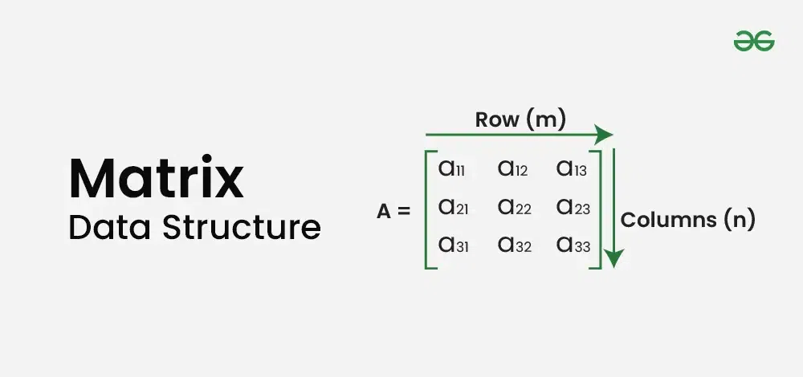
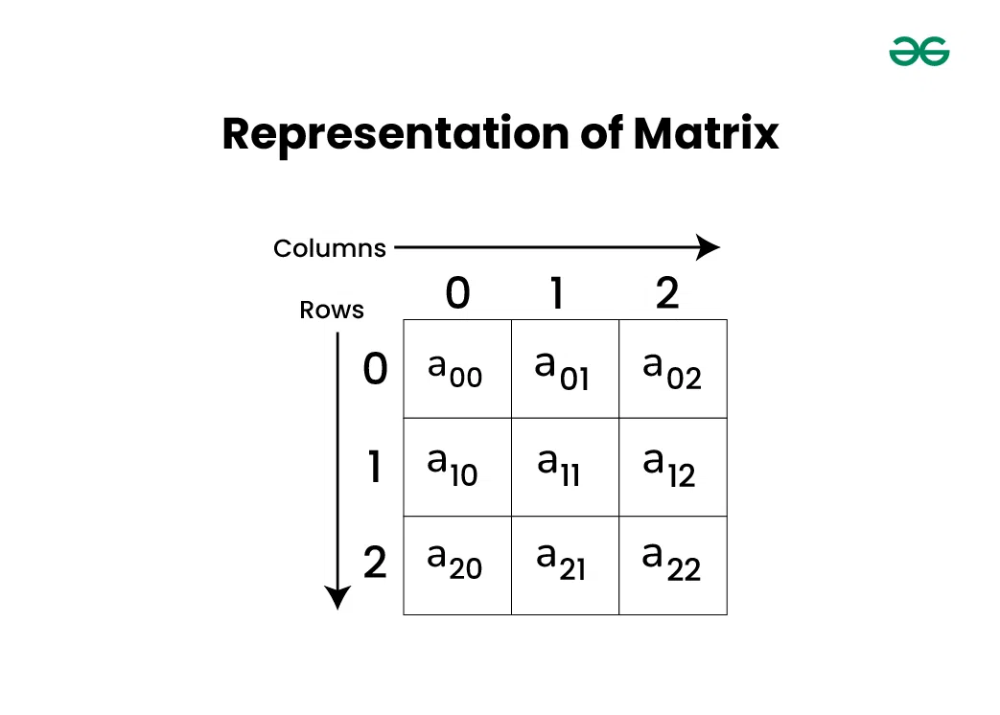
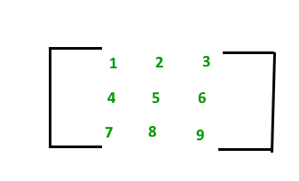

### Matrix Data Structure

**Matritsa ma'lumotlar strukturasi** satr va ustunlarda joylashgan ikki o'lchovli massivdir. U odatda matematik matritsalarni ifodalash uchun ishlatiladi va matematika, kompyuter grafikasi va ma'lumotlarni qayta ishlash kabi turli sohalarda asosiy hisoblanadi. Matritsalar tizimli formatda ma'lumotlarni samarali saqlash va manipulyatsiya qilish imkonini beradi.

<p align="center">

</p>

- **Basics of Matrix Data Structure**
  - Representation and Basic Operations
  - Row-wise vs column-wise traversal
  - Applications of Matrix Data Structure

**Matrix or Grid or 2D Array**

**Matritsa yoki Grid** - bu asosan matematik va ilmiy hisob-kitoblarda qo'llaniladigan ikki o'lchovli massiv. U, shuningdek, massivlar massivi sifatida qaraladi, bunda har bir indeksdagi massiv bir xil o'lchamga ega.

### Representation of Matrix Data Structure:

Quyidagi rasmdan ko'rinib turibdiki, elementlar qatorlar va ustunlar shaklida joylashtirilgan. Yuqoridagi rasmda ko'rsatilganidek, a[0][0] katak birinchi qator va birinchi ustunning birinchi elementidir. Birinchi kvadrat qavsdagi qiymat satr raqamini, ikkinchi kvadrat qavs ichidagi qiymat esa ustun raqamini ifodalaydi. (ya'ni, a[row][column]).

<p align="center">

</p>

> Example Declaration of Matrix Data Structure in JavaScript

```js
// Defining number of rows and columns in matrix
(rows = 3), (cols = 3);

// Declare a 2D array using array constructor
let arr = new Array(3);

// Python declaration
for (let i = 0; i < arr.length; i++) {
  arr[i] = new Array(3); // Each row has 3 columns
}
```

> Example Initializing Matrix Data Structure in JavaScript

```js
// Initializing a 2-D array with values
let arr = [
  [1, 2, 3],
  [4, 5, 6],
  [7, 8, 9],
];
```

- **Operations on Matrix Data Structure:**
  - Access elements of Matrix
  - Traversal of a Matrix
  - Searching in a Matrix
  - Sorting a Matrix

> Example Access elements of Matrix Data Structure in JavaScript

```js
// Initializing a 2-D array with values
let arr = [
  [1, 2, 3],
  [4, 5, 6],
  [7, 8, 9],
];

// Accessing elements of 2-D array
console.log("First element of first row: " + arr[0][0]);
console.log("Third element of second row: " + arr[1][2]);
console.log("Second element of third row: " + arr[2][1]);
```

> Example Traversal of a Matrix Data Structure in JavaScript

```js
// JS code for above approach
let arr = [
  [1, 2, 3, 4],
  [5, 6, 7, 8],
  [9, 10, 11, 12],
];

// Traversing over all the rows
for (let i = 0; i < 3; i++) {
  let s = "";
  // Traversing over all the columns of each row
  for (let j = 0; j < 4; j++) {
    s += arr[i][j] + " ";
  }
  console.log(s);
}

// This code is contributed by ishankhandelwals.
```

> Example Searching in a Matrix Data Structure in JavaScript

```js
// JavaScript code for the above approach

function searchInMatrix(arr, x) {
  let m = arr.length,
    n = arr[0].length;

  for (let i = 0; i < m; i++) {
    for (let j = 0; j < n; j++) {
      if (arr[i][j] == x) return true;
    }
  }
  return false;
}

// Driver program to test above
let x = 8;
let arr = [
  [0, 6, 8, 9, 11],
  [20, 22, 28, 29, 31],
  [36, 38, 50, 61, 63],
  [64, 66, 100, 122, 128],
];
if (searchInMatrix(arr, x)) console.log("YES");
else console.log("NO");
```

- **Sorting Matrix Data Structure**
  - Sort the matrix row-wise
  - Sort the matrix column-wise

**Row wise sorting in 2D array**

> Method 1 (Using Bubble Sort)

```js
// JavaScript Program to sort 2D matrix row-wise

function sortRowWise(m) {
  // loop for rows of matrix
  for (let i = 0; i < m.length; i++) {
    // loop for column of matrix
    for (let j = 0; j < m[i].length; j++) {
      // loop for comparison and swapping
      for (let k = 0; k < m[i].length - j - 1; k++) {
        if (m[i][k] > m[i][k + 1]) {
          // swapping of elements
          let t = m[i][k];
          m[i][k] = m[i][k + 1];
          m[i][k + 1] = t;
        }
      }
    }
  }

  // printing the sorted matrix
  for (let i = 0; i < m.length; i++) {
    for (let j = 0; j < m[i].length; j++) document.write(m[i][j] + " ");
    document.write("<br/>");
  }

  return 0;
}

// Driver code

let m = [
  [9, 8, 7, 1],
  [7, 3, 0, 2],
  [9, 5, 3, 2],
  [6, 3, 1, 2],
];
sortRowWise(m);

// This code is contributed by sanjoy_62.
```

> Method 2 (Using Library Function)

```js
// JavaScript code to sort 2D
// matrix row-wise

function GetRow(matrix, row) {
  var rowLength = matrix[0].length;
  var rowVector = new int[rowLength]();
  for (var i = 0; i < rowLength; i++) rowVector[i] = matrix[row][i];

  return rowVector;
}

function sortRowWise(m) {
  // One by one sort individual
  // rows.
  for (var i = 0; i < m.length; i++) {
    for (var k = 0; k < m[0].length; k++)
      for (var j = 0; j < m[0].length - k - 1; j++)
        if (m[i][j] > m[i][j + 1]) {
          // swap temp and arr[i]
          var temp = m[i][j];
          m[i][j] = m[i][j + 1];
          m[i][j + 1] = temp;
        }
  }

  // Printing the sorted matrix
  for (var i = 0; i < m.length; i++) {
    for (var j = 0; j < m[0].length; j++) document.write(m[i][j] + " ");
    document.write("<br>");
  }

  return 0;
}

// Driver code
var m = [
  [9, 8, 7, 1],
  [7, 3, 0, 2],
  [9, 5, 3, 2],
  [6, 3, 1, 2],
];
sortRowWise(m);
```

- **Matritsa ma'lumotlar strukturasining afzalliklari:**

  - Bu 2D vizualizatsiyada yordam beradi.
  - U bir xil nomdan foydalangan holda bir xil turdagi bir nechta elementlarni saqlaydi.
  - Bu tasodifiy elementlarga kirish imkonini beradi.
  - Ruxsat etilgan o'lchamdagi ma'lumotlarning har qanday shakli saqlanishi mumkin.
  - Amalga oshirish oson.

- **Matritsa ma'lumotlar strukturasining kamchiliklari:**
  - Biz siyrak grafik kabi matritsada juda kam elementlarni saqlashimiz kerak bo'lganda bo'sh joy samarasiz.
  - Matritsaning o'lchami oldindan kerak bo'lishi kerak.
  - Agar almashtirish sodir bo'lsa, kiritish va o'chirish operatsiyalari qimmatga tushadi.
  - Matritsa hajmini o'zgartirish ko'p vaqt talab etadi.

### Row-wise vs column-wise traversal of matrix

- **Matritsani kesib o'tishning ikkita keng tarqalgan usuli - row-major-order va column-major-order**
  - **Row Major Order** (Satrning asosiy tartibi): matritsaga satr bo'yicha kirishda.
  - **Column Major Order** (Ustunning asosiy tartibi): matritsaga ustun ustunga kirishda.

> Example:

```js
Input : mat[][] = {{1, 2, 3},
                   {4, 5, 6},
                   {7, 8, 9}}

Output : Row-wise: 1 2 3 4 5 6 7 8 9
         Col-wise: 1 4 7 2 5 8 3 6 9
```

> Example in JavaScript

```js
function rowMajor(arr) {
  let rows = arr.length;
  let cols = arr[0].length;

  // Accessing elements row-wise
  for (let i = 0; i < rows; i++) {
    for (let j = 0; j < cols; j++) {
      arr[i][j]++;
    }
  }
}

function colMajor(arr) {
  let rows = arr.length;
  let cols = arr[0].length;

  // Accessing elements column-wise
  for (let j = 0; j < cols; j++) {
    for (let i = 0; i < rows; i++) {
      arr[i][j]++;
    }
  }
}

// Driver code
let n = 1000; // Size of the matrix (n x n)
let arr = Array.from({ length: n }, () => Array(n).fill(0));

// Time taken by row-major order
let start = Date.now();
rowMajor(arr);
let end = Date.now();
console.log(`Row major access time: ${end - start} ms`);

// Time taken by column-major order
start = Date.now();
colMajor(arr);
end = Date.now();
console.log(`Column major access time: ${end - start} ms`);
```

- **Time Complexity: O(MAX\*MAX)**
- **Auxiliary Space: O(MAX\*MAX)**

### Applications of Matrix Data Structure

Matritsa qatorlar va ustunlar tartibida joylashtirilgan raqamlar to'plamini ifodalaydi. Matritsaning elementlarini qavs yoki qavs ichiga olish kerak.

<p align="center">

</p>

- **Matritsa turlari:**

  - Row matrix
  - Column matrix
  - Null matrix
  - Square matrix
  - Diagonal matrix
  - Sparse matrix
  - Spiral matrix
  - Identity matrix
  - Triangular matrix
  - Symmetric matrix

- **Matritsa ma'lumotlar strukturasining xususiyatlari:**

  - Size: Matritsa satrlar va ustunlar soni bilan belgilanadigan o'ziga xos o'lchamga ega.
  - Element: Matritsaning satr va ustun indekslari element deb ataladigan har bir yozuvni aniqlash uchun xizmat qiladi.
  - Operations: Skalyar ko'paytirish va matritsalarda qo'shish, ayirish va ko'paytirish amallari ham qo'llab-quvvatlanadi.
  - Determinant: Kvadrat matritsaning determinanti chiziqli tenglamalar tizimini yechish va boshqa chiziqli algebraik amallarni bajarish uchun ishlatilishi mumkin bo'lgan skalyar sondir.
  - Inverse: Agar kvadrat matritsa teskari bo'lsa, u chiziqli tenglama tizimlarini echish va boshqa chiziqli algebraik amallarni bajarish uchun ishlatilishi mumkin.
  - Transpose: Matritsani asosiy diagonali bo'ylab aylantirib, satrlar va ustunlarni almashtirish orqali siz matritsaning transpozitsiyasini yaratishingiz mumkin.
  - Rank: Ko'pgina ilovalarda, jumladan, chiziqli tenglamalar va chiziqli regressiya tahlillarini echishda, matritsaning darajasi - uning chiziqli mustaqil satrlari yoki ustunlari o'lchovi - qo'llaniladi.

- **Matritsa ma'lumotlar strukturasining ilovalari:**

  - Linear Algebra: Matritsalar chiziqli algebrada keng qo'llaniladi, bu matematikaning chiziqli tenglamalar, vektor bo'shliqlari va chiziqli o'zgarishlar bilan shug'ullanadi. Matritsalar chiziqli tenglamalarni ifodalash va chiziqli tenglamalar tizimini yechish uchun ishlatiladi.
  - Optimization: Matritsalar optimallashtirish masalalarida, masalan, chiziqli dasturlashda, masalaning cheklovlari va maqsad funktsiyalarini ifodalash uchun ishlatiladi.
  - Statistics: Matritsalar statistikada ma'lumotlarni ifodalash va korrelyatsiya va regressiya kabi operatsiyalarni bajarish uchun ishlatiladi.
  - Signal Processing: Matritsalar signallarni qayta ishlashda signallarni ifodalash va filtrlash va o'zgartirish kabi operatsiyalarni bajarish uchun ishlatiladi.
  - Network Analysis: Matritsalar tarmoq tahlilida grafiklarni ko'rsatish va ikkita tugun orasidagi eng qisqa yo'lni topish kabi operatsiyalarni bajarish uchun ishlatiladi.
  - Quantum Mechanics: Matritsalar kvant mexanikasida kvant tizimlaridagi holatlar va operatsiyalarni ifodalash uchun ishlatiladi.

- **Matritsa ma'lumotlar strukturasining real hayotdagi ilovalari:**

  - Image processing: Matritsalar tasvirlarni filtrlash, silliqlash, masshtablash va aylantirish kabi operatsiyalar uchun tasvirni qayta ishlashda keng qo'llaniladi. Tasvirni qayta ishlashda tasvirni piksellar matritsasi sifatida ko'rsatish mumkin, bu erda har bir piksel matritsadagi elementga mos keladi.
  - Robotics: robototexnikada matritsalar robotlarning joylashuvi va yo'nalishini va ularning yakuniy effektlarini ifodalash uchun ishlatiladi. Ular robot qo'llarining kinematikasi va dinamikasini hisoblash va ularning traektoriyalarini rejalashtirish uchun ishlatiladi.
  - Transportation and logistics: Matritsalar transport va logistikada transport tarmoqlarini ifodalash va transport muammosi va tayinlash muammosi kabi optimallashtirish muammolarini hal qilish uchun ishlatiladi.
  - Finance: Matritsalar moliya sohasida aktivlar portfelini ifodalash, investitsiyalarning tavakkalchiligi va daromadliligini hisoblash hamda aktivlarni taqsimlash va optimallashtirish kabi operatsiyalarni bajarish uchun ishlatiladi.
  - Computer graphics and gaming: Kompyuter grafikasi va oʻyinlarda matritsalar 3D modellarni ifodalash va masshtablash, aylantirish va tarjima qilish kabi amallarni bajarish uchun ishlatiladi. Ular yorug'lik va soya effektlarida ham qo'llaniladi.
  - Electrical engineering: Matritsalar elektrotexnikada elektron tahlil, boshqaruv tizimlari va signallarni qayta ishlash uchun ishlatiladi. Ular chiziqli tenglamalar tizimini ifodalash va ularni Gauss eliminatsiyasi va LU parchalanishi kabi usullardan foydalangan holda echish uchun ishlatiladi.
  - Medical imaging: Matritsalar tibbiy tasvirlashda tasvirni segmentatsiyalash, ro'yxatga olish va rekonstruksiya qilish kabi operatsiyalar uchun ishlatiladi. Ular tibbiy tasvirlarni piksellar massivlari sifatida ko'rsatish va silliqlash va filtrlash kabi operatsiyalarni bajarish uchun ishlatiladi.
  - Cryptography: Kriptografiyada matritsalar xabarlarni shifrlash va shifrlash uchun ishlatiladi. Ular Hill Cipher va boshqa shifrlash usullarida qo'llaniladi.
  - Machine learning and artificial intelligence: Matritsalar mashinani o'rganish va sun'iy intellektda ma'lumotlarni taqdim etish, modellashtirish va neyron tarmoqlar, qo'llab-quvvatlovchi vektorli mashinalar va asosiy komponentlarni tahlil qilish kabi algoritmlarni o'rgatish uchun ishlatiladi.

- **Matritsa ma'lumotlar strukturasining afzalliklari:**

  - Bu 2D vizualizatsiyada yordam beradi.
  - U bir xil nomdan foydalangan holda bir xil turdagi bir nechta elementlarni saqlaydi.
  - Indeks yordamida elementlarga kirish mumkin.
  - Bu tasodifiy elementlarga kirish imkonini beradi.
  - Ruxsat etilgan o'lchamdagi ma'lumotlarning har qanday shakli saqlanishi mumkin.
  - Amalga oshirish oson.
  - Bu eng oddiy 2D ma'lumotlar tuzilmasi.
  - U barcha dasturlash tillari tomonidan qo'llaniladi.

- **Matritsa ma'lumotlar strukturasining kamchiliklari:**
  - Matritsaning o'lchamini oldindan bilish kerak.
  - U qat'iy o'lchamga ega va uning hajmini boshqa o'zgartirish mumkin emas.
  - Agar almashtirish sodir bo'lsa, kiritish va o'chirish operatsiyalari qimmatga tushadi.
  - Belgilangan matritsa o'lchami talab qilinganidan kattaroq bo'lsa, xotira isrof bo'lishi mumkin.
  - Matritsaning o'lchamini o'zgartirish ko'p vaqt talab qilishi mumkin, ayniqsa uni tez-tez bajarish kerak bo'lsa yoki matritsaning o'lchami juda katta bo'lsa.
  - O'rnatilgan funksionallik yo'q.
