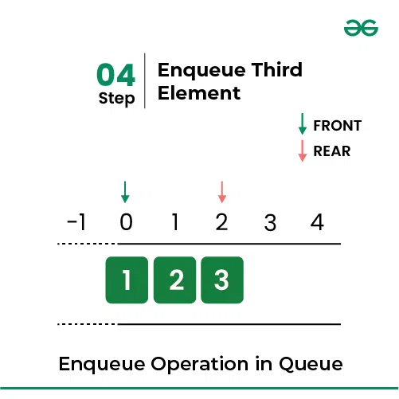

### Queue Data Structure

Navbatdagi ma'lumotlar strukturasi - bu ma'lum bir tartibda ma'lumotlarni saqlash va boshqarish uchun ishlatiladigan informatikadagi asosiy tushuncha. U "Birinchi kir, birinchi chiqadi" (FIFO) tamoyiliga amal qiladi, bunda navbatga qo'shilgan birinchi element birinchi bo'lib o'chiriladi. Ma'lumotlar oqimini boshqarishda soddaligi va samaradorligi uchun navbatlar odatda turli xil algoritmlar va ilovalarda qo'llaniladi.

<p align="center">

</p>

- **FIFO navbatdagi ma'lumotlar tuzilmasi printsipi:**
  - Navbat chipta sotib olishni kutayotgan navbatga o'xshaydi, bu erda navbatda turgan birinchi odam birinchi bo'lib xizmat qiladi. (ya'ni, birinchi kelgan birinchi xizmat).
  - Xizmat ko'rsatishga tayyor bo'lgan navbatdagi yozuvning joylashishi, ya'ni navbatdan olib tashlanadigan birinchi yozuv navbatning old qismi (ba'zan navbat boshlig'i) deb ataladi. Xuddi shunday, navbatdagi oxirgi yozuvning o'rni, ya'ni oxirgi qo'shilgan joy navbatning orqa (yoki dumi) deb ataladi.

<p align="center">

</p>

- **Navbat ma'lumotlari tuzilmasini ifodalash:**
  - Quyidagi rasmda navbat ma'lumotlari tuzilmasini qanday ko'rsatishimiz ko'rsatilgan:

<p align="center">

</p>

- **Navbatdagi ma'lumotlar strukturasining turlari:**
  - Navbatdagi ma'lumotlar strukturasini 4 turga bo'lish mumkin:

<p align="center">

</p>

- **Har xil turdagi navbatlar mavjud:**

  1. **Simple Queue:** oddiy navbat FIFO tuzilmasiga amal qiladi. Biz elementni faqat orqa tarafga kiritishimiz va elementni navbatning old qismidan olib tashlashimiz mumkin.
  2. **Double-Ended Queue (Dequeue):** Ikki tomonlama navbatda qo'shish va o'chirish operatsiyalari ikkala tomondan ham bajarilishi mumkin. Ular ikki xil:

  - **Input Restricted Queue:** Bu oddiy navbat. Ushbu turdagi navbatda kiritish faqat bitta uchidan olinishi mumkin, lekin o'chirish har qanday uchidan amalga oshirilishi mumkin.
  - **Output Restricted Queue:** Bu ham oddiy navbat. Ushbu turdagi navbatda kiritish har ikki uchidan olinishi mumkin, lekin o'chirish faqat bir uchidan amalga oshirilishi mumkin.

  3. **Circular Queue:** Bu navbatdagi maxsus turi bo'lib, unda oxirgi pozitsiya birinchi holatga qayta ulanadi. Bu erda ham operatsiyalar FIFO tartibida amalga oshiriladi.
  4. **Priority Queue:** ustuvor navbat - bu elementlarga ularga berilgan ustuvorlik asosida kirish uchun mo'ljallangan maxsus navbat. Ular ikki xil:

  - **Ascending Priority Queue:** O'sish bo'yicha ustuvorlik navbatida elementlar ustuvorlik qiymatlarining ortib borish tartibida joylashtirilgan. Eng kichik ustuvorlik qiymatiga ega element birinchi bo'lib ochiladi.
  - **Descending Priority Queue:** Kamayib borayotgan ustuvorlik navbatida elementlar ustuvorlik qiymatlarining kamayishi tartibida joylashtirilgan. Eng katta ustunlikka ega element birinchi bo'lib ochiladi.

- **Navbatdagi ma'lumotlar tuzilmasidagi asosiy operatsiyalar:**

  1. **Enqueue:** navbat oxiriga element qo‘shadi (yoki saqlaydi).
  2. **Dequeue:** Navbatdan elementlarni olib tashlash.
  3. **Peek or front:** navbatning oldingi tugunida mavjud bo'lgan ma'lumotlar elementini o'chirmasdan oladi.
  4. **rear:** Bu operatsiya elementni orqa tomonda olib tashlamasdan qaytaradi.
  5. **isFull:** Navbat to'lganligini tasdiqlaydi.
  6. **isEmpty:** navbat bo'sh yoki yo'qligini tekshiradi.

- **1. Enqueue Operation in Queue Data Structure:**
  Navbatdagi Enqueue() operatsiyasi navbat oxiriga element qo'shadi (yoki saqlaydi).
  Ma'lumotlarni navbatga qo'yish (qo'shish) uchun quyidagi amallarni bajarish kerak:
  - Step 1: Check if the queue is full.
  - Step 2: If the queue is full, return overflow error and exit.
  - Step 3: If the queue is not full, increment the rear pointer to point to the next empty space.
  - Step 4: Add the data element to the queue location, where the rear is pointing.
  - Step 5: return success.

<p align="center">

</p>
<p align="center">

</p>
<p align="center">

</p>
<p align="center">

</p>
<p align="center">

</p>
<p align="center">

</p>

> Implementation of Enqueue:

```js
enqueue(element){
    // adding element to the queue
    this.items.push(element);
}

// This code is contributed by Susobhan Akhuli
```

- **Complexity Analysis:**

  - Time Complexity: O(1)
  - Space Complexity: O(N)

- **2. Dequeue Operation in Queue Data Structure:**
  Navbatdan birinchi elementni olib tashlaydi (yoki kirish huquqini beradi).
  O'chirish operatsiyasini bajarish uchun quyidagi qadamlar qo'yiladi:
  - Step 1: Check if the queue is empty.
  - Step 2: If the queue is empty, return the underflow error and exit.
  - Step 3: If the queue is not empty, access the data where the front is pointing.
  - Step 4: Increment the front pointer to point to the next available data element.
  - Step 5: The Return success.

<p align="center">

</p>
<p align="center">

</p>
<p align="center">

</p>
<p align="center">

</p>
<p align="center">

</p>
<p align="center">

</p>

> Implementation of dequeue:

```js
dequeue(){
    // removing element from the queue
    // returns underflow when called
    // on empty queue
    if(this.isEmpty()){
        document.write("<br>Queue is empty<br>");
           return -1;
    }
    return this.items.shift();
}
// This code is contributed by Susobhan Akhuli
```

- **Complexity Analysis:**

  - Time Complexity: O(1)
  - Space Complexity: O(N)

- **3. Front Operation in Queue Data Structure:**
  Ushbu operatsiya elementni olib tashlamasdan oldingi qismga qaytaradi.

```js
// Function to get front of queue
front(){
    // returns the Front element of
    // the queue without removing it.
    if(this.isEmpty())
           return "No elements in Queue<br>";
    return this.items[0];
}
// This code is contributed By Susobhan Akhuli
```

- **Complexity Analysis:**

* Time Complexity: O(1)
* Space Complexity: O(N)

- **4. Rear Operation in Queue Data Structure:**
  Ushbu operatsiya elementni olib tashlamasdan orqa tarafga qaytaradi.

```js
function rear(queue) {
  if (queue.length === 0) {
    console.log("Queue is empty.");
    return -1;
  }

  let rearElement = -1;
  while (queue.length > 0) {
    rearElement = queue.shift();
  }

  return rearElement;
}
```

```js
rear(){
	// returns the Rear element of
	// the queue without removing it.
	if(this.isEmpty())
		return "No elements in Queue<br>";
	return this.items[this.items.length-1];
}
// This code is contributed By Susobhan Akhuli
```

- **Complexity Analysis:**

  - Time Complexity: O(1)
  - Space Complexity: O(N)

- **5. isEmpty Operation in Queue Data Structure:**
  Ushbu operatsiya navbatning bo'sh yoki bo'lmasligini ko'rsatadigan mantiqiy qiymatni qaytaradi.

```js
isEmpty(){
    // return true if the queue is empty.
    return this.items.length == 0;
}
// This code is contributed by Susobhan Akhuli
```

- **Complexity Analysis:**

  - Time Complexity: O(1)
  - Space Complexity: O(N)

- **6. isFull Operation in Queue Structure:**
  Ushbu operatsiya navbatning to'la yoki yo'qligini ko'rsatadigan mantiqiy qiymatni qaytaradi.

```js
// This function will check
// whether the queue is full or not.
function isFull() {
  if (front == 0 && rear == MAX_SIZE - 1) {
    return true;
  }
  return false;
}
```

- **Complexity Analysis:**

  - Time Complexity: O(1)
  - Space Complexity: O(N)

- **7. size()**
  Ushbu operatsiya navbatning o'lchamini, ya'ni tarkibidagi elementlarning umumiy sonini qaytaradi.

```js
queuename.size()
Parameters :
No parameters are passed
Returns :
Number of elements in the container
```

```js
// Javascript code
let sum = 0;
let myqueue = [];
myqueue.push(1);
myqueue.push(8);
myqueue.push(3);
myqueue.push(6);
myqueue.push(2);

// Queue becomes 1, 8, 3, 6, 2

console.log(myqueue.length);
```

- **Complexity Analysis:**

  - Time Complexity: O(1)
  - Space Complexity: O(N)

- **Implementation of Queue Data Structure:**
  - Implementation of Queue using Arrays
  - Implementation of Queue using Linked List

> Biz quyida navbatni amalga oshirishni muhokama qildik:

```js
// Queue class
class Queue {
  // Array is used to implement a Queue
  constructor() {
    this.items = [];
  }
  isEmpty() {
    // return true if the queue is empty.
    return this.items.length == 0;
  }
  enqueue(element) {
    // adding element to the queue
    this.items.push(element);
    document.write(element + " enqueued to queue<br>");
  }
  dequeue() {
    // removing element from the queue
    // returns underflow when called
    // on empty queue
    if (this.isEmpty()) return "Underflow<br>";
    return this.items.shift();
  }
  front() {
    // returns the Front element of
    // the queue without removing it.
    if (this.isEmpty()) return "No elements in Queue<br>";
    return this.items[0];
  }
  rear() {
    // returns the Rear element of
    // the queue without removing it.
    if (this.isEmpty()) return "No elements in Queue<br>";
    return this.items[this.items.length - 1];
  }
}

// creating object for queue class
var queue = new Queue();

// Adding elements to the queue
queue.enqueue(10);
queue.enqueue(20);
queue.enqueue(30);
queue.enqueue(40);

// queue contains [10, 20, 30, 40]
// removes 10
document.write(queue.dequeue() + " dequeued from queue<br>");

// queue contains [20, 30, 40]
// Front is now 20
document.write("Front item is " + queue.front() + "<br>");

// printing the rear element
// Rear is 40
document.write("Rear item is " + queue.rear() + "<br>");

// This code is contributed by Susobhan Akhuli

// Output
// 10 enqueued to queue
// 20 enqueued to queue
// 30 enqueued to queue
// 40 enqueued to queue
// 10 dequeued from queue
// Front item is 20
// Rear item is 40
```

**Complexity Analysis of Operations on Queue Data Structure:**

| Operations | Time Complexity | Space Complexity |
| ---------- | --------------- | ---------------- |
| Enqueue    | O(1)            | O(1)             |
| Dequeue    | O(1)            | O(1)             |
| Front      | O(1)            | O(1)             |
| Back       | O(1)            | O(1)             |
| isEmpty    | O(1)            | O(1)             |
| isFull     | O(1)            | O(1)             |

- **Navbatdagi ma'lumotlar strukturasining ilovalari:**
  Navbatni qo'llash keng tarqalgan. Kompyuter tizimida printerni, disk xotirasiga kirishni yoki hatto protsessordan foydalanish uchun vaqtni taqsimlash tizimida kutayotgan vazifalar navbatlari bo'lishi mumkin. Bitta dastur doirasida bir nechta so'rovlar navbatda turishi mumkin yoki bitta vazifa boshqa vazifalarni yaratishi mumkin, ularni navbatda ushlab turish orqali bajarish kerak.

  - Navbatdan Printer Spooling kabi ishni rejalashtirishda foydalanish mumkin.
  - Navbatdan bizda bitta resurs va bir nechta iste'molchilar mavjud bo'lganda foydalanish mumkin.
  - Tarmoqda navbat marshrutizator/kommutator va pochta navbati kabi qurilmalarda qo'llaniladi.
  - Navbatdan kenglikdagi birinchi qidiruv, topologik tartib va ​​boshqalar kabi turli xil algoritm texnikalarida foydalanish mumkin.

- **Navbatdagi ma'lumotlar strukturasining afzalliklari:**

  - Katta hajmdagi ma'lumotlarni osonlik bilan samarali boshqarish mumkin.
  - Qo'shish va o'chirish kabi operatsiyalarni osonlik bilan bajarish mumkin, chunki u birinchidan birinchi chiqadi qoidasiga amal qiladi.
  - Navbatlar ma'lum bir xizmatdan bir nechta iste'molchilar tomonidan foydalanilganda foydali bo'ladi.
  - Ma'lumotlar jarayonlari o'rtasidagi aloqa uchun navbatlar tezdir.
  - Navbatlardan boshqa ma'lumotlar tuzilmalarini amalga oshirishda foydalanish mumkin.

- **Navbatdagi ma'lumotlar strukturasining kamchiliklari:**
  - O'rtadan elementlarni kiritish va o'chirish kabi operatsiyalar ko'p vaqt talab etadi.
  - Elementni qidirish O(N) vaqtini oladi.
  - Massivni amalga oshirishdan oldin navbatning maksimal hajmi aniqlanishi kerak.
