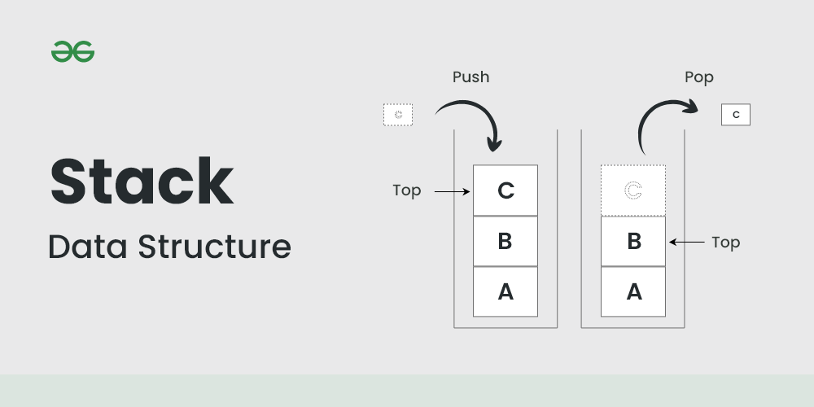
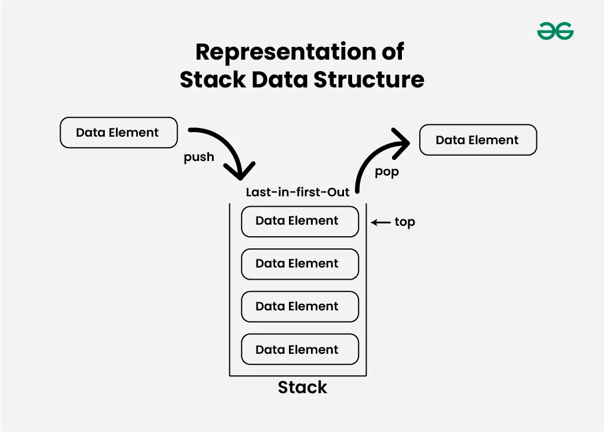
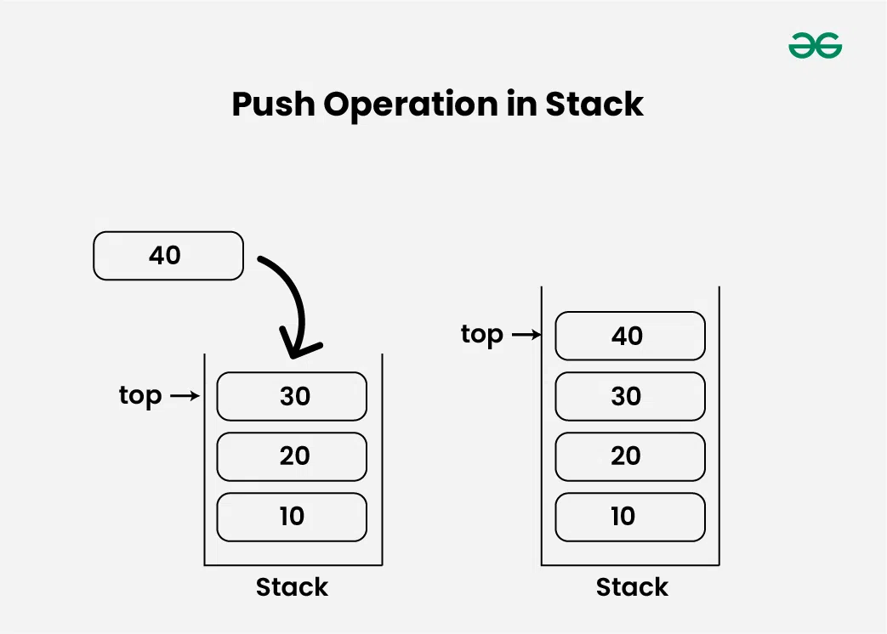
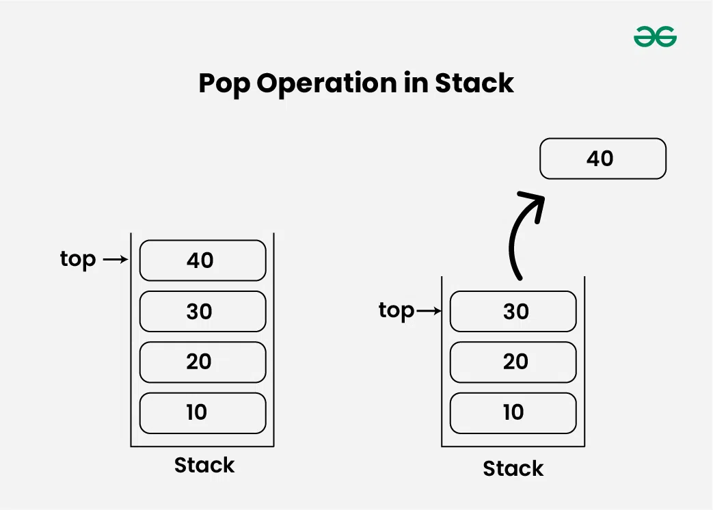
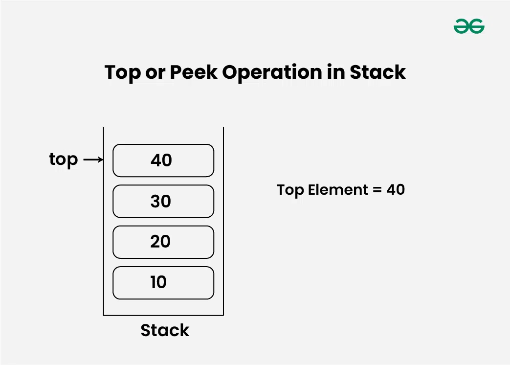
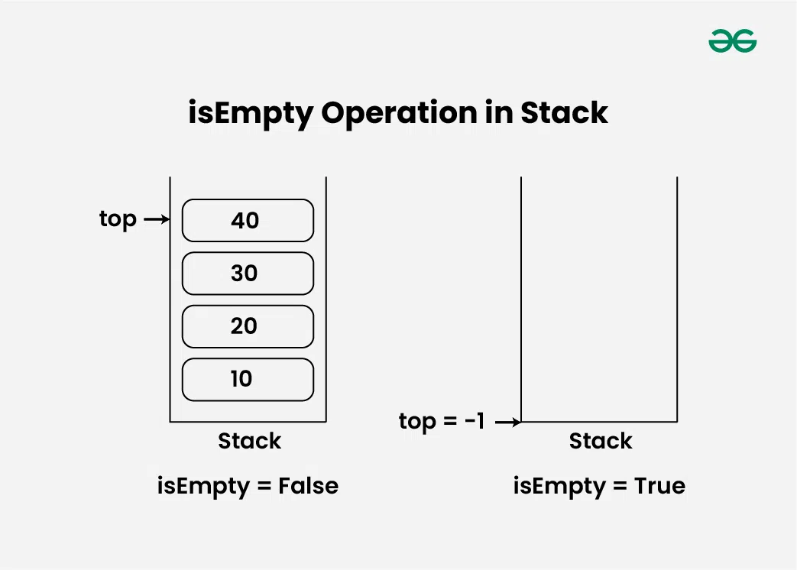
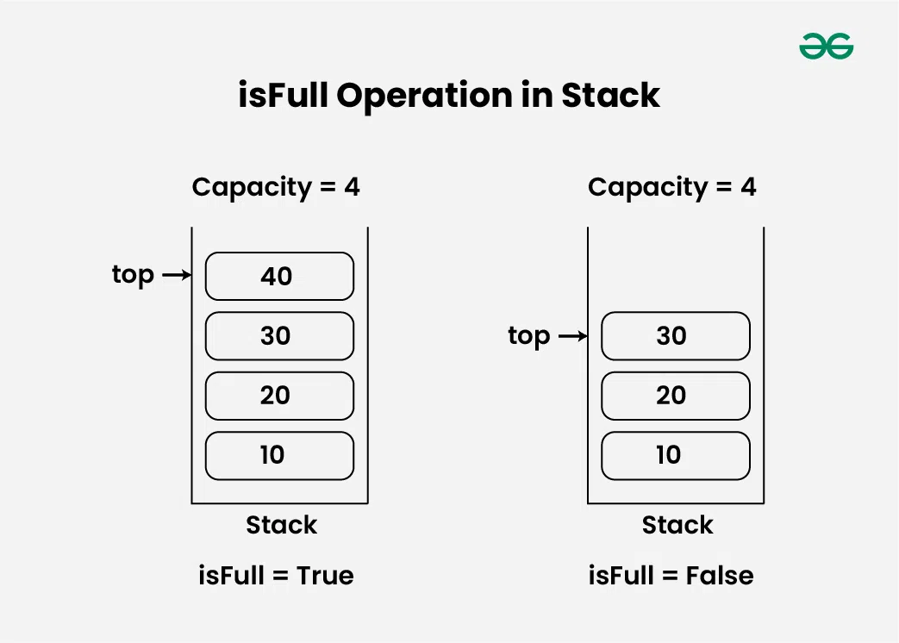

### Stack Data Structure

**Stack** - bu ma'lumotlarning chiziqli tuzilmasi bo'lib, u amallar bajarilishining ma'lum bir tartibiga amal qiladi. Buyurtma LIFO (oxirgi kiruvchi birinchi chiqadi) yoki FILO (birinchi kiruvchi birinchi chiqadi) bo'lishi mumkin. LIFO oxirgi kiritilgan element birinchi bo'lib chiqishini va FILO birinchi qo'yilgan element oxirgi chiqishini bildiradi.

**Stack Data Structure** - bu LIFO (Oxirgi kirish birinchi chiqish) tamoyiliga amal qiluvchi chiziqli ma'lumotlar strukturasi (linear data structure), shuning uchun oxirgi kiritilgan element birinchi bo'lib chiqariladi. Ushbu maqolada biz Stackning barcha asoslarini, Stackdagi operatsiyalarni, uni amalga oshirishni, afzalliklari va kamchiliklarini ko'rib chiqamiz, bu sizga Stack asosidagi barcha muammolarni hal qilishga yordam beradi.

<p align="center">

</p>

- **Representation of Stack Data Structure:**
  - Stack LIFO (oxirgi kiruvchi birinchi chiqish) tamoyiliga amal qiladi, shuning uchun oxirgi bosilgan element birinchi bo'lib chiqadi.

<p align="center">

</p>

- **Types of Stack Data Structure:**

  - **Fixed Size Stack:** Nomidan ko'rinib turibdiki, qattiq o'lchamdagi stek qat'iy o'lchamga ega va dinamik ravishda o'sishi yoki qisqarishi mumkin emas. Agar stek to'lgan bo'lsa va unga element qo'shishga harakat qilinsa, to'lib ketish xatosi yuzaga keladi. Agar stek bo'sh bo'lsa va undan elementni olib tashlashga harakat qilinsa, quyi oqim xatosi yuzaga keladi.
  - **Dynamic Size Stack:** Dinamik o'lchamli stek dinamik ravishda o'sishi yoki kichrayishi mumkin. Stack to'la bo'lsa, u yangi elementni joylashtirish uchun o'z hajmini avtomatik ravishda oshiradi va stek bo'sh bo'lsa, uning hajmini kamaytiradi. Ushbu turdagi stek bog'langan ro'yxat yordamida amalga oshiriladi, chunki u stekning o'lchamlarini oson o'zgartirishga imkon beradi.

- **Basic Operations on Stack Data Structure:**

  - push() to insert an element into the stack
  - pop() to remove an element from the stack
  - top() Returns the top element of the stack.
  - isEmpty() returns true if stack is empty else false.
  - isFull() returns true if the stack is full else false.

- **Push Operation in Stack Data Structure:**

<p align="center">

</p>

> Example Push Operation in Stack in JavaScript

```js
class Stack {
  constructor() {
    this.stack = [];
  }

  push(value) {
    this.stack.push(value); // Pushes the value to the stack top
  }

  top() {
    return this.stack[this.stack.length - 1]; // Returns the element at the top of the stack
  }

  pop() {
    return this.stack.pop(); // Removes and returns the top element of the stack
  }

  isEmpty() {
    return this.stack.length === 0; // Checks if the stack is empty
  }
}

function main() {
  const s = new Stack(); // Creating a stack

  s.push(1); // Pushing 1 to the stack top
  s.push(2); // Pushing 2 to the stack top
  s.push(3); // Pushing 3 to the stack top
  s.push(4); // Pushing 4 to the stack top
  s.push(5); // Pushing 5 to the stack top

  // Printing the stack
  while (!s.isEmpty()) {
    console.log(s.top() + " "); // Outputting the top element
    s.pop(); // Removing the top element
  }
  // The above loop prints "5 4 3 2 1"
}

main(); // Calling the main function
// Output
// 5 4 3 2 1
```

- **Pop Operation in Stack Data Structure:**

<p align="center">

</p>

> Example Pop Operation in Stack in JavaScript

```js
// Creating a stack
let stack = [];

// Pushing elements to the stack
stack.push(1); // This pushes 1 to the stack top
stack.push(2); // This pushes 2 to the stack top
stack.push(3); // This pushes 3 to the stack top
stack.push(4); // This pushes 4 to the stack top
stack.push(5); // This pushes 5 to the stack top

// Removing elements from the stack using pop function
while (stack.length > 0) {
  console.log(stack[stack.length - 1]); // Print the top element
  stack.pop(); // Removes the top element from the stack
}

// Output
// 5 4 3 2 1
```

- **Top or Peek Operation in Stack Data Structure:**

<p align="center">

</p>

> Example Top Operation in Stack in JavaScript

```js
function topElement(s) {
  return s[s.length - 1];
}

// Main function
function main() {
  let s = []; // Creating an array to act as a stack

  s.push(1); // Pushing 1 to the stack
  console.log(topElement(s)); // Prints 1 since 1 is at the top of the stack

  s.push(2); // Pushing 2 to the stack
  console.log(topElement(s)); // Prints 2 since 2 is at the top of the stack

  s.push(3); // Pushing 3 to the stack
  console.log(topElement(s)); // Prints 3 since 3 is at the top of the stack
}

// Calling the main function
main();
//THis code is contributed by Utkarsh

// Output
// 1
// 2
// 3
```

- **isEmpty Operation in Stack Data Structure:**

<p align="center">

</p>

> Example isEmpty Operation in Stack in JavaScript

```js
function isEmpty(stack) {
  // checking whether stack is empty or not
  return stack.length === 0;
}

function main() {
  const s = [];

  // The if - else conditional statements below prints "Stack is empty."
  if (isEmpty(s)) {
    console.log("Stack is empty.");
  } else {
    console.log("Stack is not empty.");
  }

  s.push(1); // Inserting value 1 to the stack top

  // The if - else conditional statements below prints "Stack is not empty."
  if (isEmpty(s)) {
    console.log("Stack is empty.");
  } else {
    console.log("Stack is not empty.");
  }
}

// Run the main function
main();
//This code is contributed by Monu.

// Output
// Stack is empty.
// Stack is not empty.
```

- **isFull Operation in Stack Data Structure:**

<p align="center">

</p>

> Example in JavaScript

```js
let stack = []; // Creating an array to simulate a stack

console.log(stack.length); // Prints 0 since the stack is empty

stack.push(1); // This pushes 1 to the stack top
stack.push(2); // This pushes 2 to the stack top
console.log(stack.length); // Prints 2 since the stack contains two elements

stack.push(3); // This pushes 3 to the stack top
console.log(stack.length); // Prints 3 since the stack contains three elements
//This code is contributed by Aman.

// Output
// 0
// 2
// 3
```

**Implementation of Stack Data Structure:**

- **Stackda bajarilishi mumkin bo'lgan asosiy operatsiyalarga push, pop va peek kiradi. Stackni amalga oshirishning ikki yo'li mavjud -**
  - **Using Array**
  - **Using Linked List**

> Example Implementation of Stack Data Structure using Array in JavaScript

```js
/* javascript program to implement basic stack
operations 
*/
var t = -1;
var MAX = 1000;
var a = Array(MAX).fill(0); // Maximum size of Stack

function isEmpty() {
  return t < 0;
}

function push(x) {
  if (t >= MAX - 1) {
    console.log("Stack Overflow");
    return false;
  } else {
    t += 1;
    a[t] = x;

    console.log(x + " pushed into stack<br/>");
    return true;
  }
}

function pop() {
  if (t < 0) {
    console.log("Stack Underflow");
    return 0;
  } else {
    var x = a[t];
    t -= 1;
    return x;
  }
}

function peek() {
  if (t < 0) {
    console.log("Stack Underflow");
    return 0;
  } else {
    var x = a[t];
    return x;
  }
}

function print() {
  for (i = t; i > -1; i--) {
    console.log(" " + a[i]);
  }
}

push(10);
push(20);
push(30);
console.log(pop() + " Popped from stack");
console.log("<br/>Top element is :" + peek());
console.log("<br/>Elements present in stack : ");
print();

// This code is contributed by Rajput-Ji
// Output
// 10 pushed into stack
// 20 pushed into stack
// 30 pushed into stack
// 30 Popped from stack
// Top element is : 20
// Elements present in stack : 20 10
```

- **Massivni amalga oshirishning afzalliklari:**

  - Amalga oshirish oson.
  - Ko'rsatkichlar ishtirok etmaganligi sababli xotira saqlanadi.

- **Massivni amalga oshirishning kamchiliklari:**
  - Bu dinamik emas, ya'ni ish vaqtidagi ehtiyojlarga qarab o'smaydi va qisqarmaydi. [Ammo C++ da vektor, Pythonʼdagi roʻyxat, Javaʼdagi ArrayList kabi dinamik oʻlchamli massivlar boʻlsa, steklar massivni amalga oshirish bilan ham oʻsishi va kichrayishi mumkin].
  - To'plamning umumiy hajmi oldindan aniqlanishi kerak.

> Example Implementation of Stack Data Structure using Linked List in JavaScript

```js
// javascript Code for Linked List Implementation

var root;

class StackNode {
  constructor(data) {
    this.data = data;
    this.next = null;
  }
}

function isEmpty() {
  if (root == null) {
    return true;
  } else return false;
}

function push(data) {
  var newNode = new StackNode(data);

  if (root == null) {
    root = newNode;
  } else {
    var temp = root;
    root = newNode;
    newNode.next = temp;
  }
  document.write(data + " pushed to stack<br/>");
}

function pop() {
  var popped = Number.MIN_VALUE;
  if (root == null) {
    document.write("Stack is Empty");
  } else {
    popped = root.data;
    root = root.next;
  }
  return popped;
}

function peek() {
  if (root == null) {
    document.write("Stack is empty");
    return Number.MIN_VALUE;
  } else {
    return root.data;
  }
}

// Driver code
push(10);
push(20);
push(30);

document.write(pop() + " popped from stack<br/>");

document.write("Top element is " + peek());

// This code is contributed by Rajput-Ji

// Output
// 10 pushed to stack
// 20 pushed to stack
// 30 pushed to stack
// 30 popped from stack
// Top element is 20
// Elements present in stack : 20 10
```

- **Linked List (Bog'langan ro'yxat)ni amalga oshirishning afzalliklari:**

  - Stackning bog'langan ro'yxatini amalga oshirish ish vaqtidagi ehtiyojlarga qarab o'sishi va qisqarishi mumkin.
  - U JVM kabi ko'plab virtual mashinalarda qo'llaniladi.

- **Linked List (Bog'langan ro'yxat)ni amalga oshirishning kamchiliklari:**
  - Ko'rsatkichlarning ishtiroki tufayli qo'shimcha xotira talab qiladi.
  - Stakka tasodifiy kirish mumkin emas.

**Complexity Analysis of Operations on Stack Data Structure:**

| Operations      | Time Complexity | Space Complexity |
| --------------- | --------------- | ---------------- |
| push()          | O(1)            | O(1)             |
| pop()           | O(1)            | O(1)             |
| top() or peek() | O(1)            | O(1)             |
| isEmpty()       | O(1)            | O(1)             |
| isFull()        | O(1)            | O(1)             |

- **Stack Data Strukturasining afzalliklari:**

  - **Simplicity:** Staklar oddiy va tushunarli ma'lumotlar tuzilmasi bo'lib, ularni keng ko'lamli ilovalar uchun mos qiladi.
  - **Efficiency:** Stakdagi surish va ochish operatsiyalari doimiy vaqt ichida (O(1)) bajarilishi mumkin, bu ma'lumotlarga samarali kirishni ta'minlaydi.
  - **Last-in, First-out (LIFO):** Staklar LIFO tamoyiliga amal qiladi, bu stekga oxirgi qo'shilgan element birinchi bo'lib o'chirilishini ta'minlaydi. Ushbu xatti-harakatlar funktsiya chaqiruvi va ifodani baholash kabi ko'plab stsenariylarda foydalidir.
  - **Limited memory usage:** Staklar faqat ularga o'rnatilgan elementlarni saqlashi kerak, bu ularni boshqa ma'lumotlar tuzilmalariga nisbatan xotiradan samaraliroq qiladi.

- **Disadvantages of Stack Data Structure:**

  - **Limited access:** Stekdagi elementlarga faqat yuqoridan kirish mumkin, bu stekning o'rtasida joylashgan elementlarni olish yoki o'zgartirishni qiyinlashtiradi.
  - **Potential for overflow:** Agar stekga sig'ishi mumkin bo'lgandan ko'proq elementlar surilsa, to'lib ketish xatosi yuzaga keladi, bu ma'lumotlarning yo'qolishiga olib keladi.
  - **Not suitable for random access:** Stack s elementlarga tasodifiy kirishga ruxsat bermaydi, bu ularni elementlarga ma'lum tartibda kirish kerak bo'lgan ilovalar uchun yaroqsiz qiladi.
  - **Limited capacity:** Stacklar qattiq sig'imga ega, agar saqlanishi kerak bo'lgan elementlar soni noma'lum yoki juda o'zgaruvchan bo'lsa, bu cheklov bo'lishi mumkin.

- **Stack Data Strukturasining ilovalari:**
  - Infix to Postfix/Prefiks konvertatsiyasi
  - Muharrirlar, fotoshop kabi ko'plab joylarda qayta tiklash-bekor qilish funksiyalari.
  - Veb-brauzerlarda oldinga va orqaga harakatlanish xususiyatlari
  - Xotirani boshqarishda har qanday zamonaviy kompyuter ishlaydigan maqsad uchun asosiy boshqaruv sifatida stekdan foydalanadi. Kompyuter tizimida ishlaydigan har bir dastur o'ziga xos xotira taqsimotiga ega.
  - Stack shuningdek, kompyuterlarda funksiya chaqiruvini amalga oshirishda yordam beradi. Oxirgi chaqirilgan funktsiya har doim birinchi bo'lib bajariladi.
