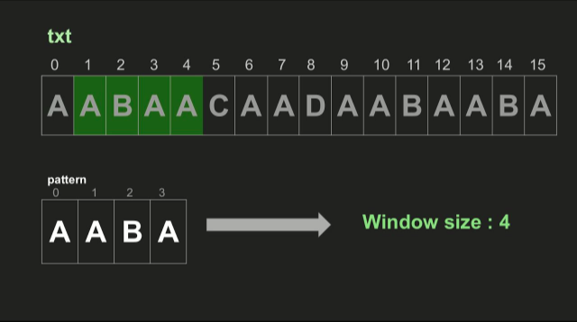
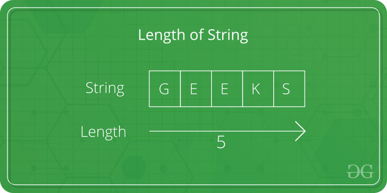
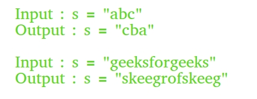
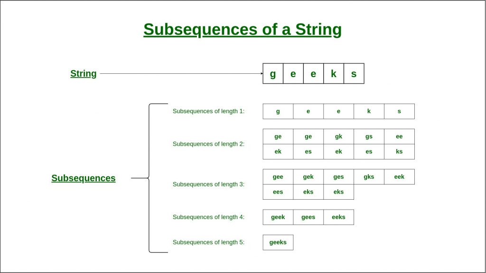
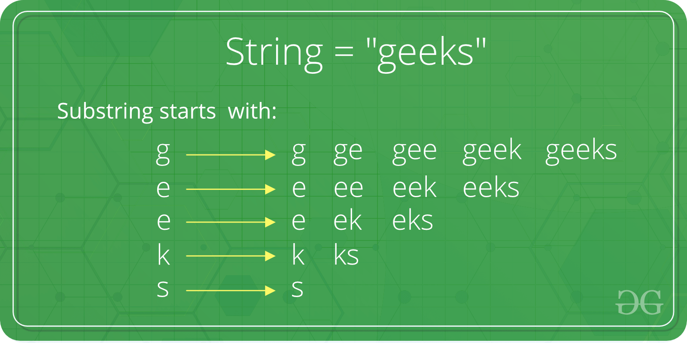
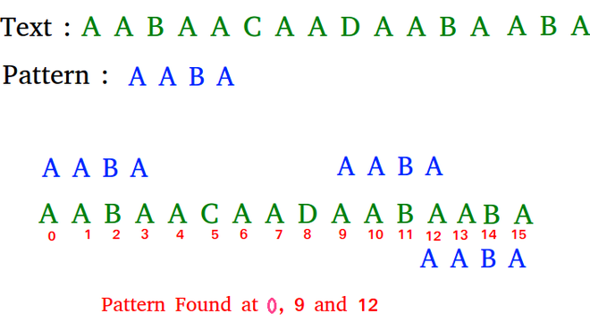
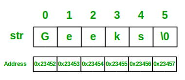

### String in Data Structure

- **String - bu belgilar ketma-ketligi.**

  - Kichik elementlar to'plami. Oddiy massivdan farqli o'laroq, satrlar odatda kichikroq elementlar to'plamiga ega. Masalan, kichik ingliz alifbosi faqat 26 ta belgidan iborat. ASCII faqat 256 ta belgidan iborat.
  - Java, Python, JavaScript va C# kabi dasturlash tillarida satrlar o'zgarmasdir.
  - Ko'pgina string muammolari belgilar to'plamining o'lchami kichik bo'lganligi sababli optimallashtirilishi mumkin. Masalan, saralash tezroq amalga oshirilishi mumkin, elementlarning chastotalarini hisoblash tezroq va ko'plab qiziqarli intervyu savollari bunga asoslanadi.

<p align="center">

</p>

- **1. Concatenation of Strings**
  - Bir nechta satrlarni birlashtirish jarayoni Konkatenatsiya deb nomlanadi. String Concatenation - bu ikki qatorni birlashtirish texnikasi.

> Example Concatenation of Strings in JavaScript

```js
let str1 = "Geeks";
let str2 = "For";
let str3 = "Geeks";

// Concating all the strings together without spaces
let result1 = str1.concat(str2, str3);
console.log("Result without spaces: " + result1); // Result without spaces: GeeksForGeeks

// Concating all the strings together with spaces
let result2 = str1.concat(" ", str2, " ", str3);
console.log("Result with spaces: " + result2); // Result with spaces: Geeks For Geeks
```

- **2. Find in String**
  - Stringlarda bajariladigan juda oddiy operatsiya berilgan butun satrda biror narsani topishdir. Endi bu satrda berilgan belgini topish yoki boshqa satrda to'liq satrni topish uchun bo'lishi mumkin.

<p align="center">

</p>

- **3. Replace in String**

  - Ko'pincha satrlarda tuzatishlar kiritish juda muhimdir. Stringdagi belgi, so'z yoki iborani almashtirish - Stringlarda bajariladigan yana bir keng tarqalgan operatsiya.

- **4. Finding the Length of String**
  - Stringdagi eng umumiy amallardan biri berilgan satrning uzunligini/o‘lchamini topishdir. Uzunlik satrdagi belgilar soni sifatida aniqlanadi, bu satrning uzunligi deb ataladi.

<p align="center">

</p>

```js
let s1 = "gfg";
console.log(s1.length); // 3

let s2 = "";
console.log(s2.length); // 0

let s3 = "#$%A";
console.log(s3.length); // 4

let a = ["js", "css", "html"];
a.length = 2; // Changes length of array
console.log(a);

let s = "geeksforgeeks";
s.length = 3; // Has no effect on string
console.log(s);
```

- **5. Trim a String**
  - Bo'shliqlar yoki maxsus belgilar Strings-da juda keng tarqalgan. Shunday qilib, String-da bunday belgilarni qanday kesish kerakligini bilish muhimdir.

> Remove spaces from a given string

```js
// An efficient JavaScript program to remove all
// spaces from a string

// Function to remove all spaces
// from a given string
function removeSpaces(str) {
  // To keep track of non-space
  // character count
  var count = 0;

  // Traverse the given string. If current
  // character is not space, then place
  // it at index 'count++'
  for (var i = 0; i < str.length; i++)
    if (str[i] !== " ") str[count++] = str[i];
  // here count is
  // incremented

  return count;
}

// Driver code
var str = "g eeks for ge eeks ".split("");
var i = removeSpaces(str);
document.write(str.join("").substring(0, i));

// Output => geeksforgeeeks
// Time complexity of above solution is O(n) and it does only one traversal of string.
// Auxiliary Space: O(1)
```

```js
// javascript program to remove
// all spaces from a string
// Function to remove all
// spaces from a given string
function removeSpace(str) {
  str = str.replace(/\s/g, "");
  return str;
}

// Driver Code
var str = "g eeks for ge eeks ";
document.write(removeSpace(str));

// This code contributed by aashish1995
// Output => geeksforgeeeks
```

```js
// JavaScript program for the above approach

let s = "g e e k s f o r g e e k s";
console.log("string with spaces is " + s);

let l = s.length; // storing the length of the string

let c = s.split(" ").length - 1; // counting the number of whitespaces

s = s.replace(/\s/g, ""); // removing all the whitespaces

s = s.substring(0, l - c); // resizing the string to l-c

console.log("string without spaces is " + s);

// Output :
// string with spaces is g e e k s f o r g e e k s
// string without spaces is geeksforgeeks
// Time Complexity : O(N), N is length of given string.
```

- **6. Reverse and Rotation of a String**
  - Teskari operatsiya satr belgilarining o'rnini shunday almashtirishdan iboratki, birinchisi oxirgi, ikkinchisi ikkinchi oxirgi bo'ladi va hokazo.

> Rotations of a String:

<p align="center">

</p>

> Reverse a String:

<p align="center">

</p>

- **7. Subsequence of a String**
  - Qolgan elementlar tartibini oʻzgartirmasdan, nol yoki undan ortiq elementlarni olib tashlash orqali boshqa ketma-ketlikdan olinishi mumkin boʻlgan ketma-ketlik.

<p align="center">

</p>

- **8. Substring of a String**
  - Pastki satr - bu satrning qo'shni qismi, ya'ni boshqa satr ichidagi satr.

<p align="center">

</p>

- **9. Binary String**
  - Ikkilik satr - 0 va 1 kabi faqat ikki turdagi belgilardan tashkil topgan maxsus qatordir.

> Example

```js
Input: str = "01010101010"
Output: Yes, it is a Binary String
Input: str = "geeks101"
Output: No, it is not a Binary String
```

- **10. Palindrome String**
  - Agar ipning teskari tomoni ip bilan bir xil bo'lsa, ip palindrom deyiladi.

> Example

```js
“abba” is a palindrome, but “abbc” is not a palindrome.
```

- **11. Lexicographic Patterns**
  - Leksikografik naqsh ASCII qiymatiga asoslangan yoki lug'at tartibida aytilishi mumkin bo'lgan naqshdir. Biz belgilarning leksikografik tartibini ularning ASCII qiymatining tartibi deb hisoblaymiz. Demak, belgilarning leksikografik tartibi shunday bo'ladi

```js
‘A’, ‘B’, ‘C’, …, ‘Y’, ‘Z’, ‘a’, ‘b’, ‘c’, …, ‘y’, ‘z’.
```

- **12. Pattern Searching**
  - Naqsh qidirish - bu satrda berilgan naqshni qidirish. Bu stringning rivojlangan mavzusi. Pattern Searching algoritmlari ba'zan String Searching Algoritmlari deb ham ataladi va String algoritmlarining bir qismi sifatida qaraladi. Ushbu algoritmlar boshqa satr ichida satrni qidirishda foydalidir.

<p align="center">

</p>

### Applications, Advantages and Disadvantages of String

- String ma'lumotlar strukturasi dasturlash tillarining asosi va aloqaning qurilish bloklari hisoblanadi. String ma'lumotlar tuzilmalari kompyuter fanlari va dasturlashda eng fundamental va keng qo'llaniladigan vositalardan biridir. Ular matn va belgilar ketma-ketligini turli usullarda tasvirlash va manipulyatsiya qilish imkonini beradi. String ma'lumotlar strukturasi oddiy satrlardan tortib murakkab jumlalar, paragraflar va hatto butun kitoblargacha bo'lgan katta hajmdagi matn ma'lumotlarini saqlash va qayta ishlash uchun ishlatilishi mumkin bo'lgan kuchli vositadir.
- Bu matn yoki boshqa ma'lumotlar shakllarini ifodalovchi belgilar ketma-ketligi. Bu matnga asoslangan ma'lumotlarni saqlash va manipulyatsiya qilish uchun ko'plab dasturlash tillarida qo'llaniladigan asosiy ma'lumotlar tuzilmasi. Ko'pgina dasturlash tillarida satrlar belgilar massivi sifatida amalga oshiriladi, har bir belgi massiv ichida o'ziga xos indeks pozitsiyasiga ega.

<p align="center">

</p>

- **Applications of String:**

  - **Plagiarism Checker:** Stringlar kodlardagi plagiatni topish uchun ishlatilishi mumkin va string moslashuv algoritmlari yordamida juda oz vaqt ichida tarkibni topish mumkin. Buning yordamida kompyuter bizga kodning foizini osongina aytishi mumkin va har qanday ikki foydalanuvchi tomonidan yozilgan matn qancha foizga mos kelishini aytishi mumkin.
  - **Encoding/Decoding(Cipher Text Generation):** Satrlar ma'lumotlarni jo'natuvchidan qabul qiluvchiga xavfsiz uzatish uchun kodlash va dekodlash uchun ishlatilishi mumkin, chunki uzatish yo'lida hech kim sizning ma'lumotlaringizni o'qiy olmasligiga ishonch hosil qilish uchun ular faol va passiv hujumlarni amalga oshirishi mumkin. Siz xabar sifatida uzatayotgan matn jo'natuvchining oxirida shifrlanadi va qabul qiluvchining oxirida dekodlanadi.
  - **Information Retrieval:** String ilovalari bizga noma'lum ma'lumotlar manbalaridan (kirish sifatida ishlatiladigan katta ma'lumotlar to'plamlari) ma'lumotlarni olishda yordam beradi va qatorlarni moslashtirish/qidiruv moduli yordamida muhim ma'lumotlarni olishimizga yordam beradi.
  - **Improved Filters For The Approximate Suffix-Prefix Overlap Problem:** Strings va uning algoritmlari ilovalari Taxminan Suffiks-prefiksning o'zaro bog'liqligi muammosi uchun yaxshilangan Filtrlarni taqdim etishga yordam beradi. Taxminiy qo'shimcha-prefiksning o'zaro bog'liqligi muammosi berilgan to'plamdagi barcha juft qatorlarni topishdir, shunda bitta satrning prefiksi boshqasining qo'shimchasiga o'xshaydi.
  - **Network communication:** Stringlar HTTP so'rovlari va javoblari kabi tarmoqlar orqali yuborilgan ma'lumotlarni kodlash va dekodlash uchun ishlatiladi.
  - **File handling:** Satrlar fayl yo'llari va nomlarini boshqarish, fayllarni o'qish va yozish uchun ishlatiladi.
  - **Data analysis:** Strings tabiiy tilni qayta ishlash va hissiyotlarni tahlil qilish kabi katta hajmdagi matn ma'lumotlaridan mazmunli tushunchalarni olish uchun ishlatilishi mumkin.

- **Real-Time Application of String:**

  - **Spam Detection:** Stringlar spamni aniqlash tizimi sifatida xizmat qilish uchun ishlatilishi mumkin, chunki bu erda qatorlarni moslashtirish algoritmi tushunchasi qo'llaniladi. Spam (keraksiz elektron pochta) katta moliyaviy yo'qotishlarga olib kelishi mumkin. Barcha spam-filtrlar spamni aniqlash va yo'q qilish uchun qatorlarni moslashtirish tushunchasidan foydalanadi.
  - **Bioinformatics:** Stringlar bioinformatika (DNK ketma-ketligi) sohasida qo'llanilishi mumkin. String moslashuv moduli genetik ketma-ketliklar bilan bog'liq muammolarni yoki muammolarni hal qilish va DNKdagi naqshlarni topish uchun ishlatilishi mumkin.
  - **Intrusion Detection System:** Stringlar bosqinlarni aniqlash tizimlarida ishlatilishi mumkin. Intrusion bilan bog'liq kalit so'zlarni o'z ichiga olgan paketlar qatorlarni moslashtirish algoritmlarini qo'llash orqali topiladi.
  - **Search Engines:** Satrlar ko'plab qidiruv tizimlarida ishlatilishi mumkin. Ma'lumotlarning aksariyati Internetda matnli ma'lumotlar shaklida mavjud. Ko'p sonli turkumlanmagan matn ma'lumotlari tufayli ma'lum bir tarkibni qidirish juda qiyin bo'ladi. Veb-qidiruv tizimlari ma'lumotlarni tartibga soladi va ma'lumotlar qatorini tasniflash uchun mos keladigan algoritmlardan foydalaniladi.

- **Operations on String:**
  String foydalanuvchilarga turli operatsiyalarni taqdim etadi. Muhimlaridan ba'zilari:

  - **size():** Bu funksiya satr uzunligini topish uchun ishlatiladi.
  - **substr():** Bu ma'lum bir indeksdan boshlab ma'lum uzunlikdagi pastki qatorni topish uchun ishlatiladi.
  - **+:** Bu operator ikki qatorni birlashtirish uchun ishlatiladi.
  - **s1.compare(s2):** Bu ikkita s1 va s2 qatorlarni solishtirib, qaysi biri leksikografik jihatdan kattaroq va qaysi biri kichikroq ekanligini aniqlash uchun ishlatiladi.
  - **reverse():** Bu funksiya berilgan qatorni teskari aylantirish uchun ishlatiladi.
  - **sort():** Bu funksiya qatorni leksikografik tartibda saralash uchun ishlatiladi.

- **Advantages of String:**

  - **Text Processing:** Matnni dasturlash tillarida ifodalash uchun satrlardan foydalaniladi. Ular matnni qidirish, almashtirish, tahlil qilish va formatlash kabi turli usullarda manipulyatsiya qilish va qayta ishlash uchun ishlatilishi mumkin.
  - **Data Representation:** Satrlar raqamlar, sanalar va vaqtlar kabi boshqa ma'lumotlar turlarini ko'rsatish uchun ishlatilishi mumkin. Masalan, “YYYY-MM-DD” formatidagi sanani yoki “HH:MM:SS” formatidagi vaqtni ko'rsatish uchun satrdan foydalanishingiz mumkin.
  - **Ease of Use:** Stringlarni ishlatish va manipulyatsiya qilish oson. Ular boshqa narsalar qatorida birlashtirilishi, kesilishi va teskari bo'lishi mumkin. Ular, shuningdek, oddiy va intuitiv sintaksisga ega bo'lib, ularni barcha mahorat darajasidagi dasturchilar uchun ochiq qiladi.
  - **Compatibility:** Stringlar dasturlash tillarida keng qo'llaniladi va ularni universal ma'lumotlar turiga aylantiradi. Bu shuni anglatadiki, strings turli tizimlar va platformalar o'rtasida osongina uzatilishi mumkin, bu ularni aloqa va ma'lumotlarni almashishning ishonchli va samarali usuliga aylantiradi.
  - **Memory Efficiency:** Satrlar odatda qo'shni xotira blokida saqlanadi, bu ularni ajratish va ajratish uchun samarali qiladi. Bu shuni anglatadiki, ular juda ko'p xotirani egallamasdan katta hajmdagi ma'lumotlarni ifodalash uchun ishlatilishi mumkin.

- **Disadvantages of String:**
  - **Memory Consumption:** Stringlar, ayniqsa, katta satrlar yoki ko'p satrlar bilan ishlashda juda ko'p xotirani iste'mol qilishi mumkin. Bu ichki tizimlar yoki mobil qurilmalar kabi xotira cheklangan muhitlarda muammo bo'lishi mumkin.
  - **Immutability:** Ko'pgina dasturlash tillarida satrlar o'zgarmasdir, ya'ni ularni yaratilgandan keyin o'zgartirib bo'lmaydi. Tez-tez o'zgartirishni talab qiladigan katta yoki murakkab satrlar bilan ishlashda bu kamchilik bo'lishi mumkin, chunki bu samarasizlik va xotira yukiga olib kelishi mumkin.
  - **Performance Overhead:** String operatsiyalari boshqa ma'lumotlar turlaridagi operatsiyalarga qaraganda sekinroq bo'lishi mumkin, ayniqsa katta yoki murakkab satrlar bilan ishlashda. Buning sababi shundaki, string operatsiyalari ko'pincha xotiradan nusxa ko'chirish va qayta taqsimlashni o'z ichiga oladi, bu ko'p vaqt talab qilishi mumkin.
  - **Encoding and Decoding Overhead:** Satrlar turli xil belgilar kodlashlariga ega bo'lishi mumkin, bu ular o'rtasida konvertatsiya qilishda ortiqcha yuklarga olib kelishi mumkin. Bu turli manbalardan olingan ma'lumotlar bilan ishlashda yoki turli xil kodlashlardan foydalanadigan tizimlar bilan aloqa qilishda muammo bo'lishi mumkin.
  - **Security Vulnerabilities:** Satrlar to'g'ri ishlanmasa, bufer to'lib ketishi yoki in'ektsiya hujumlari kabi xavfsizlik zaifliklariga qarshi zaif bo'lishi mumkin. Buning sababi shundaki, satrlar tajovuzkorlar tomonidan o'zboshimchalik bilan kodni bajarish yoki nozik ma'lumotlarga kirish uchun manipulyatsiya qilinishi mumkin.
