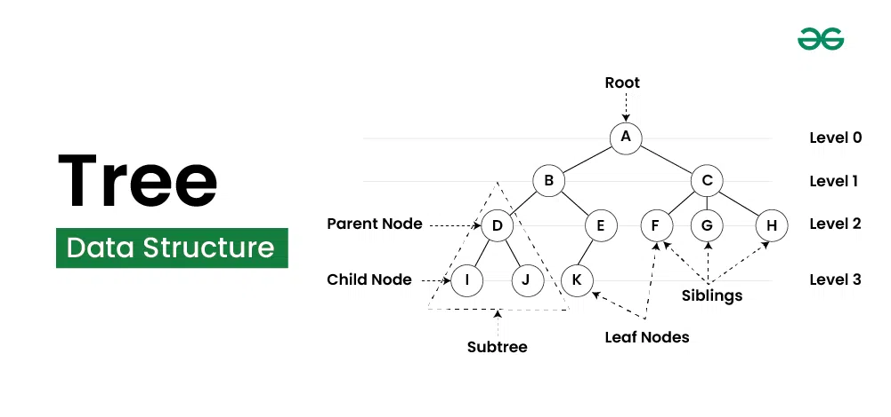
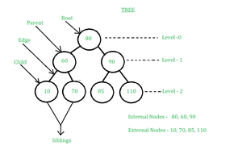
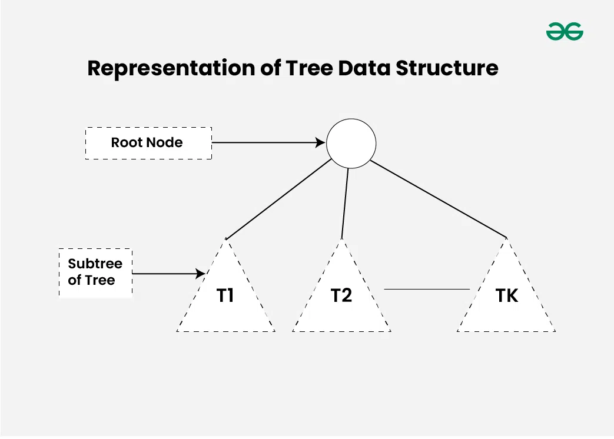
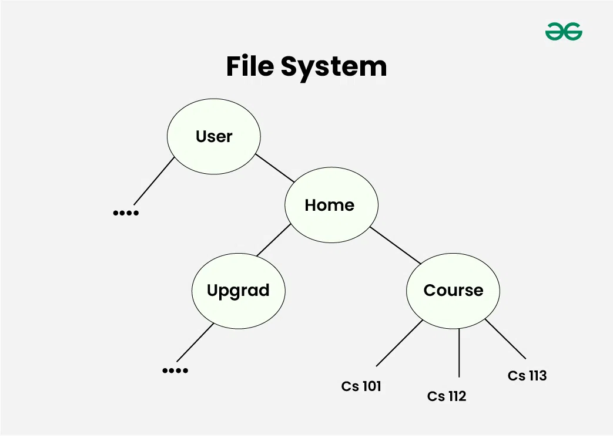

### Tree Data Structure

Tree Data Structure - bu chiziqli bo'lmagan ma'lumotlar strukturasi bo'lib, unda tugunlar deb nomlanuvchi elementlar to'plami bir-biriga qirralar orqali ulanadi, shunda har qanday ikkita tugun o'rtasida aynan bitta yo'l mavjud.

<p align="center">

</p>

**Tree**dagi ma'lumotlar ketma-ket saqlanmaydi, ya'ni ular chiziqli saqlanmaydi. Buning o'rniga, ular bir necha darajalarda joylashtirilgan yoki biz buni ierarxik tuzilma deb aytishimiz mumkin. Shu sababli, **Tree** chiziqli bo'lmagan ma'lumotlar strukturasi hisoblanadi.

- **Tree Data Structure asosiy terminlar:**
  - **Parent Node:** Tugunning bevosita o'tmishdoshi bo'lgan tugunga ushbu tugunning asosiy tugunlari deyiladi. {B} {D, E} ning asosiy tugunidir.
  - **Child Node:** Tugunning bevosita vorisi bo'lgan tugunga ushbu tugunning tugunlari deyiladi. Misollar: {D, E} {B} ning asosiy tugunlari.
  - **Root Node:** Daraxtning eng yuqori tuguniga yoki ota-ona tuguniga ega bo'lmagan tugunga ildiz tugunlari deyiladi. {A} - daraxtning ildiz tugunidir. Bo'sh bo'lmagan daraxtda aynan bitta ildiz tugunini va ildizdan daraxtning barcha boshqa tugunlarigacha bo'lgan aniq bir yo'l bo'lishi kerak.
  - **Leaf Node or External Node:** Tugun tugunlari bo'lmagan tugunlarga barg tugunlari deyiladi. {I, J, K, F, G, H} - daraxtning barg tugunlari.
  - **Ancestor of a Node:** Ildizning ushbu tugunga boradigan yo'lidagi har qanday oldingi tugunlar ushbu tugunning ajdodlari deb ataladi. {A,B} - {E} tugunining ajdod tugunlari
  - **Descendant:** x tugun boshqa y tugunining avlodidir, agar y x ning ajdodi bo'lsa.
  - **Sibling:** Bir ota-ona tugunining bolalari aka-uka deb ataladi. {D,E} aka-uka deb ataladi.
  - **Level of a node:** Ildiz tugunidan yo'lda qirralarning soni o'sha tugunga. Ildiz tugun 0 darajasiga ega.
  - **Internal node:** Kamida bitta bolali tugun ichki tugun deb ataladi.
  - **Neighbour of a Node:** Ushbu tugunning ota-ona yoki kichik tugunlari ushbu tugunning qo'shnilari deb ataladi.
  - **Subtree:** Tree ning har qanday tugunlari va uning avlodi.

<p align="center">

</p>

**Tree ma'lumotlar tuzilmasini ifodalash:**

Daraxt ildiz tugunidan va T<sub>1</sub>, T<sub>2</sub>, …, Tk nol yoki undan ortiq pastki daraxtlardan iborat bo'lib, shundayki, daraxtning ildiz tugunidan har bir pastki daraxtning ildiz tuguniga qadar chekka bo'ladi. X tugunning pastki daraxti X tuguniga ajdod tugun sifatida ega bo'lgan barcha tugunlardan iborat.

<p align="center">

</p>

Representation of a Node in Tree Data Structure:

```js
class Node {
  constructor(data) {
    this.data = data;
    this.children = [];
  }
}
```

**Tree ma'lumotlarining tuzilishi uchun ahamiyati:**

**Tree**lardan foydalanishning sabablaridan biri tabiiy ravishda ierarxiyani tashkil etuvchi ma'lumotlarni saqlashni xohlashingiz bo'lishi mumkin. Masalan, kompyuterdagi fayl tizimi: HTML-sahifaning DOM modeli ham daraxt bo'lib, bizda ildiz sifatida html tegi, bosh va uning bolalari va bu teglar, keyin esa o'z **children**lari bo'ladi.

**Tree ma'lumotlar tuzilmalarining turlari:**

- **Binary Tree:** Binary tree da har bir tugun unga bog'langan eng ko'p ikkita bolaga ega bo'lishi mumkin. Binary tree larning ba'zi keng tarqalgan turlariga to'liq binary tree lar, to'liq binary tree lar, muvozanatli binary tree lar va degeneratsiyalangan yoki patologik binar tree lar kiradi. Binary tree ga misollar: **Binary Search Tree** va **Binary Heap**.
- **Ternary Tree:** Ternary Tree - bu tree ma'lumotlar tuzilmasi bo'lib, unda har bir tugun ko'pi bilan uchta tugunga ega bo'lib, odatda "left", "mid" va "right" deb ajratiladi.
- **N-ary Tree or Generic Tree:** Generic tree lar tugunlar to'plami bo'lib, har bir tugun yozuvlar va uning bolalariga havolalar ro'yxatidan iborat bo'lgan ma'lumotlar tuzilmasi (ikki nusxadagi havolalarga ruxsat berilmaydi). Bog'langan ro'yxatdan farqli o'laroq, har bir tugun bir nechta tugunlarning manzilini saqlaydi.

Types of Trees in Data Structure based on the number of children:

<p align="center">

</p>

- **Tree ma'lumotlar strukturasining asosiy operatsiyalari:**
  - Create – create a tree in the data structure.
  - Insert − Inserts data in a tree.
  - Search − Searches specific data in a tree to check whether it is present or not.
  - Traversal:
    - Depth-First-Search Traversal
    - Breadth-First-Search Traversal

Tree ma'lumotlar strukturasini amalga oshirish:

```js
// Number of nodes
let N = 7,
  Root = 1;

// Adjacency list to store the tree
let adj = new Array(N + 1).fill(null).map(() => []);

// Creating the tree
addEdge(1, 2, adj);
addEdge(1, 3, adj);
addEdge(1, 4, adj);
addEdge(2, 5, adj);
addEdge(2, 6, adj);
addEdge(4, 7, adj);

// Function to add an edge between vertices x and y
function addEdge(x, y, arr) {
  arr[x].push(y);
  arr[y].push(x);
}

// Function to print the parent of each node
function printParents(node, arr, parent) {
  // current node is Root, thus, has no parent
  if (parent == 0) console.log(`${node}->Root`);
  else console.log(`${node}->${parent}`);

  // Using DFS
  for (let cur of arr[node]) if (cur != parent) printParents(cur, arr, node);
}

// Function to print the children of each node
function printChildren(Root, arr) {
  // Queue for the BFS
  let q = [];

  // pushing the root
  q.push(Root);

  // visit array to keep track of nodes that have been
  // visited
  let vis = new Array(arr.length).fill(0);
  // BFS
  while (q.length > 0) {
    let node = q.shift();
    vis[node] = 1;
    console.log(`${node}-> `);
    for (let cur of arr[node])
      if (vis[cur] == 0) {
        console.log(cur + " ");
        q.push(cur);
      }
    console.log("\n");
  }
}

// Function to print the leaf nodes
function printLeafNodes(Root, arr) {
  // Leaf nodes have only one edge and are not the root
  for (let i = 1; i < arr.length; i++)
    if (arr[i].length == 1 && i != Root) console.log(i + " ");
  console.log("\n");
}

// Function to print the degrees of each node
function printDegrees(Root, arr) {
  for (let i = 1; i < arr.length; i++) {
    console.log(`${i}: `);

    // Root has no parent, thus, its degree is equal to
    // the edges it is connected to
    if (i == Root) console.log(arr[i].length + "\n");
    else console.log(arr[i].length - 1 + "\n");
  }
}

// Driver code
// Printing the parents of each node
console.log("The parents of each node are:");
printParents(Root, adj, 0);

// Printing the children of each node
console.log("The children of each node are:");
printChildren(Root, adj);

// Printing the leaf nodes in the tree
console.log("The leaf nodes of the tree are:");
printLeafNodes(Root, adj);

// Printing the degrees of each node
console.log("The degrees of each node are:");
printDegrees(Root, adj);

// This code is contributed by ruchikabaslas.
```

Output:

```
The parents of each node are:
1->Root
2->1
5->2
6->2
3->1
4->1
7->4
The children of each node are:
1-> 2 3 4
2-> 5 6
3->
4-> 7
5->
6->
7->
The leaf nodes of the tree are:
3 5 6 7
The degrees o...
```

**Tree ma'lumotlar strukturasining xususiyatlari:**

- **Number of edges:** chekka ikkita tugun orasidagi bog'lanish sifatida belgilanishi mumkin. Agar daraxtda N ta tugun bo'lsa, u (N-1) qirralarga ega bo'ladi. Har bir tugundan daraxtning boshqa tuguniga faqat bitta yo'l bor.
- **Depth of a node:** Tugunning chuqurligi ildizdan shu tugungacha bo'lgan yo'lning uzunligi sifatida aniqlanadi. Har bir chekka yo'lga 1 birlik uzunlik qo'shadi. Shunday qilib, uni daraxtning ildizidan tugungacha bo'lgan yo'ldagi qirralarning soni sifatida ham aniqlash mumkin.
- **Height of a node:** Tugunning balandligi tugundan daraxtning barg tuguniga qadar bo'lgan eng uzun yo'lning uzunligi sifatida aniqlanishi mumkin.
- **Height of the Tree:** Tree ning balandligi - daraxtning ildizidan daraxtning barg tuguniga qadar bo'lgan eng uzun yo'lning uzunligi.
- **Degree of a Node:** Ushbu tugunga biriktirilgan pastki daraxtlarning umumiy soni tugun darajasi deb ataladi. Barg tugunining darajasi 0 bo'lishi kerak. Treening darajasi tree dagi barcha tugunlar orasidagi tugunning maksimal darajasidir.

**Tree data structure ning ilovalari**

Tree - bu **nodes** deb ataladigan ma'lumotlar elementlari orasidagi **hierarchical relationship**larni ifodalovchi ma'lumotlar strukturasining bir turi. Tree ning yuqori node niga root deyiladi, root ostidagi elementlar esa node lar deb ataladi. Har bir node ning o'ziga xos bir yoki bir nechta tugunlari bo'lishi mumkin, ular tarmoqli tuzilmani tashkil qiladi. Tree ning pastki qismidagi, hech qanday child nodes bo'lmagan node larga leaf node lari deyiladi.

<p align="center">

</p>

**Tree ma'lumotlar strukturasidan foydalanish:**

<p align="center">

</p>

Linear ma'lumotlar tuzilmalari bo'lgan Array va Linked List dan farqli o'laroq, tree hierarchical (or non-linear) ma'lumotlar strukturasidir.

- **Hierarchical Structure:** One reason to use trees might be because you want to store information that naturally forms a hierarchy. For example, the file system on a computer: The DOM model of an HTML page is also tree where we have html tag as root, head and body its children and these tags, then have their own children. DNS System is also example where we have natural hierarchy.
- **Searching Efficiency:** Trees provide an efficient way to search for data. For example, in a binary search tree, searching for a value takes time proportional to the logarithm of the number of elements, which is much faster than searching in a linear data structure like an array or a linked list.
- **Sorting:** Trees can be used to sort data efficiently. For example, in a self-balancing binary search tree, the data is automatically sorted as it is inserted into the tree, making it easy to find the minimum, maximum, and other values in the tree.
- **Dynamic Data:** Trees are dynamic data structures, which means that they can grow and shrink as needed. This makes them well-suited for applications where the data changes frequently, such as in real-time systems.
- **Efficient Insertion and Deletion:** Trees provide efficient algorithms for inserting and deleting data, which is important in many applications where data needs to be added or removed frequently.
- **Easy to Implement:** Trees are relatively easy to implement, especially when compared to other data structures like graphs. This makes them a popular choice for many programming projects.

**Tree Data Structure boshqa ilovalari:**

1. Store hierarchical data, like folder structure, organization structure, XML/HTML data.
2. Binary Search Tree is a tree that allows fast search, insert, delete on a sorted data. It also allows finding closest item
3. Heap is a tree data structure which is implemented using arrays and used to implement priority queues.
4. B-Tree and B+ Tree : They are used to implement indexing in databases.
5. Syntax Tree: Scanning, parsing , generation of code and evaluation of arithmetic expressions in Compiler design.
6. K-D Tree: A space partitioning tree used to organize points in K dimensional space.
7. Trie : Used to implement dictionaries with prefix lookup.
8. Suffix Tree : For quick pattern searching in a fixed text.
9. Spanning Trees and shortest path trees are used in routers and bridges respectively in computer networks
10. As a workflow for compositing digital images for visual effects.
11. Decision trees.
12. Organization chart of a large organization.
13. In XML parser.
14. Machine learning algorithm.
15. For indexing in database.
16. IN server like DNS (Domain Name Server)
17. In Computer Graphics.
18. To evaluate an expression.
19. In chess game to store defense moves of player.
20. In java virtual machine.
21. Tree data structures are used to organize and manage files and directories in a file system. Each file and directory is represented as a node in the tree, with parent-child relationships indicating the hierarchical structure of the file system.
22. Tree data structures are often used in parsing, such as in compilers and interpreters, to represent the structure of a program or a document.
23. Tree data structures, such as binary search trees, are commonly used to implement efficient searching and sorting algorithms.
24. Graphics and UI design
25. Tree data structures are commonly used in decision-making algorithms in artificial intelligence, such as game-playing algorithms, expert systems, and decision trees.
26. Tree data structures can be used to represent the topology of a network and to calculate routing tables for efficient data transmission.

**Tree ning afzalliklari va kamchiliklari**

**Tree ning afzalliklari:**

- Efficient searching: Trees are particularly efficient for searching and retrieving data. The time complexity of searching in a tree is O(log n) in AVL and Red Black Trees. This is better than arrays and linked list but not as good as hashing, but the advantages the these trees provide are sorted data, search for floor and ceiling of data.
- Fast insertion and deletion: Inserting and deleting nodes in a self balancing binary search trees like AVL and Red Black can be done in O(log n) time. This is again better than arrays and linked list not as good as hashing, but the advantages the these trees provide are sorted data, search for floor and ceiling of data.
- Trees provide a hierarchical representation of data, making it easy to organize and navigate large amounts of information.
- The recursive nature of trees makes them easy to traverse and manipulate using recursive algorithms.
- Natural organization: Trees have a natural hierarchical organization that can be used to represent many types of relationships. This makes them particularly useful for representing things like file systems, organizational structures, and taxonomies.
- Flexible size: Unlike Arrays, trees can easily grow or shrink dynamically depending on the number of nodes that are added or removed. This makes them particularly useful for applications where the data size may change over time.

**Tree ning kamchiliklari:**

- **Memory overhead:** Trees can require a significant amount of memory to store, especially if they are very large. This can be a problem for applications that have limited memory resources.
- **Imbalanced trees:** If a tree is not balanced, it can result in uneven search times. This can be a problem in applications where speed is critical.
- **Complexity:** Unlike Arrays and Linked Lists, Trees can be complex data structures, and they can be difficult to understand and implement correctly. This can be a problem for developers who are not familiar with them.
- **Search, Insert and Delete Times:** If a problem requires only search, insert and delete, not other operations like sorted data traversal, floor, and ceiling, Hash Tables always beat Self Balancing Binary Search Trees.
- The implementation and **manipulation of trees can be complex** and require a good understanding of the algorithms.
