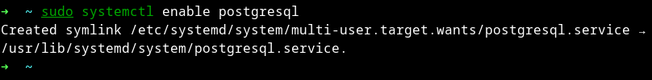

# PostgreSQL on Arch-based Linux Distributions (Manjaro)

### Installation of PostgreSQL

**Step 1:** Install **postgresql** Official Repository

**Step 2:** Install pgAdmin4-desktop

```shell
yay -S pgadmin4-desktop
```

**Step 3:** Check version

```shell
postgres --version
```

```shell
postgres -V
```

**Step 4:** Start the PostgreSQL server by using systemctl command

```shell
sudo systemctl start postgresql
```

```shell
sudo systemctl status postgresql
```

<p align="center">

</p>

**Step 5:** Once again use systemctl command to enable PostgreSQL. PostgreSQL will restart whenever your machine boots up.

```shell
sudo systemctl enable postgresql
```

<p align="center">

</p>

### PostgreSQL - psql command-line interface with the default user ‘postgres’

```shell
sudo -u postgres psql
```

<p align="center">

</p>

**Create a new database with the following command**

```sql
postgres=# CREATE DATABASE <db_name>;
```

```sql
postgres=# CREATE DATABASE new_db;
CREATE DATABASE
postgres=#
```

**List available databases**

```sql
postgres=# \l
```

<p align="center">

</p>

**Switch connection to a new database**

```sql
postgres=# \c <db_name>;
```

```sql
postgres=# \c new_db;
You are now connected to database "new_db" as user "postgres".
new_db=#
```

**Delete database**

```sql
postgres=# DROP DATABASE <db_name>;
```

```sql
postgres=# DROP DATABASE new_db;
DROP DATABASE
postgres=#
```

**Create table**

```sql
CREATE TABLE <table_name> (
  column_name data_type
);
```

```sql
CREATE TABLE users (
  id INT,
  name VARCHAR(60),
  email VARCHAR(60),
  birthday TIMESTAMP,
);
```

<p align="center">

</p>

```sql
CREATE TABLE users (
  id BIGSERIAL NOT NULL PRIMARY KEY,
  name VARCHAR(60) NOT NULL,
  email VARCHAR(60) NOT NULL,
  birthday DATE NOT NULL,
);
```

<p align="center">

</p>

```sql
DROP TABLE table_name;
```

**INSERT — create new rows in a table**

```sql
INSERT INTO <table_name> () VALUES ();
```

```sql
INSERT INTO users (
  id,
  name,
  email,
  birthday);
VALUES ('Alex', 'alex@mail.com', DATE '1977-01-01');
```

<p align="center">

</p>

**SELECT, TABLE, WITH — retrieve rows from a table or view**

```sql
SELECT * FROM <table_name>;
```

> Example

```sql
SELECT * FROM users;
```

```sql
SELECT <column_name> FROM <table_name>;
```

> Example

```sql
SELECT country FROM users;
```

> The ORDER BY clause causes the result rows to be sorted according to the specified expression.

```sql
SELECT * FROM <table_name> ORDER BY <column_name>;
```

> Example

```sql
SELECT * FROM users ORDER BY country;
```

> Optionally one can add the key word ASC (ascending) or DESC (descending) after any expression in
> the ORDER BY clause. If not specified, ASC is assumed by default.

```sql
SELECT * FROM <table_name> ORDER BY <column_name> DESC;
```

> Example

```sql
SELECT * FROM users ORDER BY country DESC;
```

> SELECT DISTINCT is specified, all duplicate rows are removed from the result set.

```sql
SELECT DISTINCT <column_name> FROM <table_name> ORDER BY <column_name> DESC;
```

> Example

```sql
SELECT DISTINCT country FROM users ORDER BY country DESC;
```

> Where condition is any expression that evaluates to a result of type boolean.

```sql
SELECT * FROM <table_name> WHERE condition;
```

> Example

```sql
SELECT * FROM users WHERE gender="Male";
```

> AND condition requires that all of the conditions (ie: condition1, condition2, condition_n) must be met for the record to be included in the result set.

```sql
SELECT * FROM <table_name> WHERE condition1 AND condition2 ... AND condition_n;
```

> Example

```sql
SELECT * FROM users WHERE gender="Male" AND country="China";
```

> OR condition requires that all of the conditions (ie: condition1, condition2, condition_n) must be met for the record to be included in the result set.

```sql
SELECT * FROM <table_name> WHERE condition1 OR condition2 ... OR condition_n;
```

> Example

```sql
SELECT * FROM users WHERE gender="Male" OR country="China";
```

```sql
SELECT * FROM users WHERE gender="Male" AND country="China" OR country="Russia";
```

```sql
SELECT * FROM users WHERE gender="Male" AND country="China" OR country="Russia" AND first_name="Jess";
```

> LIMIT - The parameter count specifies the maximum number of rows to return, while start specifies the
> number of rows to skip before starting to return rows.

```sql
SELECT * FROM <table_name> LIMIT { count | ALL };
```

> Example

```sql
SELECT * FROM users LIMIT 10;
```

> OFFSET

```sql
SELECT * FROM <table_name> OFFSET start;
```

> Example

```sql
SELECT * FROM users OFFSET 10 LIMIT 10;
```

> FETCH — retrieve rows from a query using a cursor.

```sql
SELECT * FROM <table_name> OFFSET start FETCH [ direction ] [ FROM | IN ] cursor_name;
```

> Example

```sql
SELECT * FROM users OFFSET 10 FETCH FIRST 10 ROW ONLY;
```

```sql
SELECT * FROM users WHERE country IN ("Mexico", "Brazil", "Poland");
SELECT * FROM users WHERE country IN ("Mexico", "Brazil", "Poland", "USA") ORDER BY country;
```

> BETWEEN condition will return the records where expression is within the range of value1 and value2 (inclusive).

```sql
SELECT * FROM <table_name> WHERE <column_name> BETWEEN value1 AND value2;
```

> Example

```sql
SELECT * FROM users WHERE date_of_birth BETWEEN DATE '2020-01-01' AND '2022-01-01';
```

> LIKE - A character expression that contains pattern matching. The patterns that you can choose from are:

- **%** Allows you to match any string of any length (including zero length)
- **\_** Allows you to match on a single character

```sql
SELECT * FROM <table_name> WHERE <column_name> LIKE pattern [ ESCAPE 'escape_character' ];
```

> Example

```sql
SELECT * FROM users WHERE email LIKE '%.com';
```

```sql
SELECT * FROM users WHERE email ILIKE '%.uk';
```

> GROUP BY will condense into a single row all selected rows that share the same values for the grouped
> expressions.

```sql
SELECT <column_name> FROM <table_name> GROUP BY [ ALL | DISTINCT ] grouping_element [, ...];
```

> Example

```sql
SELECT country FROM users GROUP BY country;
SELECT country, COUNT(*) FROM users GROUP BY country;
SELECT country, COUNT(*) FROM users GROUP BY country ORDER BY country;
SELECT country, COUNT(*) FROM users GROUP BY country HAVING COUNT(*) > 5 ORDER BY country;

```

> Example HAVING
> HAVING condition
> where condition is the same as specified for the WHERE clause.

```sql
SELECT country, COUNT(*) FROM users GROUP BY country HAVING COUNT(*) > 5 ORDER BY country;

```
