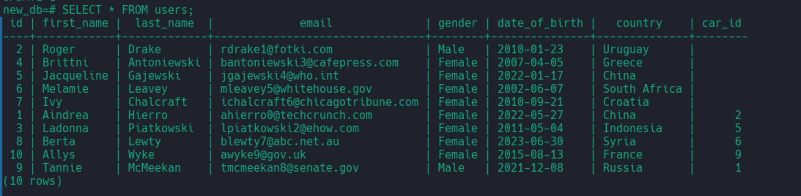

# PostgreSQL on Arch-based Linux Distributions (Manjaro)

### Installation of PostgreSQL

**Step 1:** Install **postgresql** Official Repository

**Step 2:** Install pgAdmin4-desktop

```shell
yay -S pgadmin4-desktop
```

**Step 3:** Check version

```shell
postgres --version
```

```shell
postgres -V
```

**Step 4:** Start the PostgreSQL server by using systemctl command

```shell
sudo systemctl start postgresql
```

```shell
sudo systemctl status postgresql
```

<p align="center">

</p>

**Step 5:** Once again use systemctl command to enable PostgreSQL. PostgreSQL will restart whenever your machine boots up.

```shell
sudo systemctl enable postgresql
```

<p align="center">

</p>

### PostgreSQL - psql command-line interface with the default user ‘postgres’

```shell
sudo -u postgres psql
```

<p align="center">

</p>

> postgres help

<p align="center">

</p>

**Create a new database with the following command**

```sql
postgres=# CREATE DATABASE <db_name>;
```

```sql
postgres=# CREATE DATABASE new_db;
CREATE DATABASE
postgres=#
```

**List available databases**

```sql
postgres=# \l
```

<p align="center">

</p>

**Switch connection to a new database**

```sql
postgres=# \c <db_name>;
```

```sql
postgres=# \c new_db;
You are now connected to database "new_db" as user "postgres".
new_db=#
```

**Delete database**

```sql
postgres=# DROP DATABASE <db_name>;
```

```sql
postgres=# DROP DATABASE new_db;
DROP DATABASE
postgres=#
```

**Create table**

```sql
CREATE TABLE <table_name> (
  column_name data_type
);
```

```sql
CREATE TABLE users (
  id INT,
  name VARCHAR(60),
  email VARCHAR(60),
  birthday TIMESTAMP,
);
```

<p align="center">

</p>

```sql
CREATE TABLE users (
  id BIGSERIAL NOT NULL PRIMARY KEY,
  name VARCHAR(60) NOT NULL,
  email VARCHAR(60) NOT NULL,
  birthday DATE NOT NULL,
);
```

<p align="center">

</p>

```sql
DROP TABLE table_name;
```

**INSERT — create new rows in a table**

```sql
INSERT INTO <table_name> () VALUES ();
```

```sql
INSERT INTO users (
  id,
  name,
  email,
  birthday);
VALUES ('Alex', 'alex@mail.com', DATE '1977-01-01');
```

<p align="center">

</p>

**SELECT, TABLE, WITH — retrieve rows from a table or view**

```sql
SELECT * FROM <table_name>;
```

> Example

```sql
SELECT * FROM users;
```

```sql
SELECT <column_name> FROM <table_name>;
```

> Example

```sql
SELECT country FROM users;
```

> The ORDER BY clause causes the result rows to be sorted according to the specified expression.

```sql
SELECT * FROM <table_name> ORDER BY <column_name>;
```

> Example

```sql
SELECT * FROM users ORDER BY country;
```

> Optionally one can add the key word ASC (ascending) or DESC (descending) after any expression in
> the ORDER BY clause. If not specified, ASC is assumed by default.

```sql
SELECT * FROM <table_name> ORDER BY <column_name> DESC;
```

> Example

```sql
SELECT * FROM users ORDER BY country DESC;
```

> SELECT DISTINCT is specified, all duplicate rows are removed from the result set.

```sql
SELECT DISTINCT <column_name> FROM <table_name> ORDER BY <column_name> DESC;
```

> Example

```sql
SELECT DISTINCT country FROM users ORDER BY country DESC;
```

> Where condition is any expression that evaluates to a result of type boolean.

```sql
SELECT * FROM <table_name> WHERE condition;
```

> Example

```sql
SELECT * FROM users WHERE gender="Male";
```

> AND condition requires that all of the conditions (ie: condition1, condition2, condition_n) must be met for the record to be included in the result set.

```sql
SELECT * FROM <table_name> WHERE condition1 AND condition2 ... AND condition_n;
```

> Example

```sql
SELECT * FROM users WHERE gender="Male" AND country="China";
```

> OR condition requires that all of the conditions (ie: condition1, condition2, condition_n) must be met for the record to be included in the result set.

```sql
SELECT * FROM <table_name> WHERE condition1 OR condition2 ... OR condition_n;
```

> Example

```sql
SELECT * FROM users WHERE gender="Male" OR country="China";
```

```sql
SELECT * FROM users WHERE gender="Male" AND country="China" OR country="Russia";
```

```sql
SELECT * FROM users WHERE gender="Male" AND country="China" OR country="Russia" AND first_name="Jess";
```

> LIMIT - The parameter count specifies the maximum number of rows to return, while start specifies the
> number of rows to skip before starting to return rows.

```sql
SELECT * FROM <table_name> LIMIT { count | ALL };
```

> Example

```sql
SELECT * FROM users LIMIT 10;
```

> OFFSET

```sql
SELECT * FROM <table_name> OFFSET start;
```

> Example

```sql
SELECT * FROM users OFFSET 10 LIMIT 10;
```

> FETCH — retrieve rows from a query using a cursor.

```sql
SELECT * FROM <table_name> OFFSET start FETCH [ direction ] [ FROM | IN ] cursor_name;
```

> Example

```sql
SELECT * FROM users OFFSET 10 FETCH FIRST 10 ROW ONLY;
```

```sql
SELECT * FROM users WHERE country IN ("Mexico", "Brazil", "Poland");
```

```sql
SELECT * FROM users WHERE country IN ("Mexico", "Brazil", "Poland", "USA") ORDER BY country;
```

> BETWEEN condition will return the records where expression is within the range of value1 and value2 (inclusive).

```sql
SELECT * FROM <table_name> WHERE <column_name> BETWEEN value1 AND value2;
```

> Example

```sql
SELECT * FROM users WHERE date_of_birth BETWEEN DATE '2020-01-01' AND '2022-01-01';
```

> LIKE - A character expression that contains pattern matching. The patterns that you can choose from are:

- **%** Allows you to match any string of any length (including zero length)
- **\_** Allows you to match on a single character

```sql
SELECT * FROM <table_name> WHERE <column_name> LIKE pattern [ ESCAPE 'escape_character' ];
```

> Example

```sql
SELECT * FROM users WHERE email LIKE '%.com';
```

```sql
SELECT * FROM users WHERE email ILIKE '%.uk';
```

> GROUP BY will condense into a single row all selected rows that share the same values for the grouped
> expressions.

```sql
SELECT <column_name> FROM <table_name> GROUP BY [ ALL | DISTINCT ] grouping_element [, ...];
```

> Example

```sql
SELECT country FROM users GROUP BY country;
```

```sql
SELECT country, COUNT(*) FROM users GROUP BY country;
```

```sql
SELECT country, COUNT(*) FROM users GROUP BY country ORDER BY country;
```

```sql
SELECT country, COUNT(*) FROM users GROUP BY country HAVING COUNT(*) > 5 ORDER BY country;
```

> Example HAVING
> HAVING condition
> where condition is the same as specified for the WHERE clause.

```sql
SELECT country, COUNT(*) FROM users GROUP BY country HAVING COUNT(*) > 5 ORDER BY country;

```

**Aggregate Functions**

An aggregate function computes a single result from multiple input rows. For example, there are aggregates to compute the **count**, **sum**, **avg (average)**, **max (maximum)** and **min (minimum)** over a set of rows.

> As an example, we can find the highest low-temperature reading anywhere with:

```sql
SELECT max(temp_lo) FROM weather;
max
-----
46
(1 row)
```

> WRONG

```sql
SELECT city FROM weather WHERE temp_lo = max(temp_lo);
```

```sql
SELECT city FROM weather WHERE temp_lo = (SELECT max(temp_lo) FROM weather);

city
---------------
San Francisco
(1 row)
```

```sql
SELECT city, count(*), max(temp_lo) FROM weather GROUP BY city;
city           | count | max
---------------+-------+-----
Hayward        | 1     | 37
San Francisco  | 2     | 46
(2 rows)
```

**ALIASES**

- PostgreSQL ALIASES can be used to create a temporary name for columns or tables.
  - COLUMN ALIASES are used to make column headings in your result set easier to read.
  - TABLE ALIASES are used to shorten your SQL to make it easier to read or when you are performing a self join (ie: listing the same table more than once in the FROM clause).

```sql
column_name [ AS ] alias_name
```

```sql
table_name [ AS ] alias_name
```

> Example

```sql
SELECT sales_person, MAX(commission) AS highest
FROM sales
GROUP BY sales_person;
```

```sql
SELECT sales_person, MAX(commission) AS "highest commission"
FROM sales
GROUP BY sales_person;
```

```sql
SELECT p.product_id, p.product_name, inventory.quantity
FROM products p
INNER JOIN inventory
ON p.product_id = inventory.product_id
ORDER BY p.product_name ASC, inventory.quantity DESC;
```

**COALESCE**

COALESCE(value [, ...])

The COALESCE function returns the first of its arguments that is not null. Null is returned only if all
arguments are null. It is often used to substitute a default value for null values when data is retrieved for
display, for example:

```sql
SELECT COALESCE(description, short_description, '(none)') ...
```

This returns description if it is not null, otherwise short_description if it is not null, otherwise
(none).

> Example

```sql
SELECT COALESCE(null, 1);
```

```sql
SELECT COALESCE(email, "Email not entered") FROM users;
```

**NULLIF**

NULLIF(value1, value2)

The NULLIF function returns a null value if value1 equals value2; otherwise it returns value1. This
can be used to perform the inverse operation of the COALESCE example given above:

```sql
SELECT NULLIF(value, '(none)') ...
```

In this example, if value is (none), null is returned, otherwise the value of value is returned.
The two arguments must be of comparable types. To be specific, they are compared exactly as if you had
written value1 = value2, so there must be a suitable = operator available.
The result has the same type as the first argument — but there is a subtlety. What is actually returned is
the first argument of the implied = operator, and in some cases that will have been promoted to match
the second argument's type. For example, NULLIF(1, 2.2) yields numeric, because there is no
integer = numeric operator, only numeric = numeric.

> Example

```sql
SELECT NULLIF(5, 5);
```

```sql
SELECT COALESCE(5 / NULLIF(0, 0), 0);
coalesce
--------
      0
(1 row)

```

**Date/Time Types**

```sql
SELECT NOW()::DATE;
  now
----------
2024-12-27
(1 row)
```

```sql
SELECT localtimestamp;
         timestamp
----------------------------
 2014-04-24 20:55:09.808294
(1 row)
```

**AGE**

```sql
age( [date1,] date2 )
```

```sql
SELECT age(timestamp '2014-01-01');  (current date is '2014-04-25')
      age
----------------
 3 mons 24 days
(1 row)
```

```sql
SELECT age(timestamp '2014-04-25', timestamp '2014-04-17');
  age
--------
 8 days
(1 row)
```

```sql
SELECT age(current_date, timestamp '2012-09-16');
         age
----------------------
 1 year 7 mons 9 days
(1 row)
```

**PRIMARY KEY**

A primary key constraint indicates that a column, or group of columns, can be used as a unique identifier
for rows in the table. This requires that the values be both unique and not null. So, the following two table
definitions accept the same data:

```sql
CREATE TABLE products (product_no integer UNIQUE NOT NULL, name text, price numeric);
```

```sql
CREATE TABLE products (product_no integer PRIMARY KEY, name text, price numeric);
```

> Primary keys can span more than one column; the syntax is similar to unique constraints:

```sql
CREATE TABLE example (a integer, b integer, c integer, PRIMARY KEY (a, c));
```

**UNIQUE**

Unique constraints ensure that the data contained in a column, or a group of columns, is unique among
all the rows in the table.

> Written as a column constraint

```sql
CREATE TABLE products (product_no integer UNIQUE, name text, price numeric);
```

> Written as a table constraint:

```sql
CREATE TABLE products (product_no integer, name text, price numeric, UNIQUE (product_no));
```

> To define a unique constraint for a group of columns, write it as a table constraint with the column names
> separated by commas:

```sql
CREATE TABLE example (a integer, b integer, c integer, UNIQUE (a, c));
```

> Adding a unique constraint will automatically create a unique B-tree index on the column or group of
> columns listed in the constraint. A uniqueness restriction covering only some rows cannot be written as a
> unique constraint, but it is possible to enforce such a restriction by creating a unique partial index.

```sql
CREATE TABLE products (product_no integer CONSTRAINT must_be_different UNIQUE, name text, price numeric);
```

> Unique constraint is violated if there is more than one row in the table where the values of all
> of the columns included in the constraint are equal. By default, two null values are not considered equal
> in this comparison. That means even in the presence of a unique constraint it is possible to store duplicate
> rows that contain a null value in at least one of the constrained columns. This behavior can be changed by
> adding the clause NULLS NOT DISTINCT, like

```sql
CREATE TABLE products (product_no integer UNIQUE NULLS NOT DISTINCT, name text, price numeric);
```

The default behavior can be specified explicitly using NULLS DISTINCT. The default null treatment in
unique constraints is implementation-defined according to the SQL standard, and other implementations
have a different behavior. So be careful when developing applications that are intended to be portable.

**CHECK**

A check constraint is the most generic constraint type. It allows you to specify that the value in a certain
column must satisfy a Boolean (truth-value) expression. For instance, to require positive product prices,
you could use:

```sql
CREATE TABLE products (product_no integer, name text, price numeric CHECK (price > 0));
```

```sql
CREATE TABLE products (product_no integer, name text, price numeric CONSTRAINT positive_price CHECK (price > 0));
```

```sql
CREATE TABLE products (
    product_no integer,
    name text,
    price numeric CHECK (price > 0),
    discounted_price numeric CHECK (discounted_price > 0),
    CHECK (price > discounted_price)
);
```

```sql
CREATE TABLE products (
    product_no integer,
    name text,
    price numeric,
    CHECK (price > 0),
    discounted_price numeric,
    CHECK (discounted_price > 0),
    CHECK (price > discounted_price)
);
```

```sql
CREATE TABLE products (
    product_no integer,
    name text,
    price numeric,
    CHECK (price > 0),
    discounted_price numeric,
    CHECK (discounted_price > 0),
    CONSTRAINT valid_discount CHECK (price > discounted_price)
);
```

**DELETE**
DELETE deletes rows that satisfy the WHERE clause from the specified table. If the WHERE clause is absent,
the effect is to delete all rows in the table. The result is a valid, but empty table.

```
[ WITH [ RECURSIVE ] with_query [, ...] ]
DELETE FROM [ ONLY ] table_name [ * ] [ [ AS ] alias ]
[ USING from_item [, ...] ]
[ WHERE condition | WHERE CURRENT OF cursor_name ]
[ RETURNING { * | output_expression [ [ AS ] output_name ] }
[, ...] ]
```

```sql
DELETE FROM films USING producers WHERE producer_id = producers.id AND producers.name = 'foo';
```

```sql
DELETE FROM films WHERE producer_id IN (SELECT id FROM producers WHERE name = 'foo');
```

> Examples
> Delete all films but musicals:

```sql
DELETE FROM films WHERE kind <> 'Musical';
```

> Clear the table films:

```sql
DELETE FROM films;
```

> Delete completed tasks, returning full details of the deleted rows:

```sql
DELETE FROM tasks WHERE status = 'DONE' RETURNING *;
```

> Delete the row of tasks on which the cursor c_tasks is currently positioned:

```sql
DELETE FROM tasks WHERE CURRENT OF c_tasks;
```

**UPDATE**

UPDATE changes the values of the specified columns in all rows that satisfy the condition. Only the
columns to be modified need be mentioned in the SET clause; columns not explicitly modified retain their
previous values.

```
  [ WITH [ RECURSIVE ] with_query [, ...] ]
  UPDATE [ ONLY ] table_name [ * ] [ [ AS ] alias ]
  SET { column_name = { expression | DEFAULT } |
  ( column_name [, ...] ) = [ ROW ] ( { expression | DEFAULT }
  [, ...] ) |
  ( column_name [, ...] ) = ( sub-SELECT )
  } [, ...]
  [ FROM from_item [, ...] ]
  [ WHERE condition | WHERE CURRENT OF cursor_name ]
  [ RETURNING { * | output_expression [ [ AS ] output_name ] }
  [, ...] ]
```

> Examples
> Change the word Drama to Dramatic in the column kind of the table films:

```sql
UPDATE films SET kind = 'Dramatic' WHERE kind = 'Drama';
```

> Adjust temperature entries and reset precipitation to its default value in one row of the table weather:

```sql
UPDATE weather SET temp_lo = temp_lo+1, temp_hi = temp_lo+15, prcp = DEFAULT
  WHERE city = 'San Francisco' AND date = '2003-07-03';
```

> Perform the same operation and return the updated entries:

```sql
UPDATE weather SET temp_lo = temp_lo+1, temp_hi = temp_lo+15, prcp = DEFAULT
  WHERE city = 'San Francisco' AND date = '2003-07-03'
  RETURNING temp_lo, temp_hi, prcp;
```

> Use the alternative column-list syntax to do the same update:

```sql
UPDATE weather SET (temp_lo, temp_hi, prcp) = (temp_lo+1, temp_lo+15, DEFAULT)
  WHERE city = 'San Francisco' AND date = '2003-07-03';
```

```sql
UPDATE summary s SET (sum_x, sum_y, avg_x, avg_y) =
  (SELECT sum(x), sum(y), avg(x), avg(y) FROM data d
  WHERE d.group_id = s.group_id);
```

> Change the kind column of the table films in the row on which the cursor c_films is currently
> positioned:

```sql
UPDATE films SET kind = 'Dramatic' WHERE CURRENT OF c_films;
```

**FOREIGN KEY**

A foreign key constraint specifies that the values in a column (or a group of columns) must match the
values appearing in some row of another table. We say this maintains the referential integrity between
two related tables.

> CREATE TABLE cars

```sql
CREATE TABLE cars (
	id BIGSERIAL NOT NULL PRIMARY KEY,
	make VARCHAR(100) NOT NULL,
	model VARCHAR(100) NOT NULL,
	price NUMERIC(19, 2) NOT NULL,
);
```

> CREATE TABLE users

```sql
CREATE TABLE users (
	id BIGSERIAL NOT NULL PRIMARY KEY,
	first_name VARCHAR(50) NOT NULL,
	last_name VARCHAR(50) NOT NULL,
	email VARCHAR(100),
	gender VARCHAR(50) NOT NULL,
	date_of_birth DATE NOT NULL,
	country VARCHAR(50) NOT NULL,
	car_id BIGINT REFERENCES car(id),
	UNIQUE(car_id)
);
```

<p align="center">

</p>

```shell
new_db=# \i /tmp/cars.sql
```

<p align="center">

</p>

```shell
new_db=# \i /tmp/users.sql
```

<p align="center">

</p>

```sql
UPDATE users SET car_id = 2 WHERE id = 1;
```

<p align="center">

</p>

A foreign key must reference columns that either are a primary key or form a unique constraint, or are
columns from a non-partial unique index. This means that the referenced columns always have an index
to allow efficient lookups on whether a referencing row has a match. Since a DELETE of a row from the
referenced table or an UPDATE of a referenced column will require a scan of the referencing table for rows
matching the old value, it is often a good idea to index the referencing columns too. Because this is not
always needed, and there are many choices available on how to index, the declaration of a foreign key
constraint does not automatically create an index on the referencing columns.

**INNER JOIN**

<p align="center">

</p>

<p align="center">

</p>

**LEFT JOIN**

<p align="center">

</p>

<p align="center">

</p>

**RIGHT JOIN**

<p align="center">

</p>

<p align="center">

</p>

**IMPORT/EXPORT CSV FILE**

```shell
new_db=# \copy (SELECT * FROM users LEFT JOIN cars ON cars.id = users.car_id) TO '/tmp/results.csv' DELIMITER ',' CSV HEADER;
```
