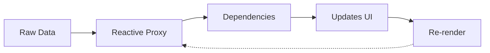

# Основы Vue.js 3 - Vue.js 3 Basics

## Реактивность - Reactivity

1. Концепция - Concept
2. Нюансы - Nuances
3. Упрощение - Simplification

```mermaid
flowchart LR
  A[Raw Data] --> B[Reactive Proxy]
  B --> C[Dependencies]
  C --> D[Updates UI]
  D --> E[Re-render]
  E -.-> B
```
