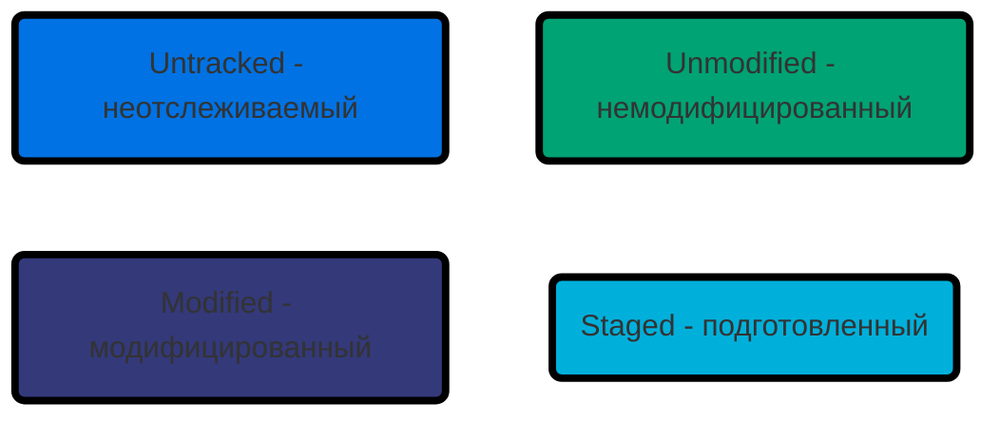

# Git

### Git - распределенная система управления версииями

### Почему стоит использовать Git

- Позволяет сохранять различные версии проектов
- Быстрый переход между различными версиями проекта
- Откат к предыдущим версиям при необходимости
- Улучшает процесс командной работы над одними и теми же проектами
- Независимая одновременная разработка различных новых функций в проекте

### Разница между Git и Guthub

- Git - распределенная система контроля версий
- GutHub - сервис хостинга Git репозиториев

### На каждом компьютере находится полная версия репозитория

### Это позволяет работать с Git репозиториями локально даже без интернета

> Настройка имени и почты автора

```bash
git config --global user.name "Your Name"
git config --global user.email "Your Email"
```

> Создание нового Git репозитория

```bash
git init
```

После инициализации создается скрытая папка .git

### Области Git - Git areas


### Рабочая директория - working directory

<p align="left">

</p>

### Индекс - staging area

<p align="left">

</p>

### Репозиторий - repository

Сохраненные объекты в репозитории

<p align="left">

</p>

Git сохраняет различные версии одного и того же файла

### Рабочий процесс Git

<p align="left">

</p>

### Статусы отслеживания файлов



- **Неотслеживаемым (untracked)**. О неотслеживаемых файлах Git не знает, поэтому изменения в них не будут добавлены в коммит. Это любые файлы в вашем рабочем каталоге, которые не входили в последний коммит и не подготовлены к текущему коммиту.
- **Отслеживаемым (tracked)**. Об этих файлах Git знает и отслеживает изменения в них. Отслеживаемые файлы в свою очередь могут находится в следующих состояниях:
  - **Неизмененным (unmodified)**. То есть с момента последнего коммита в файле не было никаких изменений
  - **Измененным (modified)**. То есть с последнего коммита в файле были произведены какие-то изменения
  - **Подготовленным к коммиту (staged)**. Это значит, что вы внесли изменения в этот файл и затем проиндексировали их, и эти изменения будут добавлены в следующий коммит
