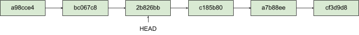

# Git

### Git - распределенная система управления версииями

### Почему стоит использовать Git

- Позволяет сохранять различные версии проектов
- Быстрый переход между различными версиями проекта
- Откат к предыдущим версиям при необходимости
- Улучшает процесс командной работы над одними и теми же проектами
- Независимая одновременная разработка различных новых функций в проекте

### Разница между Git и Guthub

- Git - распределенная система контроля версий
- GutHub - сервис хостинга Git репозиториев

### На каждом компьютере находится полная версия репозитория

### Это позволяет работать с Git репозиториями локально даже без интернета

> Настройка имени и почты автора

```bash
git config --global user.name "Your Name"
git config --global user.email "Your Email"
```

> Создание нового Git репозитория

```bash
git init
```

После инициализации создается скрытая папка .git

### Области Git - Git areas


### Рабочая директория - working directory

<p align="left">

</p>

### Индекс - staging area

<p align="left">

</p>

### Репозиторий - repository

Сохраненные объекты в репозитории

<p align="left">

</p>

Git сохраняет различные версии одного и того же файла

### Рабочий процесс Git

<p align="left">

</p>

### Статусы отслеживания файлов


- **Неотслеживаемым (untracked)**. О неотслеживаемых файлах Git не знает, поэтому изменения в них не будут добавлены в коммит. Это любые файлы в вашем рабочем каталоге, которые не входили в последний коммит и не подготовлены к текущему коммиту.
- **Отслеживаемым (tracked)**. Об этих файлах Git знает и отслеживает изменения в них. Отслеживаемые файлы в свою очередь могут находится в следующих состояниях:
  - **Неизмененным (unmodified)**. То есть с момента последнего коммита в файле не было никаких изменений
  - **Измененным (modified)**. То есть с последнего коммита в файле были произведены какие-то изменения
  - **Подготовленным к коммиту (staged)**. Это значит, что вы внесли изменения в этот файл и затем проиндексировали их, и эти изменения будут добавлены в следующий коммит

### Типы объектов в Git


- Blob — объект, содержащий длину содержимого файла и само содержимое;
- Tree — объект, содержащий данные о состоянии директорий и поддиректорий проекта;
- Commit — ссылка на корневое дерево. Так как объект Tree хранит в себе иерархию нижележащих объектов, корень проекта — содержит всю иерархию проекта, поэтому на него ссылается коммит;
- Annotated Tag — логическая разметка для маркирования состояний объектов в git.

### Хэши объектов и SHA1 хэш-функция

Каждый объект в Git имеет уникальный ID (SHA1 ХЭШ)


### Коммиты и ветки в Git

Коммит - указатель на дерево

<p align="left">

</p>

Внутренние устройство коммита

<p align="left">

</p>

- Указатель коммита — SHA1-хеш, который идентифицирует коммит;
- Email и имя автора — данные вносятся автоматически на основании параметров git config;
- Описание коммита — здесь указываются изменения, которые были внесены, версия коммита и иные данные, которые помогут понять, что коммит содержит;
- Дерево — это хеш-ссылка на корневое дерево проекта, которое содержит структуру всего проекта;
  Родительский коммит — это хеш-ссылка на предыдущий коммит;
- HEAD — указатель на текущую версию проекта, которая находится в рабочей директории проекта.

Все коммиты связаны между собой хеш-ссылками и организуют цепочку, а смещение указателя HEAD позволяет изменять текущее состояние файлов рабочий директории. Строго говоря HEAD ссылается на ветку, а ветка ссылается на последний коммит в ней, но вы можете в ручном режиме смещать HEAD на конкретный коммит минуя ветку.

<p align="left">

</p>

**HEAD** – это указатель, задача которого ссылаться на определенный коммит в репозитории

<p align="left">

</p>
<p align="left">

</p>
<p align="left">

</p>
<p align="left">

</p>

### Ветка (branch) - ссылка на коммит

<p align="left">

</p>

Ветка ссылается на последний коммит

<p align="left">

</p>

Ветка — это ссылка на последний коммит. Указатель HEAD ссылается на ветку, ветка ссылается на последний коммит. Ветки нужны для независимой работы разработчиков над своими зонами ответственности. Например, ваш проект имеет бэкенд и фронтенд части и, очевидно, над ними работают разные команды. В репозитории заводятся 2 разные ветки проекта: main и dev. Графически, эту структуру можно представить так:

<p align="left">

</p>

Main — основная ветка проекта, в которой находится код рабочего (продакшн) проекта, а в ветке dev — ведется разработка нового функционала, чтобы разграничить команды, в ветке dev можно создать еще 2 ветки: frontend и backend. Теперь команды могут независимо друг от друга разрабатывать новый функционал, тестировать его, а после влить в основную ветку. Мы же сделали немного по другому: в ветке flask — мы будем разрабатывать web-часть нашего проекта, а в ветке cli — терминальную часть проекта.

Слияние веток или merge (мердж) — это создание коммита в основной ветке, который содержит ссылки на два родительских коммита: последний коммит в основной ветке и последний коммит в ветке, где разрабатывался функционал, который нужно интегрировать в основную ветку.

Графически процесс слияния веток можно представить так:

<p align="left">

</p>

### Файл .gitignore

Все файлы в каталоге **Git** либо отслеживаются, либо не отслеживаются. Чтобы игнорировать файлы (такие как .class, .o, .exe, которые могут быть воспроизведены из исходного кода) и удалить их из списка неотслеживаемых файлов, создайте файл ".gitignore" в каталоге вашего проекта, в котором перечислены файлы, которые следует игнорировать, следующим образом:

```bash
# .gitignore

# Java class files
*.class

# Executable files
*.exe

# Object and archive files
# Can use regular expression, e.g., [oa] matches either o or a
*.[oa]

# temp sub-directory (ended with a directory separator)
temp/
```

НЕ должно быть никаких завершающих комментариев для имени файла. Вы можете использовать регулярные выражения для сопоставления шаблонов имени файла/пути, например, [oa] обозначает либо o, либо a. Вы можете переопределить правила, используя инвертированный шаблон (!), например, добавление !hello.exe включает hello.exe, хотя \*.exe исключаются.

# Основные команды Git

**Команды работы с репозиторием:**

- **git init** — инициализация репозитория;
- **git status** — просмотр актуального состояния репозитория git. Эта команда показывает, какие файлы были изменены, какие файлы находятся в индексе,
  а какие файлы вообще не трекаются гитом;
- **git add [file name]** — добавление файла или файлов в индекс, подготовка их для коммита;
- **git add .** - добавить все файлы из директории используется оператор точка;
- **git commit -m “[ message ]"** — создать коммит и указать его описание;
- **git log** — просмотреть сделанные коммиты и информацию о них;
- **git checkout [commit hash ]** — перейти в нужную версию проекта или коммит по его хешу, который отражается в выводе команды git log
- **git cat-file -t [hash git-object]** — посмотреть тип git-объекта по хешу;
- **git cat-file -p [hash git-object]** — прочитать содержимое файлов git-объектов по хешу.

**Команды работы с ветками:**

- **git branch [branch name]** — создать ветку;
- **git branch -a** — просмотреть все доступные ветки;
- **git branch -m [branch name] [branch name]** — переименовать ветку;
- **git checkout [branch name ]** — перейти в другую ветку;
- **git branch -b [branch name]** — создать новую ветку и переместиться в неё;
- **git branch -d [branch name]** — удалить ветку по имени;
- **git merge -m «commit text» [feature branch]** — слить ветки, используя стандартную стратегию git-слияния.

**Команды настройки git:**

- **git config --global init.defaultBranch [branch name]** — задать название метки по умолчанию;
- **git config --global user.name [имя пользователя]** — задать имя пользователя глобально, для всех репозиториев на локальной машине;
- **git config --global user.email [электронная почта пользователя]** — задать электронную почту пользователя глобально, для всех репозиториев на локальной машине.

### Сервисы хостинга Git репозиториев

<p align="center">


</p>
