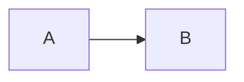

# HTML

- **HTML** - HyperText Markup Language
- **CSS** - Cascading Style Sheets
- **JavaScript** - Язык программирования.

**HTTP** - Протокол для получения файлов с серверов.
**HTTP** - Hypertext Transfer Protocol

Первый сайт появился в 1991 году.
http://info.cern.ch

**TLS** - Transport Layer Security

**HTTP + TLS => HTTPS** - Безопасная передача данных.

> Примеры HTML:

```html
<!DOCTYPE html>
<html lang="en">
  <head>
    <meta charset="UTF-8" />
    <meta name="viewport" content="width=device-width, initial-scale=1.0" />
    <title>Document</title>
  </head>
  <body></body>
</html>
```

Теги HTML (HTML tags):

- html
- head
- body
- div
- a
- img
- h1
- p
- meta
- link
- style
- script
  ...

<title>  - Открывающий HTML тег
</title> - Закрывающий HTML тег
<button class="btn">Click me</button> - Атрибут
 - Атрибут src, Атрибут class, Атрибут alt.

Самозакрывающийся тегы (Self-Closing Tags):

- 
- <input/>
- <hr/>
- <br/>
- <meta />
- <link />

The following code-block will be rendered as a Mermaid diagram:


