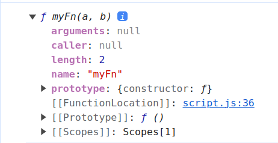
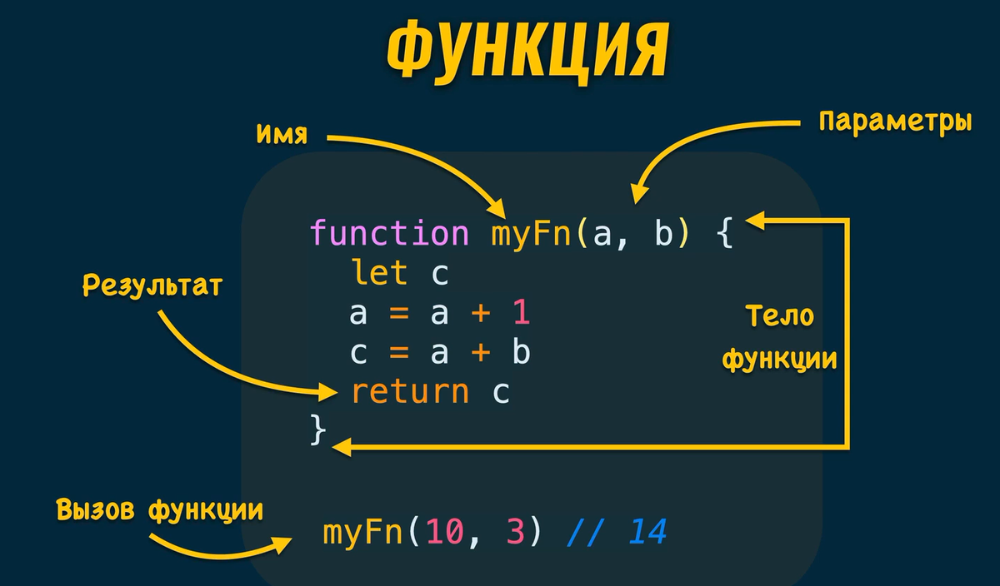
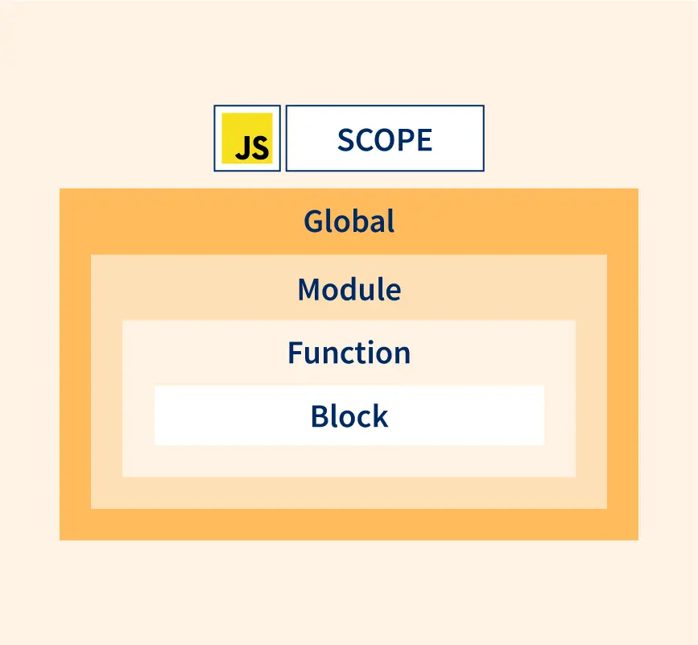
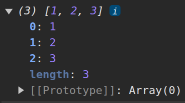
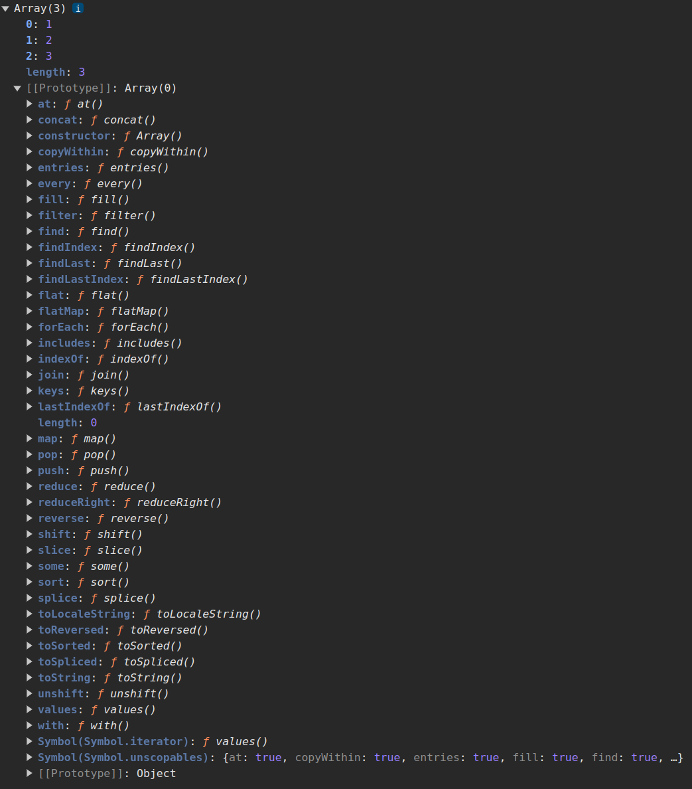

# JavaScript

## JavaScript - ВЫРАЖЕНИЯ, ФУНКЦИИ, ОБЪЕКТЫ

### Практически все сущности в JavaScript - ОБЪЕКТЫ

> [!NOTE]
>
> **ОБЪЕКТ** - Набор свойств. "имя: значение"

Пример объекта:

```js
{
 visible: true,
 colorDepth: 24,
 title: 'My Image',
 orientation: {
   angle: 0,
   type: 'landscape'
 },
 pixelDepth: 25,
 width: 1920
}
```

- Массив - это Объект
- Функция - это Объект
- Число - это Объект<sup>\*</sup>
- Строка - это Объект<sup>\*</sup>
  <sup>\*</sup>ведут себя как Объекты

console.log('Hello World')
console => Объект . => Точечная запись log => Метод () => Вызов метода

## ВЫРАЖЕНИЯ - возвращает значение

Примеры:

```js
"abc"; // 'abc'
10; // 10
5 + 2; // 7
c = 10; // 10
"Good " + "Evening"; // 'Good Evening'
a <= b || c !== d; // true or false
myFunction(c, d); // результат функции
```

> Результатом каждого выражения является - Значения

### Выражение присваивания

```js
a = 20;
```

Выражение с побочными действиями
Не только возвращает значение, но и выполняет другие действия

```js
a = 5;
b++;
myFunction(c, d);
```

## ПЕРЕМЕННЫЕ

> Переменные дают возможность повторного доступа к значениям

### Имена переменных

- **PascalCase** - Типы и классы
- **UPPER_SNAKE_CASE** - **DB_PASSWORD** Значения известны до запуска приложения и не меняются (сonstants)
- **camelCase** - Все остальные переменные (Используется чаще всего)

Названия переменных должны быть понятными

### Объявление переменных

- var -
- let - Появились в ECMAScript 6
- const - Появились в ECMAScript 6

let

```js
let a = 10;
a = 20;
let b;
b = false;
```

const

```js
const c = 10;
c = 20;
//TypeError: Assignment to constant variable.
```

### Объявление и присваивание

```js
condole.log(a); // ReferenceError: a is not defined
let a;
console.log(a); // undefined
a = true;
console.log(a); // true
```

Тип переменной определяется типом присвоенного значения

```js
const a = 10; // Type of Number
const b = "abc"; // Type of String
```

## ТИПЫ

- ### Примитивные типы

```
string (строка)
boolean (логический)
number (число)
null
undefined
symbol (символ)
```

- ### Ссылочный тип

```
object (объект)
```

## ДИНАМИЧЕСКАЯ ТИПИЗАЦИЯ

### Статическая типизации

```js
String a = 'abc'
int b = 10
b = 'xyz' // Error
```

### Динамическая типизации

```js
a = "abc"; // String
a = 10; // Number
```

> [!NOTE]
>
> **JavaScript** - динамически типизируемый язык

### Динамическая типизация в **JavaScript**

```js
let a = 10;
a = true;
a = "Bogdan";
a = undfined;
```

```js
function a() {
  console.log("Hey there");
}

a(); // 'Hey there'

a = 10;

a(); // Uncaught TypeError: a is not a funciton
```

### const для объявления переменных

```js
const a = () => {
  console.log("Hey there");
};

a(); // 'Hey there'

a = 10; // TypeError: Assignment to constat variable

a();
```

> [!NOTE]
> Правила работы с переменными
>
> 1. Все переменные объявлять перед их использованием
> 1. Стараться использовать **const** везде, где это возможно

## ОБЪЕКТЫ

### Объект - тип переменных

**Структура и синтаксис**

```js
const myCity = {
  city: "New York",
  popular: true,
  country: "USA",
};
```

> Порядок свойств в объекте не имеет значения

**Получение значений свойств**

> Dot notation - Точечная запись

```js
const myCity = {
  city: "New York",
  popular: true,
  country: "USA",
};

myCity.city; // 'New York'
myCity.popular; // true
```

**Изменение значений свойств**

```js
const myCity = {
  city: "New York",
};

myCity.city = "Las Vegas"; // 'Las Vegas'
```

**Добавление новых свойств**

```js
const myCity = {
  city: "New York",
};

myCity.popular = true;
myCity.country = "USA";

console.log(myCity); // {city: 'New York', popular: true, country: 'USA'}
```

**Удаление свойств**

```js
const myCity = {
  city: "New York",
  popular: true,
  country: "USA",
};

delete myCity.country;

console.log(myCity); // {city: 'New York', popular: true}
```

**Доступ к значению свойства с использованием скобок**

> Bracket notation - Скобочная запись

```js
const myCity = {
  city: "New York",
};

myCity["popular"] = true;
console.log(myCity); // {city: 'New York', popular: true} const

countryPropertyName = "country";
myCity[countryPropertyName] = "USA";
console.log(myCity); // {city: 'New York', popular: true, country: 'USA'}
```

**Вложенные свойства**

```js
const myCity = {
  city: "New York",
  info: {
    isPopular: true,
    country: "USA",
  },
};

console.log(myCity.info.isPopular); // true
delete myCity.info["isPopular"];
console.log(myCity); // {city: 'New York', info: {country: 'USA'}}
```

**Использование переменных**

```js
const name = "Bogdan";
const postsQty = 23;

const userProfile = {
  name: name,
  postsQty: postsQty,
  hasSignedAgreement: false,
};
```

**Сокращенный формат записи свойств**

> Сокращенные свойства рекомендуется размещать в начале объекта

```js
const name = "Bogdan";
const postsQty = 23;

const userProfile = {
  name,
  postsQty,
  hasSignedAgreement: false,
};
```

### ГЛОБАЛЬНЫЕ ОБЪЕКТЫ

> - window - Веб браузеры
> - global - Node.js
> - globalThis - Унифицированный глобальный объект

**Свойства глобальных объектов**

> - console
> - window.console
> - global.console

### МЕТОДЫ

> Метод - свойство объекта, значение которого - функция

**Методы - свойства объекта, которые содержат функции**

```js
const myCity = {
  city: "New York",
  cityGreeting: function () {
    console.log("Greetings!!!");
  },
};

myCity.cityGreeting(); // 'Greetings!!'
```

**Сокращенный формат записи методов**

```js
const myCity = {
  city: "New York",
  cityGreeting() {
    console.log("Greetings!!!");
  },
};

myCity.cityGreeting(); // 'Greetings!!'
```

**Методы VS Свойства объектов**

myCity.city - Доступ к значению свойтва
myCity.cityGreeting() - Вызов метода

### JSON - JavaScript Object Notation

> Формат обмена данными

```js
{
  "userId": 1,
  "id": 1,
  "title": "Test title",
  "status": {
    "completed": false
  }
}
```

> Передача дынных в формате JSON - передается в виде строки

```
{"userId":1,"id":1,"title":"Test title","status":{"completed":false}}
```

> [!NOTE]
>
> **JSON.parse()** - Конвертация JSON в -> JavaScript объект.
> **JSON.stringify()** - Конвертация JavaScript объекта в -> JSON.

### Мутация в JavaScript

**Значения примитивных типов**

```js
const a = 10
let b = a       Копирование значения (copy by value)
b = 30

console.log(a) // 10 Значение "a" не изменилось console.log(b) // 30
```

**Значения ссылочного типа**

```js
const person = {
  name: 'Bob',
  age: 21
}

person.age = 22                   Мутация объекта, на который ссылается переменная "person"
person.isAdult = true             Мутация объекта, на который ссылается переменная "person"

console.log(person.age) // 22
console.log(person.isAdult) // true
```

**Мутирование копий**

```js
const person = {
  name: 'Bob',
  age: 25
}

const person2 = person              Копирование ссылки (copy by reference)

person2.age = 26                    Мутация объекта, на который ссылается "person2"
person2.isAdult = true              Мутация объекта, на который ссылается "person2"

console.log(person.age) // 26       Мутация также отразилась на переменной "person"
console.log(person.isAdult) // true Мутация также отразилась на переменной "person"
```

**Как избежать мутаций**

> Вариант 1

```js
const person = {
  name: "Bob",
  age: 25,
};

const person2 = Object.assign({}, prerson);
// Если у объекта есть вложенные объекты, то ссылки на них сохраняются
person2.age = 26;

console.log(person2.age); // 26
console.log(person.age); // 25
```

> Вариант 2

```js
const person = {
  name: "Bob",
  age: 25,
};

const person2 = { ...person }; // Оператор разделения объекта на свойства
// Ссылки на вложенные объекты сохраняются
person2.name = "Alice";

console.log(person2.name); // Alice
console.log(person.name); // Bob
```

> Вариант 3

```js
const person = {
  name: "Bob",
  age: 25,
};

const person2 = JSON.parse(JSON.stringify(person));
// Ссылки на вложенные объекты не сохраняются
person2.name = "Alice";

console.log(person2.name); // Alice
console.log(person.name); // Bob
```

## ФУНКЦИИ

**Функция - блок кода, который можно выполнять многократно**

```js
let a = 5;
let b = 3;

let c;

c = a + b;
console.log(c); // 8

a = 8;
b = 12;

c = a + b;
console.log(c); // 20
```

```js
let a = 5;
let b = 3;

function sum(a, b) {
  const c = a + b;
  console.log(c);
}

sum(a, b); // 8

a = 8;
b = 12;

sum(a, b); // 20
```

> Функция может быть...
>
> - ... именованной
> - ... анонимной
> - ... присвоена переменной
> - ... аргументом при вызове другой функции
> - ... значением свойства (метода) объекта

**Функция - это объект**

```js
function myFn(a, b) {
  let c;
  a = a + 1;
  c = a + b;
  return c;
}
```

> Исползуйте console.dir(myFn) чтобы отобразились свойства объекта

<p align="left">

</p>

<p align="center">

</p>

**Функция возвращает UNDEFINED если нет инструкции RETURN**

**Вызов функции**

```js
function myFn(a, b) {
  let c;
  a = a + 1;
  c = a + b;
  return c;
}

myFn(10, 3); // 14
```

> 1. Параметрам "a" и "b" присваиваются значения 10 и 3
> 2. Объявляется перменная "c"
> 3. Значение "a" увеличивается на 1
> 4. Сумма значений "a" и "b" присваивается "c"
> 5. Возвращается значение "c"

**Самая короткая функция**

```js
function myFn() {}

myFn(); // undefined
```

**Передача значения по ссылке**

```js
const personOne = {
  name: "Bob",
  age: 21,
};

function increasePersonAge(person) {
  // Функция мутирует внешний объект
  person.age += 1;
  return person;
}

increasePersonAge(personOne); // Передача объекта по ссылке
console.log(personOne.age); // 22
```

> [!WARNING]
> Внутри функции не рекомендуется мутировать внешние объекты

**Создание копии объекта**

```js
const personOne = {
  name: "Bob",
  age: 21,
};

function increasePersonAge(person) {
  const updatePerson = Object.assign({}, person);
  updatesPerson.age += 1;
  return updatedPerson;
}

const upodatedPersonOne = increasePersonAge(personOne);
console.log(personOne.age); // 21 Объект "personOne" не изменился!
console.log(updatedPersonOne.age); // 22
```

### Колбэк функции

```js
function anotherFunction() {
  //.Действия..
}

function fnWithCallback(callbackFunction) {
  callbackFunction(); // В теле этой функции вызывается колбэк функция
}

fnWithCallback(anotherFunction);
```

> Пример

```js
function printMyName() {
  console.log("Bogdan");
}

setTimeout(printMyName, 1000); // Функция "printMyName" будет вызвана через 1000 миллисекунд
// setTimeoout - Встроенная функция
```

**Правила работы с функциями**

> 1. **Называть** функции исходя из выполняемых задач
> 2. **Одна** функция должна выполнять **одну** задачу
> 3. Не рекомендуется изменять **внешние** относительно функции **переменные**

**Области видимости**

> Области видимости определяет границы действия переменной.

> Глобальные переменные vs локальные переменные.

> Области видимости

```js
let a; // Глобальные переменные
let b; // Глобальные переменные

function myFn() {
  let b; // Локальная переменная
  a = true;
  b = 10;
  console.log(b); // 10
}

myFn();

console.log(a); // true
console.log(b); // undefined
```

> Цепочка областей видимости

```js
const a = 5;
function myFn() {
  function innerFn() {
    console.log(a); // 5
  }
  innerFn();
}
myFn();
```

<p align="center">

</p>

> Жизненный цикл переменных (Переменная "b")

```js
let a;
let b; // 1. Объявление "b" в глобальной области видимости. Ее значение undefined

function myFn() {
  let b; // 3. Объявление "b" в зоне видимости функции
  a = true;
  b = 10; // 4. Объявлена ли "b" в рамках функции? ДА
  console.log(b); // 10   5. "b" имеет значение 10 в области видимости функции
}

myFn(); // 2. Вызов myFn

console.log(a); // true
console.log(b); // undefined  6. "b" все так же имеет значение undefined в глобальной области
```

> Жизненный цикл переменных (Переменная "a")

```js
let a; // 1. Объявление "a" в глобальной области видимости. Ее значение undefined
let b;

function myFn() {
  let b;
  a = true; // 3. Объявление ли "a" в зоне видимости функции? НЕТ
  b = 10; //    Объявлена ли "a" во внешней области видимости? ДА
  console.log(a); // true   Присваивание значения true глобальной перменной "a"
}

myFn(); // 2. Вызов myFn

console.log(a); // true   4. "a" имеет значение true
console.log(b); // undefined
```

**Типы областей видимости**

- Глобальная область видимости
- Область видимости функции
- Область видимости блока
  - Переменные, объявленные с помощью **let** или **const** внутри блока имеют область видмости, ограниченную этим блоком.
  - Блок это код находится между фигурные скобками {}.

**Области видимости**

> Необъявленные переменные

> [!WARNING]
> Не рекомендуется!

```js
function myFn() {
  a = true; // Переменная "a" бедет автоматически объявлена в глобальной области видимости
  console.log(a); // true
}
myFn();
console.log(a); // true
```

**Правила работы с переменными**

1. Все переменные объявлять **перед** их использованием
2. Стараться использовать **const** везде, где это возможно
3. Внутри функций не изменять переменные с внешних областей видимости

**Строгий режим** 'use strict'

> Запрещает использование необъявленных переменных

```js
"use strict"; // Эта строка должна быть первой в глобальной области видимости или в области видимости функции
// Запрещает использование необъявленных переменных
function myFn() {
  a = true; // Uncaught ReferenceErro: a is not defined at myFn
  console.log(a);
}
myFn();
console.log(a);
```

**Операторы**

> Оператор - это встроенная функция

- Операторы
- Операнды
- Унарные и Бинарные
- Инфиксная, префиксная и постфиксная записи

> Операторы

- Арифметические **+** **-** **\*** **/**
- Сравнения **===** **!==** **<=** **>=**
- Логические **!** **&&** **||**
- Присваивания **=**

> Текстовые операторы

- typeof
- instanceof
- new
- delete

```js
let a, b;

a = 10; // Присваивание
b = a; // Присваивание

let c = a + b; // Присваивание

console.log(c); // 20
```

> Оператор - встроенная функция

```js
a = 10

function =(переменная, выражение) {
  1. Получение результата выражения
  2. Поиск переменной по имени
  3. Присваивание результата выражения переменной
  4. Возврат результата выражения
}
```

> Унарные операторы

```js
// У унарных операторов всегда один операнд (аргумент)
a++;
+a;
delete obj.a;
typeof a;
new Object();
```

> Бинарные операторы

```js
// У бинарных операторов два операнда (аргумента)
a = 5;
a + b;
a += 5;
a === b;
a && b;
```

> Инфиксная запись

```js
a = true;
a + b;
a += 5;
a || b;
a > b;
```

> Префиксная запись

```js
++a;
delete obj.a;
typeof a;
```

> Постфиксная запись

```js
a++;
myFunction();
```

> Приоритетность операторов

> Логические операторы

- ! -- НЕ - Всегда возвращает значение типа **boolean**
- && -- И - Возвращают значение одного из операндов
- || -- ИЛИ - Возвращают значение одного из операндов

> Ложные значения

```js
// Boolean(value) -> false
false;
0;
("");
undefined;
null;
Boolean(false); // false
Boolean(0); // false
Boolean(""); // false
Boolean(undefined); // false
Boolean(null); // false
```

> Практика с **typeof** оператором

```js
typeof 10; // number
typeof undefined; // undfined
typeof "Bogdan"; // string
typeof false; // boolean
typeof 10 === "number"; // true
```

> Оператор НЕ **!** чаще всего используется в условных инструкциях

> Примеры с оператором **!**

```js
!10; // false
!0; // true
!"abc"; // false
!""; // true
!true; // false
undefined; // true
```

> Отрицание отрицания НЕ НЕ **!!**

```js
!!10; // true
!!0; // false Позволяет проверить ложность значения
!!"abc"; // true
!!""; // false
!!true; // true
!!undefined; // false
```

> Операторы **&&** и **||** являются операторами короткого замыкания

> Оператор **&&**

```js
Выражение 1 && Выражение 2

Если "Выражение 1" ложно:
1. Выражение 2 игнорируется
2. Возвращается результат "Выражение 1"
```

> Оператор ИЛИ **||**

```js
Выражение 1 || Выражение 2

Если "Выражение 1" истинно:
1. Выражение 2 игнорируется
2. Возвращается результат "Выражение 1"
```

> Цепочка операторов **&&** и **||**

```js
a && b && c && d;
// оператор вернёт значение первого ложноподобного операнда при вычислении, либо значение последнего операнда, если все операнды оказались истиноподобными

a || b || c || d;
// оператор если какой-либо из аргументов true, он вернёт true, в противоположной ситуации возвращается false
```

> Оператор разделения объекта на свойства ...

> Оператор ...

```js
const button = {
  width: 200,
  text: "Buy",
};

const redButton = {
  ...button,
  color: "red", // Если у объекта "button" есть свойство "color", его значение будет перезаписано
};

console.table(redButton);
```

> Объединение объектов с помощью ...

```js
const buttonInfo = {
  text: "Buy",
};

const buttonStyle = {
  color: "yellow",
  width: 200,
  height: 300,
};

const button = {
  ...buttonInfo,
  ...buttonStyle,
};

console.table(button);
```

> Конкатенация строк

> Оператор + для конкатенации строк

```js
"Hello " + "World";
("Hello World");
```

> Переменные в конкатенации строк

```js
const hello = "Hello";
const world = "World";

const greeting = hello + " " + world;
```

> Шаблонные строки

```js
const hello = "Hello";
const world = "World";

const greeting = `${hello} ${world}`; // Выражение между обратными кавычками
```

**Функциональные выражения**

> Объявленная функция vs Функциональное выражение

> Объявленная функция

```js
function myFn(a, b) {
  let c;
  a = a + 1;
  c = a + b;
  return c;
}
```

> Функциональное выражение

```js
function(a, b) { // нет имени
  let c;
  a = a + 1;
  c = a + b;
  return c;
}
```

> [!NOTE]
> Функциональные выражения **всегда анонимные**

|                                                         | Объявленная функция | Функциональное выражение |
| ------------------------------------------------------- | ------------------- | ------------------------ |
| Имеет имя                                               | ДА                  | НЕТ                      |
| Можно использовать автономно                            | ДА                  | НЕТ                      |
| Можно присваивать переменной                            | ДА                  | ДА                       |
| Можно использовать как аргумент в вызове другой функции | ДА                  | ДА                       |

> Присваивание функционального выражения переменной

```js
const myFunction = function (a, b) {
  let c;
  a = a + 1;
  c = a + b;
  return c;
};

myFunction(5, 3); // 9
```

> Функциональное выражение в вызове другой функции

```js
setTimeout(function () {
  // Анонимное функциональное выражение
  console.log("Отложенное сообщение");
}, 1000);

// 'Отложенное сообщение' будует выведено в консоль через 1000 мс (1 секунд)
```

> Стрелочные функции

```js
(a, b) => {
  // Имени нету
  let c;
  a = a + 1;
  c = a + b;
  return c;
};
```

> Стрелочная функциия - **выражение**

> Стрелочные функции всегда **\*анонимные**

> Как дать имя стрелочной функции?

```js
const myFunction = (a, b) => {
  let c;
  a = a + 1;
  c = a + b;
  return c;
};

myfunction(5, 3); // 9
```

> Стрелочная функция в вызове другой функции

```js
setTimeout(() => {
  console.log("Отложенное сообщение");
}, 1000);

// 'Отложенное сообщение' будует выведено в консоль через 1000 мс (1 секунд)
```

> Сокращения в стрелочных функциях

```js
(a) => {
  // Если один параметр, то круглые скобки можно опустить
  // Тело функции
};
```

```js
(a, b) => a + b;
// Фигурные скобки можно опустить если тело функции состоит из одного выражения
// В этом случае стрелочная функция неявно возвращает результат выражения
```

> Значения параметров функции по умолчанию

> Пример 1

```js
function multByFactor(value, multiplier = 1) {
  return value * multiplier;
}

multByFactor(10, 2); // 20
multByFactor(5); // 5
```

> Пример 2

```js
const newPost = (post, addedAt = Date()) => ({
  // Значения по умолчанию вычисляются в момент вызова функции
  // Неявный возврат объекта
  ...post,
  addedAt,
});

const firstPost = {
  id: 1,
  author: "Bogdan",
};

newPost(firstPost);
```

**Обработка ошибок**

> Что происходит в случае ошибок

```js
const fnWithError = () => {
  throw new Error("Some error");
};

fnWithError(); // Выполнение кода остановится после появления Uncaught ошибки

console.log("Continue...");
```

**TRY/CATCH**

```js
try {
  // Выполнение блока кода
} catch (error) {
  // Этот блок выполняется в случае возникновения ошибок в блок try
}
```

> Пример

```js
const fnWithError = () => {
  throw new Error("some error");
};

try {
  fnWithError();
} catch (error) {
  console.error(error);
  console.log(error.message);
}
console.log("Continue..."); // Выполнение кода продолжится
```

## ИНСТРУКЦИИ

> **Выражение**

> **Инструкция**

> **Выражение - Инструкция**

> **Инструкция - Выражение**

> **Выражение возвращает значение**

> **Инструкция выполняет действия**

> Инструкции

> Примеры

```js
let a;

const b = 5;

if (a > b) {
  console.log("a is larger");
}

for (let i = 0; i++; i < 5) {
  console.log(i);
}
```

> **Инструкция обычно заканчивается точкой с запятой** Исключение: Точка с запятой не требуется после блока инструкций

```js
if ( a > b) {
  console.log('a is larger');
} // <= Точка с запятой не нужна

for (let i = 0 i++ i < 5) {
  console.log(i);
} // <= Точка с запятой не нужна
```

> **Точку с запятой можно опускать**

> **Выражение может быть инструкцией**

> Выражение - инструкция

> Примеры

```js
"abc";

a = a + 3;

c = a + b;

d = "Good" + "Evening";

myFunction(c, d);

console.log("Hey");
```

> **инструкция не может быть трансформирована в выражение**

> **Как отличить выражение от инструкции?**

> **Выражения могут быть использованы как аргументы в вызовах функций**

> Инструкция или выражение?

> Примеры

```js
funciton myFn(a) {
  console.log(a);
}

const b = true;
let c = 10;

myFn(2 + 3) // 5
myFn(b) // true
myFn(c = c + 1) // 11
myFn(c = c + 1;) // Uncaught SyntaxError
myFn(let d) // Uncaught SyntaxError
```

## МАССИВЫ

### МАССИВ - это объект с цифровыми именами свойств

> Формат записи массивов

```js
const myArray = [1, 2, 3];
console.log(myArray); // [1, 2, 3]

const myArray2 = new Array(1, 2, 3);
console.log(myArray2); // [1, 2, 3]
```

> Структура массивов

<p align="center">

</p>

> **МАССИВ VS ОБЪЕКТ**

```js
const myArray = [1, 2, 3];

console.log(myArray); // [1, 2, 3]
```

```js
const myObject = {
  0: 1,
  1: 2,
  2: 3,
  length: 3,
};

console.log(myObject); // { 0: 1, 1: 2, 2: 3, length: 3}
```

> Чтение значений массива

```js
const myArray = [1, true, "a"];
console.log(myArray); // [1, true, 'a']

console.log(myArray[0]); // 1
console.log(myArray[1]); // true

console.log(myArray.length); // 3
```

> Длина массива

```js
const myArray = [1, 2, 3, 4];
console.log(myArray); // [1, 2, 3, 4]
console.log(myArray.length); // 4

myArray[2] = "abc";

console.log(myArray); // [1, 2, 'abc', 4]
console.log(myArray[2]); // 'abc'

myArray[4] = true;

console.log(myArray); // [1, 2, 'abc', 4, true]
console.log(myArray.length); // 5
```

### Методы массивов

- push
- pop
- shift
- unshift
- forEach
- map

### Функции высшего порядка в массивах

<p align="center">

</p>

> PUSH

```js
const myArray = [1, 2, 3];
console.log(myArray); // [1, 2, 3]

myArray.push(4);
console.log(myArray); // [1, 2, 3, 4] Довабление нового элемента в конце массива

myArray.push(true);
console.log(myArray); // [1, 2, 3, 4, true]
```

> POP

```js
const myArray = [1, 2, 3];
console.log(myArray); // [1, 2, 3]

myArray.pop();
console.log(myArray); // [1, 2] Удаление последного элемента массива

const removedElement = myArray.pop();

console.log(myArray); // [1]
console.log(removedElement); // 2
```

> UNSHIFT

```js
const myArray = [1, 2, 3];
console.log(myArray); // [1, 2, 3]

myArray.unshift(true);
console.log(myArray); // [true, 1, 2, 3] Довабление элемента в начале массива

myArray.unshift("abc");

console.log(myArray); // ['abc', true, 1, 2, 3]
```

> SHIFT

```js
const myArray = [1, 2, 3];
console.log(myArray); // [1, 2, 3]

myArray.shift();
console.log(myArray); // [2, 3] Удаление первого элемента массива

const removedElement = myArray.shift();

console.log(myArray); // [3]
console.log(removedElement); // 2
```

> FOREACH

```js
const myArray = [1, 2, 3];
console.log(myArray); // [1, 2, 3]

myArray.forEach((el) => console.log(el * 2)); // Выполнение действий с каждым элементом массива

console.log(myArray); // [1, 2, 3] Оригинальный массив не изменился
```

> MAP

```js
const myArray = [1, 2, 3];
console.log(myArray); // [1, 2, 3]

const newArray = myArray.map((el) => el * 3); // Возвращает новый массив

console.log(newArray); // [3, 6, 9]
console.log(myArray); // [1, 2, 3] Оригинальный массив не изменился
```

## ДЕСТРУКТУРИЗАЦИЯ

> Деструктуризация объектов

```js
const userProfile = {
  name: "Bogdan",
  commentsQty: 23,
  hasSignedAgreement: false,
};

const { name, commentsQty } = userProfile; // Объявление новых переменных и
const { hasSignedAgreement } = userProfile; // присваивание значений на основе значений свойств объекта

console.log(name); // Bogdan
console.log(commentsQty); // 23
```

> Деструктуризация массивов

```js
const fruits = ["Apple", "Banana"];

const [fruitOne, fruitTwo] = fruits; // Объявление новых перпменных и присваивание значений на основе элементов массива

console.log(fruitOne); // Apple
console.log(fruitTwo); // Banana
```

> Деструктуризация в функциях

```js
const userProfile = {
  name: "Bogdan",
  commentsQty: 23,
  hasSignedAgreement: false,
};

const userInfo = ({ name, commentsQty }) => {
  // Деструктуризация параметров
  if (!commentsQty) {
    return `User ${name} has no comments`;
  }

  return `User ${name} has ${commentsQty} comments`;
};

userInfo(userProfile); // User Bogdan has 23 comments
```

## УСЛОВНЫЕ ИНСТРУКЦИИ

- if
- if ... else
- switch
- Тернарный оператор // Выражение

> Инструкция **if**

```js
// Зарезервированное слово "if"
if (Условие) {
  // Блок инструкций
  // Блок кода, выполняемый однократно, если Условие правдиво
}
```

> Пример **if**

```js
let val = 10;

if (val > 5) {
  // Это условие правдиво
  val += 20;
}

console.log(val); // 30
```

> Пример **if** c оператором отрицания

```js
const person = {
  age: 20,
};

if (!person.name) {
  // !undefined === true
  console.log("Имя не указано");
  // Другие действия в случае, если
  //  свойства "name" у объекта "person" нету
}
```

> Инструкция **if else**

```js
if (Условие) {
  // Блок кода, выполняемый однократно, если Условие правдиво
} else {
  // Блок кода, выполняемый однократно, если Условие ложно
}
```

> Пример **if else**

```js
let val = 10;

if (val < 5) {
  // Это условие ложно
  val += 20;
} else {
  // Выполнится этот блок инструкций
  val -= 20;
}

console.log(val); // -10
```

> Инструкция **if else if**

```js
if (Условие 1) {
  // Блок кода, выполняемый однократно, если Условие 1 правдиво
} else if (Условие 2) {
  // Блок кода, выполняемый однократно, если Условие 2 правдиво
} else {
  // Блок кода, выполняемый однократно, если предыдущие условия ложны
}
```

> Предпочтительный формат **if**

```js
if (Условие 1) {
  // Блок кода, выполняемый однократно, если Условие 1 правдиво
}

if (Условие 2) {
  // Блок кода, выполняемый однократно, если Условие 2 правдиво
}

if (Условие 3) {
  // Блок кода, выполняемый однократно, если Условие 3 правдиво
}
```

> Использование **if** в функциях

```js
const sumPositiveNumbers = (a, b) => {
  if (typeof a !== "number" || typeof b !== "number") {
    return "One of the arguments is not a number";
  }

  if (a <= 0 || b <= 0) {
    return "Numbers are not positive";
  }

  return a + b;
};
```

> Инструкция **switch**

```js
switch (Выражение) {
  case A:
    // Действия если Выражение === А
    break;
  case B:
    // Действия если Выражение === В
    break;
  default:
  // Действия по умолчанию
}
```

> Пример **switch**

```js
const month = 2;

switch (month) {
  case 12:
    console.log("Декабрь");
    break;
  case 1:
    console.log("Январь");
    break;
  case 2:
    console.log("Февраль");
    break;
  default:
    console.log("Это не зимний месяц");
}
```

### ТЕРНАРНЫЙ ОПЕРАТОР

> У тернарного оператора **три** операнда

> Конструкция с тернарным оператором - **выражение**

> **Выражение** возвращает значение

> Тернарный оператор

```js
Условие ?  Выражение 1 : Выражение 2

Условие
  ? Выражение 1
  : Выражение 2
```

> Пример 1

```js
const value = 11;

value
  ? console.log('Условие истинно');
  : console.log('Условие ложно');
```

> Пример 2

```js
const value1 = 11;
const value2 = 25;

value111 && value2 ? myFunction(valkue1, value2) : myFunction();
```

> Пример 3

```js
const value = 11;
console.log(value >= 0 ? value : -value); // 11

value = -5;
const res = value >= 0 ? value : -value;
console.log(res); // 5
```

## ЦИКЛЫ

> Без циклов

```js
let i = 0;
console.log(i);
i++;
console.log(i);
i++;
console.log(i);
i++;
console.log(i);
i++;
console.log(i);
i++;
```

> Перебор всех элементов массива без цикла

```js
const myArray = [true, "abc", 10];

console.log(myarray[0]);
console.log(myarray[1]);
console.log(myarray[2]);
```

> Перебор всех свойств объекта без цикла

```js
const myObject = {
  x: 10,
  y: true,
  z: "abc",
};

console.log(myObject.x);
console.log(myObject.y);
console.log(myObject.z);
```

## ТИПЫ ЦИКЛОВ

- for
- for ... in ...
- while
- do ... while
- for ... of ...

### ЦИКЛ for

```js
for (Начальная инструкция; Условие; Итерационное действие) {
  // Блок кода, выполняемый на каждой итерации
}
```

```js
for (let i = 0; i < 5; i++) {
  console.log(i);
}
```

> [!CAUTION]
> Циклы можно использовать для массивов

> [!TIP]
> Используйте функции высшего порядка массивов - "forEach", "map", "reduce"

> Цикл **for** для массивов

```js
const myArray = ["first", "second", "third"];

for (let i = 0; i < myArray.length; i++) {
  console.log(myArray[i]);
}

// 'first'
// 'second'
// 'third'
```

> Метод массивов **forEach**

```js
const myArray = ["first", "second", "third"];

myArray.forEach((element, index) => {
  console.log(element, index);
});

// 'first'  0
// 'second' 1
// 'third'  2
```

### ЦИКЛ while

```js
while (Условие) {
  // Блок кода, выполняемый на каждой итерации
}
```

```js
let i = 0;

while (i < 5) {
  console.log(i);
  i++;
}
```

> Бесконечный цикл

```js
let i = 0;

while (i < 5) {
  console.log(i);
}
```

### ЦИКЛ do while

```js
do {
  // Блок кода, выполняемый на каждой итерации
} while (Условие);
```

```js
let i = 0;

do {
  console.log(i);
  i++;
} while (i < 5);
```

```js
let i = 10;

do {
  console.log(i);
  i++;
} while (i < 5);
```

### ЦИКЛ for in

```js
for (key in Object) {
  // Действия с каждым свойстом объекта
  // Значения свойства - Object[key]
}
```

> **for in** для объектов

```js
const myObject = {
  x: 10,
  y: true,
  z: "abc",
};

for (const key in myObject) {
  console.log(key, myObject[key]);
}
```

> **forEach** для объектов

```js
const myObject = {
  x: 10,
  y: true,
  z: "abc",
};

Object.keys(myObject).forEach((key) => {
  console.log(key, myObject[key]);
});

Object.values(myObject).forEach((value) => {
  console.log(value);
});
```

> **for in** для массивов

```js
const myArray = [true, 10, "abc", null];

for (const key in myArray) {
  console.log(myArray[key]);
}
```

**ЦИКЛ for of** Появился в ES6

```js
for (Element of Iterable) {
  // Действия с определенным элементом
}
```

> **for of** для строк

```js
const myString = "Hey";

for (const letter of myString) {
  console.log(letter);
}
```

> **for of** для массивов

```js
const myArray = [true, 10, "abc", null];

for (const element of myArray) {
  console.log(element);
}
```

> [!CAUTION]
> for of не для объектов

## МОДУЛИ

> Модули позволяют структурировать код

> Модули позволяют избегать дублирования блоков кода

> EXPORT/IMPORT синтаксис появился в ES6

```js
moduleOne.js

export ...
```

```js
moduleTwo.js

import ...
```

> Экспорт по умолчанию

```js
moduleOne.js;

const myName = () => {
  console.log("Bogdan");
};

export default myName;
```

```js
moduleTwo.js;

import printMyName from "./moduleOne.js";

printMyName(); // Bogdan
```

> Несколько экспортов

```js
moduleOne.js;

const one = 1;
const two = "two";

export { one, two }; // Имена переменных должны совпадать
```

```js
moduleTwo.js;

import { one, two } from "./moduleOne.js"; // Имена переменных должны совпадать

console.log(one); // 1
console.log(two); // 'two'
```

> Переименование импортов

```js
moduleOne.js;

const one = 1;
const two = "two";

export { one, two };
```

```js
moduleTwo.js;

import { one as oneRenamed, two } from "./moduleOne.js"; // При импорте можно переименовывать переменные

console.log(oneRenamed); // 1
console.log(two); // 'two'
```

**Node.js поддерживает ES6 модули, начиная с версии 13**

**Правила работы с модулями**

1. Модули должны быть одноцелевыми
2. Располагайте все **export** инструкции внизу файла
3. Располагайте все **import** инструкции сверху файла
4. По возможности используйте **export default**

## КЛАССЫ И ПРОТОТИПЫ

> Синтаксис классов появился в **ES6**

```js
class ...
```

> **Классы** позволяют создавать прототиты для объектов

> На основании прототипов создаются **экземпляры**

> **Экземпляры** могут иметь собственные свойства и методы

> **Экземпляры** наследуют свойства и методы прототипов

> Класс

```js
class Comment {
  constructor(text) {
    this.text = text; // Переменная this указывает на экземпляр класса
    this.votesQty = 0;
  }

  upvote() {
    this.votesQty += 1;
  }
}
```

> Создание экземпляра

```js
const firstComment = new Comment("First comment"); // Вызывается функция constructor

console.log(firstComment); // Собственные свойства экземпляра

firstComment.text; // Наследование по цепочке
```

> Цепочка прототипов

> firstComment => Comment => Object

> Проверка принадлежности

```js
class Comment {
  constructor(text) {
    this.text = text;
    this.votesQty = 0;
  }

  upvote() {
    this.votesQty += 1;
  }
}

const firstComment = new Commewnt("First comment");

firstComment instanceof Comment; // true
firstComment instanceof Object; // true
```

> Вызов методов

```js
class Comment {
  constructor(text) {
    this.text = text;
    this.votesQty = 0;
  }

  upvote() {
    this.votesQty += 1;
  }
}

const firstComment = new Commewnt("First comment");

firstComment.upvote();
console.log(firstComment.votesQty); // 1   Методы можно вызывать многократно
firstComment.upvote();
console.log(firstComment.votesQty); // 2   Методы можно вызывать многократно
```

> Проверка принадлежности свойства экземпляру объекта

```js
const firstComment = new Comment("First comment");

firstComment.hasOwnProperty("text"); // true
firstComment.hasOwnProperty("votesQty"); // true
firstComment.hasOwnProperty("upvote"); // false
firstComment.hasOwnProperty("hasOwnProperty"); // false
```

> Создание нескольких экземпляров

```js
class Comment {
  constructor(text) {
    this.text = text;
    this.votesQty = 0;
  }

  upvote() {
    this.votesQty += 1;
  }
}

const firstComment = new Commewnt("First comment"); // Разные объекты с разными собственными свойствами
const secondComment = new Commewnt("Second comment");
const thirdComment = new Commewnt("Third comment");
```

> Статические методы

```js
class Comment {
  constructor(text) {
    this.text = text;
    this.votesQty = 0;
  }

  upvote() {
    this.votesQty += 1;
  }
  static mergeComments(first, second) {
    return `${first} ${second}`;
  }
}

Comment.mergeComments("First comment.", "Second comment."); // Метод доступен как свойство класса и не наследуется экземплярами класса
```

> Расширение других классов

```js
class NumbersArray extends Array {
  // Array Родительский конструктор вызовется автоматически
  sum() {
    return this.reduce((el, acc) => (acc += el), 0);
  }
}

const myArray = new NumbersArray(2, 5, 7);

console.log(myArray);
myArray.sum();
```

> Цепочка прототипов

> myArray => NumbersArray => Array => Object

**Что же такое ПРОТОТИП?**

> [!NOTE]
> Прототипы - это механизм, с помощью которого объекты JavaScript наследуют свойства друг от друга.

# ПРОМИСЫ

> Промисы позволяют обрабатывать **отложенные** во времени события

> Промис - это **обещание** предоставить результат **позже**

> Промис может вернуть **ошибку** если результат предоставить **невозможно**

Состояния промиса

- ожидание
- исполнен
- отклонен

> Создание промиса

```js
const myPromise = new Promise((resolve, reject) => {
  /**
   * Выполнение асинхронных действий
   * Внутри этой функции нужно в результате вызвать одну из функций resolve или reject
   */
  // Вновь созданный Промис будет в состоянии pending
});
```

> Получение результата промиса

```js
myPromise
  .then((value) => {
    /**
     * Действия в случае успешного исполнения Промиса
     * Значение value - это значение, преданное в вызове функции resolve внутри Промиса
     */
  })
  .catch((error) => {
    /**
     * Действия в случае успешного отклонения Промиса
     * Значение error - это значение, преданное в вызове функции reject внутри Промиса
     */
  });
```

> Получение данных с помощью FETCH API

```js
fetch("https://jsonplaceholder.typicode.com/todos")
  .then((response) => response.json())
  .then((json) => console.log(json))
  .catch((error) => console.log(error));
```

> Промисы пример

```js
const getData = (url) =>
  new Promise((resolve, reject) =>
    fetch(url)
      .then((response) => response.json())
      .then((json) => resolve(json))
      .catch((error) => reject(error))
  );

getData("https://jsonplaceholder.typicode.com/todos")
  .then((data) => console.log(data))
  .catch((error) => console.log(error.message));
```

## ASYNC/AWAIT

> [!NOTE]
> ASYNC/AWAIT - специальный синтаксис для упрощения работы с промисами

> Асинхронная функция

```js
async function asyncFn() {
  // Всегда возвращает Промис
}
```

```js
const asyncFn = async () => {
  // Всегда возвращает Промис
};
```

> Пример 1

```js
const asyncFn = async () => {
  return "Success!";
};

asyncFn();

asyncFn().then((value) => console.log(value));
```

> Пример 2

```js
const asyncFn = async () => {
  throw new Error("There was an error");
};

asyncFn();

asyncFn()
  .then((value) => console.log(value))
  .catch((error) => console.log(error.message));
```

> AWAIT

```js
const asyncFn = async () => {
  await <Promise> // Внутри асинхронных функций можно ожидать результатов Промисов
}

asyncFn()
```

> Ожидание результата AWAIT (Пример 3)

```js
const timerPromise = () =>
  new Promise((resolve, reject) => setTimeout(() => resolve(), 2000));

const asyncFn = async () => {
  console.log("Timer starts");
  await timerPromise(); // Функция дальше не выполняется пока не получен результат Промиса (исполнен/отклонен)
  console.log("Timer ended");
};

asyncFn();
```

```js
const timerPromise = () =>
  new Promise((resolve, reject) => setTimeout(() => resolve(), 2000));

const asyncFn = async () => {
  console.log("Timer starts");
  const startTime = performance.now();
  await timerPromise();
  const endTime = performance.now();
  console.log("Timer ended", endTime - startTime);
};

asyncFn();
```

> Переход с промисов на ASYNC/AWAIT

```js
const getData = async (url) => {
  const res = await fetch(url);
  const json = await res.json();
  return json;
};

getData("https://jsonplaceholder.typicode.com/todos")
  .then((data) => console.log(data))
  .catch((error) => console.log(error.message));
```

```js
const getData = async (url) => {
  const res = await fetch(url);
  const json = await res.json();
  return json;
};

const url = "https://jsonplaceholder.typicode.com/todos";

const data = await getData(url); // Нет обработки ошибок
```

```js
const getData = async (url) => {
  const res = await fetch(url);
  const json = await res.json();
  return json;
};

const url = "https://jsonplaceholder.typicode.com/todos";

try {
  const data = await getData(url);
  console.log(data);
} catch (error) {
  console.log(error.message); // Есть обработка ошибок
}
```

## ГЛАВНОЕ В ASYNC/AWAIT

1. **Async/await** - это **синтаксическая** надстройка над промисами
2. **await** синтаксис возможен только внутри **async** функций
3. **async** функция всегда возвращает **Promise**
4. **async** функция ожидает результата инструкции **await** и не выполняет последующие инструкции
