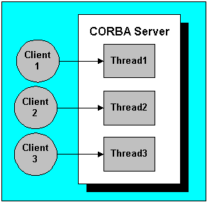

# Node.js

### Node.js - среда выполнения кода JavaScript вне веб броузеров

### Что такое Node.js?

- Традиционно язык JavaScript использовался только для работы в веб-браузерах
- Node.js позволяет выполнять код JavaScript за пределами браузеров, например, на серверах

* [About Node.js® - https://nodejs.org/en/about](https://nodejs.org/en/about)
* [About Node.js JavaScript runtime - https://github.com/nodejs/node](https://github.com/nodejs/node)

### Преимущества Node.js?

- Высокая популярность
- Один язык JavaScript для фронтенда и бэкенда
- Открытый исходный код и кроссплатформенность
- Большое количество внешних библиотек
- Решает основные задачи для Web
- Много соединений и задач одновременно
- Легко сделать рабочий прототип
- Удобный менеджер пакетов, где много всего
- Большое и активное сообщество вокруг

### Node.js - лучше всего подходит для обработки потоковых данных в реальном времени

### Node.js - не лучшей выбор для обработки видео или для машинного обучения

| Javascript в веб браузере                         | Javascript в Node.js                                   |
| ------------------------------------------------- | ------------------------------------------------------ |
| Глобальный объект window                          | Глобальный объект global                               |
| Взаимодействие с ДОМ                              | Нет взаимодействия с веб браузером                     |
| Код нужно адаптировать под различные веб браузеры | Можно использовать все функции, поддерживаемые Node.js |
| Нет доступа к файловой системе клиентов           | Есть доступ к файловой системе                         |

### NODE REPL - интерактивный интерпретатор

- READ - Прочитать код, введенный пользователем
- EVALUATE - Анализ и интерпретация
- PRINT - Вывести результат в терминал
- LOOP - Начать сначала. При этом переменные, созданные ранее, сохраняются

**node filename.js** - Выполнение кода JavaScript в файле с помощью Node.js
**node** - Запуск интерактивного интерпретатора Node.js

> Взаимодействие с NODE REPL

```js
node > node
Welcome to Node.js v18.9.0.
Type ".help" for more information.
> const name = "John"
undefined
> name
'John'
> .exit
node >
```

> Получение помощи в NODE REPL

```js
> .help
.break    Sometimes you get suck, this gets you out
.clear    Alias for .break
.editor   Enter editor mode
.exit     Exit the REPL
.help     Print this help message
.load     Load JS from a file into the REPL session
.save     Save all evaluated commands in this REPL session to a file
```

## Архитектура Node.js

- https://www.turing.com/kb/understanding-the-nodejs-architecture
- https://medium.com/@ibrahimlanre1890/node-js-architecture-understanding-node-js-architecture-5fb32879b994

### Как работает Node.js

<p align="center">

</p>

- **V8 Engine** - Выполняет код JavaScript
- **Встроенные модули Node.js** - Различные API, предоставляемые Node.js, например, для доступа к файловой системе, path, os, fs, http ...
- **LibUV** - Библиотека, написанная на C++, которая обеспечивает поддержку **неблокирующих** операций ввода-вывода
- **C++ Bindings** - Позволяет коду, написанному на JavaScript, получать доступ к функциям, написанным в библиотеке LibUV
- **Внешние модули Node.js:** например, express, mocha ...

* [libuv is a multi-platform support library with a focus on asynchronous I/O - https://libuv.org/](https://libuv.org/)
* [About Cross-platform asynchronous I/O - https://github.com/libuv/libuv](https://github.com/libuv/libuv)
* [About WASI syscall API built atop libuv - https://github.com/nodejs/uvwasi](https://github.com/nodejs/uvwasi)
* [About WebAssembly System Interface - https://github.com/WebAssembly/WASI](https://github.com/WebAssembly/WASI)

### Потоки и процессы

- **Thread** - Отдельный поток выполнения кода
- **Process** - Запущенная программа

> **Process** - Процесс может иметь несколько потоков

### Модель одного потока на один запрос

> ! Это не Node.js!

<p align="center">

</p>

### Модель Node.js

> Node.js имеет один поток, который обрабатывает все запросы

<p align="center">

</p>

### Блокирующие и неблокирующие операции

> [!NOTE]
>
> Если Node.js имеет **один** поток, как он обрабатывает **несколько** запросов?

> [!NOTE]
>
> Это делается благодаря **асинхронным** неблокирующим операциям

> Примеры операций ввода-вывода

- Запрос к базе данных
- Чтение или запись файла
- Взаимодействие с сетью

> [!NOTE]
>
> **Синхронные** методы блокируют процесс выполнения, **асинхронные** - нет.

> Пример блокирующей операции

```js
const fs = require("fs"); // Встроенный модуль для работы с файлами

const data = fs.readFileSync("./test.txt", "utf-8"); // Блокирующая операция
console.log("File reading finished");

console.log("Continue..."); // Выполняется после чтения файла
```

```
File reading finished
Continue...
```

> Пример неблокирующей операции

```js
const fs = require("fs");

fs.readFile("./test.txt", "utf-8", (err, data) => {
  // Неблокирующая операция
  if (!err) {
    console.log("File reading finished");
  }
});

console.log("Continue..."); // Выполняется до окончания чтения файла
```

```
Continue...
File reading finished
```

### Libuv с циклом событий и пулом потоков

> [!NOTE]
>
> **LIBUV** обеспечивает поддержку асинхронных неблокирующих операций.

<p align="center">

</p>

**Libuv**

- **Event loop** - Обрабатывает асинхронные колбэк вызовы, связанные с различными событиями
- **Thread pool** - Используется для обработки блокирующих операций

## Event loop

<p align="center">

</p>

### Event loop позволяет Node.js выполнять неблокирующие операции

### Event loop - бесконечный цикл, в котором вызываются колбэк функции, связанные с событиями

<p align="center">

</p>

> Что выполняется в Event loop?

- Колбэки, зарегистрированные для разных событий
- Выполнение в цикле событий означает выполнение в **основном** потоке

### LibUV использует Thread pool для асинхронного выполнения блокирующих операций

> Количество потоков в Thread pool

- По умолчанию количество потоков - 4
- Количетсво потоков можно увеличить до 1024

> Что выполняется с помощью Thread pool?

- Операции ввода/вывода (I/O operations)
- Задачи, создающие нагрузку на процессор

### По-возможности, LibUV использует операционную систему для выполнения задач

> Делегирование задач


### Псевдокод для Event loop

Примеры событий:

- данные были записаны в файл
- получена следующая часть данных с удалленного сервера

```js
пока цикл событий работает:
  пока есть события для обработки:
    е = получить следующее событие
    если для события есть колбэк функция:
        вызвать колбэк функцию
```

### Группы событий в цикле событий

> Начало работы Event loop

- Timers - Колбэки для истёкших таймеров setTiemout? setInterval
- Pending - I/O колбэки, отложенные до следующей итерации
- Idle, Prepare - Используются внутри Node.js
- Poll - Получить и выполнить колбэки I/O
- Check - Колбэки setImmediate
- Close - close event callbacks
- Продолжить ДА => Timers, НЕТ => Выход

### События nextTick и колбэки промисов

<p align="center">

</p>

> **nextTick** имеет приоритет перед другим событиями и обрабатывается на текущей итерации

### События setImmediate

> **setImmediate** вызывает колбэк функцию на текущей или следующей итерации цикла событий

> Пример **setImmediate**

```js
setImmediate(() => {
  console.log("immediate callback");
});
```

### Блокирующие операции

> [!WARNING]
> ! Код, который вы пишите, **не должен занимать** цикл событий слишком долго

## Стек вызовов (Call Stack)

```js
function thirdFunction() {
  return 10;
}

function secondFunction() {
  return thirdFunction();
}

function firstFunction() {
  return secondFunction();
}

console.log(firstFunction()); // 10
```

## Модули

### В Node.js каждый файл js является **модулем**

> Преимущества модулей

- Разделение приложения на части
- Организация кода
- Разделение ответственности
- Упрощение поддержки приложения

> Характеристики модулей

1. По умолчанию ни одна из переменных в модуле не доступна для импорта в других модулях
2. Чтобы переменная стала доступна для импорта в других модулях, её необходимо экспортировать из модуля
3. Для использования в определённом модуле переменных из других модулей, их необходимо импортивать
4. При импортировании названия переменных можно изменять

> Варианты модулей в Node.js

- CommonJS Modules - require ... // Включены по умолчанию
- ECMAScript Modules (ESM) - import ...

### Модули CommonJS

> Модули CommonJS

- module.exports - Объект для экспортирования из модуля
- require() - Функция для импорта из другого модуля

> Объект module.exports

1. По умолчанию, любой файл с расширением **.js** в Node.js является модулем **CommonJS**
2. **module** - это объект, который доступен в любом таком файле
3. **module.exports** содержит значения, экспортируемые из модуля
4. По умолчанию, **module.exports** - пустой объект и следовательно, из модуля ничего не экспортируется
5. Переменная **exports** - это копия **module.exports**

### Как устроен модуль CommonJS

```js
(function (exports, require, module, __filename, __dirname) {
  // Содержимое модуля
  // В Node.js каждый модуль CommonJS автоматически оборачивается в анонимную функцию
});
```

> Проверка наличия анонимной функции

```js
console.log(arguments.callee.toString());
```

```js
function (exports, require, module, __filename, __dirname) {
  console.log(arguments.callee.toString());
};
```

> Экспорт из модуля CommonJS

```js
function printHello() {
  // Функция printHello становится доступна в других модулях
  console.log("Hello world");
}

module.exports.printHello = printHello; // Добавление ключа с значением в объект module.exports
```

> Добавление экспорта без создания переменной

```js
module.exports.printHello = function () {
  console.log("Hello world");
};
```

```js
module.exports.printHello = () => {
  console.log("Hello world");
};
```

> Переписывание значения **module.exports**

```js
Таким образом можно экспортировать только одну переменную

module.exports = function () {
  // Изменение значения module.exports с объекта на функцию
  console.log("Hello world");
};
```

### Алиас module.exports

```js
module.exports ==> {};
По умолчанию, module.exports и exports ссылаются на один и тот же объект
exports ==> {};
```

```js
exports.printHello = function () {
  console.log("Hello world");
};
```

> Присвоение нового значения переменной **exports**

```js
Так делать нельзя, потому что exports
больше не будет ссылаться на тот же объект, что и module.exports

exports = function () {
  console.log("Hello world");
};
```

### Импорты в модулях CommonJS и функция require

> Функция require

1. **require** - это функция, которая доступна внутри каждого CommonJS модуля
2. Функция **require** используется для импорта переменных, которые экспортируются из других модулей
3. Можно импортировать из встроенных или внешних модулей, указывая имя модуля
4. Можно имопртировать из модулей приложения, указывая путь к соответствующим файлам

> Импорт из встроенных или внешних модулей

> [!NOTE]
>
> Перед использованием внешних модулей их нужно установить с помощью **npm install**

```js
const fs = require("fs"); // Нужно указать только имя встроенного или внешного модуля
```

> Импорт единственного экспорта

```js
index.js;

const usersArray = require("./users.js");
```

```js
users.js;

const users = ["Bogdan", "Alice", "Bob"];

module.exports = users; // Значение module.exports переписывается
```

> Импорт нескольких переменных

```js
index.js;

const { URL, USERNAME, PASSWORD } = require("./constants");
```

```js
constants.js

const URL = 'http://localhost:5000';
const USERNAME = 'admin';
conat PASSWORD = 'strong_pass';

exports.URL = URL;
exports.USERNAME= USERNAME;
exports.PASSWORD = PASSWORD;

// module.exports.URL = URL;
// module.exports.USERNAME= USERNAME;
// module.exports.PASSWORD = PASSWORD;
```

> Импорт функций

```js
index.js;

const getData = require("./utils.js");

getData("https://jsonplaceholder.typecode.com/posts")
  .then((posts) => console.log(posts))
  .catch((error) => console.log(error));
```

```js
utils.js;

async function getData(url) {
  const res = await fetch(url);
  const data = await res.json();
  return data;
}

module.exports = getData;
```

### Модули ES6

> Модули ECMASCRIPT

- export - Ключевое слово для экспортирования из модуля
- import - Ключевое слово для импорта из другого модуля

> Как перейти с **CommonJS** на **ES6**

- Изменить расширения файлов на **.mjs**
- Добавить **"type": "module"** в файле package.json
  // Файл package.json содержит информацию о приложении Node.js, а также список внешних модулей

> Внутри модуля **ES6 нет доступа** к переменным **module** и **require**

```js
console.log(module);
// ReferenceError: module is not defined in ES module scope
console.log(require);
// ReferenceError: require is not defined in ES module scope, you can use import instead
console.log(exports);
// ReferenceError: exports is not defined in ES module scope
console.log(__filename);
// ReferenceError: __filename is not defined in ES module scope
console.log(__dirname);
// ReferenceError: __dirname is not defined in ES module scope
```

> Типы экспортов в **ES6**

- Именованный экспорт
- Экспорт по умолчанию
- Смешанные экпорты // именованные экспорты и экспорт по умолчанию

> Именованный экспорт из модуля **ES6**

```js
function printHello() {
  console.log("Hello world");
}

export { printHello }; // Функция printHello становится доступна в других модулях
```

```js
import { printHello } from "./hello.mjs"; // Относительный путь к файлу, из которого выполняется импорт
```

> Экспорт нескольких переменных

```js
function printHello() {
  console.log("Hello world");
}

function printHi() {
  console.log("Hi world");
}

export { printHello, printHi };
```

```js
import { printHello, printHi } from "./hello.mjs";
// Порядок следования переменных при импорте не имеет значения
```

> Пример с модулями в **ES6**

```js
index.mjs;

const { URL, USERNAME, PASSWORD } = require("./constants.mjs");
```

```js
constants.mjs

const URL = 'http://localhost:5000';
const USERNAME = 'admin';
conat PASSWORD = 'strong_pass';

export { URL, USERNAME, PASSWORD };
```

> Экспорт при объявлении переменных

```js
export function printHello() {
  console.log("Hello world");
}

export function printHi() {
  console.log("Hi world");
}
```

> Экспорт по умолчанию

```js
function printHello() {
  console.log("Hello world");
}

export default printHello;
```

> Импорт экспорта по умолчанию

```js
import printHello from "./hello.mjs"; // При импортировании дефолтного экспорта фигурные скобки не используются
```

> Пример с экспортом по умолчанию

```js
index.mjs;

import users from "./users.mjs"; // Относительный путь к файлу

import usersArray from "./users.mjs"; // Можно использовать другое имя переменной
```

```js
users.mjs;

const users = ["Bogdan", "Alice", "Bob"];

export default users; // Экспорт по умолчанию
```

> Пример с импортом функций в **ES6**

```js
index.mjs;

import getData from "./utils.mjs";

getData("https://jsonplaceholder.typicode.com/posts")
  .then((posts) => console.log(posts))
  .catch((error) => console.log(error));
```

```js
utils.mjs;

async function getData(url) {
  const res = await fetch(url);
  const posts = await res.json();
  return posts;
}

export default getData;
```

> Наличие многих импортов

```js
export { sayName, printHello, printHi, printHey, tellStory, findTreasure };
```

```js
import {
  printHello,
  printHi,
  printHey,
  sayName,
  tellStory,
  findTreasure,
} from "./helpers.mjs";
```

> Выборочный импорт в **ES6**

```js
export { sayName, printHello, printHi, printHey, tellStory, findTreasure };
```

```js
import { printHello, sayName, tellStory } from "./helpers.mjs";
```

> Переименование при импорте в **ES6**

```js
import { printHello as greetFn } from "./hello.mjs";
// Именованные импорты можно переименовывать, используя ключевое слово as

greetFn();
```

> Импорт из встроенных или внешних модулей **ES6**

```js
import express from "express";
```

```js
import fs from "fs";
```

> Префикс **node** при импортировании

```js
import fs = require("node:fs"); // При импортировании встроенных модулей можно добавлять префикс node:
```

```js
import fs from "node:fs";
```

| **Именованные экспорты**                                       | **Экспорт по умолчанию**                                           |
| -------------------------------------------------------------- | ------------------------------------------------------------------ |
| export { city };                                               | export default city;                                               |
|                                                                |                                                                    |
| import { city } from "./mod.mjs";                              | import userCity from "./mod.mjs";                                  |
|                                                                |                                                                    |
| Имена переменных должны **совпадать**                          | Имена переменных могут быть **разные**                             |
|                                                                |                                                                    |
| Можно экспортировать **несколько** переменных из одного модуля | Экспорт по умолчанию в **одном** модуле может быть только **один** |
|                                                                |                                                                    |

> Кэширование модулей
> **Модул 1** <== **Модул 2** ==> **Модул 3**

- После загрузки и компиляции моудля, Node.js поместит его в **кэш**
- Модуль 2 загружается с кэша, что повышает скорость загрузки приложения и уменьшает нагрузку на память

### Встроенные модули

> В Node.js есть много встроенных модулей

> Часто используемые встроенные модули

- fs
- events
- path
- http
- stream

### Модуль FS

### Модуль FS позволяет взаимодействовать с файловой системой

> Стили использования модуля **FS**

- Callback API - Функции в этих API асинхронны
- Promise API - Функции в этих API асинхронны
- Synchronous API

> Функции в модуле **FS**

| **async** | **sync**      |
| --------- | ------------- |
| readFile  | readFileSync  |
|           |               |
| writeFile | writeFileSync |
|           |               |
| unlink    | unlinkSync    |
|           |               |

> Чтение файла - вариант с колбэком

```js
const fs = require("fs");

// Содержимое файла будет в виде строки вместо бинарного формата
fs.readFile("./file.txt", "utf-8", (err, data) => {
  // err будет null, если ошибка не возникла
  if (err) {
    console.log(err);
  } else {
    console.log(data);
  }
});
```

> Чтение файла - вариант с промисами

```js
const fs = require("fs/promises"); // Импорт версии с промисами

fs.readFile("./file.txt", "utf-8")
  .then((data) => {
    console.log(data);
  })
  .catch((error) => console.log(error));
```

> Чтение файла - синхронная версия

```js
const fs = require("fs");

try {
  const data = fs.readFileSync("./file.txt", "utf-8"); // Блокирует дальнейшее выполнение кода до завершения операции чтения файла
  console.log(data);
} catch (error) {
  console.log(error);
}
```

> Запись в файл - вариант с колбэком

```js
const fs = require("fs");

const dataToWrite = "Hello Node.js";

fs.writeFile("./file.txt", dataToWrite, (err) => {
  if (err) {
    // err будет null, если ошибка не возникла
    console.log(data);
  }
});
```

> Запись файла - вариант с промисами

```js
const fs = require("fs/promises");

const dataToWrite = "Hello Node.js";

fs.writeFile("./file.txt", dataToWrite);
  .then(() => {
    console.log("done");
  })
  .catch((error) => console.log(error));
```

> Запись в файла - синхронная версия

```js
const fs = require("fs");

try {
  const data = fs.writeFileSync("./file.txt", "utf-8"); // Блокирует дальнейшее выполнение кода до завершения операции запись файла
  console.log(data);
} catch (error) {
  console.log(error);
}
```

> Удаление файла - вариант с колбэкомя

```js
const fs = require("fs");

fs.unlink("./file.txt", (error) => {
  if (error) {
    console.log(error);
  }
  console.log("file deleted");
});
```

> Удаление файла - вариант с промисами

```js
const fs = require("fs/promises");

fs.unlink("./file.txt")
  .then(() => console.log("file deleted"))
  .catch((error) => console.log(error));
```

> Удаление файла - синхронная версия

```js
const fs = require("fs");

try {
  fs.unlinkSync("./file.txt"); // Блокирует дальнейшее выполнение кода до завершения операции удаления файла
  console.log("File was deleted");
} catch (error) {
  console.log(error);
}
```

### Модуль events

> События в Node.js

1. Арихитектура Node.js основана на событиях
2. Встроенные модули, такие как модуль **fs**, генерируют события
3. Например, событие создается, когда данные были прочитаны из файла, или когда был получен новый запрос http-сервером
4. В ответ на событие вызывается колбэк функция, зарегистрированная для конкретного события
5. Для одного события может быть несколько зарегистрированных колбэк функций

### Модуль events предоставляет класс eventemitter для работы с событиями в Node.js

### Все объекты, которые создают события, являются экземплярами класса eventemitter

> Класс EventEmitter

```js
const EventEmitter = require("events");

const myEmitter = new EventEmitter(); // Создаётся экземпляр класса EventEmitter

myEmitter.on("customEvent", () => {
  // Добавляется слушатель для события с именем customEvent
  console.log("CustomEvent was emitted");
});

myEmitter.emit("customEvent");
```

> Передача аргументов колбэк функции слушателя

```js
myEmitter.on("newUser", (userName) => {
  console.log("Hello " + userName);
});

myEmitter.emit("newUser", "John");
```

> Резюме по модулю **events**

1. Встроенный модуль **events** используется для работы с событиями
2. Экземпляры класса **EvenEmitter** наследуют метод **on**, с помощью которого можно создовать слушателей событий
3. События создаются с помощью метода **emit**

### Модуль path

### Модул path позволяет работать с путями к файлам и папкам

> Соединение сегментов пути

```js
const path = require("path");

const linuxP = path.join("/usr", "node", "app.js");
// "node" => Части пути для соединения
// /usr/node/index.js (MacOS | Linux)

const winP = path.join("D:\\", "node", "app.js");
console.log(winP);

// D:\node\index.js (Windows)
```

> Расчет абсолютного пути

```js
const path = require("path");

const result = path.resolve("node", "index.js"); // Формирование абсолютного пути на основании частей пути
console.log(result);
// /Users/john/Desktop/node/node/index.js
```

> Резюме по модулю **path**

1. Встроенный модуль **path** используется для выполнения операций с путями к файлам и папкам
2. Модуль **path** учитывает операционную систему при формировании путей

### Модуль http

### Модуль http позволяет создать http сервер или отсылать http запросы

> **http** сервер

```js
const server = http.createServer((req, res) => {
  // Эта колбэк функция вызывается для каждого запароса от клиента
  res.statusCode = 200;
  res.setHeader("Content-Type", "text/html");
  res.write("<h1>Hello from the Node.js</h1>");
  res.end();
});

server.listen(3000);
```

> Отправка **http** запроса

```js
const http = require("http");

const url = "http://jsonplaceholder.typicode.com/todos/1";

http.get(url, (res) => {
  // Эта колбэк функция вызывается при получении ответа от удалённого сервера
  let responseBody = "";

  res.on("data", (chunk) => {
    // Событие data возникает несколько раз в процессе получения ответа от сервера
    responseBody += chunk;
  });

  res.on("end", () => {
    // Событие end возникает после обработки всех данных
    console.log(responseBody);
  });
});
```

> Резюме по модулю **http**

1. Встроенный модуль **http** позволяет создать **http** сервер и обрабатывать **http** запросы от клиента
2. С помощью модуля **http** также можно отправлять запросы на удаллённые серверы

### Модуль stream

### Поток представляет собой данные, которые доступны не все сразу, а частями

> Потоки

1. Потоки позволяют нам обрабатывать данные **частями**
2. Это делает потоки идеальными для работы с большими объемами данных, которые могут не поместиться в памяти одновременно
3. Пример: монжно прочитать файл частями, что позволит избежать чтения всего файла и записи его в память
4. Потоки является экземплярами класса **EventEmitter**

> Без потоков

- Данные нужно полностью прочесть перед началом обработки

> С потоками

- Данные могут обрабатываться частями с помощью потока

> Типы потоков

- **Readable** - Для чтения данных
- **Writable** - Для записи данных
- **Duplex** - Как для чтения, так и для записи данных
- **Transform** - Дуплексный поток, который преобразует входные данные

> Запись в файл с помощью потока

```js
const fs = require("fs");

const writeStream = fs.createWriteStream("./f.txt");

writeStream.write("This is data ");
writeStream.write("written to the file using stream!");
writeStream.write("\n");
writeStream.write("Stream are great!");

writeStream.end();
```

> Чтение файла с помощью потока

```js
const fs = require("fs");

const readStream = fs.createReadStream("./f.txt", "utf8");

readStream.on("data", (dataChunk) => {
  console.log(dataChunk);
});

readStream.on("end", () => {
  console.log("File reading complete");
});

readStream.on("error", (err) => {
  console.log(err);
});
```

> Метод **PIPE**

```js
readableStream.pipe(writableStream); // Метод pipe перенаправляет один поток в другой
```

**Readable Stream** **pipe** **Writable Stream**

> Цепочка методов **pipe**

```js
stream1.pipe(stream2).pipe(stream3);
```

Метод **pipe** возвращает целевой поток, что позволяет снова вызывать метод **pipe**

```js
stream1.pipe(stream2);
stream2.pipe(stream3);
```

> Копирование файла с помощью потока

```js
const fs = require("fs");

const readStream = fs.createReadStream("./f.txt", "utf8");
const writeStream = fs.createWriteStream("./f_copy.txt");

readStream.pipe(writeStream);

writeStream.on("close", () => {
  console.log("File copy completed");
});
```

> Создание **transform** потока

```js
const stream = require("stream");

const upperCaseStream = new stream.Transform({
  transform(chunk, encoding, callback) {
    const upperCased = chunk.toString().toUpperCase();
    callback(null, upperCased); // Колбэк должен быть вызван с ошибкой или преобразованной частью потока
  },
});
```

> Использование **transform** потока

```js
process.stdin // Поток для чтения из стандартного ввода
  .pipe(upperCaseStream) // Трансформирующий поток
  .pipe(process.stdout); // Поток для вывода
```

> Резюме по модулю **stream**

1. Потоки позволяют обрабатывать данные **частями**
2. Часто потоки используются для обработки данных из других приложений или данных с удаллённых серверов

### NPM - Менеджер пакетов в Node.js

### NPM - NODE PACKAGE MANAGER

> Что такое NPM?

- Публичный реестр для пакетов Node.js
- Утилита командной строки для установки и управления NPM пакетами - Устанавливается автоматически с Node.js

> Проверка версии NPM

```js
npm --version
```

### Файл package.json

> Файл package.json

1. **package.json** - это файл JSON, содержащий метаданные о проекте Node.js/JavaScript
2. Обычно **package.json** создаётся в корневой папке проекта
3. Он содержит метаданные, такие как имя проекта, версия, описание, автор, список зависимостей и т.д.
4. Этот файл позволяет NPM идентифицировать проект, а также управлять зависимостями проекта.

> Пример файла package.json

```js
{
  "name": "my-package",
  "version": "1.0.0",
  "description": "Project description",
  "main": "index.js",
  "scripts": {
    "start": "node index.js"
  },
  "keywords": [],
  "author": "",
  "license": "ISC"
}
```

> Создание файла package.json

```js
npm init // NPM попросит ввести метаданные для проекта
```

```js
npm init -y // Без предложений ввести данные для файла package.json
```

> Установка пакетов из NPM

```js
npm install <package-name>
```

Все NPM пакеты проекта устанавливаются в папка **node_modules**

```js
npm i <package> // Можно сокращать так
```

> Зависимости в файле package.json

```js
{
  "name": "my-package",
  "version": "1.0.0",
  "main": "index.js",
  ...
  "dependencies": {       // Список NPM зависимостей проекта
    "express": "^4.18.1",
    "winston": "^3.8.2",
  },
}
```

### Семантические версии

> Семантические номера версий

```js
4.18.1

4  - Основная версия (major)
18 - Минорная версия (minor)
1  - Патч версия (patch)

semver.org
```

> Обновление номеров версий

- **Основная версия** - Внесение критических изменений или обновлений
- **Минорная версия** - Добавление нового функционала с сохранением предыдущего
- **Патч версия** - Внесение небольших изменений с сохранением предыдущего функционала

| Обновление **основной** версии | Обновление **минорной** версии | Обновление **патч** версии |
| ------------------------------ | ------------------------------ | -------------------------- |
| 4.18.1                         | 4.18.1                         | 4.18.1                     |
| 5.0.0                          | 4.19.0                         | 4.18.2                     |

> Указание приемлемых обновлений пакетов

- **^4.18.1** Допускаются **минорные** и **патч** обновления пакета, например, **4.20.0**
- **~4.18.1** Допускаются только**патч** обновления пакета, например, **4.18.7**
- **4.18.1** Только конкретная версия **4.18.1**

> Обновление NPM пакетов

```js
npm update <package-name>

npm update express
```

> Удаление NPM пакетов

```js
npm uninstall <package-name>

npm uninstall express
```

> Глобальная установка NPM пакета

```js
npm install -g <package-name>

npm install -g nodemon
```

> Список глобальных NPM пакетов

```js
npm list -g
```

### Файл package-lock.json

> Установка всех зависимостей, перечисленных в файле package.json

```js
npm install // Папка node_modules будет создана, если она отсутствует
```

### Как узнать какую же точную версию пакета нужно установить?

```js
^4.18.1 // Запись в файле package.json
```

> Файл package-lock.json

```js
...
"node_modules/morgan": {
  "version": "1.10.0", // Содержит точные версии пакетов, которые следует установить
  "resolved": "...",
  "integrity": "...",
  "dependencies": {    // Также содержит зависимости пакета
    "bacis-auth": "~2.0.1",
    "debug": "2.6.9",
    "depd": "~2.0.0",
    "on-finished": "~2.3.0",
    "on-headers": "~1.0.2"
  },
  "engines:" {
    "node": ">= 0.8.0"
  }
...
}
```

### Зависимости для процесса разработки (devDependencies)

```js
npm install --save-dev <package-name> // Можно вместо ---save-dev использовать -D
```

> Зависимости для процесса разработки в файле package.json

```js
{
  "name": "my-package",
  "version": "1.0.0",
  "main": "index.js",
  ...
  "dependencies": {
    "express": "^4.18.1"
  },
  "devDependencies": { // Список зависимостей, необходимых только для процесса разработки
    "jest": "^28.1.0",
    "nodemon": "^2.0.20"
  },
}
```

> Установка всех пакетов **без** зависимостей для разработки

```js
npm install --only=prod // Используется при запуске приложений Node.js в production
```

### NPM SCRIPTS

```js
"scripts": {
  "test": "jest",
  "start": "node index.js",
  "dev": "nodemon index.js"
}
```

### Разница между npm install и npm ci

### npm install может изменять package-lock.json файл

> Установка всех зависимостей **точно** в соответствии с package.json и package-lock.json

```js
npm ci // Папка node_modules будет создана, если она отсутствует
```

> Установка пакетов

| **npm i**                                             | **npm ci**                                      |
| ----------------------------------------------------- | ----------------------------------------------- |
| Может изменять package.json и package-lock.json       | Не изменяет package.json и package-lock.json    |
| Медленнее                                             | Быстрее                                         |
| Если папка node_modules есть, она заново не создается | Папка node_modules всегда создается снова       |
| Используется для установки отдельних пакетов          | Не используется для установки отдельных пакетов |

> Файл **package.json**

1. Папку **node_modules** можно создать снова на основании файла **package.json**
2. Все пакеты из **package.json** можно установаить с помощью **npm install**
3. Папка **node_modules** обыно очень большая (10-200мб)
4. Благодаря **package.json** и **package-lock.json** нет необходимости сохранять папку **node_modules** в репозитории **Git**

> Файл **package-lock.json**

1. Содержит **точные** версии пакетов
2. Содержит список зависимостей пакетов из файла **package.json**, а также зависимости их зависимостей
3. Команда **npm ci** используется для установки всех версий пакетов согласно файлов **package.json** и **package-lock.json**
4. Команда **npm ci не модифицирует** файлы **package.json** и **package-lock.json**
5. Команда **npm install может** вносить изменения в **package-locj.json**

## EXPRESS

### Express - Фреймворк для Node.js, который упрощает создание API и веб приложений

> Преимущества **Express**

- Упрощает создание веб приложений и API
- Прост в изучении
- Публичная NPM библиотека
- Очень популярный

> Установка **Express**

```js
npm install express // Установка NPM пакетов выполняется в папке проекта после создания package.json
```

> Пример приложения **Express**

```js
const express = require("express");

const PORT = 3000;
const app = express();

app.get("/", (req, res) => {
  res.send("<h1>Hello fomr Express</h1>");
});

app.listen(POSRT, () => {
  console.log(`App is listening on port ${PORT}`);
});
```

### **Роутинг** определяет как сервер отвечает на разные запросы клиентов

> Настройка роутинга

```js
app.httpMethod(requestPath, handlerFn);
// httpMethod - HTTP метод (get, post, delete и другие) или use (все методы)
// requestPath - Путь, по которому обращается клиент, нампример, /users или /login
// handlerFn - Колбэк функция, которая вызывается при получении запроса от клиента
```

> Несколько обработчиков для одного запроса

```js
app.method(path, handler1, handler2, ...);
// handler1, handler2 - Колбэк функции вызываются одна за другой (очередность слева-направо)
```

> Пример маршрута для **GET** запроса

```js
app.get("/", (req, res) => {
  res.send("Hello World");
});
// req - Объект, содержащий все детали запроса от клиента
// res - Объект, содержащий все детали ответа клиента
// send - Отправка ответа клиенту. После этого изменение объекта res невозможно
```

> Пример маршрута для **POST** запроса

```js
app.post("/users", (req, res) => {
  res.send("User was created");
});
// Маршрут для POST запроса для пути /users
// Express поддерживает и другие HTTP методы, такие как delete, put, patch
```

> Параметры маршрута

```js
app.get("/users/:userId", (req, res) => {
  // Примеры путей при наличии параметра: /users/234 или /users/471
  console.log(req.params); // { userId: "234" }
  console.log(req.params.userId); // 234
});
```

> Разные методы для одного пути

```js
app.get("/users", (req, res) => {
  res.send("GET req at /users path");
});

app.post("/users", (req, res) => {
  res.send("POST req at /users path");
});
```

> Цепочка HTTP матодов

```js
app
  .route("/users") // Путь указывается только один раз
  .get((req, res) => {
    res.send("GET req at /users path");
  })
  .post((req, res) => {
    res.send("POST req at /users path");
  });
```

> Маршруты в отдельных модулях

```js
// routes/users.js

const express = require("express");

const usersRouter = express.Router();

usersRouter.get("/", (req, res) => {
  // code
});

export default usersRouter;
```

> Использование маршрутов из модулей

```js
// app.js

const express = require("express");
const usersRouter = require("./routes/users.js");

const app = express();

app.use("/users", usersRouter);
```

### Паттерн программирования MVC

### Model View Controller

<p align="center">

</p>

### Model - Интерфейс взаимодействия с данными в базе данных

### View - Видимый для пользователя интерфейс (презентационная часть)

### Controller - Логика взаимодействия интерфейса с данными через модель

### Функции middleware в Express

### Middleware функция выполняется в процессе обработки запроса и отправки ответа

<p align="center">

</p>

Любая **middleware функция** может отправить ответ клиенту

> Что может делать **middleware функция**

- Выполнять любой код
- Изменять объекты request/response
- Вызвать следующую middleware функцию
- Завершать цикл запрос-ответ

> Создание middleware функции

```js
function logger(req, res, next) {
  console.log(`${req.method} request at ${req.path}`);
  next();
}
// Middleware функция должна либо вызвать следующую функцию, либо завершить цикл заспрос-ответ
```

> Использование **middleware функции**

```js
app.use(logger);
// Подключение middleware функции в приложении Express.js
```

> Использование анонимной функции

```js
app.use((req, res, next) => {
  // Функцию можно не создавать отдельно
  console.log(`${req.method} request at ${req.path}`);
  next();
});
```

> [!NOTE]
>
> ! Но принято все **middleware функции**, которые содержат логику приложения, выносить в папку **middleware**
