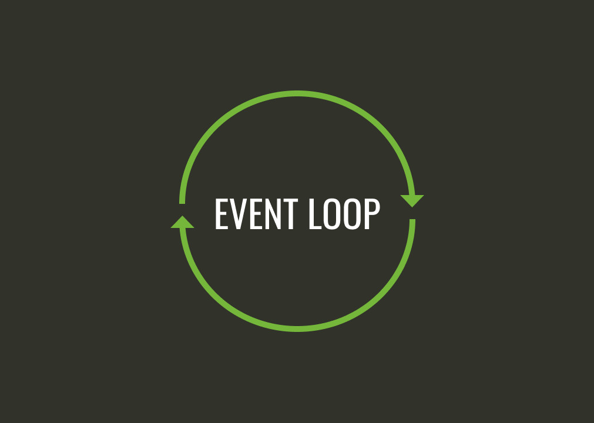

# Node.js

### Node.js - среда выполнения кода JavaScript вне веб броузеров

### Что такое Node.js?

- Традиционно язык JavaScript использовался только для работы в веб-браузерах
- Node.js позволяет выполнять код JavaScript за пределами браузеров, например, на серверах

### Преимущества Node.js?

- Высокая популярность
- Один язык JavaScript для фронтенда и бэкенда
- Открытый исходный код и кроссплатформенность
- Большое количество внешних библиотек

### Node.js - лучше всего подходит для обработки потоковых данных в реальном времени

### Node.js - не лучшей выбор для обработки видео или для машинного обучения

| Javascript в веб браузере                         | Javascript в Node.js                                   |
| ------------------------------------------------- | ------------------------------------------------------ |
| Глобальный объект window                          | Глобальный объект global                               |
| Взаимодействие с ДОМ                              | Нет взаимодействия с веб браузером                     |
| Код нужно адаптировать под различные веб браузеры | Можно использовать все функции, поддерживаемые Node.js |
| Нет доступа к файловой системе клиентов           | Есть доступ к файловой системе                         |

### NODE REPL - интерактивный интерпретатор

- READ - Прочитать код, введенный пользователем
- EVALUATE - Анализ и интерпретация
- PRINT - Вывести результат в терминал
- LOOP - Начать сначала. При этом переменные, созданные ранее, сохраняются

**node filename.js** - Выполнение кода JavaScript в файле с помощью Node.js
**node** - Запуск интерактивного интерпретатора Node.js

> Взаимодействие с NODE REPL

```js
node > node
Welcome to Node.js v18.9.0.
Type ".help" for more information.
> const name = "John"
undefined
> name
'John'
> .exit
node >
```

> Получение помощи в NODE REPL

```js
> .help
.break    Sometimes you get suck, this gets you out
.clear    Alias for .break
.editor   Enter editor mode
.exit     Exit the REPL
.help     Print this help message
.load     Load JS from a file into the REPL session
.save     Save all evaluated commands in this REPL session to a file
```

### Как работает Node.js

## Архитектура Node.js

<p align="center">

</p>

- V8 Engine - Выполняет код JavaScript
- Встроенные модули Node.js - Различные API, предоставляемые Node.js, например, для доступа к файловой системе
- LibUV - Библиотека, написанная на C++, которая обеспечивает поддержку **неблокирующих** операций ввода-вывода
- C++ Bindings - Позволяет коду, написанному на JavaScript, получать доступ к функциям, написанным в библиотеке LibUV
- Внешние модули node.js, например, express, mocha

### Потоки и процессы

- Thread - Отдельный поток
- Process - Запущенная программа

> Процесс может иметь несколько потоков

### Модель одного потока на один запрос

> ! Это не Node.js!

<p align="center">

</p>

### Модель Node.js

> Node.js имеет один поток, который обрабатывает все запросы

<p align="center">

</p>

### Блокирующие и неблокирующие операции

> [!NOTE]
>
> Если Node.js имеет **один** поток, как он обрабатывает **несколько** запросов?

> [!NOTE]
>
> Это делается благодаря **асинхронным** неблокирующим операциям

> Примеры операций ввода-вывода

- Запрос к базе данных
- Чтение или запись файла
- Взаимодействие с сетью

> [!NOTE]
>
> **Синхронные** методы блокируют процесс выполнения, **асинхронные** - нет.

> Пример блокирующей операции

```js
const fs = require("fs"); // Встроенный модуль для работы с файлами

const data = fs.readFileSync("./test.txt", "utf-8"); // Блокирующая операция
console.log("File reading finished");

console.log("Continue..."); // Выполняется после чтения файла
```

> Пример неблокирующей операции

```js
const fs = require("fs");

fs.readFile("./test.txt", "utf-8", (err, data) => {
  // Неблокирующая операция
  if (!err) {
    console.log("File reading finished");
  }
});

console.log("Continue..."); // Выполняется до окончания чтения файла
```

### Libuv с циклом событий и пулом потоков

> [!NOTE]
>
> **LIBUV** обеспечивает поддержку асинхронных неблокирующих операций.

<p align="center">

</p>

- Event loop - Обрабатывает асинхронные колбэк вызовы, связанные с различными событиями
- Thread pool - Используется для обработки блокирующих операций

## Event loop

<p align="center">

</p>

### Event loop позволяет Node.js выполнять неблокирующие операции

### Event loop - бесконечный цикл, в котором вызываются колбэк функции, связанные с событиями

<p align="center">

</p>

> Что выполняется в Event loop?

- Колбэки, зарегистрированные для разных событий
- Выполнение в цикле событий означает выполнение в **основном** потоке

### LibUV использует Thread pool для асинхронного выполнения блокирующих операций

> Количество потоков в Thread pool

- По умолчанию количество потоков - 4
- Количетсво потоков можно увеличить до 1024

> Что выполняется с помощью Thread pool?

- Операции ввода/вывода (I/O operations)
- Задачи, создающие нагрузку на процессор

### По-возможности, LibUV использует операционную систему для выполнения задач

### Псевдокод для Event loop

Примеры событий:

- данные были записаны в файл
- получена следующая часть данных с удалленного сервера

```js
пока цикл событий работает:
  пока есть события для обработки:
    е = получить следующее событие
    если для события есть колбэк функция:
        вызвать колбэк функцию
```

### Группы событий в цикле событий

> Начало работы Event loop

- Timers - Колбэки для истёкших таймеров setTiemout? setInterval
- Pending - I/O колбэки, отложенные до следующей итерации
- Idle, Prepare - Используются внутри Node.js
- Poll - Получить и выполнить колбэки I/O
- Check - Колбэки setImmediate
- Close - close event callbacks
- Продолжить ДА => Timers, НЕТ => Выход

### События nextTick и колбэки промисов

<p align="center">

</p>

> **nextTick** имеет приоритет перед другим событиями и обрабатывается на текущей итерации

### События setImmediate

> **setImmediate** вызывает колбэк функцию на текущей или следующей итерации цикла событий

> Пример **setImmediate**

```js
setImmediate(() => {
  console.log("immediate callback");
});
```

### Блокирующие операции

> [!WARNING]
> ! Код, который вы пишите, **не должен занимать** цикл событий слишком долго
