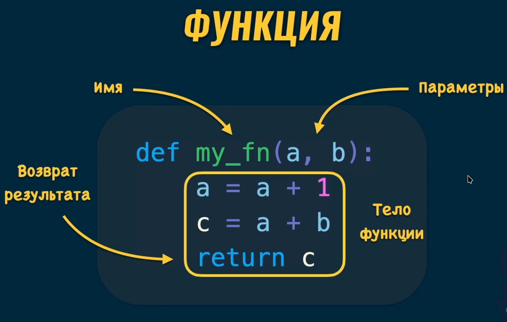

# Python

### Самое важное в Python - Объекты

**Python** - это объектно-ориентированный язык программирования, что означает, что все в Python является объектом. Это включает в себя не только данные, но и функции и классы. Объекты имеют свойства (атрибуты) и методы (функции), которые могут быть вызваны для выполнения действий с объектом.

### Главная идея в Python - все сущности в Python - объекты.

### Объект - это экземпляр класса, который содержит данные и методы для работы с этими данными.

### Классы в Python определяют структуру и поведение объектов.

### Класс - это шаблон или прототип для создания объектов.

### На основе класса можно создавать множество объектов, каждый из которых будет иметь свои собственные данные, но общие методы и свойства.

### У каждого объекта есть атрибуты.

### Атрибут объекта называется методом, если его значение - функция.

## Основные типы в Python - Basic Types in Python

### В Python есть несколько основных типов данных:

- **str** - строки, например: "Hello", "World"
- **int** - целые числа, например: 1, 2, 3
- **bool** - логические значения, True или False
- **list** - упорядоченный изменяемый список, например: [1, 2, 3]
- **dict** - неупорядоченный изменяемый словарь, например: {"key": "value"} {"min": 1, "max": 10}
- **tuple** - упорядоченный неизменяемый список, например: (1, 2, 3)
- **float** - числа с плавающей запятой, например: 1.5, 2.0, 3.14
- **set** - неупорядоченное множество, например: {1, 2, 3}

## Встроенные функции - Built-in Functions

В Python есть множество встроенных функций, которые можно использовать для выполнения различных задач. Вот некоторые из них:

- **print()** - выводит данные на экран
- **len()** - возвращает длину объекта
- **type()** - возвращает тип объекта
- **int()** - преобразует объект в целое число
- **float()** - преобразует объект в число с плавающей запятой
- **str()** - преобразует объект в строку
- **list()** - преобразует объект в список
- **dict()** - преобразует объект в словарь
- **set()** - преобразует объект в множество
- **tuple()** - преобразует объект в кортеж
- **sum()** - возвращает сумму элементов в итерируемом объекте
- **max()** - возвращает максимальное значение в итерируемом объекте
- **min()** - возвращает минимальное значение в итерируемом объекте
- **input()** - считывает данные с клавиатуры

Функции могут принимать аргументы и возвращать значения. Они могут быть вызваны с помощью круглых скобок, например: `print("Hello, World!")`.

Функции могут быть определены с помощью ключевого слова `def`, например:

```python
def greet(name):
    return f"Hello, {name}!"

print(greet("Alice"))  # Вывод: Hello, Alice!
```

Встроенная функция `input()` позволяет считывать данные с клавиатуры. Она возвращает введенную строку:

```python
name = input("Введите ваше имя: ")

print(f"Привет, {name}!")
# <Name your entered> - Значения типа str
```

## Функция dir и атрибуты объектов - dir() and Object Attributes

Функция `dir()` возвращает список атрибутов и методов объекта. Это полезно для изучения объектов и их возможностей. Например:

```python
my_list = [1, 2, 3]
print(dir(my_list))
```

Вывод будет содержать все методы, доступные для списков, такие как `append()`, `remove()`, и т.д.

Атрибуты объекта - это переменные, которые хранят данные, связанные с объектом. Их можно получить с помощью точечной нотации:

Примеры получения списка атрибутов объекта.

```python
>>> x = 5
>>> dir()
['__annotations__', '__builtins__', '__doc__', '__loader__',
'__name__', '__package__', '__spec__', 'x']
>>> import struct
>>> dir()
['__annotations__', '__builtins__', '__doc__', '__loader__',
'__name__', '__package__', '__spec__', 'struct', 'x']

>>> dir(struct)
['Struct', '__all__', '__builtins__', '__cached__', '__doc__',
'__file__', '__loader__', '__name__', '__package__', '__spec__',
'_clearcache', 'calcsize', 'error', 'iter_unpack', 'pack', 'pack_into',
'unpack', 'unpack_from']
>>> class Shape:
...     def __dir__(self):
...         return ['area', 'perimeter', 'location']
>>> s = Shape()
>>> dir(s)
['area', 'location', 'perimeter']
```

Встроенная функция `dir()` позволяет увидеть все атрибуты и методы объекта, включая те, которые были определены в классе:

```python
print(dir(person))
# Выводит список атрибутов и методов объекта person
```

Атрибуты объекта доступны через точечную нотацию, например: `person.name` или `person.age`. Методы объекта также вызываются с помощью точечной нотации, например: `person.greet()`.

```python
name = 'Alice'

print(name.upper())  # Вывод: ALICE метод атрибута upper() является функцией, которая возвращает строку в верхнем регистре.
```

# Форматирование кода и PEP8 - Formatting Code and PEP8

## Отступы в Python - Indentation in Python

Отступы играют важную роль в Python, так как они определяют блоки кода. В Python используется 4 пробела для отступов. Отступы помогают структурировать код и делают его более читаемым.

Отступы

```python
# Корректный код
def print_name_function(name):
    print(name)
```

```python
# Некорректный код
def print_name_function(name):
print(name)
```

**PEP8** - это руководство по стилю кода в Python, которое рекомендует использовать 4 пробела для отступов. Это позволяет избежать ошибок и сделать код более понятным.
**PEP8** рекомендует использовать 4 пробела для отступов. Это позволяет избежать ошибок и сделать код более понятным.

**Некоторые выдержки из PEP8:**

1. Для отступов использовать **пробелы**, а не **Tab**. Используйте **4 пробела** для каждого уровня отступа.
2. Длина строк должна быть не более **79 символов**.
3. **Функции и классы** должны быть отделены от других строк кода **двумя пустыми строками.**
4. Импорты модулей должны быть в отдельных строках.
5. Используйте пробелы вокруг операторов и после запятых.
6. Комментарии должны быть написаны на английском языке и начинаться с заглавной буквы.
7. Комментарии в конце строки должны быть отделяться по крайней мере **двумя пробелами.**
8. Используйте **одинарные** или **двойные кавычки** для строк, но будьте последовательны в их использовании.

## Комментарии в Python - Comments in Python

Комментарии в Python начинаются с символа `#` и продолжаются до конца строки. Они используются для добавления пояснений к коду и не влияют на выполнение программы. Комментарии помогают другим разработчикам (и вам самим) понять, что делает код.

```python
# Комментарий

# Многострочный
# комментарий

print("Hello, World!")  # Код с комментарием
```

# Введение в функции - Introduction to Functions

```python
def hello(name):
    print("Hello,", name)
    print("Hi,", name)


hello('Alice')  # Call the hello function
hello("Bob")
```

```python
def sum_nums(a, b):
    sum = a + b
    return sum


first_num = sum_nums(5, 10)
print(first_num)

print(sum_nums(50.5, 20))

print(sum_nums(sum_nums(50.5, 20), 30))
```

# Выражения и инструкции - Expressions and Statements

## Выражения - Expressions

**Результатом выражения является значение**
**Результатом каждого выражения является значение.**
**Выражение - это комбинация значений, переменных и операторов, которая вычисляется в одно значение. Например:**

```python
10 + 5 # 15 - Сумма значений
```

```python
a > b # True или false
```

```python
'Hello ' + 'World' # Hello World
```

```python
my_func(10, 5) # результат функции
```

## Инструкции - Statements

**Инструкция - это команда, которая выполняет действие.**
**Инструкция - это строка кода, которая выполняет какое-то действие. Например:**

```python
print("Hello, World!")  # Выводит строку на экран
```

```python
x = 5  # Присваивает значение 5 переменной x
```

```python
# Условная инструкция
if my_name:
    print(my_name)
```

```python
# Импортирование модуля
import datetime
```

```python
# Цикл
for i in range(5):
    print(i)
```

```python
# Функция
def greet(name):
    print("Hello,", name)
```

```python
if a > b:
    print("a больше b")
```

# Переменные - Variables

Переменные дают возможность повторного доступа к значениям. Они позволяют сохранять данные и использовать их в разных частях программы. Например:

```python
x = 5
y = 10
z = x + y
print(z)  # Вывод: 15
```

```python
name = "Alice"
age = 30
print("Имя:", name)
print("Возраст:", age)
```

**Имена в Python**

- **snake_case** - Переменные, функции, методы, модули
- **PascalCase** - Классы
- **my-package** - Пакеты
- **DB_PASSWORD** - Константы

Названия переменных должны быть понятными и описательными, чтобы код был более читаемым. Например, вместо использования однобуквенных имен, таких как `x` или `y`, лучше использовать более информативные имена, такие как `user_age` или `total_price`.

## Объявление и присваивание переменных - Declaration and Assignment of Variables

```python
my_variable = 10
my_variable = 'Alice'
my_variable = True
```

**Python - язык с динамической типизацией**

**Тип переменной определяется типом присваиваемого значения.**

Переменные могут изменять свой тип во время выполнения программы. Например:

```python
my_variable = 10
print(my_variable)  # Вывод: 10
my_variable = 'Alice'
print(my_variable)  # Вывод: Alice
my_variable = True
print(my_variable)  # Вывод: True
```

# Типы и структуры данных - Types and Data Structures

## Динамическая типизация - Dynamic Typing

Статическая и динамическая типизация - это два подхода к определению типов переменных в языках программирования.

- **Статическая типизация**: Тип переменной определяется на этапе компиляции, и его нельзя изменить во время выполнения программы. Примеры языков со статической типизацией: Java, C++.

```
String a = 'abc'
int b = 10
b = 'xyz' # Error
```

- **Динамическая типизация**: Тип переменной определяется во время выполнения, и его можно изменять. Python является языком с динамической типизацией.

```
a = 'abc' #str
b = 10    #int
b = 'xyz' # No Error
```

**Динамическая типизация в Python**

Это не ошибки в Python

```python
a = 10
a = True
a = 'Alice'
a = None
```

```python
def print_name(name):
    print(name)

print_name('Alice') # Alice

print_name = 15

print_name('Bob') # TypeError: 'int' object is not callable
```

**Правила работы с переменными**

1. Всегда выбирать осмысленные названия
2. В названиях переменных использовать имя существительное, например **name**, **comments**, **new_photos**
   - Имя переменной должно отвечать на вопрос **"Что содержит?"**
3. Названия функций и методов начинать с глагола, например **get_data**, **create_request**, **merge_names**
   - Имя функции должно отвечать на вопрос **"Что выполняет или возвращает?"**

## Типы и структуры данных - Types and Data Structures

В **Python** отсутствуют примитивные типы

В **Python** существуют изменяемые (mutable) и неизменяемые (immutable) объекты

**Типы неизменяемых объектов:**

- string (строка) **str**
- boolean (логический) **bool**
- integer (целое число) **int**
- float (число с десятичной точкой) **float**
- tuple (кортеж) **tuple**
- None (ничто) **NoneType**

**Типы изменяемых объектов:**

- list (список) **list**
- dictionary (словарь) **dict**
- set (набор) **set**
- user-defined classes (пользовательские классы)

## Переменные и объекты - Variables and Objects

В Python переменные являются ссылками на объекты в памяти. Когда вы присваиваете значение переменной, вы на самом деле создаете ссылку на объект, который хранит это значение.

```python
a = [1, 2, 3]
b = a
b.append(4)
print(a)  # Вывод: [1, 2, 3, 4]
```

В этом примере переменная `a` ссылается на список `[1, 2, 3]`. Когда мы присваиваем `b = a`, переменная `b` также начинает ссылаться на тот же список. Изменения, внесенные через `b`, также отражаются в `a`, поскольку обе переменные ссылаются на один и тот же объект.

**Изменяемые и неизменяемые объекты - Mutable and Immutable Objects**

- **Неизменяемые объекты**: Это объекты, которые не могут быть изменены после их создания. Примеры: строки, кортежи, числа.
- **Изменяемые объекты**: Это объекты, которые могут быть изменены после их создания. Примеры: списки, словари, множества.

```python
# Неизменяемый объект
a = (1, 2, 3)
# a[0] = 4  # Ошибка: 'tuple' object does not support item assignment

# Изменяемый объект
b = [1, 2, 3]
b[0] = 4
print(b)  # Вывод: [4, 2, 3]
```

```python
# Пример с неизменяемым объектом
s = "Hello"
s[0] = "h"  # Ошибка: 'str' object does not support item assignment

# Пример с изменяемым объектом
lst = [1, 2, 3]
lst[0] = 4
print(lst)  # Вывод: [4, 2, 3]
```

```python
# Изменяемый объект
d = {'key': 'value'}
d['key'] = 'new_value'
print(d)  # Вывод: {'key': 'new_value'}
```

## Встроенная функция id - Built-in function id

Переменная содержит **ссылку** на объект.
Получить уникальный идентификатор объекта в памяти можно с помощью функции `id()`.
Этот идентификатор является целым числом и остается постоянным для объекта на протяжении его жизни.

```python
my_number = 10
print(id(my_number))  # Вывод: уникальный идентификатор для числа 1684432346556

my_string = 'Hello'
print(id(my_string))  # Вывод: уникальный идентификатор для строки 164487987098
```

Переменные могут ссылаться на один объект.

```python
a = [1, 2, 3]
b = a
print(id(a))  # Вывод: уникальный идентификатор для списка # 15664777634
print(id(b))  # Вывод: тот же уникальный идентификатор, что и для a # 15664777634
```

# Строки - Strings

## Строки - str

Строка - это последовательность символов, заключенная в одинарные или двойные кавычки. Строки являются неизменяемыми объектами в Python.

**Структура и синтаксис**

```python
s = "Hello, World!" # Двойные кавычки обычно используют для многословных строк
print(s[0])  # Вывод: H
print(s[7:12])  # Вывод: World
```

**Тип строк**

```python
my_name = 'Alice'
print(my_name)  # Вывод: Alice

print(type(my_name))  # Вывод: <class 'str'> # Каждая строка - это экземпляр класса str

print(id(my_name))  # Вывод: уникальный идентификатор для строки 164487987098
```

Многострочные строки можно создавать с помощью тройных кавычек:

```python
my_bio = """Hello, my name is Alice.
I am a software developer.
I love coding in Python."""
print(my_bio)  # Вывод: Hello, my name is Alice.
               #         I am a software developer.
               #         I love coding in Python.
```

# Встроенные функции и методы строк - Built-in Functions and String Methods

Python предоставляет множество встроенных функций и методов для работы со строками. Вот некоторые из них:

> Методы строк

- `len(s)` - возвращает длину строки `s`.
- `s.lower()` - возвращает строку в нижнем регистре.
- `s.upper()` - возвращает строку в верхнем регистре.
- `s.capitalize()` - возвращает строку с заглавной буквы.
- `s.count(substring)` - возвращает количество вхождений подстроки `substring` в строке `s`.
- `s.strip()` - удаляет пробелы в начале и конце строки.
- `s.split(separator)` - разбивает строку на список подстрок по разделителю.
- `s.replace(old, new)` - заменяет все вхождения подстроки `old` на `new`.
- `s.index(substring)` - возвращает индекс первого вхождения подстроки `substring` в строке `s` или -1, если не найдено.

Примеры использования:

```python
my_string = "  Hello, World!  "
print(len(my_string))  # Вывод: 15
print(my_string[3])  # Вывод: H
print(my_string[7:12])  # Вывод: World
print(my_string.lower())  # Вывод: "  hello, world!  "
print(my_string.upper())  # Вывод: "  HELLO, WORLD!  "
print(my_string.strip())  # Вывод: "Hello, World!"
print(my_string.split(","))  # Вывод: ["  Hello", " World!  "]
print(my_string.replace("World", "Python"))  # Вывод: "  Hello, Python!  "
```

# Целые и другие числа в Python - Integers and Other Numbers in Python

## Целые числа - int

Структура и синтаксис

```python
friends_qty = 50
print(friends_qty) # 50

print(type(friends_qty))  # Вывод: <class 'int'> # Каждое целое число - это экземпляр класса int
```

Конвертация строки в число

```python
age_str = "30"
age = int(age_str)
print(age)  # Вывод: 30
print(type(age))  # Вывод: <class 'int'>
```

Возведение в степень

```python
base = 5
power = 3

print(pow(base, power))  # Вывод: 125
```

Длинные числа

```python
one_million = 1_000_000
print(one_million)  # Вывод: 1000000

my_number = 3_427
print(my_number)  # 3427
```

```python
# Целые числа
a = 10
b = 20
c = a + b
print(c)  # Вывод: 30

# Вещественные числа
x = 10.5
y = 20.3
z = x + y
print(z)  # Вывод: 30.8

# Комплексные числа
d = 1 + 2j
e = 3 + 4j
f = d + e
print(f)  # Вывод: (4+6j)
```

## Числа с десятичной точкой - float

Структура и синтаксис

```python
average_price = 17.25

print(average_price)  # Вывод: 17.25

print(type(average_price))  # Вывод: <class 'float'>
Каждое число с десятичной точкой - это экземпляр класса float.
```

Конвертация чисел

```python
average_price = 28.75
price = int(average_price)

print(price)  # Вывод: 28
print(type(price))  # Вывод: <class 'int'>

str_temperature = '14.5'
temperature = float(str_temperature)

print(temperature)  # Вывод: 14.5
print(type(temperature))  # Вывод: <class 'float'>
```

Округление чисел

```python
average_price = 17.25
print(round(average_price)) # 17

rate = 0.78

print(round(rate))  # 1
print(type(round(rate)))  # Вывод: <class 'int'>
```

## Комплексные числа - complex

Комплексное число состоит из действительной и мнимой частей. В Python комплексные числа обозначаются с помощью суффикса `j` или `J`.

Структура и синтаксис

```python
complex_a = 3 + 5j
complex_b = 4 + 7j

sum = complex_a + complex_b
print(sum)  # Вывод: (7+12j)

print(type(sum))  # Вывод: <class 'complex'>
Каждое комплексное число - это экземпляр класса complex.
```

# Логический тип

## Логический тип - bool

Структура и синтаксис

```python
is_authorized = True

print(is_authorized)  # Вывод: True
print(type(is_authorized))  # Вывод: <class 'bool'>
Каждое логическое значение - это экземпляр класса bool.
```

**BOOL** часто используется при проверке правдивости выражения

Результат выражений

```python
print(100 > 24) # True
print(-5 > 0) # False
print('Long string' > 'Long') # True
print([1, 2, 3] == [1, 2, 3]) # True
```

Конвертация в логическое значения

```python
bool(my_value)
```

# Магические методы - Magic Methods

## Конвертация типов - Type Conversion

**Python не выполняет неявную конвертацию типов значений.**
Все конвертации типов должны быть явными.
Конвертация типов - это процесс преобразования значения из одного типа данных в другой. В Python есть несколько встроенных функций для конвертации типов:

- `int()` - преобразует значение в целое число.
- `float()` - преобразует значение в число с плавающей запятой.
- `str()` - преобразует значение в строку.
- `bool()` - преобразует значение в логическое значение.

В других случаях **возникает ошибка TypeError**

```python
print('a' + 3)
# TypeError: can only concatenate str (not "int") to str
```

В некоторых случаях **ошибок нет**

```python
int_num = 5
float_num = 4.5
print(int_num + float_num) # 9.5

bool_val = True
int_val = 7
print(bool_val + int_val) # 8
```

**Как выполняется сложение?**

```python
int_num = 5
float_num = 4.5
print(int_num + float_num) # 9.5

print(int_num.__add__(float_num))
# NotImplemented
# Магический метод (magic method)
# Метод __add__ класса int

print(float_num.__radd__(int_num))
# 9.5
# Метод __radd__ класса float
```

## Магические методы - Magic Methods

Магические методы - внутренние методы классов и они обычно не вызываются явно
Магические методы - это специальные методы в Python, которые начинаются и заканчиваются двойным подчеркиванием
Например: `__init__`, `__str__`, `__add__`, `__and__`, `__mul__`, `__rmul__`, `__eq__`, `__neq__`, `__or__` ...
Они позволяют определять поведение объектов при выполнении различных операций, таких как арифметические операции, сравнения, преобразования типов и другие.

# Списки - Lists

## Списки - list

**Список - упорядоченная последовательность элементов**, которая может содержать элементы разных типов. Списки в Python создаются с помощью квадратных скобок `[]`.

Структура и синтаксис

```python
fruits = ['apple', 'banana', 'cherry']

posts_ids = [151, 245, 762, 167]

user_inputs = [True, 'hi', 'symbol', 10.5]
```

**Порядок элементов в списке имеет значение**

```python
fruits = ['apple', 'banana', 'cherry']

other_fruits = ['banana', 'apple', 'cherry']

print(fruits == other_fruits)  # Вывод: False
```

**Длина списка**

```python
empty_list = []
print(len(empty_list))  # Вывод: 0

my_fruits = ['apple', 'banana', 'cherry']
print(len(my_fruits))  # Вывод: 3

posts_ids = [151, 245, 762, 167]
print(len(posts_ids))  # Вывод: 4

user_inputs = [True, 'hi', 'symbol', 10.5]
print(len(user_inputs))  # Вывод: 4
```

**Получение значений из списка**

```python
posts_ids = [151, 245, 762, 167]

print(posts_ids[0])  # Вывод: 151
print(posts_ids[1])  # Вывод: 245
print(posts_ids[-1])  # Вывод: 167
```

**Изменение элементов списка**

```python
my_fruits = ['apple', 'banana', 'cherry']

my_fruits[1] = 'blueberry'
print(my_fruits)  # Вывод: ['apple', 'blueberry', 'cherry']
```

**Удаление элементов из списка**

```python
my_fruits = ['apple', 'banana', 'cherry']

del my_fruits[1]
print(my_fruits)  # Вывод: ['apple', 'cherry']
```

**Срезы списков**

```python
my_fruits = ['apple', 'banana', 'cherry', 'orange']

print(my_fruits[1:3])  # Вывод: ['banana', 'cherry']
```

**Список словарей**

```python
users = [
    {'user_id': 831, 'user_name': 'Alice'},
    {'user_id': 832, 'user_name': 'Bob'},
    {'user_id': 833, 'user_name': 'John'}
]

print(len(users)) # 3
print(users[1]['user_id']) # 832
```

**Использование переменных**

```python
my_fruit = 'apple'
other_fruit = 'banana'
new_fruit = 'lime'

all_fruits = [my_fruit, other_fruit, new_fruit]

print(all_fruits) # ['apple', 'banana', 'lime']
```

**Несуществующие элементы**

```python
posts_ids = [151, 245, 762, 167]

print(posts_ids[10]) # IndexError: list index out of range
```

## Методы списков - List methods

Методы списков объекты наследуют от класса **list**.
Методы списков - это функции, которые позволяют выполнять различные операции над списками. Вот некоторые из них:

- `append(item)` - добавляет элемент в конец списка.
- `insert(index, item)` - вставляет элемент на указанную позицию.
- `remove(item)` - удаляет первый встреченный элемент со значением item.
- `pop(index)` - удаляет элемент по индексу и возвращает его.
- `clear()` - удаляет все элементы из списка.
- `index(item)` - возвращает индекс первого встреченного элемента со значением item.
- `count(item)` - возвращает количество вхождений элемента со значением item.
- `sort()` - сортирует элементы списка.
- `reverse()` - разворачивает элементы списка.

**APPEND Добавление новых элементов в список**

```python
my_fruits = []

my_fruits.append('apple')
my_fruits.append('banana')
my_fruits.append('cherry')
my_fruits.append('orange')

print(my_fruits)  # Вывод: ['apple', 'banana', 'cherry', 'orange']
print(len(my_fruits))  # Вывод: 4
```

**POP удаление элементов из списка**

```python
my_fruits = ['apple', 'banana', 'cherry', 'orange']

my_fruits.pop() # removed: orange Удаление последного элемента списка
print(my_fruits)  # Вывод: ['apple', 'banana', 'cherry']

my_fruits.pop(0) # removed: apple Удаление элемента по индексу
print(my_fruits)  # Вывод: ['banana', 'cherry']

removed_element = my_fruits.pop()
print(removed_element)  # Вывод: cherry
print(my_fruits)  # Вывод: ['banana']
```

**SORT Сортировка элементов списка**

```python
my_fruits = ['banana', 'cherry', 'apple', 'orange']

my_fruits.sort()
print(my_fruits)  # Вывод: ['apple', 'banana', 'cherry', 'orange']

posts_ids = [151, 245, 762, 167]
posts_ids.sort()
print(posts_ids)  # Вывод: [151, 167, 245, 762]

posts_ids.sort(reverse=True)
print(posts_ids)  # Вывод: [762, 245, 167, 151]
```

## Разные операции со списками - List comprehensions

**Конвертация в список**

```python
greeting = "Hello from Python"
greeting_letters = list(greeting)
print(greeting_letters)  # Вывод: ['H', 'e', 'l', 'l', 'o', ' ', 'f', 'r', 'o', 'm', ' ', 'P', 'y', 't', 'h', 'o', 'n']

my_dict = {'a': 10, 'b': True}
my_dict_keys = list(my_dict)
print(my_dict_keys)  # Вывод: ['a', 'b']
```

**Арифметические операции со списками**

```python
ratings = [2.5, 5.0, 4.3, 3.7]

print(min(ratings))  # Вывод: 2.5
print(max(ratings))  # Вывод: 5.0
print(sum(ratings))  # Вывод: 15.5

print(sum(ratings) / len(ratings))  # Вывод: 3.875
```

**Объединение списков**

```python
my_ratings = [2.5, 5.0]
other_ratings = [3.7, 4.5, 4.9]

all_ratings = my_ratings + other_ratings
# При использовании оператора + вызывается метод списков __add__
print(all_ratings)  # Вывод: [2.5, 5.0, 3.7, 4.5, 4.9]
```

**Нарезка списков**

```python
ratings = [2.5, 5.0, 4.3, 3.7, 4.5]

first_two_ratings = ratings[:2]
print(first_two_ratings)  # Вывод: [2.5, 5.0]

middle_ratings = ratings[1:-1]
print(middle_ratings)  # Вывод: [5.0, 4.3, 3.7]

last_two_ratings = ratings[-2:]
print(last_two_ratings)  # Вывод: [3.7, 4.5]
```

## Копирование списков - List copying

```python
my_cars = ['Toyota', 'Honda', 'Ford']

copied_cars = my_cars

copied_cars = my_cars.append('Audi')

print(copied_cars)  # Вывод: ['Toyota', 'Honda', 'Ford', 'Audi']

print(my_cars)  # Вывод: ['Toyota', 'Honda', 'Ford', 'Audi']

print(id(my_cars) == id(copied_cars))  # Вывод: True
```

Копирование в **новый** список

```python
# version 1
my_cars = ['Toyota', 'Honda', 'Ford']

copied_cars = my_cars[:] # Создание нового списка, используя slice

copied_cars.append('Audi')

print(copied_cars)  # Вывод: ['Toyota', 'Honda', 'Ford', 'Audi']

print(my_cars)  # Вывод: ['Toyota', 'Honda', 'Ford']

print(id(my_cars) == id(copied_cars))  # Вывод: False
```

Копирование в **новый** список

```python
# version 2
my_cars = ['Toyota', 'Honda', 'Ford']

copied_cars = my_cars.copy() # Создание нового списка, используя метод copy()

copied_cars.append('Audi')

print(copied_cars)  # Вывод: ['Toyota', 'Honda', 'Ford', 'Audi']

print(my_cars)  # Вывод: ['Toyota', 'Honda', 'Ford']

print(id(my_cars) == id(copied_cars))  # Вывод: False
```

Копирование в **новый** список

```python
# version 3
my_cars = ['Toyota', 'Honda', 'Ford']

copied_cars = list(my_cars) # Создание нового списка, используя встроенную функцию list()

copied_cars.append('Audi')

print(copied_cars)  # Вывод: ['Toyota', 'Honda', 'Ford', 'Audi']

print(my_cars)  # Вывод: ['Toyota', 'Honda', 'Ford']

print(id(my_cars) == id(copied_cars))  # Вывод: False
```

# Словари - Dictionaries

## Словари - dict

**Словарь - набор элементов ключ:значение**, где ключи уникальны. Словари в Python создаются с помощью фигурных скобок `{}`.

**Словари**

**Структара и синтаксис**

```python
user = {
    'user_id': 831,
    'user_name': 'Alice',
    'is_authorized': True,
    'age': 30
}
print(type(user))  # Вывод: <class 'dict'>
```

**Порядок элементов в словаре не имеет значения**

```python
user = {
    'user_id': 831,
    'user_name': 'Alice',
    'is_authorized': True,
    'age': 30
}
other_user = {
    'age': 30,
    'is_authorized': True,
    'user_name': 'Alice',
    'user_id': 831
}
print(user == other_user)  # Вывод: True
# Технически одинаковые словари.
# Технически это разные объекты, но они равны по значению
print(id(user) == id(other_user))  # Вывод: False
```

## Изменение и удаление значений в словарях - Modifying and Deleting Dictionary Values

**Получение значений из словаря**

```python
user = {
    'user_id': 831,
    'user_name': 'Alice',
    'is_authorized': True,
    'age': 30
}

print(user['user_name'])  # Вывод: Alice
print(user['age'])  # Вывод: 30
print(user.get('age'))  # Вывод: 30
```

**Изменение значений в словаре**

```python
user = {
    'user_id': 831,
    'user_name': 'Alice',
    'is_authorized': True,
    'age': 30
}

user['age'] = 31
print(user['age'])  # Вывод: 31
```

**Добавление новых значений в словарь**

```python
user = {
    'user_id': 831,
    'user_name': 'Alice',
    'is_authorized': True,
    'age': 30
}

user['email'] = 'alice@example.com'
print(user)
# Вывод: {'user_id': 831, 'user_name': 'Alice', 'is_authorized': True, 'age': 30, 'email': 'alice@example.com'}
```

**Удаление значений из словаря**

```python
user = {
    'user_id': 831,
    'user_name': 'Alice',
    'is_authorized': True,
    'age': 30
}

del user['is_authorized']
print(user) # Вывод: {'user_id': 831, 'user_name': 'Alice', 'age': 30}
```

## Использование переменных в словарях - Using Variables in Dictionaries

**Доступ к значению элемента с помощью переменной**

```python
user = {
    'user_id': 831,
    'user_name': 'Alice',
    'is_authorized': True,
    'age': 30
}

user_name_key = 'user_name'

user[user_name_key] = 'Bob'

print(user)
# Вывод: {'user_id': 831, 'user_name': 'Bob', 'is_authorized': True, 'age': 30}
```

**Вложенные словари**

```python
user = {
    'user_id': 831,
    'user_name': 'Alice',
    'is_authorized': True,
    'age': 30,
    'address': {
        'city': 'Wonderland',
        'zip': '12345'
    }
}

print(user['address']['city'])  # Вывод: Wonderland
```

**Использование переменных в вложенных словарях**

```python
user_name = 'Alice'
age = 30
city = 'city'


user = {
    'user_id': 831,
    'user_name': user_name,
    'is_authorized': True,
    'age': age,
    'address': {
        'city': city,
        'zip': '12345'
    }
}

print(user)
# Вывод: {'user_id': 831, 'user_name': 'Alice', 'is_authorized': True, 'age': 30, 'address': {'city': 'city', 'zip': '12345'}}
```

## Длина словаря - Dictionary Length

```python
user = {
    'user_id': 831,
    'user_name': 'Alice',
    'is_authorized': True,
    'age': 30
}
print(len(user))  # Вывод: 5
del user['age']
print(len(user))  # Вывод: 4
```

## Несуществующие ключи и метод get - Non-Existent Keys and the get Method

**Несуществующие ключи**

```python
user = {
    'user_id': 831,
    'user_name': 'Alice',
    'is_authorized': True,
    'age': 30
}
print(user['email'])
# KeyError: 'email'
# Ошибка ключа
# Такого ключа нет в словаре
```

**Метод "get" для получения значений ключей**

```python
user = {
    'user_id': 831,
    'user_name': 'Alice',
    'is_authorized': True,
    'age': 30
}

print(user.get('email'))  # Вывод: None
print(user.get('user_name'))  # Вывод: Alice
```

**Значение по умолчанию для метода "get"**

```python
user = {
    'user_id': 831,
    'user_name': 'Alice',
    'is_authorized': True,
    'age': 30
}

print(user.get('email', 'Неизвестный пользователь'))  # Вывод: Неизвестный пользователь
print(user.get('user_name', 'Неизвестный пользователь'))  # Вывод: Alice
```

**Метод "get" для получения значений ключей**

```python
user = {
    'user_id': 831,
    'user_name': 'Alice',
    'is_authorized': True,
    'age': 30
}

print(user.get('user_id'))  # Вывод: 831
print(user.get('user_name'))  # Вывод: Alice
print(user.get('is_authorized'))  # Вывод: True
print(user.get('age'))  # Вывод: 30
print(user.get('email', 'Неизвестный пользователь'))  # Вывод: Неизвестный пользователь
# Всегда стоит использовать метод get для получения значений ключей
```

## Словари - Dictionaries Methods

**Атрибут **doc\*\*\*\*

```python
my_dict = {}

print(my_dict.__doc__)
# Вывод: dict() -> new empty dictionary
# dict(mapping) -> new dictionary initialized from a mapping object's
# (key, value) pairs
# dict(iterable) -> new dictionary initialized as if via:
# d = {}
# for k, v in iterable:
#     d[k] = v
# dict(**kwargs) -> new dictionary initialized with the name=value pairs
# in the keyword argument list.  For example:  dict(one=1, two=2)
```

# Кортежи - Tuples

## Кортежи - Tuples

**Кортеж - упорядоченная и неизменяемая последовательность элементов**, которая может содержать элементы разных типов. Кортежи в Python создаются с помощью круглых скобок `()`.

**Кортеж изменять нельзя**

**Структура и синтаксис**

```python
my_tuple = ('apple', 'banana', 'lime')

posts_ids = (151, 245, 762, 167)

user_inputs = (True, 'hi', 'symbol', 10.5)
```

**Порядок элементов в кортеже имеет значение**

```python
my_fruits = ('apple', 'banana', 'lime')
other_fruits = ('banana', 'apple', 'lime')
print(my_fruits == other_fruits)  # Вывод: False
```

**Длина кортежа**

```python
my_fruits = ('apple', 'banana', 'lime')
print(len(my_fruits))  # Вывод: 3

posts_ids = (151, 245, 762, 167)
print(len(posts_ids))  # Вывод: 4

user_inputs = (True, 'hi', 'symbol', 10.5)
print(len(user_inputs))  # Вывод: 4
```

**Получение значений из кортежа**

```python
posts_ids = (151, 245, 762, 167)
print(posts_ids[0])  # Вывод: 151
print(posts_ids[1])  # Вывод: 245
print(posts_ids[-1])  # Вывод: 167
```

**Изменение элементов кортежа невозможно**

```python
posts_ids = (151, 245, 762, 167)

posts_ids[1] = 300  # TypeError: 'tuple' object does not support item assignment
```

**Удаление элементов из кортежа невозможно**

```python
posts_ids = (151, 245, 762, 167)

del posts_ids[1]  # TypeError: 'tuple' object doesn't support item deletion
```

**Кортеж словарей**

```python
users = (
    {'user_id': 831, 'user_name': 'Alice'},
    {'user_id': 832, 'user_name': 'Bob'},
    {'user_id': 833, 'user_name': 'John'}
)

print(users[1]['user_id'])  # Вывод: 832
users[1]['user_id'] = 900  # Изменение значения внутри словаря возможно
print(users[1]['user_id'])  # Вывод: 900
```

**Использование переменных**

```python
my_fruit = 'apple'
other_fruit = 'banana'
new_fruit = 'lime'

all_fruits = (my_fruit, other_fruit, new_fruit)

print(all_fruits)  # Вывод: ('apple', 'banana', 'lime')
```

**Несуществующие элементы**

```python
posts_ids = (151, 245, 762, 167)
print(posts_ids[10])  # IndexError: tuple index out of range
```

**Объединение кортежей**

```python
fruits = ('apple', 'banana')
other_fruits = ('lime', 'orange')

all_fruits = fruits + other_fruits
# При использовании оператора + вызывается метод кортежей __add__

print(all_fruits)  # Вывод: ('apple', 'banana', 'lime', 'orange')
```

## Методы кортежей - Tuple Methods

**count и index - два метода кортежей**

Методы кортежей наследуется от класса **tuple**

**Подсчёт количества элементов**

```python
my_tuple = (1, 2, 3, 4, 5, 3)

# Метод count - подсчет количества вхождений элемента
print(my_tuple.count(3))  # Вывод: 2
print(my_tuple.count(4))  # Вывод: 1
```

**Поиск индекса элемента**

```python
my_tuple = (1, 2, 3, 4, 5, 3)

# Метод index - поиск индекса первого вхождения элемента
print(my_tuple.index(4))  # Вывод: 3
print(my_tuple.index(3))  # Вывод: 1 Если элемент встречается несколько раз, возвращается индекс первого вхождения
print(my_tuple.index(6))  # ValueError: tuple.index(x): x not in tuple
```

**Конвертация в список**

```python
my_tuple = (1, 2, 3, 4, 5)
my_list = list(my_tuple)
my_list.append(6)

print(my_list)  # Вывод: [1, 2, 3, 4, 5, 6]

my_list_tuple = tuple(my_list)
# Список можно конвертировать обратно в кортеж
print(my_list_tuple) # Вывод: (1, 2, 3, 4, 5, 6)
```

# Наборы - Set

## Наборы - Set

**Набор - неупорядоченная последовательность элементов.**
Набор содержит только **уникальные** элементы.
**Изменять** наборы можно, добавляя или удаляя элементы.
В наборах обычно сохраняются элементы **однотипные** объекты.
Наборы в Python создаются с помощью фигурных скобок `{}` или функции `set()`.
**Порядок** элементов в наборе **не имеет** значения

**Структура и синтаксис**

```python
my_fruits = {'apple', 'banana', 'cherry'}
posts_ids = {151, 245, 762, 167}
user_inputs = {True, 'hi', 'symbol', 10.5} # Все элементы одного типа - не обязательно

print(my_fruits)  # Вывод: {'banana', 'cherry', 'apple'}

print(type(my_fruits))  # Вывод: <class 'set'>
```

**Уникальные элементы**

```python
posts_ids = {151, 245, 167, 167, 151}

print(posts_ids)  # Вывод: {167, 245, 151} - дубликаты удалены

print(type(posts_ids))  # Вывод: <class 'set'>
```

```python
my_fruits = {'apple', 'banana', 'cherry'}
other_fruits = {'banana', 'apple', 'cherry'}

print(my_fruits == other_fruits)  # Вывод: True
```

Длина набора

```python
my_fruits = {'apple', 'banana', 'cherry'}
print(len(my_fruits))  # Вывод: 3

posts_ids = {151, 245, 762, 167}
print(len(posts_ids))  # Вывод: 4

user_inputs = {True, 'hi', 'symbol', 10.5, True}
print(len(user_inputs))  # Вывод: 4
```

**У элементов нет индексов**

```python
posts_ids = {151, 245, 762, 167}

print(posts_ids[0])
# TypeError: 'set' object is not subscriptable
# Получить значение по индексу в наборе нельзя
```

**Изменяемые объекты в наборах**

```python
lists_set = {[1, 2], [20, 5]}

print(lists_set)
# TypeError: unhashable type: 'list'
# В наборы нельзя добавлять изменяемые объекты, такие как list, dict, set
```

**Удалять элементы с помощью del нельзя**

```python
photo_dimensions = {'1920x1080', '800x600'}
print(len(photo_dimensions))  # Вывод: 2

del photo_dimensions[1]
# TypeError: 'set' object doesn't support item deletion
# Удалить элемент по индексу в наборе нельзя
```

## Методы наборов - Set Methods

- **add** - добавляет элемент в набор.
- **remove** - удаляет элемент из набора. Если элемента нет, возникает ошибка KeyError.
- **discard** - удаляет элемент из набора. Если элемента нет, ошибка не возникает.
- **pop** - удаляет и возвращает случайный элемент из набора. Если набор пуст, возникает ошибка KeyError.
- **clear** - удаляет все элементы из набора.
- **union** - возвращает новый набор, содержащий все элементы из текущего и другого набора.
- **intersection** - возвращает новый набор, содержащий только общие элементы текущего и другого набора.
- **update** - добавляет элементы из другого набора в текущий набор.
- **difference** - возвращает новый набор, содержащий элементы, которые есть в текущем наборе, но отсутствуют в другом наборе.
- **issubset** - возвращает True, если текущий набор является подмножеством другого набора.
- **issuperset** - возвращает True, если текущий набор является надмножеством другого набора.
  и другие...

**Методы наборов наследуется от класса set**

**Добавление новых элементов в набор**

```python
photo_sizes = {'1920x1080', '800x600'}

photo_sizes.add('1024x768')

print(photo_sizes)  # Вывод: {'1920x1080', '800x600', '1024x768'}
# Новый уникальный элемент был добавлен в набор
```

**UNION Объединение наборов**

```python
photo_sizes = {'1920x1080', '800x600'}
other_sizes = {'800x600', '1024x768'}

# Объединение наборов с помощью метода union()
all_sizes = photo_sizes.union(other_sizes)
print(all_sizes)  # Вывод: {'1920x1080', '800x600', '1024x768'}

# Объединение наборов с помощью оператора |
combined_sizes = photo_sizes | other_sizes
print(combined_sizes)  # Вывод: {'1920x1080', '800x600', '1024x768'}
```

**INTERSECTION Пересечение наборов**

```python
photo_sizes = {'1920x1080', '800x600'}
other_sizes = {'800x600', '1024x768'}

# Пересечение наборов с помощью метода intersection()
common_sizes = photo_sizes.intersection(other_sizes)
print(common_sizes)  # Вывод: {'800x600'}

# Пересечение наборов с помощью оператора &
combined_sizes = photo_sizes & other_sizes
print(combined_sizes)  # Вывод: {'800x600'}
```

**ISSUBSET Один набор включен в другой**

```python
nums = {10, 5, 35}
other_nums = {20, 5, 12, 10, 35}

print(nums.issubset(other_nums))  # Вывод: True
print(other_nums.issubset(nums))  # Вывод: False
print(nums <= other_nums)  # Вывод: True
print(other_nums <= nums)  # Вывод: False
```

# Диапазоны - Ranges

## Диапазоны - Ranges

Диапазон - упорядоченная неизменяемая последовательность элементов.

Диапазоны обычно используются для циклах.

**Структура и синтаксис**

```python
my_range = range(7)

print(type(my_range))  # Вывод: <class 'range'>
print(my_range)  # Вывод: range(0, 7)
print(list(my_range))  # Вывод: [0, 1, 2, 3, 4, 5, 6]
```

**Добавление шага в диапазонах**

```python
my_range = range(10, 20, 3) # шаг для диапазона

print(type(my_range))  # Вывод: <class 'range'>
print(my_range)  # Вывод: range(10, 20, 3)
print(list(my_range))  # Вывод: [10, 13, 16, 19]
```

**Индексы элементов в диапазонах**

```python
my_range = range(10, 20, 3)

print(my_range[0])  # Вывод: 10
print(my_range[1])  # Вывод: 13
print(my_range[2])  # Вывод: 16
print(my_range[3])  # Вывод: 19
print(my_range[4])  # IndexError: range object index out of range
print(my_range[-1])  # Вывод: 19
print(my_range[-2])  # Вывод: 16
```

**Использование диапазонов в циклах**

```python
my_range = range(10, 20, 3)

for n in my_range:
    print(n)
# Вывод:
# 10
# 13
# 16
# 19
```

## Сравнение типов последовательностей - Comparing Sequence Types

**Сравнение типов**

|       | Изменения | Порядок | Одинаковые элементы |
| ----- | --------- | ------- | ------------------- |
| list  | Да        | Да      | Да                  |
| tuple | Нет       | Да      | Да                  |
| set   | Да        | Нет     | Нет                 |
| range | Нет       | Да      | Нет                 |
| dict  | Да        | Нет     | Нет                 |
| str   | Нет       | Да      | Да                  |

# Функция zip - zip function

## Встроенная функция zip - Built-in Function zip

> Example

```python
fruits = ['apple', 'banana', 'lime']

quantities = [100, 70, 50]

fruit_qtys_zip = zip(fruits, quantities)
print(fruit_qtys_zip) # <zip object at 0x7f9c8c0c8c80>

fruit_qtys_list = list(fruit_qtys_zip)
print(fruit_qtys_list) # [('apple', 100), ('banana', 70), ('lime', 50)]
```

**Функция zip** - это встроенная функция Python, которая принимает несколько итерируемых объектов (например, списки, кортежи) и возвращает итератор кортежей. Каждый кортеж содержит элементы из переданных итерируемых объектов, объединенные по индексам.

## Конвертация zip в dict - Converting zip to dict

```python
fruits = ['apple', 'banana', 'lime']

quantities = [100, 70, 50]

fruit_qtys_zip = zip(fruits, quantities)
print(fruit_qtys_zip) # <zip object at 0x7f9c8c0c8c80>

fruit_qtys_dict = dict(fruit_qtys_zip)
# При конвертации zip объекта в словарь допускается только 2 аргумента в вызове функции zip
print(fruit_qtys_dict) # {'apple': 100, 'banana': 70, 'lime': 50}
```

# Изменение объектов в Python - Modifying Objects in Python

## Изменение объектов в Python - Modifying Objects in Python

**Переменная содержит ссылку на объект в памяти.**

**Переменные могут ссылаться на один и тот же объект.**

**Адреса неизменяемых объектов**

```python
my_number = 10
print(id(my_number)) # 140706823588208

other_number = 10
print(id(other_number)) # 140706823588208

print(id(10)) # 140706823588208
```

**Неизменяемые объекты**

```python
first_num = 10
second_num = first_num

print(id(first_num)) # 140706823588208
print(id(second_num)) # 140706823588208

second_num += 5
print(second_num) # 15
print(first_num) # 10 Значение не изменилось

print(id(second_num)) # 140706823588240
print(id(first_num)) # 140706823588208
```

## Поведение изменяемых объектов - Behavior of Mutable Objects

**Адреса изменяемых объектов**

```python
my_list = [1, 2, 3] # Список list
print(id(my_list)) # 140706823588208

other_list = [1, 2, 3]
print(id(other_list)) # 140706823588544

print(id([1, 2, 3])) # 140706823588880
```

```python
my_list = [1, 2, 3]
other_list = [1, 2, 3]
other_list.append(4)

print(my_list) # [1, 2, 3]

print(other_list) # [1, 2, 3, 4] Значение изменилось
```

```python
info = {'user_id': 831, 'user_name': 'Alice'}

other_info = info
info['age'] = 30

print(info['age']) # 30
print(other_info['age']) # 30
```

```python
info = {'user_id': 831, 'user_name': 'Alice'}

other_info = info
info['age'] = 30
other_info['age'] = 40

print(info['age']) # 40
print(other_info['age']) # 40
```

```python
info = {'user_id': 831, 'user_name': 'Alice'}

other_info = {'user_id': 831, 'user_name': 'Alice'}
other_info['age'] = 40

print(id(info)) # 140706823588208
print(id(other_info)) # 140706823588544

print(info) # {'user_id': 831, 'user_name': 'Alice'}
print(other_info) # {'user_id': 831, 'user_name': 'Alice', 'age': 40}
```

**После копирования изменяемых объектов изменения отражаются на всех копиях**

## Как избежать изменения копий - How to Avoid Modifying Copies

Вариант 1

```python
info = {
    'user_id': 831,
    'user_name': 'Alice'
}

info_copy = info.copy()
# Создание нового словаря, используя метод copy()
# Если у словаря есть вложенные словари, то ссылка на них сохраняются
info_copy['age'] = 40

print(info_copy) # {'user_id': 831, 'user_name': 'Alice', 'age': 40}
print(info) # {'user_id': 831, 'user_name': 'Alice'}
```

Вариант 2

```python
info = {
    'user_id': 831,
    'user_name': 'Alice',
    'reviews': []
}

info_copy = info.copy()
info_copy['reviews'].append('Great product!')

print(info) # {'user_id': 831, 'user_name': 'Alice', 'reviews': ['Great product!']}
print(info_copy) # {'user_id': 831, 'user_name': 'Alice', 'reviews': ['Great product!']}
```

```python
from copy import deepcopy

info = {
    'user_id': 831,
    'user_name': 'Alice',
    'reviews': []
}

info_copy = deepcopy(info)
# Если у словаря есть вложенные словари, то ссылка на них не сохраняются
info_copy['reviews'].append('Great product!')

print(info) # {'user_id': 831, 'user_name': 'Alice', 'reviews': []}
print(info_copy) # {'user_id': 831, 'user_name': 'Alice', 'reviews': ['Great product!']}
```

# Функции - Functions

## Функции - Functions

**Функция - блок кода, который можно выполнять многоратно.**

```python
a = 5
b = 3

c = a + b
print(c) # 8

a = 8
b = 12

c = a + b
print(c) # 20
# Одинаковые блоки кода
```

```python
def sum(a, b):
    c = a + b
    print(c)

a = 5
b = 3

sum(a, b) # 8

a = 8
b = 12
sum(a, b) # 20
```

**Функция - это объект**

```python
def sum(a, b):
    c = a + b
    print(c)

print(type(sum))
# <class 'function'>
# Каждая функция - это экземпляр класса function
```

<p align="center">

</p>

**Функция возвращает значение None если нет ключевого слова return**

**Функцию нужно вызвать для выполнения кода внутри функции**

**Вызов функции**

```python
def my_fn(a, b):
    a = a + 1
    c = a + b
    return c

result = my_fn(10, 3)
print(result) # 14
```

1. Параметрам **a** и **b** присваиваются значения 10 и 3
2. Значение **a** увеличивается на 1
3. Сумма **a** и **b** присваивается новой переменной **c**
4. Возвращается значение **c**
5. Результат вызова функции присваивается переменной **result**
6. Значение переменной **result** выводится на экран

## Самая короткая функция и pass - The Shortest Function and pass

```python
def my_fn():
    pass

print(my_fn()) # None
# Функция ничего не делает
# Ключевое слово pass используется для создания пустых блоков кода
```

## Передача неизменяемых объектов в функцию - Passing Immutable Objects to a Function

```python
def my_fn(a, b):
    a = a + 1 # Создается новый объект
    c = a + b
    return c

new_one = 10
new_two = 5

res = my_fn(new_one, new_two)
print(res) # 16
print(new_one) # 10
print(new_two) # 5
```

## Передача изменяемых объектов в функцию - Passing Mutable Objects to a Function

```python
def increase_person_age(person): # Функция изменяет внешний объект
    person['age'] += 1
    return person

person_one= {
    'name': 'Alice',
    'age': 21
}

increase_person_age(person_one) # Передача словаря по ссылке
print(person_one['age']) # 22
```

**Внутри функции не рекомендуется изменять внешние объекты**

## Как избежать изменения внешних объектов в функции - How to Avoid Modifying External Objects in a Function

> Создание копии объекта

```python
def increase_person_age(person):
    person_copy = person.copy() # Копирование объекта
    person_copy['age'] += 1
    return person_copy

person_one= {
    'name': 'Alice',
    'age': 21
}

new_person = increase_person_age(person_one)
print(new_person['age']) # 22
print(person_one['age']) # 21
```

# Аргументы функций - Function Arguments

## Аргументы функций - Function Arguments

**Параметры - переменные, указанные в определении функции.**
**Аргументы - значения, которые передаются в функцию при её вызове.**

```python
def my_fn(a, b): # a и b - параметры функции
    c = a + b
    return c

result = my_fn(10, 5) # 10 и 5 - аргументы функции
```

Ошибка отсутствия аргументов

```python
def sum_nums(a, b): # При вызове этой функции нужно обязательно передать два аргумента
    c = a + b
    return c

print(sum_nums(10, 5)) # 15
print(sum_nums(10)) # TypeError: sum_nums() missing 1 required positional argument 'b'
print(sum_nums()) # TypeError: sum_nums() missing 2 required positional arguments: 'a' and 'b'
```

Ошибка чрезмерного количества аргументов

```python
def sum_nums(a, b): # При вызове этой функции нужно передавать точно два аргумента
    c = a + b
    return (c)

print(sum_nums(10, 5, 7)) # TypeError: sum_nums() takes 2 positional arguments but 3 were given
```

## Объединение всех аргументов в кортеж в функции - Combining All Arguments into a Tuple in a Function

> Объединение аргументов в Tuple

```python
def sum_nums(*args): # Все переданные аргументы объединяются в кортеж args
    print(args) # (10, 5, 3, 8)
    print(type(args)) # <class 'tuple'>
    print(args[0]) # 10
    return sum(args) # Функция sum() возвращает сумму всех элементов в итер

print(sum_nums(10, 5, 3, 8)) # 26
```

> Позиционные аргументы

```python
def get_posts_info(name, posts_qty):
    info = f"{name} wrote {posts_qty} posts"
    return info

print(get_posts_info("Alice", 5))
# Порядок аргументов имеет значение
# Alice wrote 5 posts
```

## Аргументы с ключевыми словами - Keyword Arguments

> Аргументы с ключевыми словами

```python
def get_posts_info(name, posts_qty):
    info = f"{name} wrote {posts_qty} posts"
    return info

print(get_posts_info(posts_qty=5, name="Alice"))
# Аргументы можно передавать в любом порядке
# Alice wrote 5 posts
```

**Использование аргументов с ключевыми словами делает код более читаемым и понятным**

## Объединение именованых аргументов в словарь - Combining Named Arguments into a Dictionary

> Объединение аргументов в DICT

```python
def get_posts_info(**person): # Все переданные именованные аргументы объединяются в словарь person
    print(person) # {'name': 'Alice', 'posts_qty': 30}
    print(type(person)) # <class 'dict'>
    info = (
        f"{person['name']} wrote "
        # Если не ставить запятую, Python автомачически объединит две строки
        f"{person['posts_qty']} posts"
        )
    return info

print(get_posts_info(name='Alice', posts_qty=30))
# Alice wrote 30 posts
```

# Параметры функций по умолчанию - Function Default Parameters

## Значения параметров функции по умолчанию - Function Default Parameter Values

> Пример 1

```python
def mult_by_factor(value, multiplier=2): # Параметр multiplier имеет значение по умолчанию 2
    return value * multiplier

print(mult_by_factor(5, 3)) # 15
print(mult_by_factor(5)) # 10
# Наличие значения по умолчанию для параметра функции делает его необязательным
```

> Пример 2

```python
from datetime import date

def get_weekday():
    return date.today().strftime('%A')

def create_new_post(post, weekday=get_weekday()):
    post_copy = post.copy()
    post_copy['created_on_weekday'] = weekday
    return post_copy

initial_post = {
    'id': 243,
    'author': 'Alice',
}

post_with_weekday = create_new_post(initial_post)
print(post_with_weekday)
# {'id': 243, 'author': 'Alice', 'created_on_weekday': 'Monday'}
```

# Колбэк функции - Callback Functions

## Колбэк функции - Callback Functions

**Колбэк функция - это функция, которая передается в другую функцию в качестве аргумента и вызывается внутри этой функции для выполнения определенной задачи.**

```python
def other_fn():
    # some actions...
    pass

def fn_with_callback(callback_fn): # В теле функции вызывается колбэк функция
    callback_fn()

fn_with_callback(other_fn)
```

```python
def print_number_info(num):
    if num % 2 == 0:
        print(f"{num} is even")
    else:
        print(f"{num} is odd")

def process_number(number, callback_fn):
    callback_fn(number) # Функция вызывается внутри другой функции

entered_number = int(input("Enter any number: "))

process_number(entered_number, print_number_info)
```

# Как работать с функциями - How to Work with Functions

## Правила работы с функциями - Rules for Working with Functions

- Функции должны выполнять одну конкретную задачу.
- Имена функций должны быть описательными и отражать их назначение.
- Параметры функций должны иметь значения по умолчанию, если это возможно.
- Используйте аргументы с ключевыми словами для повышения читаемости кода.
- Избегайте изменения внешних объектов внутри функций.

## Документация функции (docstring) - Function Documentation (docstring)

**docstring** используется для документирования функций, классов и модулей.

Описание функции

```python
def multi_by_factor(value, mult=1):
    """Multiplies number by multiplicator"""
    return value * mult

multi_by_factor(5)
```

Описание аргументов

```python
def print_number_info(num):
    """
    Prints whether a number is even or odd.

    Args:
        num (int): Number to be evaluated # Типы и описание аргументов
    """
    if num % 2 == 0:
        print(f"{num} is even")
    else:
        print(f"{num} is odd")
print_number_info(20)
```

## Области видимости - Scopes

**Областиь видимости определяют границы действия переменной**

**Глобальные переменные vs Локальные переменные**

```python
a = 10 # Глобальная переменная

def my_fn():
    a = True
    b = 15
    print(a) # True - доступ к локальной переменной
    print(b) # 15 - доступ к локальной переменной

my_fn()

print(a) # 10 - доступ к глобальной переменной
print(b) # NameError: name 'b' is not defined - нет доступа к локальной переменной
```

**Цепочка областей видимости**

```python
a = 5 # Глобальная переменная

def my_fn():
    def inner_fn():
        print(a) # 5 - доступ к глобальной переменной
        inner_fn()

    inner_fn()
```

**Типы областей видимости:**

- **Глобальная область видимости**

- **Область видимости функции**

## Жизненный цикл переменных - Variable Lifecycle

Переменная "a"

```python
a = 10 # 1. Объявление "a" в глобальной области видимости и присвоение значения 10

def my_fn():
    a = True # 3. Объявление "a" в локальной области видимости функции и присвоение значения True
    b = 15
    print(a) # True # 4. Объявлена ли "a" в рамках функции? ДА Вывод значения "a" в терминал
    print(b) # 15

my_fn() # 2. Вызов функции my_fn(), создание локальных переменных "a" и "b"
print(a) # 10 # 5. Объявлена ли "a" глобально? ДА Вывод значения "a" в терминал
print(b) # NameError: name 'b' is not defined
```

Переменная "b"

```python
a = 10

def my_fn():
    a = True
    b = 15  # 2. Объявление "b" в области видимости функции и присвоение значения 15
    print(a)
    print(b) # 15 # 3. Объявлена ли "b" в рамках функции? ДА Вывод значения "b" в терминал

my_fn() # 1. Вызов функции my_fn()
print(a)
print(b) # 4. Объявлена ли "b" в глобальной области видимости? НЕТ
```

## Ключевое слово global в функциях - The global Keyword in Functions

Создание глобальной переменной в функции

```python
def my_fn():
    global a
    a = 10

my_fn()

print(a) # 10
```

Использование глобальной переменной в функции

```python
 a = 10

def my_fn():
    global a
    a = 15

my_fn()

print(a) # 15
```

**Не рекомендуется изменять внешние относительно функции переменные**

# Операторы - Operators

## Операторы - Operators

**Операторы и операнды**

```python
a = 10
# = Оператор
# 10 Операнд
```

**Операторы**

- Арифметические операторы **+ - \* / // % \*\***
- Операторы сравнения **== != > < >= <=**
- Логические операторы **and or not**
- Побитовые операторы **& | ^ ~ << >>**
- Операторы присваивания **= += -= \*= /= //= %= \*\*=**
- Операторы идентичности **is is not**
- Операторы членства **in not in**

```python
a = 10 # = Оператор присваивания
b = a # = Оператор присваивания

c = a + b # + Оператор сложения

# is Оператор проверки совпадения объектов
print(a is b) # True
print(c is a) # False
```

## Операторы и магические методы - Operators and Magic Methods

**У операторов есть соответствующие магические методы классов**
(method) **eq**: (**0: object, **1: object) -> bool

```python
a = [1, 2]
b = [1, 2]

print(a == b) # True
print(a.__eq__(b)) # True
# Метод, который вызывается при использовании оператора ==

print(a.__eq__) # <method-wrapper '__eq__' of list object at 0x7f9c8c0c8c80>

print(id(a) == id(b)) # False

print(id(a)) # 140706823588208
print(hex(id(b))) # 0x7f9c8c0c8c80
```

## Функция dir - The dir Function

```python
print(dir(list))
# Вывод всех методов и атрибутов класса list
['__add__', '__class__', '__class_getitem__', '__contains__', '__delattr__', '__delitem__', '__dir__', '__doc__', '__eq__', '__format__', '__ge__', '__getattribute__', '__getitem__', '__getstate__', '__gt__', '__hash__', '__iadd__', '__imul__', '__init__', '__init_subclass__', '__iter__', '__le__', '__len__', '__lt__', '__mul__', '__ne__', '__new__', '__reduce__', '__reduce_ex__', '__repr__', '__reversed__', '__rmul__', '__setattr__', '__setitem__', '__sizeof__', '__str__', '__subclasshook__', 'append', 'clear', 'copy', 'count', 'extend', 'index', 'insert', 'pop', 'remove', 'reverse', 'sort']
```

## Бинарные и унарные операторы - Binary and Unary Operators

**Унарные операторы всегда имеют один операнд**

```python
- my_number
+ my_number
not is_activated
```

**У бинарных операторов два операнда**

```python
a = 5
a + b
a += 5
a == b
a and b
```

**Инфиксная запись**

```python
a = True
a + b
a += 5
a or b
a > b
```

## Операторы in, not in - The in, not in Operators

```python
my_car = {
    'brand': 'Toyota',
    'price': 25000
}

print('brand' in my_car) # True
print('year' in my_car) # False
print('year' not in my_car) # True
```

## Приоритетность операторов - Operator Precedence

```python
a + b * c / d - e
# Сначала выполняются операции умножения и деления, затем сложение и вычитание
```

```python
a + ((b * c)) / ((d - e))
# Скобки изменяют приоритет выполнения операций
```

```python
(((a + b) * c) / d) - e
# Скобки изменяют приоритет выполнения операций
```

## Ложные значения - False values

**Значение, которое при приведении к олгическому типу даёт False, является ложным**

```python
int 0          # Ложное значение
float 0.0      # Ложное значение
complex 0j     # Ложное значение

dict {}        # Ложное значение
list []        # Ложное значение
tuple ()       # Ложное значение
set  set()     # Ложное значение
range range(0)  # Ложное значение
str ''         # Ложное значение
```

```python
bool     False
NoneType None
```

Ложные значения в условных инструкциях **if**

```python
my_list = [1, 2]

if len(my_list) > 0:
    print("List has elements")
```

```python
my_list = [1, 2]

if my_list:
    print("List has elements")
```

# Логические операторы - Logical Operators

## Логические операторы - Logical Operators

**not** - **не** Всегда возвращает значение типа **bool**
**and** - **и** Возвращают значение одного из операндов
**or** - **или** Возвращают значение одного из операндов

Оператор **not** чаще всего используется в условных инструкциях **if**

Примеры с оператором **not**

```python
not 10      # False
not 0       # True
not 'abc'   # False
not ''      # True
not True    # False
not False   # True
```

Отрицание отрицания **not not**

```python
# Позволяет проверить ложность значения
not not 10      # True
not not 0       # False
not not 'abc'   # True
not not ''      # False
not not True    # True
not not None    # False
```

## Операторы короткого замыкания OR и AND - Short-Circuit Operators OR and AND

Операторы **AND** и **OR** является операторами короткого замыкания (short-circuit)

Оператор AND

```python
Выражение 1 and Выражение 2

Если "Выражение 1" ложно:
1. Выражение 2 игнорируется
2. Возвращается результат "Выражение 1"
```

Оператор OR

```python
Выражение 1 or Выражение 2

Если "Выражение 1" истинно:
1. Выражение 2 игнорируется
2. Возвращается результат "Выражение 1"
```

Цепочка операторов AND и OR

```python
a and b and c and d

a or b or c or d

a or b and c or d
```

# Распаковка словарей - Dictionary Unpacking

## Оператор распаковки словаря - Dictionary Unpacking Operator

Оператор \*\*

```python
button = {
    'width': 200,
    'text': 'Buy'
}

red_button = {
    **button,
    'color': 'red'
    # Если у словаря button есть ключ 'color',
    # то его значение будет перезаписано
}

print(red_button)
# {'width': 200, 'text': 'Buy', 'color': 'red'}

print(button)
# {'width': 200, 'text': 'Buy'}
```

## Объединение словарей - Merging Dictionaries

Объединение словарей с помощью оператора \*\*

```python
button_info = {
    'text': 'Buy'
}

button_style = {
    'color': 'yellow',
    'width': 200,
    'height': 300
}

button = {
    **button_info,
    **button_style,
}

print(button)
# {'text': 'Buy', 'color': 'yellow', 'width': 200, 'height': 300}
```

Объединение словарей с помощью оператора |

```python
button_info = {
    'text': 'Buy'
}

button_style = {
    'color': 'yellow',
    'width': 200,
    'height': 300
}

button = button_info | button_style

print(button)
# {'text': 'Buy', 'color': 'yellow', 'width': 200, 'height': 300}
```

# Инструкция del - The del Statement

## Инструкция del - The del Statement

del my_dict['a'] - удаляет элемент из словаря по ключу 'a'

```python
my_dict = { 'a': True, 'b': 10 }
del my_dict['a']
my_dict.__delitem__('b')

print(my_dict)  # Вывод: {}
# Инструкция del удаляет элемент из словаря по ключу
pritn(my_dict.__delitem__)
# Вывод: <built-in method __delitem__ of dict object at 0x7f9c8c0c8c80>
```

# Соединение строк - Joining Strings

## Соединение строк - Joining Strings

Оператор + для соединения строк

```python
'Hello ' + 'World!'  # 'Hello World!'
```

Переменные в соединении строк

```python
greeting = 'Hello '
name = 'Alice'
print(greeting + name)  # 'Hello Alice'
```

## Форматирование строк с f-strings - String Formatting with f-strings

```python
hello = 'Hello'
world = 'World'

greeting = f'{hello} {world}!'
# Также называется f-string
# Здесь может быть любое выражение внутри {}, например, вызов функции

print(greeting)  # 'Hello World!'
```

# Лямбда функции - Lambda Functions

## Лямбда функции - Lambda Functions

```python
lambda parameters: expression
# lambda ключевое слово
# parameters - параметры функции, может иметь несколько параметров, разделенных запятыми
# expression - выражение, которое возвращает значение, допускается только одно выражение
```

**Лямбда функции всегда анонимные**

Функция

```python
def mult(a, b):
    return a * b
```

Лямбда функция

```python
lambda a, b: a * b
```

```python
def greeting(greet):
    return lambda name: f"{greet}, {name}!"

morning_greeting = greeting("Good morning")
print(morning_greeting("Alice"))  # "Good morning, Alice!"

evening_greeting = greeting("Good evening")
print(evening_greeting("Bob"))  # "Good evening, Bob!"
```

# Обработка ошибок - Error Handling

## Обработка ошибок - Error Handling

Что происходит в случае ошибок

```python
print(10 / 0)
# ZeroDivisionError: division by zero
# Выполнение кода остановится после появления ошибки

print('Continue...')
# Этот код не выполнится из-за ошибки выше
```

**TRY/EXCEPT**

```python
try:
    # Выполнение блока кода
    pass
except ErrorType:
    # Этот блок выполняется в случае возникновения ошибок в блоке try
    pass
```

**EXCEPT с определенным типом ошибки**

```python
try:
    print(10 / 0)
except ZeroDivisionError:
    print("Error - Division by zero!")

print("Continue...") # Continue...
```

## Получение информации об ошибке - Getting Error Information

```python
try:
    print(10 / 0)
except ZeroDivisionError as e: # Переменная e содержит информацию об ошибке
    print(type(e))  # <class 'ZeroDivisionError'>
    print(e)  # division by zero

print("Continue...") # Continue...
```

## Разные типы ошибок в разных блоках except - Different Error Types in Different except Blocks

```python
try:
    print('10' / 0)
    # Деление строки на ноль вызовет ошибку TypeError
    # Эта ошибка не попадает в блок except
except ZeroDivisionError as e:
    print(e) # division by zero

print("Continue...") # Continue...
```

Несколько блоков except

```python
try:
    print('10' / 0)
except ZeroDivisionError as e:
    print(e)
except TypeError as e:
    print(e) # unsupported operand type(s) for /: 'str' and 'int'
    # Выполняется этот блок кода, потому сто первой возникает ошибка TypeError

print("Continue...") # Continue...
```

## Блоки else и finally в обработке ошибок - else and finally Blocks in Error Handling

Блок else

```python
try:
    print(10 / 5) # 2.0
except ZeroDivisionError as e:
    print(e)
except TypeError as e:
    print(e)
else:
    print("There was no error")  # There was no error
    # Этот блок выполняется, если в блоке try не возникло ошибок

print("Continue...")  # Continue...
```

Блок finally

```python
try:
    print(10 / 5) # 2.0
except ZeroDivisionError as e:
    print(e)
except TypeError as e:
    print(e)
else:
    print("There was no error")  # There was no error
finally:
    print("Continue...")  # Continue...
    # Этот блок выполняется в любом случае, независимо от наличия ошибок
```

## Отсутствие типа ошибки и класс Exception - Absence of Error Type and Exception Class

Любые ошибки в блоке EXCEPT

```python
try:
    print('10' / 0)
except Exception as e:  # Класс Exception является базовым для всех встроенных исключений
    print(e)  # division by zero
```

```python
try:
    print('10' / 0)
except:
    print("Some error occurred")  # Some error occurred
    # Не рекомендуется использовать, так как нет информации об ошибке
```

## Создание ошибок - Raising Errors

Генерация ошибки с помощью RAISE

```python
def divide_numbers(a, b):
    if b == 0:
        raise TypeError("Second argument cannot be zero")
        # Лучше в данном случае создать ошибку ValueError
    return a / b
```

```python
try:
    divide_numbers(10, 0)
except ZeroDivisionError as e:
    print(e)
except TypeError as e:
    print(e)
    # Second argument cannot be zero
    # Сгенерированная ошибка попадает в этот блок

print("Continue...")  # Continue...
```

```python
try:
    divide_numbers(10, 0)
except TypeError as e:
    print(e)
    # Second argument cannot be zero
    # Теперь ошибка ZeroDivisionError не возникнет

print("Continue...")  # Continue...
```

# Распаковка списков и кортежей - Unpacking Lists and Tuples

## Распаковка списков и кортежей - Unpacking Lists and Tuples

**Распаковка** - извлечение значений и присвоение их переменным

Присвоение значений из списка переменным

```python
my_fruits = ['apple', 'banana', 'lime']

fruit_one = my_fruits[0]
fruit_two = my_fruits[1]
fruit_three = my_fruits[2]

print(fruit_one)   # apple
print(fruit_two)   # banana
print(fruit_three) # lime
```

**LIST, TUPLE** - упорядочкнные последовательности элементов

Распаковка списков (LIST)

```python
my_fruits = ['apple', 'banana', 'lime']

fruit_one, fruit_two, fruit_three = my_fruits
# Объявление новых переменных и присвоение им значений элементов из списка

print(fruit_one)   # apple
print(fruit_two)   # banana
print(fruit_three) # lime
```

Распаковка кортежей (TUPLE)

```python
my_fruits = ('apple', 'banana', 'lime')
# В tuple новые элементы не могут быть добавлены или удалены
print(type(my_fruits)) # <class 'tuple'>

fruit_one, fruit_two, fruit_three = my_fruits

print(fruit_one)   # apple
print(fruit_two)   # banana
print(fruit_three) # lime
```

Использование \* при распаковке

```python
my_fruits = ['apple', 'banana', 'lime']

fruit_one, *other_fruits = my_fruits

print(fruit_one)   # apple
print(other_fruits)   # ['banana', 'lime']

print(type(other_fruits)) # <class 'list'>
```

## Распаковка словаря в именованые аргументы - Unpacking Dictionary into Named Arguments

Распаковка словаря в аргументы с ключевыми словами

```python
user_profile = {
    'name': 'Alice',
    'comments_qty': 23,
}

def user_info(name, comments_qty=0): # В таком случае в словаре не может быть больше двух ключей
    if not comments_qty:
        return f"{name} has no comments"

    return f"{name} has {comments_qty} comments"

print(user_info(**user_profile))  # Alice has 23 comments
```

## Распаковка списка в позиционные аргументы - Unpacking List into Positional Arguments

```python
user_data = ['Alice', 23]

def user_info(name, comments_qty): # В таком случае в списке должно быть точно два аргумента
    if not comments_qty:
        return f"{name} has no comments"

    return f"{name} has {comments_qty} comments"

print(user_info(*user_data))  # Alice has 23 comments
```

Несовпадение количества аргументов

```python
user_data = ['Alice', 23, True]

def user_info(name, comments_qty):
    if not comments_qty:
        return f"{name} has no comments"

    return f"{name} has {comments_qty} comments"

print(user_info(*user_data)) # Аргументов больше чем параметров
# TypeError: user_info() takes 2 positional arguments but 3 were given
```

# Условные инструкции if - Conditional Statements if

## Условные инструкции - Conditional Statements

**if**
**if ... else**
**if ... elif**
**тернарный оператор** - Выражение

## Инструкция if - The if Statement

```python
if condition:
    # Блок кода, который выполняется, если условие истинно
    # Зарезервированное слово "if"
    # condition - здесь может быть любое выражение, которое возвращает значение типа bool
```

Ложные значения

```python
dict {}        # Ложное значение
list []        # Ложное значение
tuple ()       # Ложное значение
set  set()     # Ложное значение
range range(0) # Ложное значение
str ''         # Ложное значение
int 0          # Ложное значение
float 0.0      # Ложное значение
complex 0j     # Ложное значение
bool     False # Ложное значение
NoneType None  # Ложное значение
```

**Правдивые значения - все те, которые не являются ложными**

**Правдивые значения**

- Непустые последовательности

```python
dict, list, tuple, set, range, str
```

- Ненулевые числа

```python
int, float, complex
```

- Логическое значение

```python
True
```

```python
my_number = 25

if my_number > 0:
    print(f"{my_number} is positive number")
```

Пример **if** с оператором отрицания **not**

```python
person_info = {
    'age': 30
}

if not person_info.get('name'):
    # Действия в случаях, если:
    # 1. Ключа 'name' у объекта person_info нет
    # 2. Ключа 'name' есть, но его значение является ложным
    # Результат выражения с оператором not и ложным операндом всегда будет True
    print("Name is missing")  # Name is missing
```

## Инструкция if else - The if else Statement

```python
if condition:
    # Блок кода, который выполняется, если условие истинно
else:
    # Блок кода, который выполняется, если условие ложно
```

```python
my_number = 21.5

if type(my_number) is int:
    print(f"{my_number} is integer number")
else:
    print(f"{my_number} is not integer number")
    # 21.5 is not integer number
```

## Инструкция if elif - The if elif Statement

```python
if condition1:
    # Блок кода, который выполняется, если условие1 истинно
elif condition2:
    # Блок кода, который выполняется, если условие1 ложно и условие2 истинно
else:
    # Блок кода, который выполняется, если условие1 и условие2 ложны
```

```python
my_number = -10

if my_number > 0:
    print(f"{my_number} is positive number")
elif my_number < 0:
    print(f"{my_number} is negative number")
else:
    print(f"{my_number} is zero")
    # -10 is negative number
```

Предпочтитеьный формат if

```python
if condition1:
    # Блок кода, который выполняется, если условие1 истинно
if condition2:
    # Блок кода, который выполняется, если условие2 истинно
if condition3:
    # Блок кода, который выполняется, если условие3 истинно
```

## Использование if в функциях - Using if in Functions

```python
def nums_info(a, b):
    if (type(a) is not int) or (type(b) is not int):
        return "Один из аргументов не целое число"

    if a >= b:
        return f"{a} больше или равно {b}"

    return f"{a} меньше {b}"

print(nums_info(True, 10)) # Один из аргументов не целое число
print(nums_info(10, 2))   # 10 больше или равно 2
print(nums_info(5, 15))   # 5 меньше 15
```

# Тернарный оператор - The Ternary Operator

## Тернарный оператор - The Ternary Operator

**У тернарного оператора три операнда**

**Конструкция с тернарным оператором - выражение**

**Результатом выражения является значение**

```python
Expression1 if condition else Expression2
# Expression1 - выражение, которое возвращает значение, если условие истинно
# condition - здесь может быть любое выражение, которое возвращает значение типа bool
# Expression2 - выражение, которое возвращает значение, если условие ложно
```

```python
Variable = Expression1 if condition else Expression2
# Результат выражения присваивается переменной Variable
```

Пример 1

```python
my_number = 21.5

print("is int") if type(my_number) is int else print("is not int")

if type(my_number) is int:
    print("is int")
else:
    print("is not int")
```

Пример 2

```python
send_img(img) if img.get['is_processed'] else process_and_send_img(img)
# Вызов разных функций зависимо от наличия ключа is_processed в словаре img
```

Пример 3

```python
product_qty = 10

print("in stock" if product_qty > 0 else "out of stock")
# in stock
```

```python
product_qty = 10

result = "in stock" if product_qty > 0 else "out of stock"

print(result) # in stock
```

# Цикл for in - The for in Loop

## Циклы - Loops

Без циклов

```python
i = 10
print(i) # 10
i *= 2
print(i) # 20
i *= 2
print(i) # 40
i *= 2
```

Перебор всех элементов списка без цикла

```python
my_fruits = ['apple', 'banana', 'lime']
print(my_fruits[0]) # apple
print(my_fruits[1]) # banana
print(my_fruits[2]) # lime
```

Перебор всех ключей словаря без цикла

```python
my_object = {
    'a': 1,
    'b': 2,
    'c': 3
}
print(my_object['a']) # 1
print(my_object['b']) # 2
print(my_object['c']) # 3
```

**Циклы используются для перебора элементов последовательностей**

```python
Последовательности:
dict, list, tuple, set, range, str
```

**Типы циклов**

- **for ... in ...**
- **while**

## Цикл for in - The for in Loop

```python
for item in sequence:
    # Блок кода, который выполняется для каждого элемента из sequence
```

**for in для списков (list)**

```python
my_fruits = ['apple', 'banana', 'lime']

for fruit in my_fruits:
    print(fruit)
# apple
# banana
# lime
```

**for in для кортежей (tuple)**

```python
my_fruits = ('apple', 'banana', 'lime')

for fruit in my_fruits:
    print(fruit)
# apple
# banana
# lime
```

**for in для словарей (dict)**

```python
my_object = {
    'a': 1,
    'b': 2,
    'c': 3
}

for key in my_object:
    print(f"{key}: {my_object[key]}")
# a: 1
# b: 2
# c: 3
```

## Итерация по ключам с значениями в словаре - Iterating Over Keys with Values in a Dictionary

**for in для словарей и метод items()**

```python
my_object = {
    'a': 1,
    'b': True,
}

for item in my_object.items():
    key, value = item # Распаковка кортежа (tuple)
    print(f"{key}: {value}")
# a: 1
# b: True
```

```python
my_object = {
    'a': 1,
    'b': True,
}

for key, value in my_object.items():
    print(f"{key}: {value}")
# a: 1
# b: True
```

## Цикл for in для наборов - The for in Loop for Set

**for in для наборов (set)**

```python
video_ids = {1435, 4317, 2761, 5721}
for id in video_ids:
    print(id)
# 1435
# 4317
# 2761
# 5721
```

```python
my_name = "Alice"
for char in my_name:
    print(char)
# A
# l
# i
# c
# e
```

**for in для диапазонов (range)**

```python
for number in range(5):
    print(number)
# 0
# 1
# 2
# 3
# 4

for odd_numm in range(3, 10, 2):
    print(odd_numm)
# 3
# 5
# 7
# 9
```

# Цикл while - The while Loop

## Цикл while - The while Loop

```python
while condition:
    # Блок кода, который выполняется, пока условие истинно
```

```python
counter = 0
while counter < 3:
    print(counter)
    counter += 1
# 0
# 1
# 2
```

```python
while True:
    print("Infinite loop")
# Бесконечный цикл
```

**Выход из цикла с помощью break**

```python
while True:
    answer = input("Enter yes or no: ")
    if answer == 'no':
        break
```

## Использование continue в циклах - Using continue in Loops

Переход к следующей итерации цикла с помощью continue

```python
import random

random_number = random.randint(1, 10)

while True:
    number = int(input("Enter a number between 1 and 10: "))
    if number != random_number:
        print("Number is out of range, try again")
        continue  # Переход к следующей итерации цикла

    print("You guessed the number!")
    break  # Выход из цикла
```

# Сокращенный цикл for in - The Compressed for in Loop

## Сокращенный цикл for in - The Compressed for in Loop

**Сокращенный цикл for in используется для создания новых последовательностей**

- list (список) list
- dictionary (словарь) dict
- tuple (кортеж) tuple
- set (набор) set

**Сокращенный цикл for in **

```python
[expression for item in sequence if condition]
# expression - выражение, которое возвращает значение для каждого элемента
# item - переменная для каждого элемента из sequence
# sequence - последовательность элементов (list, dict, tuple, set, range, str)
# condition - условие, по которому будет отобран элемент из sequence
```

**Формирование нового списка в обычном for in**

```python
all_numbers = [-3, 1, 0, 10, -20, 5]

absolute_nums = []

for num in all_numbers:
   absolute_nums.append(abs(num))

print(absolute_nums)  # [3, 1, 0, 10, 20, 5]
print(all_numbers)     # [-3, 1, 0, 10, -20, 5]
```

**Сокращенный for in списков (list)**

```python
all_numbers = [-3, 1, 0, 10, -20, 5]

absolute_nums = [abs(num) for num in all_numbers]

print(absolute_nums)  # [3, 1, 0, 10, 20, 5]
print(all_numbers)     # [-3, 1, 0, 10, -20, 5]
```

**Формирование нового списка с фильтрацией в обычном for in**

```python
all_numbers = [-3, 1, 0, 10, -20, 5]

positive_nums = []

for num in all_numbers:
    if num > 0:
        positive_nums.append(num)

print(positive_nums)    # [1, 10, 5]
print(all_numbers)      # [-3, 1, 0, 10, -20, 5]
```

**Сокращенный for in с фильтрацией для списков (list)**

```python
all_numbers = [-3, 1, 0, 10, -20, 5]

positive_nums = [num for num in all_numbers if num > 0]

print(positive_nums)  # [1, 10, 5]
print(all_numbers)     # [-3, 1, 0, 10, -20, 5]
```

## Примеры с сокращенным циклом for in - Examples with Compressed for in Loop

**Формирование нового набора в обычном for in**

```python
my_set = {1, 10, 15}

new_set = set()

for val in my_set:
    new_set.add(val * val)

print(new_set)  # {1, 100, 225}
print(my_set)   # {1, 10, 15}
```

**Сокращенный for in для наборов (set)**

```python
my_set = {1, 10, 15}

new_set = {val * val for val in my_set}

print(new_set)  # {1, 100, 225}
print(my_set)   # {1, 10, 15}
```

**Формирование нового словаря в обычном for in**

```python
my_scores = {
    'a': 10,
    'b': 7,
    'm': 14
}

scores = {}

for key, value in my_scores.items():
    scores[key] = value * 10

print(scores)      # {'a': 100, 'b': 70, 'm': 140}
print(my_scores)   # {'a': 10, 'b': 7, 'm': 14}
```

**Сокращенный for in для словарей (dict)**

```python
my_scores = {
    'a': 10,
    'b': 7,
    'm': 14
}

scores = {k: v * 10 for k, v in my_scores.items()}

print(scores)      # {'a': 100, 'b': 70, 'm': 140}
print(my_scores)   # {'a': 10, 'b': 7, 'm': 14}
```

## Генераторы в сокращенном for in - Generators in Compressed for in Loop

```python
numbers = (3, 5, 10)

squares = (num * num for num in numbers) # Это не кортеж, а генератор

print(squares)  # <generator object <genexpr> at 0x7f9c8c0c8d00>
print(type(squares))  # <class 'generator'>
```

```python
squares = (num * num for num in range(6))
# Можно выполнять итерацию по любой последовательности

print(squares)  # <generator object <genexpr> at 0x7f9c8c0c8d00>
print(type(squares))  # <class 'generator'>

for num in squares:
    print(num)
# 0
# 1
# 4
# 9
# 16
# 25
```

**Конвертация генератора в список**

```python
numbers = [3, 5, 10]

generator = (num * num for num in numbers)

squares = list(generator)

print(squares)  # [9, 25, 100]
print(type(squares))  # <class 'list'>
```

**Конвертация генератора в кортеж**

```python
numbers = [3, 5, 10]

generator = (num * num for num in numbers)

squares = tuple(generator)

print(squares)  # [9, 25, 100]
print(type(squares))  # <class 'list'>
```

**Преимущество генератора - размер**

```python
from sys import getsizeof

squares_generator = (num * num for num in range(10000))

print(getsizeof(squares_generator))  # 112 Размер генератора в байтах
print(type(squares_generator))  # <class 'generator'>

squares_list = [num * num for num in range(1000)]

print(getsizeof(squares_list))  # 8856
print(type(squares_list))  # <class 'list'>
```

# Классы - Объекты и классы - Classes - Objects and Classes

## Объекты и классы - Objects and Classes

**Классы - это шаблоны для создания объектов**
**на основании шаблонов создаются экземпляры**
**экземпляры могут иметь собственные атрибуты**
**экземпляры наследуют атрибуты классов**

```python
class ... ClassName:
    # Тело класса
```

```python
class Car:
    def move(self):
        print("Car is moving")

    def stop(self):
        print("Car stopped")
```

**Создание экземпляра класса**

```python
my_car = Car() # создание экземпляра класса Car
```

**Проверка типа экземпляра класса**

```python
my_car = Car()

print(type(my_car))  # <class '__main__.Car'>
print(isinstance(my_car, Car))  # True
```

**Вызов методов экземпляра класса**

```python
my_car = Car()

my_car.move()  # Car is moving
my_car.stop()  # Car stopped
```

## Магический метод классов `__init__` - The `__init__` Magic Method of Classes

Создание класса с методом `__init__`

```python
class Comment:
    def __init__(self, text):
        # Переменная self указывает на конкретный экземпляр класса
        self.text = text
        self.votes_qty = 0

    def upvote(self):
        self.votes_qty += 1
```

**Собственные атрибуты экземпляров определяются с помощью функции `__init__`**

**Создание экземпляра класса**

```python
first_comment = Comment("First comment") # Вызывается метод __init__
```

**Собственные атрибуты экземпляра**

```python
first_comment = Comment("First comment")

print(first_comment.text)        # First comment
print(first_comment.votes_qty)   # 0

print(first_comment.__dict__)  # {'text': 'First comment', 'votes_qty': 0}
```

## Методы экземпляров и классов - Instance and Class Methods

```python
my_comment = Comment("My comment")

my_comment.upvote()     # upvote - method
my_comment.votes_qty    # votes_qty - attribute
```

**Привязанные методы (Bound methods)**

```python
first_comment = Comment("First comment")

print(first_comment.upvote)
# Метод является привязанным, если у него первый параметр self
# <bound method Comment.upvote of <__main__.Comment object at 0x7f9c8c0c8d60>>

print(Comment.upvote)
# <function Comment.upvote at 0x7f9c8c0c8310>

Comment.upvote()
# Привязанный метод нельзя вызвать без аргументов как метод класса
# TypeError: upvote() missing 1 required positional argument: 'self'
```

**Привязанные методы вызываются для конкретного экземпляра**

```python
first_commnent.upvote()  # Метод вызывается для экземпляра first_comment
or
Comment.upvote(first_comment)  # Метод вызывается для экземпляра first_comment
```

**Использование методов**

```python
class Comment:
    def __init__(self, text):
        self.text = text
        self.votes_qty = 0

    def upvote(self):
        self.votes_qty += 1

first_comment = Comment("First comment")

print(first_comment.text)       # First comment
print(first_comment.votes_qty)  # 0

first_comment.upvote()

print(first_comment.votes_qty)  # 1
```

**Наследование от нескольких классов**

```python
first_comment   =>    Comment    =>     object

print(Comment) # <class '__main__.Comment'>

print(object)  # <class 'object'>
```

**Проверка принадлежности классу**

```python
class Comment:
    def __init__(self, text):
        self.text = text
        self.votes_qty = 0

    def upvote(self):
        self.votes_qty += 1

first_comment = Comment("First comment")

print(isinstance(first_comment, Comment))   # True
print(type(first_comment) == Comment)       # True
print(isinstance(first_comment, object))    # True
```

**Вызов методов**

```python
class Comment:
    def __init__(self, text):
        self.text = text
        self.votes_qty = 0

    def upvote(self):
        self.votes_qty += 1

first_comment = Comment("First comment")

print(first_comment.text)       # First comment
print(first_comment.votes_qty)  # 0

first_comment.upvote() # Методы можно вызывать многократно
print(first_comment.votes_qty)  # 1

first_comment.upvote()
print(first_comment.votes_qty)  # 2
```

**Создание нескольких экземпляров**

```python
class Comment:
    def __init__(self, text):
        self.text = text
        self.votes_qty = 0

    def upvote(self):
        self.votes_qty += 1

first_comment = Comment("First comment")
second_comment = Comment("Second comment")

print(first_comment.text)        # First comment
print(second_comment.text)       # Second comment
# Разные объекты с разными собственными атрибутами
```

## Статические методы классов - Static Class Methods

```python
class Comment:
    def __init__(self, text):
        self.text = text

    @staticmethod
    def merge_comments(first, second):
        return f"{first} {second}"

my_comment = Comment("My comment")
# Статический методы доступны как атрибуты класса и как атирибуты экземпляров класса
m_1 = Comment.merge_comments("Thanks!", "Excellent.")
print(m_1)  # Thanks! Excellent.

m_2 = my_comment.merge_comments("Great", "OK")
print(m_2)  # Great OK
```

## Атрибуты класса - Class Attributes

```python
class Comment:
    total_comments = 0  # Атрибут класса

    def __init__(self, text):
        self.text = text
        self.votes_qty = 0
        Comment.total_comments += 1  # Обращение к атрибуту класса через имя класса

first_comment = Comment("First comment")
print(Comment.total_comments)  # 1

second_comment = Comment("Second comment")
print(Comment.total_comments)  # 2
```

# Классы - Магические методы в классах - Classes - Magic Methods in Classes

## Магические методы в классах - Magic Methods in Classes

```python
class Comment:
    def __init__(self, text):
        self.text = text
        self.votes_qty = 0

    def upvote(self):
        self.votes_qty += 1

first_comment = Comment("First comment")
first_comment.upvote()
second_comment = Comment("Second comment")
second_comment.upvote()
```

```python
class Comment:
    def __init__(self, text):
        self.text = text
        self.votes_qty = 0

    def upvote(self):
        self.votes_qty += 1

    def __add__(self, other):
        return (f"{self.text} {other.text}", self.votes_qty + other.votes_qty)

first_comment = Comment("First comment")
first_comment.upvote()
second_comment = Comment("Second comment")
second_comment.upvote()

print(first_comment + second_comment)
# ('First comment Second comment', 2)
```

## Наследование из других классов - Inheriting from Other Classes

```python
class ExtendedList(list):
    def print_list_info(self):
        # Метод __init__ родительского класса вызовется автоматически
        print(f"List has {len(self)} elements")

custom_list = ExtendedList([3, 5, 2])
custom_list.print_list_info()  # List has 3 elements
```

**Цепочка классов**

```python
custom_list => ExtendedList => list => object
```

# Классы - Ключевые принципы объектно-ориентированного программирования (ООП) - Classes - Key Principles of Object-Oriented Programming (OOP)
